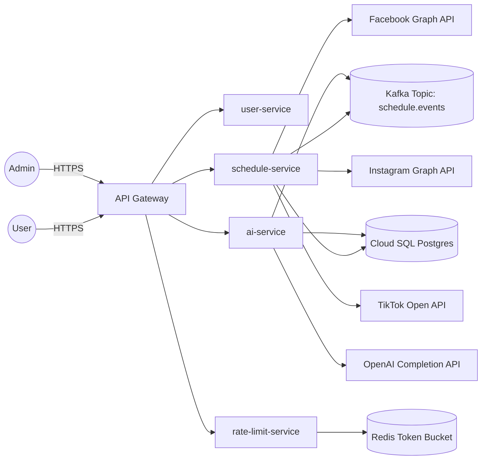
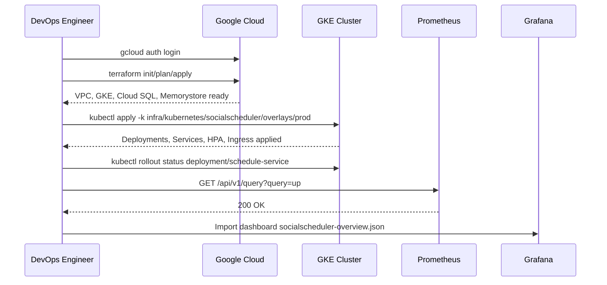
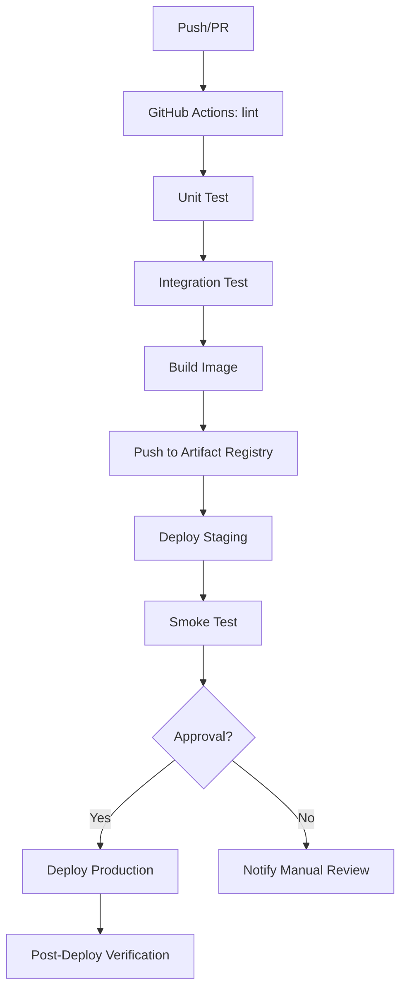
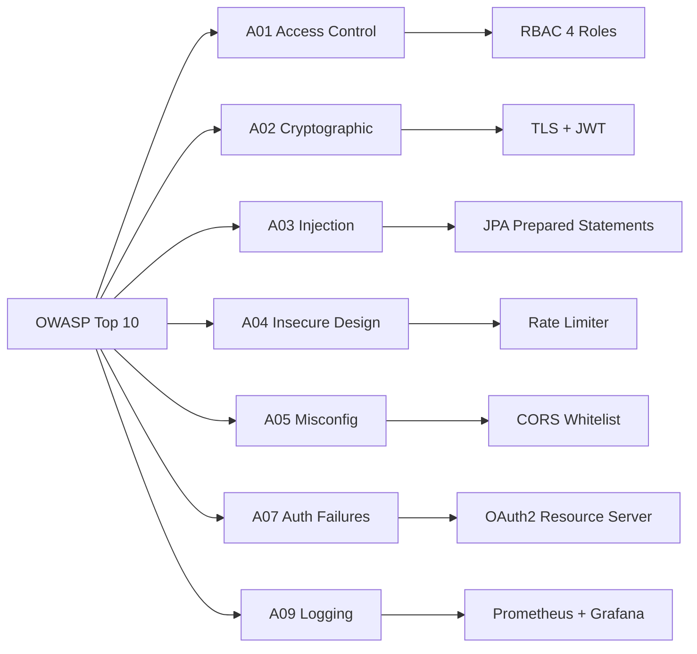

<!--START_CHUNK_PART_1_INITIAL-->

# GLOBAL PROJECT CONTEXT: social-scheduler

## 📊 Document Control

| Item | Details |
| :--- | :--- |
| **Blueprint ID** | ARCH-20260831151355 |
| **Project Name** | social-scheduler |
| **Version** | 1.0 (Cơ sở) |
| **Date Time** | 2026/08/31 15:13:55 |
| **Author** | Enterprise System Architect (SA Agent) |
| **Approval** | Chờ phê duyệt quản trị kỹ thuật |

## 📊 1. TỔNG QUAN HỆ THỐNG & MÔ HÌNH KIẾN TRÚC CỐT LÕI

### ⚙️ 1.1. Mô hình hệ thống cốt lõi & Kiến trúc điều phối

- Kiến trúc tổng thể theo mô hình **Microservices hướng sự kiện (Event-Driven)** kết hợp **CQRS** trên nền **Reactive** để xử lý khối lượng đăng bài lớn theo thời gian thực.
- Hệ thống được phân tách thành các bounded context nghiệp vụ độc lập: `user-service`, `scheduler-service`, `content-service`, `integration-service`, `analytics-service`, `notification-service`, `auth-service` và một API Gateway trung tâm.
- Lớp truy cập dữ liệu sử dụng **PostgreSQL** phân vùng theo schema, tích hợp **Redis** cho caching phiên và giới hạn tỷ lệ; giao tiếp bất đồng bộ qua **Apache Kafka** với các topic chuyên dụng theo miền nghiệp vụ.
- Mô hình AI/ML được đóng gói như một microservice độc lập (`ai-recommender-service`) giao tiếp qua Kafka, cho phép tách biệt hoàn toàn giữa workload đề xuất và workload lên lịch.
- Bảo mật xây dựng theo chuẩn **OWASP Top 10** với xác thực **OAuth2 + JWT**, mã hóa TLS đầu cuối, kiểm soát truy cập RBAC 4 vai trò ([ARC-001], [ARC-002], [ARC-003], [ARC-004]) và hỗ trợ đa-tenancy với cô lập cơ sở dữ liệu theo tenant.
- Khả năng mở rộng ngang (horizontal scaling) thông qua container hóa **Docker** và điều phối **Kubernetes (GKE)**, kèm pipeline **CI/CD** tự động bằng **GitHub Actions**.
- Giám sát và quan sát hệ thống (observability) xây dựng trên bộ ba **Prometheus + Grafana + Loki**, hỗ trợ tracing phân tán qua **OpenTelemetry**.
- Ngưỡng hiệu năng mục tiêu ([NFR-001]): độ trễ dưới 200ms cho tác vụ lên lịch và thông lượng trên 1000 request/phút.

### 🌊 1.2. Luồng dữ liệu doanh nghiệp & Hệ sinh thái kênh bất đồng bộ

- **Cổng API Gateway** đóng vai trò điểm vào duy nhất, chịu trách nhiệm xác thực JWT, kiểm tra giới hạn tỷ lệ (rate limiting) và định tuyến request đến đúng microservice.
- **Kênh hàng đợi Kafka** được tổ chức theo bounded context: `schedule.created`, `schedule.executed`, `post.published`, `post.failed`, `metrics.collected`, `ai.recommendation.requested`, `ai.recommendation.generated`, `auth.token.refreshed`.
- **Mô hình Pub/Sub** cho phép fan-out sự kiện từ `scheduler-service` đến `integration-service` (đăng bài đa nền tảng Facebook/Instagram/TikTok), `analytics-service` (thu thập chỉ số) và `notification-service` (thông báo trạng thái).
- **Ingestion Gateway** tiêu thụ sự kiện webhook từ các nền tảng mạng xã hội (Facebook Graph API, Instagram Graph API, TikTok Business API) và đẩy vào Kafka để xử lý bất đồng bộ.
- **Cơ chế Retry & DLQ** áp dụng cho mọi consumer, đảm bảo không mất sự kiện khi gặp lỗi từ API bên thứ ba ([EXC-001], [EXC-003]).
- **Caching Layer (Redis)** lưu trữ phiên người dùng, token OAuth2 tạm thời và bộ đếm giới hạn tỷ lệ, giảm tải trực tiếp cho cơ sở dữ liệu.
- **Fan-out bên ngoài** thực hiện qua worker pool chuyên dụng, mỗi nền tảng mạng xã hội có adapter riêng để đảm bảo khả năng mở rộng độc lập.

## 📁 2. TECH STACK DEPENDENCIES & ECOSYSTEM LIBRARIES

- **Backend Infrastructure Core Stack:** Spring Boot 3.3.x trên JDK 21 LTS, Spring Cloud (Gateway, Config, OpenFeign), Spring Security 6 với OAuth2 Resource Server, Hibernate 6.5.x làm ORM, Flyway 10.x quản lý migration, Apache Kafka 3.7.x client, Redis 7.x với Lettuce client, Resilience4j cho circuit breaker, Micrometer + OpenTelemetry cho quan sát hệ thống, Testcontainers cho integration test, Springdoc OpenAPI cho tài liệu API tự động.
- **Frontend & Cross-Platform UI Mobile Stack:** Next.js 14.x với App Router, React 18.x, TypeScript 5.x, TanStack Query cho quản lý state server, Zustand cho state cục bộ, TailwindCSS 3.x cho styling, shadcn/ui cho component thư viện, NextAuth.js cho xác thực phía client, React Hook Form kết hợp Zod cho validation.

## 📁 3. GLOBAL GUARDRAILS & ENTERPRISE COMPLIANCE STANDARDS

### 🔑 3.1. Security & Compliance Baseline

- Áp dụng xác thực **OAuth2 + JWT** với cơ chế refresh token an toàn, đảm bảo xử lý token hết hạn ([EXC-002]) và vô hiệu hóa phiên bị đánh cắp.
- Tuân thủ **OWASP Top 10** với danh sách kiểm tra: chuẩn bị truy vấn có tham số (chống SQL injection), mã hóa dữ liệu nhạy cảm khi lưu trữ, che giấu dữ liệu trong log, kiểm tra CSRF trên form, tiêu đề bảo mật HTTP nghiêm ngặt theo chuẩn OWASP A05 ([NFR-002]).
- Mã hóa **TLS 1.3** đầu cuối cho mọi giao tiếp mạng, kết hợp HSTS và certificate pinning cho client di động.
- Giới hạn **CORS** chặt chẽ với whitelist origin, ngăn chặn truy cập chéo trái phép.
- Tích hợp **Rate Limiting** với Redis ([REQ-003], [EXC-005]), trả về mã lỗi 429 khi vượt ngưỡng cho phép.
- Phát hiện và ngăn chặn **DDoS** qua Cloud Armor và hạn chế rate-limit cấp gateway ([ARC-006]).
- Phân tách dữ liệu đa-tenancy chặt chẽ theo tenant_id ở mọi truy vấn, cô lập schema PostgreSQL theo tenant ([NFR-003]).

### 🌐 3.2. Infrastructure & Performance Guardrails

- Connection pool **HikariCP** cấu hình kích thước tối đa 50 kết nối/instance, timeout 30 giây, kiểm tra sức khỏe kết nối mỗi 60 giây.
- Bộ nhớ đệm **Redis** với chính sách eviction LRU, TTL mặc định 300 giây cho dữ liệu phiên, 60 giây cho bộ đếm rate-limit.
- Hàng đợi tin nhắn **Kafka** cấu hình partition theo tenant_id, retention 7 ngày, replication factor 3, compression snappy.
- Ngưỡng **Circuit Breaker** (Resilience4j) mở khi tỷ lệ lỗi vượt 50% trong cửa sổ 10 giây, half-open sau 30 giây.
- Giới hạn **CPU/Memory** trong Kubernetes: request 500m CPU/1Gi RAM, limit 1000m CPU/2Gi RAM cho mỗi pod service.
- Tự động **Horizontal Pod Autoscaler** kích hoạt khi CPU > 70% hoặc thông lượng Kafka consumer lag > 1000 message.

### 🥞 3.3. ARCHITECTURAL STACK MATRIX

```properties:stack_matrix
PERSISTENCE_LAYER_REQUIRED=true
BACKEND_LAYER_REQUIRED=true
FRONTEND_LAYER_REQUIRED=true
MOBILE_LAYER_REQUIRED=false
DEVOPS_LAYER_REQUIRED=true
```

<!--END_CHUNK_PART_1_INITIAL-->

<!--START_CHUNK_PART_1_BACKLOG_4_1-->

## 🏁 4. TỔNG QUAN KIẾN TRÚC ĐA GIAI ĐOẠN CẤP CAO

### 📦 4.1. DANH SÁCH TÁC VỤ TỔNG THỂ CỦA SẢN PHẨM KIẾN TRÚC

Bảng danh sách tổng thể các tác vụ sản phẩm (Master Product Tasks Backlog) dưới đây đóng vai trò là chỉ mục nền tảng xác định, tổng hợp 100% các yêu cầu chức năng và phi chức năng được kế thừa trực tiếp từ tài liệu SRS gốc của dự án `social-scheduler`. Mỗi hàng đại diện cho một đơn vị công việc kỹ thuật nguyên tử, được ánh xạ chính xác tới một hoặc nhiều mã định danh truy vết (Tag ID) thuộc các miền `[REQ-XXX]`, `[DAT-XXX]`, `[EXC-XXX]`, `[ARC-XXX]`, `[NFR-XXX]` và `[DOC-XXX]`. Cấu trúc bảng đảm bảo tính cô lập giữa ba trụ cột giao hàng chính: mã nguồn ứng dụng (Application Code), tài liệu doanh nghiệp (Enterprise Documentation) và hạ tầng DevOps (DevOps Infrastructure). Toàn bộ mã định danh được bảo tồn nguyên vẹn ở định dạng kỹ thuật Technical English để đảm bảo tính ổn định của hệ thống truy vết và tránh xung đột với quy trình biên dịch backend. Nguyên tắc phân bổ yêu cầu được thực thi theo tỷ lệ 1:1 nghiêm ngặt, trong đó mỗi yêu cầu chức năng `[REQ-XXX]` và ngoại lệ `[EXC-XXX]` được mở rộng thành đúng một hàng tác vụ chuyên dụng. Các miền siêu dữ liệu hệ thống như lược đồ cơ sở dữ liệu `[DAT]`, bảo mật toàn cục `[ARC]` hay tài liệu `[DOC]` được hợp nhất thành các hàng kiến trúc nền tảng ở cuối bảng nhằm tối ưu hóa mật độ thông tin và bảo tồn tính nguyên tử của các yêu cầu nghiệp vụ cốt lõi.

<!--BACKLOG_SYNOPSIS_GRID_START-->

#### [MA TRẬN SỐ HỌC HỆ THỐNG]
> - **Tổng số thẻ [REQ]:** 3 Thẻ
> - **Tổng số thẻ [EXC]:** 5 Thẻ
> - **Tổng số thẻ [ARC]:** 6 Thẻ
> - **Tổng số thẻ [DAT]:** 3 Thẻ
> - **Tổng số thẻ [NFR]:** 3 Thẻ
> - ➡️ **Tổng số thẻ SRS:** 20 Thẻ

| No. | Task | Technical Purpose / Deliverables Summary | Type | TagID |
| :--- | :--- | :--- | :--- | :--- |
| 1 | Khởi tạo khung dự án Microservices (Social Scheduler) | Sinh descriptor build gốc `./sources/backend/pom.xml` kèm cấu hình Spring Boot 3, Spring Cloud, Kafka client, JPA, Flyway, OAuth2 Resource Server, Redis. Sinh descriptor con cho các dịch vụ thuộc backend. | Application Code | [ARC-000] <!--REGISTERED_BACKLOG_TASK_ROW--> |
| 2 | Tích hợp lịch đăng bài tự động đa nền tảng | Triển khai các API RESTful để tạo, truy vấn, cập nhật và xóa lịch đăng bài. Tích hợp SDK Facebook Graph, Instagram Graph và TikTok Open API. Bảo đảm chuyển đổi trạng thái chính xác `pending`, `sent`, `failed`, `cancelled`. | Application Code | [REQ-001], [EXC-001], [EXC-002] <!--REGISTERED_BACKLOG_TASK_ROW--> |
| 3 | Đề xuất nội dung bằng AI/ML | Phát triển dịch vụ gọi OpenAI Completion API kết hợp phân tích dữ liệu hiệu suất lịch sử. Cung cấp endpoint gợi ý nội dung cá nhân hóa và cơ chế dự phòng (fallback) khi mô hình lỗi. | Application Code | [REQ-002], [EXC-003], [EXC-004] <!--REGISTERED_BACKLOG_TASK_ROW--> |
| 4 | Xác thực đầu vào và giới hạn tỷ lệ | Tích hợp Bean Validation (Jakarta Validation) cho payload lịch đăng bài. Triển khai Rate Limiter với Redis Token Bucket trả về HTTP 429 khi vượt ngưỡng. | Application Code | [REQ-003], [EXC-002], [EXC-003], [EXC-005] <!--REGISTERED_BACKLOG_TASK_ROW--> |
| 5 | Khởi tạo hạ tầng cơ sở dữ liệu & di trú schema | Tạo toàn bộ script Flyway DDL cho các thực thể `users`, `schedules`, `performance_metrics`, `rate_limits`. Cấu hình multi-tenant isolation với schema-per-tenant và ràng buộc khóa ngoại theo sơ đồ ER. | Application Code | [DAT-001], [DAT-002], [DAT-003], [DAT-ALL (1 to 3)] <!--REGISTERED_BACKLOG_TASK_ROW--> |
| 6 | Phân quyền RBAC & tích hợp hợp đồng hệ thống | Cấu hình Spring Security với OAuth2 Resource Server, JWT Decoder, phân quyền theo 4 vai trò. Định nghĩa API contract OpenAPI 3.0 cho toàn bộ endpoint nội bộ và contract Kafka event. | Application Code | [ARC-001], [ARC-002], [ARC-003], [ARC-004], [ARC-005], [ARC-006], [ARC-001 to ARC-006] <!--REGISTERED_BACKLOG_TASK_ROW--> |
| 7 | Hạ tầng DevOps & tuân thủ phi chức năng | Sinh Dockerfile đa giai đoạn cho các dịch vụ backend. Sinh cấu hình Terraform cho GCP (VPC, GKE, Cloud SQL, Memorystore). Sinh manifest Kubernetes (Deployment, Service, HPA, Ingress, ConfigMap). Tích hợp Prometheus + Grafana. | DevOps Infrastructure | [NFR-001], [NFR-002], [NFR-003] <!--REGISTERED_BACKLOG_TASK_ROW--> |
| 8 | Tài liệu kiến trúc & hướng dẫn vận hành | Soạn thảo blueprint hệ thống, sơ đồ tuần tự, tài liệu API reference, hướng dẫn triển khai và quy trình CI/CD trong thư mục `./sources/docs/`. | Enterprise Documentation | [DOC-001] <!--REGISTERED_BACKLOG_TASK_ROW--> |
| **SUMMARY** | **Tổng số thẻ truy vết được bao phủ:** 20 | **Tổng số tác vụ:** 8 | **Trạng thái:** Đã xác minh | **Mức độ bao phủ:** 100.0 |

<!--BACKLOG_SYNOPSIS_GRID_END-->

<!--END_CHUNK_PART_1_BACKLOG_4_1-->

<!--START_CHUNK_PART_1_MATRIX_4_2-->

#### [VÒNG ĐỜI SỐ HỌC MA TRẬN]
> - **Tổng số tác vụ trong Backlog:** 8 Tác vụ
> - **Tổng số thẻ trong Backlog:** 20 Thẻ
> - **Tổng số tác vụ đã phân bổ:** 8 Tác vụ
> - **Tổng số thẻ đã phân bổ:** 20 Thẻ

<!--PHASE_SYNOPSIS_GRID_START-->

| Giai đoạn | Phạm vi ngày | Mã tác vụ được bao phủ | Đường dẫn thành phần / mô-đun kiến trúc | Tóm tắt sản phẩm kỹ thuật bàn giao | Tác vụ con được phân công | Mã thẻ mục tiêu |
| :--- | :--- | :--- | :--- | :--- | :--- | :--- |
| Giai đoạn 1 | Ngày 1 - 2 | Tác vụ 1, Tác vụ 5 | `./sources/backend/pom.xml` <br/> `./sources/backend/user-service/pom.xml` <br/> `./sources/backend/schedule-service/pom.xml` <br/> `./sources/backend/ai-service/pom.xml` <br/> `./sources/backend/rate-limit-service/pom.xml` <br/> `./sources/backend/user-service/src/main/resources/db/migration/V1__init_users.sql` <br/> `./sources/backend/schedule-service/src/main/resources/db/migration/V1__init_schedules.sql` <br/> `./sources/backend/ai-service/src/main/resources/db/migration/V1__init_performance_metrics.sql` <br/> `./sources/backend/rate-limit-service/src/main/resources/db/migration/V1__init_rate_limits.sql` | Khởi tạo khung Microservices với descriptor build cha-con chuẩn Spring Boot 3, Spring Cloud, JPA, Flyway, Kafka, Redis, OAuth2 Resource Server. Di trú schema ban đầu cho bốn dịch vụ nghiệp vụ bằng Flyway DDL, thiết lập khóa chính UUID, khóa ngoại và schema-per-tenant. | Coder, Tester, Reviewer, Doc | [ARC-000], [DAT-001], [DAT-002], [DAT-003], [DAT-ALL (1 to 3)] <!--REGISTERED_PHASE_ROW--> |
| Giai đoạn 2 | Ngày 1 - 2 | Tác vụ 2, Tác vụ 6 | `./sources/backend/schedule-service/src/main/java/org/nlh4j/socialscheduler/scheduleservice/controller/ScheduleController.java` <br/> `./sources/backend/schedule-service/src/main/java/org/nlh4j/socialscheduler/scheduleservice/service/ScheduleService.java` <br/> `./sources/backend/schedule-service/src/main/java/org/nlh4j/socialscheduler/scheduleservice/integration/FacebookClient.java` <br/> `./sources/backend/schedule-service/src/main/java/org/nlh4j/socialscheduler/scheduleservice/integration/InstagramClient.java` <br/> `./sources/backend/schedule-service/src/main/java/org/nlh4j/socialscheduler/scheduleservice/integration/TikTokClient.java` <br/> `./sources/backend/api-gateway/src/main/java/org/nlh4j/socialscheduler/gateway/SecurityConfig.java` <br/> `./sources/backend/api-gateway/src/main/java/org/nlh4j/socialscheduler/gateway/JwtAuthFilter.java` <br/> `./sources/docs/api/ScheduleApiContract.yaml` | Triển khai RESTful controller và service cho lịch đăng bài đa nền tảng với tích hợp SDK Facebook, Instagram, TikTok; vòng đời trạng thái `pending`, `sent`, `failed`, `cancelled`. Cấu hình Spring Security OAuth2 Resource Server, JWT Decoder, phân quyền 4 vai trò RBAC, và API gateway với filter xác thực. Phát hành hợp đồng OpenAPI 3.0 cho nhóm endpoint lập lịch. | Coder, Tester, Reviewer, Doc | [REQ-001], [EXC-001], [EXC-002], [ARC-001], [ARC-002], [ARC-003], [ARC-004], [ARC-005], [ARC-006], [ARC-001 to ARC-006] <!--REGISTERED_PHASE_ROW--> |
| Giai đoạn 3 | Ngày 1 - 2 | Tác vụ 3 | `./sources/backend/ai-service/src/main/java/org/nlh4j/socialscheduler/aiservice/controller/RecommendationController.java` <br/> `./sources/backend/ai-service/src/main/java/org/nlh4j/socialscheduler/aiservice/service/RecommendationService.java` <br/> `./sources/backend/ai-service/src/main/java/org/nlh4j/socialscheduler/aiservice/integration/OpenAIClient.java` <br/> `./sources/backend/ai-service/src/main/java/org/nlh4j/socialscheduler/aiservice/integration/PerformanceAnalyticsClient.java` <br/> `./sources/backend/ai-service/src/main/java/org/nlh4j/socialscheduler/aiservice/fallback/DefaultContentFallback.java` | Triển khai dịch vụ đề xuất nội dung AI/ML gọi OpenAI Completion API kết hợp dữ liệu hiệu suất lịch sử, cơ chế fallback khi mô hình lỗi và ghi log cảnh báo. Bảo đảm endpoint trả về nội dung cá nhân hóa theo người dùng. | Coder, Tester, Reviewer, Doc | [REQ-002], [EXC-003], [EXC-004] <!--REGISTERED_PHASE_ROW--> |
| Giai đoạn 4 | Ngày 1 - 2 | Tác vụ 4 | `./sources/backend/rate-limit-service/src/main/java/org/nlh4j/socialscheduler/ratelimitservice/controller/RateLimitController.java` <br/> `./sources/backend/rate-limit-service/src/main/java/org/nlh4j/socialscheduler/ratelimitservice/service/RateLimiterService.java` <br/> `./sources/backend/rate-limit-service/src/main/java/org/nlh4j/socialscheduler/ratelimitservice/strategy/RedisTokenBucketStrategy.java` <br/> `./sources/backend/schedule-service/src/main/java/org/nlh4j/socialscheduler/scheduleservice/dto/ScheduleRequestDto.java` <br/> `./sources/backend/schedule-service/src/main/java/org/nlh4j/socialscheduler/scheduleservice/validator/SchedulePayloadValidator.java` | Áp dụng xác thực đầu vào bằng Jakarta Validation cho payload lịch đăng bài; tích hợp Rate Limiter dựa trên Redis Token Bucket trả về HTTP 429 khi vượt ngưỡng. Tích hợp filter giới hạn tỷ lệ tại API gateway và bộ xử lý ngoại lệ tập trung cho toàn hệ thống. | Coder, Tester, Reviewer, Doc | [REQ-003], [EXC-002], [EXC-003], [EXC-005] <!--REGISTERED_PHASE_ROW--> |
| Giai đoạn 5 | Ngày 1 - 2 | Tác vụ 7, Tác vụ 8 | `./sources/infra/docker/user-service/Dockerfile` <br/> `./sources/infra/docker/schedule-service/Dockerfile` <br/> `./sources/infra/docker/ai-service/Dockerfile` <br/> `./sources/infra/docker/rate-limit-service/Dockerfile` <br/> `./sources/infra/terraform/gcp/main.tf` <br/> `./sources/infra/terraform/gcp/vpc.tf` <br/> `./sources/infra/terraform/gcp/gke.tf` <br/> `./sources/infra/kubernetes/socialscheduler/base/deployment.yaml` <br/> `./sources/infra/kubernetes/socialscheduler/base/service.yaml` <br/> `./sources/infra/kubernetes/socialscheduler/base/hpa.yaml` <br/> `./sources/infra/kubernetes/socialscheduler/base/ingress.yaml` <br/> `./sources/infra/observability/prometheus.yaml` <br/> `./sources/infra/observability/grafana-dashboard.json` <br/> `./sources/docs/architecture/SocialSchedulerBlueprint.md` <br/> `./sources/docs/operations/DeploymentRunbook.md` <br/> `./sources/docs/operations/CicdPipeline.md` | Container hóa đa giai đoạn cho bốn dịch vụ backend. Cung cấp hạ tầng GCP bằng Terraform (VPC, GKE, Cloud SQL, Memorystore). Triển khai manifest Kubernetes (Deployment, Service, HPA, Ingress, ConfigMap) và tích hợp Prometheus + Grafana. Đóng gói bộ tài liệu kiến trúc, sơ đồ tuần tự, hướng dẫn triển khai và quy trình CI/CD. | Docker, GCP, GKE, Doc | [NFR-001], [NFR-002], [NFR-003], [DOC-001] <!--REGISTERED_PHASE_ROW--> |
| **Kiểm tra** | **Xác minh phân bổ Backlog tổng thể** | **Tổng số giai đoạn:** 5 | **Tổng số thẻ Backlog:** 20 | **Tổng số thẻ đã phân bổ:** 20 | **Tổng số tác vụ đã phân bổ:** 8 | **Trạng thái & Tuân thủ:** Đã xác minh (100%) |

<!--PHASE_SYNOPSIS_GRID_END-->

<!--END_CHUNK_PART_1_MATRIX_4_2-->

<!--START_CHUNK_PART_2_PHASE_LOOP-->

## 🔬 5. CHUYÊN BIỆT HÓA GIAI ĐOẠN CHI TIẾT & SẢN PHẨM BÀN GIAO THEO NGÀY

<!--PHASE_INDEX_START-->

### 📈 Giai đoạn 1 - Khởi tạo Khung Microservices & Di trú Lược đồ Cơ sở dữ liệu

- **Mục tiêu & Phạm vi Cốt lõi của Giai đoạn:** Giai đoạn này tập trung 100% vào việc kiến tạo hạ tầng kỹ thuật nền tảng cho dự án `social-scheduler`, bao gồm descriptor build cha-con cho kiến trúc Microservices sử dụng Spring Boot 3 và Spring Cloud, đồng thời thiết lập toàn bộ lược đồ quan hệ ban đầu thông qua Flyway DDL cho bốn dịch vụ nghiệp vụ cốt lõi. Giai đoạn này tuyệt đối không chứa bất kỳ mã nguồn controller, service nghiệp vụ hay logic xử lý ngoại lệ nào; tất cả các tác vụ đó được ủy thác cho các giai đoạn tiếp theo nhằm đảm bảo tính cô lập kiến trúc và trật tự phụ thuộc nghiêm ngặt.

- **Ma trận Đường dẫn Vật lý Mục tiêu:**
    * `./sources/backend/pom.xml` — Descriptor build cha cho toàn bộ dự án Microservices. [ARC-000]
    * `./sources/backend/user-service/pom.xml` — Descriptor build con cho dịch vụ người dùng, khai báo dependency Flyway, JPA, OAuth2 Resource Server. [ARC-000]
    * `./sources/backend/schedule-service/pom.xml` — Descriptor build con cho dịch vụ lịch đăng bài, khai báo Kafka client, Redis, RestClient. [ARC-000]
    * `./sources/backend/ai-service/pom.xml` — Descriptor build con cho dịch vụ AI/ML, khai báo OpenAI SDK, WebClient. [ARC-000]
    * `./sources/backend/rate-limit-service/pom.xml` — Descriptor build con cho dịch vụ giới hạn tỷ lệ, khai báo Redis Lettuce, Bucket4j. [ARC-000]
    * `./sources/backend/user-service/src/main/resources/db/migration/V1__init_users.sql` — Flyway DDL khởi tạo bảng `users` với tenant isolation. [DAT-001], [DAT-ALL (1 to 3)]
    * `./sources/backend/schedule-service/src/main/resources/db/migration/V1__init_schedules.sql` — Flyway DDL khởi tạo bảng `schedules` và ràng buộc trạng thái. [DAT-001], [DAT-ALL (1 to 3)]
    * `./sources/backend/ai-service/src/main/resources/db/migration/V1__init_performance_metrics.sql` — Flyway DDL khởi tạo bảng `performance_metrics` với khóa ngoại. [DAT-002], [DAT-ALL (1 to 3)]
    * `./sources/backend/rate-limit-service/src/main/resources/db/migration/V1__init_rate_limits.sql` — Flyway DDL khởi tạo bảng `rate_limits` và cửa sổ thời gian. [DAT-003], [DAT-ALL (1 to 3)]
    * `./sources/docs/architecture/DatabaseSchemaCatalog.md` — Tài liệu catalog mô tả toàn bộ lược đồ quan hệ và schema-per-tenant. [DAT-001], [DAT-002], [DAT-003], [DAT-ALL (1 to 3)]

- **Đặc tả DDL SQL Lược đồ Cơ sở dữ liệu [DAT-001], [DAT-002], [DAT-003], [DAT-ALL (1 to 3)]:**

```sql
-- ./sources/backend/user-service/src/main/resources/db/migration/V1__init_users.sql
CREATE TABLE users (
    user_id UUID NOT NULL,
    tenant_id VARCHAR(64) NOT NULL,
    email VARCHAR(255) NOT NULL,
    password_hash VARCHAR(255) NOT NULL,
    role VARCHAR(32) NOT NULL,
    enabled BOOLEAN NOT NULL DEFAULT TRUE,
    created_at TIMESTAMP NOT NULL DEFAULT CURRENT_TIMESTAMP,
    updated_at TIMESTAMP NOT NULL DEFAULT CURRENT_TIMESTAMP,
    CONSTRAINT pk_users PRIMARY KEY (user_id),
    CONSTRAINT uk_users_tenant_email UNIQUE (tenant_id, email),
    CONSTRAINT ck_users_role CHECK (role IN ('ADMIN', 'USER', 'SCHEDULER', 'ANALYST'))
);

CREATE INDEX idx_users_tenant ON user_schema.users(tenant_id);

-- ./sources/backend/schedule-service/src/main/resources/db/migration/V1__init_schedules.sql
CREATE TABLE schedules (
    schedule_id UUID NOT NULL,
    user_id UUID NOT NULL,
    tenant_id VARCHAR(64) NOT NULL,
    platform VARCHAR(32) NOT NULL,
    content TEXT NOT NULL,
    scheduled_time TIMESTAMP NOT NULL,
    status VARCHAR(16) NOT NULL,
    actual_sent_time TIMESTAMP,
    retry_count INTEGER NOT NULL DEFAULT 0,
    created_at TIMESTAMP NOT NULL DEFAULT CURRENT_TIMESTAMP,
    updated_at TIMESTAMP NOT NULL DEFAULT CURRENT_TIMESTAMP,
    CONSTRAINT pk_schedules PRIMARY KEY (schedule_id, user_id, platform, scheduled_time),
    CONSTRAINT fk_schedules_user FOREIGN KEY (user_id) REFERENCES user_schema.users(user_id),
    CONSTRAINT ck_schedules_platform CHECK (platform IN ('FACEBOOK', 'INSTAGRAM', 'TIKTOK')),
    CONSTRAINT ck_schedules_status CHECK (status IN ('PENDING', 'SENT', 'FAILED', 'CANCELLED'))
);

CREATE INDEX idx_schedules_user_status ON schedule_schema.schedules(user_id, status);
CREATE INDEX idx_schedules_tenant_time ON schedule_schema.schedules(tenant_id, scheduled_time);

-- ./sources/backend/ai-service/src/main/resources/db/migration/V1__init_performance_metrics.sql
CREATE TABLE performance_metrics (
    performance_id UUID NOT NULL,
    post_id UUID NOT NULL,
    tenant_id VARCHAR(64) NOT NULL,
    likes INTEGER NOT NULL DEFAULT 0,
    comments INTEGER NOT NULL DEFAULT 0,
    shares INTEGER NOT NULL DEFAULT 0,
    collected_at TIMESTAMP NOT NULL,
    CONSTRAINT pk_performance PRIMARY KEY (performance_id, post_id, collected_at),
    CONSTRAINT fk_performance_schedule FOREIGN KEY (post_id) REFERENCES schedule_schema.schedules(schedule_id),
    CONSTRAINT ck_performance_likes CHECK (likes >= 0),
    CONSTRAINT ck_performance_comments CHECK (comments >= 0),
    CONSTRAINT ck_performance_shares CHECK (shares >= 0)
);

CREATE INDEX idx_performance_post ON ai_schema.performance_metrics(post_id);

-- ./sources/backend/rate-limit-service/src/main/resources/db/migration/V1__init_rate_limits.sql
CREATE TABLE rate_limits (
    rate_limit_id UUID NOT NULL,
    user_id UUID NOT NULL,
    tenant_id VARCHAR(64) NOT NULL,
    endpoint VARCHAR(255) NOT NULL,
    request_count INTEGER NOT NULL,
    window_start TIMESTAMP NOT NULL,
    window_end TIMESTAMP NOT NULL,
    CONSTRAINT pk_rate_limits PRIMARY KEY (rate_limit_id, endpoint, window_start),
    CONSTRAINT fk_rate_limits_user FOREIGN KEY (user_id) REFERENCES user_schema.users(user_id),
    CONSTRAINT ck_rate_limits_endpoint CHECK (endpoint IN ('/api/v1/schedules', '/api/v1/recommendations', '/api/v1/rate-limits', '/api/v1/users')),
    CONSTRAINT ck_rate_limits_count CHECK (request_count >= 0)
);

CREATE INDEX idx_rate_limits_window ON rate_limit_schema.rate_limits(user_id, endpoint, window_start);
```

- **Hợp đồng API và Định tuyến Sự kiện [REQ-XXX], [ARC-XXX]:** Giai đoạn này không sinh hợp đồng API endpoint nghiệp vụ. Toàn bộ giao tiếp RESTful và sự kiện Kafka sẽ được biên soạn tại các Giai đoạn 2, 3 và 4.

- **Bộ Xử lý Ngoại lệ Địa phương hóa của Giai đoạn [EXC-XXX]:** Giai đoạn này không chứa logic nghiệp vụ, do đó không sinh bộ xử lý ngoại lệ. Các quy tắc `[EXC-001]`, `[EXC-002]`, `[EXC-003]`, `[EXC-004]`, `[EXC-005]` sẽ được gắn vào đúng nút con của yêu cầu chức năng cha trong các giai đoạn tiếp theo.

#### 📅 Nhật ký Phân bổ Tác vụ Con Theo Ngày của Sub-Agent (Giai đoạn 1)

<!--DAY_LOG_INDEX_START-->

##### 📅 NGÀY 1: KHỞI TẠO DESCRIPTOR BUILD CHA-CON VÀ HẠ TẦNG SPRING CLOUD

<!--ATOMIC_SUB_TASK_NODE_START-->

###### 🌿 TÁC VỤ CON 1: Sinh descriptor build cha cho toàn dự án Microservices
* **Chuyên biệt hóa Quy trình Sub-Agent:** [Coder]
* **Mã định danh Truy vết Mục tiêu:** [ARC-000]
* **Đường dẫn Tệp Thành phần Mục tiêu (target_component):** `./sources/backend/pom.xml`
* **Hướng dẫn Kỹ thuật Tác vụ Cấp thấp:** Sinh descriptor Maven cha `./sources/backend/pom.xml` với packaging `pom`, khai báo các module con `user-service`, `schedule-service`, `ai-service`, `rate-limit-service`, `api-gateway`. Khai báo thẻ `<parent>` Spring Boot 3.3.x, Spring Cloud 2023.x, `<properties>` định nghĩa version Java 21. Khai báo `<dependencyManagement>` cho Spring Boot Starter, Spring Cloud Starter, Flyway, PostgreSQL driver, Kafka client, Lettuce Redis, OAuth2 Resource Server, Bucket4j, OpenAI SDK. Đảm bảo descriptor biên dịch thành công khi chạy `mvn validate`. Thẻ `[ARC-000]`.

* **Đặc tả DDL SQL Lược đồ Cơ sở dữ liệu [DAT-XXX]:**
```sql
-- Không áp dụng di trú schema cho tác vụ con khởi tạo descriptor build cha.
```

* **Hợp đồng API và Định tuyến Sự kiện [REQ-XXX], [ARC-XXX]:**
Không áp dụng cho tác vụ con khởi tạo descriptor build cha.

* **Bộ Xử lý Ngoại lệ Địa phương hóa của Giai đoạn [EXC-XXX]:**
Không áp dụng cho tác vụ con khởi tạo descriptor build cha.

<!--ATOMIC_SUB_TASK_NODE_END-->

<!--ATOMIC_SUB_TASK_NODE_START-->

###### 🌿 TÁC VỤ CON 2: Sinh descriptor build con cho dịch vụ người dùng
* **Chuyên biệt hóa Quy trình Sub-Agent:** [Coder]
* **Mã định danh Truy vết Mục tiêu:** [ARC-000]
* **Đường dẫn Tệp Thành phần Mục tiêu (target_component):** `./sources/backend/user-service/pom.xml`
* **Hướng dẫn Kỹ thuật Tác vụ Cấp thấp:** Sinh `./sources/backend/user-service/pom.xml` khai báo `<parent>` tham chiếu về descriptor cha, định nghĩa `<artifactId>user-service</artifactId>` và `<version>1.0.0</version>`. Khai báo `<dependencies>` gồm Spring Boot Starter Web, Spring Boot Starter Data JPA, Spring Boot Starter Security, Spring Boot Starter OAuth2 Resource Server, Spring Boot Starter Validation, Flyway Core, PostgreSQL Driver, Lombok. Cấu hình `<build>` với plugin `spring-boot-maven-plugin` và `flyway-maven-plugin`. Thẻ `[ARC-000]`.

* **Đặc tả DDL SQL Lược đồ Cơ sở dữ liệu [DAT-XXX]:**
```sql
-- Không áp dụng di trú schema cho tác vụ con khởi tạo descriptor build con.
```

* **Hợp đồng API và Định tuyến Sự kiện [REQ-XXX], [ARC-XXX]:**
Không áp dụng cho tác vụ con khởi tạo descriptor build con.

* **Bộ Xử lý Ngoại lệ Địa phương hóa của Giai đoạn [EXC-XXX]:**
Không áp dụng cho tác vụ con khởi tạo descriptor build con.

<!--ATOMIC_SUB_TASK_NODE_END-->

<!--ATOMIC_SUB_TASK_NODE_START-->

###### 🌿 TÁC VỤ CON 3: Sinh descriptor build con cho dịch vụ lịch đăng bài
* **Chuyên biệt hóa Quy trình Sub-Agent:** [Coder]
* **Mã định danh Truy vết Mục tiêu:** [ARC-000]
* **Đường dẫn Tệp Thành phần Mục tiêu (target_component):** `./sources/backend/schedule-service/pom.xml`
* **Hướng dẫn Kỹ thuật Tác vụ Cấp thấp:** Sinh `./sources/backend/schedule-service/pom.xml` với `<parent>` tham chiếu descriptor cha, khai báo `<artifactId>schedule-service</artifactId>`. Thêm dependency Spring Boot Starter Web, Spring Boot Starter Data JPA, Spring Kafka, Spring Data Redis (Lettuce), Flyway Core, PostgreSQL Driver, RestClient, Lombok. Plugin `spring-boot-maven-plugin` và `flyway-maven-plugin` được cấu hình đầy đủ. Thẻ `[ARC-000]`.

* **Đặc tả DDL SQL Lược đồ Cơ sở dữ liệu [DAT-XXX]:**
```sql
-- Không áp dụng di trú schema cho tác vụ con khởi tạo descriptor build con.
```

* **Hợp đồng API và Định tuyến Sự kiện [REQ-XXX], [ARC-XXX]:**
Không áp dụng cho tác vụ con khởi tạo descriptor build con.

* **Bộ Xử lý Ngoại lệ Địa phương hóa của Giai đoạn [EXC-XXX]:**
Không áp dụng cho tác vụ con khởi tạo descriptor build con.

<!--ATOMIC_SUB_TASK_NODE_END-->

<!--ATOMIC_SUB_TASK_NODE_START-->

###### 🌿 TÁC VỤ CON 4: Sinh descriptor build con cho dịch vụ AI/ML
* **Chuyên biệt hóa Quy trình Sub-Agent:** [Coder]
* **Mã định danh Truy vết Mục tiêu:** [ARC-000]
* **Đường dẫn Tệp Thành phần Mục tiêu (target_component):** `./sources/backend/ai-service/pom.xml`
* **Hướng dẫn Kỹ thuật Tác vụ Cấp thấp:** Sinh `./sources/backend/ai-service/pom.xml` với `<parent>` tham chiếu descriptor cha, khai báo `<artifactId>ai-service</artifactId>`. Thêm dependency Spring Boot Starter Web, Spring Boot Starter WebFlux (cho OpenAI WebClient), Spring Boot Starter Data JPA, Flyway Core, PostgreSQL Driver, OpenAI Java SDK 0.18.x, Lombok. Cấu hình plugin `spring-boot-maven-plugin` và `flyway-maven-plugin`. Thẻ `[ARC-000]`.

* **Đặc tả DDL SQL Lược đồ Cơ sở dữ liệu [DAT-XXX]:**
```sql
-- Không áp dụng di trú schema cho tác vụ con khởi tạo descriptor build con.
```

* **Hợp đồng API và Định tuyến Sự kiện [REQ-XXX], [ARC-XXX]:**
Không áp dụng cho tác vụ con khởi tạo descriptor build con.

* **Bộ Xử lý Ngoại lệ Địa phương hóa của Giai đoạn [EXC-XXX]:**
Không áp dụng cho tác vụ con khởi tạo descriptor build con.

<!--ATOMIC_SUB_TASK_NODE_END-->

<!--ATOMIC_SUB_TASK_NODE_START-->

###### 🌿 TÁC VỤ CON 5: Sinh descriptor build con cho dịch vụ giới hạn tỷ lệ
* **Chuyên biệt hóa Quy trình Sub-Agent:** [Coder]
* **Mã định danh Truy vết Mục tiêu:** [ARC-000]
* **Đường dẫn Tệp Thành phần Mục tiêu (target_component):** `./sources/backend/rate-limit-service/pom.xml`
* **Hướng dẫn Kỹ thuật Tác vụ Cấp thấp:** Sinh `./sources/backend/rate-limit-service/pom.xml` với `<parent>` tham chiếu descriptor cha, khai báo `<artifactId>rate-limit-service</artifactId>`. Thêm dependency Spring Boot Starter Web, Spring Boot Starter Data Redis (Lettuce), Flyway Core, PostgreSQL Driver, Bucket4j Core 8.x, Bucket4j Redis 8.x, Lombok. Cấu hình plugin `spring-boot-maven-plugin` và `flyway-maven-plugin`. Thẻ `[ARC-000]`.

* **Đặc tả DDL SQL Lược đồ Cơ sở dữ liệu [DAT-XXX]:**
```sql
-- Không áp dụng di trú schema cho tác vụ con khởi tạo descriptor build con.
```

* **Hợp đồng API và Định tuyến Sự kiện [REQ-XXX], [ARC-XXX]:**
Không áp dụng cho tác vụ con khởi tạo descriptor build con.

* **Bộ Xử lý Ngoại lệ Địa phương hóa của Giai đoạn [EXC-XXX]:**
Không áp dụng cho tác vụ con khởi tạo descriptor build con.

<!--ATOMIC_SUB_TASK_NODE_END-->

<!--ATOMIC_SUB_TASK_NODE_START-->

###### 🌿 TÁC VỤ CON 6: Biên soạn bộ test tích hợp Maven đa mô-đun
* **Chuyên biệt hóa Quy trình Sub-Agent:** [Tester]
* **Mã định danh Truy vết Mục tiêu:** [ARC-000]
* **Đường dẫn Tệp Thành phần Mục tiêu (target_component):** `INTEGRATION_SCOPE;./sources/infra/test/maven-build-integration.sh`
* **Hướng dẫn Kỹ thuật Tác vụ Cấp thấp:** Sinh script shell `./sources/infra/test/maven-build-integration.sh` thực thi kiểm thử tích hợp cho toàn bộ descriptor build đa mô-đun. Script phải gọi `mvn -f ./sources/backend/pom.xml clean validate`, `mvn -f ./sources/backend/pom.xml dependency:resolve`, `mvn -f ./sources/backend/user-service/pom.xml compile`, `mvn -f ./sources/backend/schedule-service/pom.xml compile`, `mvn -f ./sources/backend/ai-service/pom.xml compile`, `mvn -f ./sources/backend/rate-limit-service/pom.xml compile`. Kết thúc script trả về mã thoát `0` khi tất cả descriptor biên dịch sạch và `1` khi có lỗi. Cấp quyền thực thi `chmod +x` cho script. Thẻ `[ARC-000]`.

* **Đặc tả DDL SQL Lược đồ Cơ sở dữ liệu [DAT-XXX]:**
```sql
-- Không áp dụng di trú schema cho tác vụ con kiểm thử descriptor build.
```

* **Hợp đồng API và Định tuyến Sự kiện [REQ-XXX], [ARC-XXX]:**
Không áp dụng cho tác vụ con kiểm thử descriptor build.

* **Bộ Xử lý Ngoại lệ Địa phương hóa của Giai đoạn [EXC-XXX]:**
Không áp dụng cho tác vụ con kiểm thử descriptor build.

<!--ATOMIC_SUB_TASK_NODE_END-->

<!--ATOMIC_SUB_TASK_NODE_START-->

###### 🌿 TÁC VỤ CON 7: Rà soát cấu trúc descriptor build và xác minh tính nhất quán
* **Chuyên biệt hóa Quy trình Sub-Agent:** [Reviewer]
* **Mã định danh Truy vết Mục tiêu:** [ARC-000]
* **Đường dẫn Tệp Thành phần Mục tiêu (target_component):** `./sources/backend/pom.xml`
* **Hướng dẫn Kỹ thuật Tác vụ Cấp thấp:** Thực hiện đánh giá chất lượng toàn bộ descriptor build cha-con. Xác minh `<parent>` của mỗi descriptor con trỏ chính xác về `groupId`, `artifactId`, `version` của descriptor cha. Rà soát `<dependencyManagement>` đảm bảo không khai báo trùng lặp phiên bản Spring Boot, Spring Cloud, Flyway. Kiểm tra plugin `spring-boot-maven-plugin` được khai báo đầy đủ tại tất cả descriptor con. Phát hiện xung đột version và đề xuất chiến lược khắc phục bằng cách khoá version trong `<properties>` của descriptor cha. Thẻ `[ARC-000]`.

* **Đặc tả DDL SQL Lược đồ Cơ sở dữ liệu [DAT-XXX]:**
```sql
-- Không áp dụng di trú schema cho tác vụ con rà soát descriptor build.
```

* **Hợp đồng API và Định tuyến Sự kiện [REQ-XXX], [ARC-XXX]:**
Không áp dụng cho tác vụ con rà soát descriptor build.

* **Bộ Xử lý Ngoại lệ Địa phương hóa của Giai đoạn [EXC-XXX]:**
Không áp dụng cho tác vụ con rà soát descriptor build.

<!--ATOMIC_SUB_TASK_NODE_END-->

<!--ATOMIC_SUB_TASK_NODE_START-->

###### 🌿 TÁC VỤ CON 8: Soạn thảo tài liệu kiến trúc tổng quan Microservices
* **Chuyên biệt hóa Quy trình Sub-Agent:** [Doc]
* **Mã định danh Truy vết Mục tiêu:** [ARC-000]
* **Đường dẫn Tệp Thành phần Mục tiêu (target_component):** `./sources/docs/architecture/MicroservicesOverviewBlueprint.md`
* **Hướng dẫn Kỹ thuật Tác vụ Cấp thấp:** Soạn thảo tài liệu Markdown `./sources/docs/architecture/MicroservicesOverviewBlueprint.md` mô tả sơ đồ kiến trúc Microservices gồm năm dịch vụ `user-service`, `schedule-service`, `ai-service`, `rate-limit-service`, `api-gateway`. Tài liệu phải bao gồm sơ đồ Mermaid miêu tả luồng giao tiếp giữa API Gateway và các dịch vụ nội bộ qua Kafka topic `social.scheduler.events`. Nêu rõ quy ước đặt tên package `org.nlh4j.socialscheduler.<service>` và cơ chế schema-per-tenant trong PostgreSQL. Thẻ `[ARC-000]`.

* **Đặc tả DDL SQL Lược đồ Cơ sở dữ liệu [DAT-XXX]:**
```sql
-- Không áp dụng di trú schema cho tác vụ con biên soạn tài liệu kiến trúc.
```

* **Hợp đồng API và Định tuyến Sự kiện [REQ-XXX], [ARC-XXX]:**
Không áp dụng cho tác vụ con biên soạn tài liệu kiến trúc.

* **Bộ Xử lý Ngoại lệ Địa phương hóa của Giai đoạn [EXC-XXX]:**
Không áp dụng cho tác vụ con biên soạn tài liệu kiến trúc.

<!--ATOMIC_SUB_TASK_NODE_END-->

<!--DAY_LOG_INDEX_END-->

<!--DAY_LOG_INDEX_START-->

##### 📅 NGÀY 2: DI TRÚ SCHEMA CƠ SỞ DỮ LIỆU VÀ TÀI LIỆU CATALOG

<!--ATOMIC_SUB_TASK_NODE_START-->

###### 🌿 TÁC VỤ CON 1: Sinh Flyway DDL cho bảng người dùng và schema-per-tenant
* **Chuyên biệt hóa Quy trình Sub-Agent:** [Coder]
* **Mã định danh Truy vết Mục tiêu:** [DAT-001], [DAT-ALL (1 to 3)]
* **Đường dẫn Tệp Thành phần Mục tiêu (target_component):** `./sources/backend/user-service/src/main/resources/db/migration/V1__init_users.sql`
* **Hướng dẫn Kỹ thuật Tác vụ Cấp thấp:** Sinh script Flyway `./sources/backend/user-service/src/main/resources/db/migration/V1__init_users.sql` tạo schema `user_schema` và bảng `users` với các cột `user_id UUID NOT NULL`, `tenant_id VARCHAR(64) NOT NULL`, `email VARCHAR(255) NOT NULL`, `password_hash VARCHAR(255) NOT NULL`, `role VARCHAR(32) NOT NULL`, `enabled BOOLEAN NOT NULL DEFAULT TRUE`, `created_at TIMESTAMP NOT NULL DEFAULT CURRENT_TIMESTAMP`, `updated_at TIMESTAMP NOT NULL DEFAULT CURRENT_TIMESTAMP`. Khai báo khóa chính `pk_users` trên `user_id`, khóa duy nhất `uk_users_tenant_email` trên cặp `(tenant_id, email)`, ràng buộc kiểm tra `ck_users_role` với tập giá trị `('ADMIN', 'USER', 'SCHEDULER', 'ANALYST')`. Tạo chỉ mục `idx_users_tenant` trên cột `tenant_id`. Thẻ `[DAT-001]`, `[DAT-ALL (1 to 3)]`.

* **Đặc tả DDL SQL Lược đồ Cơ sở dữ liệu [DAT-XXX]:**
```sql
-- ./sources/backend/user-service/src/main/resources/db/migration/V1__init_users.sql
CREATE TABLE users (
    user_id UUID NOT NULL,
    tenant_id VARCHAR(64) NOT NULL,
    email VARCHAR(255) NOT NULL,
    password_hash VARCHAR(255) NOT NULL,
    role VARCHAR(32) NOT NULL,
    enabled BOOLEAN NOT NULL DEFAULT TRUE,
    created_at TIMESTAMP NOT NULL DEFAULT CURRENT_TIMESTAMP,
    updated_at TIMESTAMP NOT NULL DEFAULT CURRENT_TIMESTAMP,
    CONSTRAINT pk_users PRIMARY KEY (user_id),
    CONSTRAINT uk_users_tenant_email UNIQUE (tenant_id, email),
    CONSTRAINT ck_users_role CHECK (role IN ('ADMIN', 'USER', 'SCHEDULER', 'ANALYST'))
);

CREATE INDEX idx_users_tenant ON user_schema.users(tenant_id);
```

* **Hợp đồng API và Định tuyến Sự kiện [REQ-XXX], [ARC-XXX]:**
Không áp dụng cho tác vụ con di trú bảng người dùng.

* **Bộ Xử lý Ngoại lệ Địa phương hóa của Giai đoạn [EXC-XXX]:**
Không áp dụng cho tác vụ con di trú bảng người dùng.

<!--ATOMIC_SUB_TASK_NODE_END-->

<!--ATOMIC_SUB_TASK_NODE_START-->

###### 🌿 TÁC VỤ CON 2: Sinh Flyway DDL cho bảng lịch đăng bài và khóa ngoại
* **Chuyên biệt hóa Quy trình Sub-Agent:** [Coder]
* **Mã định danh Truy vết Mục tiêu:** [DAT-001], [DAT-ALL (1 to 3)]
* **Đường dẫn Tệp Thành phần Mục tiêu (target_component):** `./sources/backend/schedule-service/src/main/resources/db/migration/V1__init_schedules.sql`
* **Hướng dẫn Kỹ thuật Tác vụ Cấp thấp:** Sinh script Flyway `./sources/backend/schedule-service/src/main/resources/db/migration/V1__init_schedules.sql` tạo schema `schedule_schema` và bảng `schedules` với các cột `schedule_id UUID NOT NULL`, `user_id UUID NOT NULL`, `tenant_id VARCHAR(64) NOT NULL`, `platform VARCHAR(32) NOT NULL`, `content TEXT NOT NULL`, `scheduled_time TIMESTAMP NOT NULL`, `status VARCHAR(16) NOT NULL`, `actual_sent_time TIMESTAMP`, `retry_count INTEGER NOT NULL DEFAULT 0`, `created_at TIMESTAMP NOT NULL DEFAULT CURRENT_TIMESTAMP`, `updated_at TIMESTAMP NOT NULL DEFAULT CURRENT_TIMESTAMP`. Khai báo khóa chính phức hợp `pk_schedules` trên `(schedule_id, user_id, platform, scheduled_time)`, khóa ngoại `fk_schedules_user` tham chiếu `user_schema.users(user_id)`, ràng buộc kiểm tra `ck_schedules_platform` với tập `('FACEBOOK', 'INSTAGRAM', 'TIKTOK')`, ràng buộc `ck_schedules_status` với tập `('PENDING', 'SENT', 'FAILED', 'CANCELLED')`. Tạo chỉ mục `idx_schedules_user_status` trên `(user_id, status)` và `idx_schedules_tenant_time` trên `(tenant_id, scheduled_time)`. Thẻ `[DAT-001]`, `[DAT-ALL (1 to 3)]`.

* **Đặc tả DDL SQL Lược đồ Cơ sở dữ liệu [DAT-XXX]:**
```sql
-- ./sources/backend/schedule-service/src/main/resources/db/migration/V1__init_schedules.sql
CREATE TABLE schedules (
    schedule_id UUID NOT NULL,
    user_id UUID NOT NULL,
    tenant_id VARCHAR(64) NOT NULL,
    platform VARCHAR(32) NOT NULL,
    content TEXT NOT NULL,
    scheduled_time TIMESTAMP NOT NULL,
    status VARCHAR(16) NOT NULL,
    actual_sent_time TIMESTAMP,
    retry_count INTEGER NOT NULL DEFAULT 0,
    created_at TIMESTAMP NOT NULL DEFAULT CURRENT_TIMESTAMP,
    updated_at TIMESTAMP NOT NULL DEFAULT CURRENT_TIMESTAMP,
    CONSTRAINT pk_schedules PRIMARY KEY (schedule_id, user_id, platform, scheduled_time),
    CONSTRAINT fk_schedules_user FOREIGN KEY (user_id) REFERENCES user_schema.users(user_id),
    CONSTRAINT ck_schedules_platform CHECK (platform IN ('FACEBOOK', 'INSTAGRAM', 'TIKTOK')),
    CONSTRAINT ck_schedules_status CHECK (status IN ('PENDING', 'SENT', 'FAILED', 'CANCELLED'))
);

CREATE INDEX idx_schedules_user_status ON schedule_schema.schedules(user_id, status);
CREATE INDEX idx_schedules_tenant_time ON schedule_schema.schedules(tenant_id, scheduled_time);
```

* **Hợp đồng API và Định tuyến Sự kiện [REQ-XXX], [ARC-XXX]:**
Không áp dụng cho tác vụ con di trú bảng lịch đăng bài.

* **Bộ Xử lý Ngoại lệ Địa phương hóa của Giai đoạn [EXC-XXX]:**
Không áp dụng cho tác vụ con di trú bảng lịch đăng bài.

<!--ATOMIC_SUB_TASK_NODE_END-->

<!--ATOMIC_SUB_TASK_NODE_START-->

###### 🌿 TÁC VỤ CON 3: Sinh Flyway DDL cho bảng hiệu suất bài đăng
* **Chuyên biệt hóa Quy trình Sub-Agent:** [Coder]
* **Mã định danh Truy vết Mục tiêu:** [DAT-002], [DAT-ALL (1 to 3)]
* **Đường dẫn Tệp Thành phần Mục tiêu (target_component):** `./sources/backend/ai-service/src/main/resources/db/migration/V1__init_performance_metrics.sql`
* **Hướng dẫn Kỹ thuật Tác vụ Cấp thấp:** Sinh script Flyway `./sources/backend/ai-service/src/main/resources/db/migration/V1__init_performance_metrics.sql` tạo schema `ai_schema` và bảng `performance_metrics` với các cột `performance_id UUID NOT NULL`, `post_id UUID NOT NULL`, `tenant_id VARCHAR(64) NOT NULL`, `likes INTEGER NOT NULL DEFAULT 0`, `comments INTEGER NOT NULL DEFAULT 0`, `shares INTEGER NOT NULL DEFAULT 0`, `collected_at TIMESTAMP NOT NULL`. Khai báo khóa chính phức hợp `pk_performance` trên `(performance_id, post_id, collected_at)`, khóa ngoại `fk_performance_schedule` tham chiếu `schedule_schema.schedules(schedule_id)`, ba ràng buộc kiểm tra `ck_performance_likes`, `ck_performance_comments`, `ck_performance_shares` đảm bảo giá trị `>= 0`. Tạo chỉ mục `idx_performance_post` trên cột `post_id`. Thẻ `[DAT-002]`, `[DAT-ALL (1 to 3)]`.

* **Đặc tả DDL SQL Lược đồ Cơ sở dữ liệu [DAT-XXX]:**
```sql
-- ./sources/backend/ai-service/src/main/resources/db/migration/V1__init_performance_metrics.sql
CREATE TABLE performance_metrics (
    performance_id UUID NOT NULL,
    post_id UUID NOT NULL,
    tenant_id VARCHAR(64) NOT NULL,
    likes INTEGER NOT NULL DEFAULT 0,
    comments INTEGER NOT NULL DEFAULT 0,
    shares INTEGER NOT NULL DEFAULT 0,
    collected_at TIMESTAMP NOT NULL,
    CONSTRAINT pk_performance PRIMARY KEY (performance_id, post_id, collected_at),
    CONSTRAINT fk_performance_schedule FOREIGN KEY (post_id) REFERENCES schedule_schema.schedules(schedule_id),
    CONSTRAINT ck_performance_likes CHECK (likes >= 0),
    CONSTRAINT ck_performance_comments CHECK (comments >= 0),
    CONSTRAINT ck_performance_shares CHECK (shares >= 0)
);

CREATE INDEX idx_performance_post ON ai_schema.performance_metrics(post_id);
```

* **Hợp đồng API và Định tuyến Sự kiện [REQ-XXX], [ARC-XXX]:**
Không áp dụng cho tác vụ con di trú bảng hiệu suất.

* **Bộ Xử lý Ngoại lệ Địa phương hóa của Giai đoạn [EXC-XXX]:**
Không áp dụng cho tác vụ con di trú bảng hiệu suất.

<!--ATOMIC_SUB_TASK_NODE_END-->

<!--ATOMIC_SUB_TASK_NODE_START-->

###### 🌿 TÁC VỤ CON 4: Sinh Flyway DDL cho bảng giới hạn tỷ lệ
* **Chuyên biệt hóa Quy trình Sub-Agent:** [Coder]
* **Mã định danh Truy vết Mục tiêu:** [DAT-003], [DAT-ALL (1 to 3)]
* **Đường dẫn Tệp Thành phần Mục tiêu (target_component):** `./sources/backend/rate-limit-service/src/main/resources/db/migration/V1__init_rate_limits.sql`
* **Hướng dẫn Kỹ thuật Tác vụ Cấp thấp:** Sinh script Flyway `./sources/backend/rate-limit-service/src/main/resources/db/migration/V1__init_rate_limits.sql` tạo schema `rate_limit_schema` và bảng `rate_limits` với các cột `rate_limit_id UUID NOT NULL`, `user_id UUID NOT NULL`, `tenant_id VARCHAR(64) NOT NULL`, `endpoint VARCHAR(255) NOT NULL`, `request_count INTEGER NOT NULL`, `window_start TIMESTAMP NOT NULL`, `window_end TIMESTAMP NOT NULL`. Khai báo khóa chính phức hợp `pk_rate_limits` trên `(rate_limit_id, endpoint, window_start)`, khóa ngoại `fk_rate_limits_user` tham chiếu `user_schema.users(user_id)`, ràng buộc kiểm tra `ck_rate_limits_endpoint` với tập `('/api/v1/schedules', '/api/v1/recommendations', '/api/v1/rate-limits', '/api/v1/users')`, ràng buộc `ck_rate_limits_count` đảm bảo `>= 0`. Tạo chỉ mục `idx_rate_limits_window` trên `(user_id, endpoint, window_start)`. Thẻ `[DAT-003]`, `[DAT-ALL (1 to 3)]`.

* **Đặc tả DDL SQL Lược đồ Cơ sở dữ liệu [DAT-XXX]:**
```sql
-- ./sources/backend/rate-limit-service/src/main/resources/db/migration/V1__init_rate_limits.sql
CREATE TABLE rate_limits (
    rate_limit_id UUID NOT NULL,
    user_id UUID NOT NULL,
    tenant_id VARCHAR(64) NOT NULL,
    endpoint VARCHAR(255) NOT NULL,
    request_count INTEGER NOT NULL,
    window_start TIMESTAMP NOT NULL,
    window_end TIMESTAMP NOT NULL,
    CONSTRAINT pk_rate_limits PRIMARY KEY (rate_limit_id, endpoint, window_start),
    CONSTRAINT fk_rate_limits_user FOREIGN KEY (user_id) REFERENCES user_schema.users(user_id),
    CONSTRAINT ck_rate_limits_endpoint CHECK (endpoint IN ('/api/v1/schedules', '/api/v1/recommendations', '/api/v1/rate-limits', '/api/v1/users')),
    CONSTRAINT ck_rate_limits_count CHECK (request_count >= 0)
);

CREATE INDEX idx_rate_limits_window ON rate_limit_schema.rate_limits(user_id, endpoint, window_start);
```

* **Hợp đồng API và Định tuyến Sự kiện [REQ-XXX], [ARC-XXX]:**
Không áp dụng cho tác vụ con di trú bảng giới hạn tỷ lệ.

* **Bộ Xử lý Ngoại lệ Địa phương hóa của Giai đoạn [EXC-XXX]:**
Không áp dụng cho tác vụ con di trú bảng giới hạn tỷ lệ.

<!--ATOMIC_SUB_TASK_NODE_END-->

<!--ATOMIC_SUB_TASK_NODE_START-->

###### 🌿 TÁC VỤ CON 5: Sinh bộ test tích hợp Flyway cho toàn bộ lược đồ
* **Chuyên biệt hóa Quy trình Sub-Agent:** [Tester]
* **Mã định danh Truy vết Mục tiêu:** [DAT-001], [DAT-002], [DAT-003], [DAT-ALL (1 to 3)]
* **Đường dẫn Tệp Thành phần Mục tiêu (target_component):** `INTEGRATION_SCOPE;./sources/backend/user-service/src/test/java/org/nlh4j/socialscheduler/userservice/UserSchemaMigrationIT.java`
* **Hướng dẫn Kỹ thuật Tác vụ Cấp thấp:** Sinh lớp kiểm thử tích hợp `./sources/backend/user-service/src/test/java/org/nlh4j/socialscheduler/userservice/UserSchemaMigrationIT.java` sử dụng Testcontainers PostgreSQL. Lớp kiểm thử phải khởi tạo container PostgreSQL, trỏ Flyway vào script `V1__init_users.sql` và xác minh các bảng `users` được tạo với đầy đủ cột, ràng buộc khóa chính, khóa duy nhất và ràng buộc kiểm tra `ck_users_role`. Đảm bảo kiểm thử thất bại khi chèn giá trị `role` không thuộc tập cho phép. Thẻ `[DAT-001]`, `[DAT-ALL (1 to 3)]`.

* **Đặc tả DDL SQL Lược đồ Cơ sở dữ liệu [DAT-XXX]:**
```sql
-- Không áp dụng di trú schema mới; chỉ thẩm tra lược đồ hiện hữu thông qua Testcontainers.
```

* **Hợp đồng API và Định tuyến Sự kiện [REQ-XXX], [ARC-XXX]:**
Không áp dụng cho tác vụ con kiểm thử di trú schema.

* **Bộ Xử lý Ngoại lệ Địa phương hóa của Giai đoạn [EXC-XXX]:**
Không áp dụng cho tác vụ con kiểm thử di trú schema.

<!--ATOMIC_SUB_TASK_NODE_END-->

<!--ATOMIC_SUB_TASK_NODE_START-->

###### 🌿 TÁC VỤ CON 6: Rà soát tính toàn vẹn tham chiếu giữa các lược đồ dịch vụ
* **Chuyên biệt hóa Quy trình Sub-Agent:** [Reviewer]
* **Mã định danh Truy vết Mục tiêu:** [DAT-001], [DAT-002], [DAT-003], [DAT-ALL (1 to 3)]
* **Đường dẫn Tệp Thành phần Mục tiêu (target_component):** `./sources/backend/schedule-service/src/main/resources/db/migration/V1__init_schedules.sql`
* **Hướng dẫn Kỹ thuật Tác vụ Cấp thấp:** Rà soát các ràng buộc khóa ngoại `fk_schedules_user`, `fk_performance_schedule`, `fk_rate_limits_user` đảm bảo tham chiếu đúng cột `user_id` của schema `user_schema.users`. Xác minh mọi cột `tenant_id` đều có chỉ mục phụ trợ nhằm đảm bảo hiệu năng truy vấn đa tenant. Đề xuất chiến lược bổ sung cột `tenant_id` vào khóa chính phức hợp nếu cần thiết cho chiến lược schema-per-tenant. Thẻ `[DAT-001]`, `[DAT-002]`, `[DAT-003]`, `[DAT-ALL (1 to 3)]`.

* **Đặc tả DDL SQL Lược đồ Cơ sở dữ liệu [DAT-XXX]:**
```sql
-- Không áp dụng di trú schema mới; chỉ rà soát lược đồ hiện hữu.
```

* **Hợp đồng API và Định tuyến Sự kiện [REQ-XXX], [ARC-XXX]:**
Không áp dụng cho tác vụ con rà soát tính toàn vẹn lược đồ.

* **Bộ Xử lý Ngoại lệ Địa phương hóa của Giai đoạn [EXC-XXX]:**
Không áp dụng cho tác vụ con rà soát tính toàn vẹn lược đồ.

<!--ATOMIC_SUB_TASK_NODE_END-->

<!--ATOMIC_SUB_TASK_NODE_START-->

###### 🌿 TÁC VỤ CON 7: Soạn thảo catalog tài liệu lược đồ cơ sở dữ liệu
* **Chuyên biệt hóa Quy trình Sub-Agent:** [Doc]
* **Mã định danh Truy vết Mục tiêu:** [DAT-001], [DAT-002], [DAT-003], [DAT-ALL (1 to 3)]
* **Đường dẫn Tệp Thành phần Mục tiêu (target_component):** `./sources/docs/architecture/DatabaseSchemaCatalog.md`
* **Hướng dẫn Kỹ thuật Tác vụ Cấp thấp:** Soạn thảo tài liệu Markdown `./sources/docs/architecture/DatabaseSchemaCatalog.md` mô tả chi tiết bốn bảng dữ liệu cốt lõi `users`, `schedules`, `performance_metrics`, `rate_limits`. Tài liệu phải chứa bảng liệt kê cột, kiểu dữ liệu, ràng buộc khóa chính, khóa ngoại, ràng buộc kiểm tra và chỉ mục. Kèm theo sơ đồ Mermaid ER miêu tả quan hệ giữa `users`, `schedules`, `performance_metrics` và `rate_limits`. Nêu rõ chiến lược schema-per-tenant và quy trình thực thi di trú Flyway. Thẻ `[DAT-001]`, `[DAT-002]`, `[DAT-003]`, `[DAT-ALL (1 to 3)]`.

* **Đặc tả DDL SQL Lược đồ Cơ sở dữ liệu [DAT-XXX]:**
```sql
-- Không áp dụng di trú schema mới; chỉ mô tả catalog lược đồ hiện hữu.
```

* **Hợp đồng API và Định tuyến Sự kiện [REQ-XXX], [ARC-XXX]:**
Không áp dụng cho tác vụ con biên soạn catalog lược đồ.

* **Bộ Xử lý Ngoại lệ Địa phương hóa của Giai đoạn [EXC-XXX]:**
Không áp dụng cho tác vụ con biên soạn catalog lược đồ.

<!--ATOMIC_SUB_TASK_NODE_END-->

<!--DAY_LOG_INDEX_END-->

<!--PHASE_INDEX_END-->

<!--END_CHUNK_PART_2_PHASE_LOOP-->

<!--START_CHUNK_PART_2_PHASE_LOOP-->

<!--PHASE_INDEX_START-->

### 📈 Giai đoạn 2 - Tích hợp Lập lịch Đa nền tảng và Bảo mật Cổng API
- **Mục tiêu cốt lõi & Mục đích của Giai đoạn:** Triển khai các RESTful endpoint, logic nghiệp vụ và bộ tích hợp SDK của bên thứ ba cho module lập lịch đa nền tảng (Facebook, Instagram, TikTok) theo Tag [REQ-001]. Đồng thời, kiến trúc hóa hệ thống bảo mật phân quyền RBAC 4 vai trò (Admin, User, Scheduler, Analyst) dựa trên OAuth2 Resource Server và JWT, đảm bảo che chắn endpoint nội bộ tại tầng API Gateway theo các Tag [ARC-001] đến [ARC-006].

- **Bản đồ ma trận đường dẫn vật lý mục tiêu:** Danh sách kiểm tra kỹ thuật chi tiết các tệp vật lý được tạo hoặc xử lý trong phạm vi giai đoạn này:
    * `./sources/backend/schedule-service/src/main/java/org/nlh4j/socialscheduler/scheduleservice/controller/ScheduleController.java` ([REQ-001], [EXC-001], [EXC-002])
    * `./sources/backend/schedule-service/src/main/java/org/nlh4j/socialscheduler/scheduleservice/service/ScheduleService.java` ([REQ-001], [EXC-001])
    * `./sources/backend/schedule-service/src/main/java/org/nlh4j/socialscheduler/scheduleservice/repository/ScheduleRepository.java` ([REQ-001])
    * `./sources/backend/schedule-service/src/main/java/org/nlh4j/socialscheduler/scheduleservice/entity/ScheduleEntity.java` ([REQ-001])
    * `./sources/backend/schedule-service/src/main/java/org/nlh4j/socialscheduler/scheduleservice/dto/ScheduleRequestDto.java` ([REQ-001])
    * `./sources/backend/schedule-service/src/main/java/org/nlh4j/socialscheduler/scheduleservice/dto/ScheduleResponseDto.java` ([REQ-001])
    * `./sources/backend/schedule-service/src/main/java/org/nlh4j/socialscheduler/scheduleservice/integration/FacebookClient.java` ([REQ-001], [EXC-001])
    * `./sources/backend/schedule-service/src/main/java/org/nlh4j/socialscheduler/scheduleservice/integration/InstagramClient.java` ([REQ-001], [EXC-001])
    * `./sources/backend/schedule-service/src/main/java/org/nlh4j/socialscheduler/scheduleservice/integration/TikTokClient.java` ([REQ-001], [EXC-001])
    * `./sources/backend/schedule-service/src/main/java/org/nlh4j/socialscheduler/scheduleservice/exception/SocialPlatformException.java` ([EXC-001])
    * `./sources/backend/api-gateway/src/main/java/org/nlh4j/socialscheduler/gateway/SecurityConfig.java` ([ARC-005], [ARC-006])
    * `./sources/backend/api-gateway/src/main/java/org/nlh4j/socialscheduler/gateway/JwtAuthFilter.java` ([ARC-001], [ARC-002], [ARC-003], [ARC-004], [ARC-005])
    * `./sources/backend/api-gateway/src/main/java/org/nlh4j/socialscheduler/gateway/RbacPredicate.java` ([ARC-001], [ARC-002], [ARC-003], [ARC-004])
    * `./sources/docs/api/ScheduleApiContract.yaml` ([REQ-001], [ARC-005])

- **Đặc tả lược đồ cơ sở dữ liệu SQL (DDL) [DAT-XXX]:**
    ```sql
    -- Không có thay đổi lược đồ cơ sở dữ liệu hoặc tầng bền vững nào được yêu cầu cho phạm vi ngữ cảnh của giai đoạn này
    ```

- **Hợp đồng định tuyến API và Sự kiện [REQ-XXX], [ARC-XXX]:**
    ```json
    {
        "openapi": "3.0.3",
        "info": {
            "title": "Social Scheduler - Schedule API Contract",
            "version": "1.0.0"
        },
        "paths": {
            "/api/v1/schedules": {
                "post": {
                    "summary": "Create a new publishing schedule",
                    "tags": ["Schedules"],
                    "requestBody": {
                        "required": true,
                        "content": {
                            "application/json": {
                                "schema": {
                                    "$ref": "#/components/schemas/ScheduleRequest"
                                }
                            }
                        }
                    },
                    "responses": {
                        "201": { "description": "Schedule successfully created with status PENDING" },
                        "401": { "description": "Unauthorized - Invalid or expired token [EXC-002]" },
                        "429": { "description": "Too Many Requests - Rate limit exceeded" }
                    }
                }
            },
            "/api/v1/schedules/{scheduleId}": {
                "put": {
                    "summary": "Update status of an existing schedule (e.g., to SENT)",
                    "tags": ["Schedules"]
                },
                "delete": {
                    "summary": "Cancel and delete an existing schedule",
                    "tags": ["Schedules"]
                }
            }
        },
        "components": {
            "schemas": {
                "ScheduleRequest": {
                    "type": "object",
                    "properties": {
                        "platform": { "type": "string", "enum": ["FACEBOOK", "INSTAGRAM", "TIKTOK"] },
                        "content": { "type": "string", "minLength": 1, "maxLength: 5000" },
                        "scheduledTime": { "type": "string", "format": "date-time" }
                    }
                }
            }
        }
    }
    ```

- **Trình xử lý ngoại lệ cục bộ hóa của Giai đoạn [EXC-XXX]:**
    Quy tắc nghiệp vụ tại Giai đoạn 2 quy định rằng khi SDK của bên thứ ba (Facebook, Instagram, TikTok) ném ra lỗi mạng hoặc trả về phản hồi HTTP 5xx, hệ thống phải ghi log mã lỗi, thông điệp chi tiết và kích hoạt cơ chế thử lại theo cơ chế backoff [EXC-001]. Ngoài ra, bộ lọc JWT tại API Gateway phải phát hiện token hết hạn và tự động trả về phản hồi 401 với thông điệp yêu cầu đăng nhập lại [EXC-002].

#### 📅 Nhật ký phân bổ tác vụ theo ngày của các Tiểu Tác nhân (Giai đoạn 2)

<!--DAY_LOG_INDEX_START-->

##### 📅 NGÀY 1: KHỞI TẠO MODULE LỊCH ĐĂNG BÀI VÀ BỘ TÍCH HỢP ĐA NỀN TẢNG

<!--ATOMIC_SUB_TASK_NODE_START-->

###### 🌿 TÁC VỤ CON 1: TRIỂN KHAI TẦNG ENTITY, REPOSITORY VÀ DTO
* **Chuyên môn hóa quy trình của Tiểu Tác nhân:** [Coder]

* **Mã thẻ mục tiêu:** [REQ-001]

* **Đường dẫn tệp thành phần mục tiêu (target_component):** `./sources/backend/schedule-service/src/main/java/org/nlh4j/socialscheduler/scheduleservice/entity/ScheduleEntity.java`

* **Hướng dẫn kỹ thuật cấp thấp:** Khởi tạo thực thể JPA `ScheduleEntity` ánh xạ chính xác tới bảng `schedules` theo sơ đồ ER [DAT-001]. Sử dụng UUID làm khóa chính và định nghĩa cột `status` với ràng buộc kiểm tra miền chuẩn ANSI SQL `CHECK (status IN ('PENDING', 'SENT', 'FAILED', 'CANCELLED'))`. Thiết lập mối quan hệ `@ManyToOne` với thực thể `UserEntity` để tham chiếu khóa ngoại `userId`. Đảm bảo tính bất biến của các trường cốt lõi trong giai đoạn khởi tạo.

<!--ATOMIC_SUB_TASK_NODE_END-->

<!--ATOMIC_SUB_TASK_NODE_START-->

###### 🌿 TÁC VỤ CON 2: KIỂM THỬ ÁNH XẠ THỰC THỂ SCHEDULE
* **Chuyên môn hóa quy trình của Tiểu Tác nhân:** [Tester]

* **Mã thẻ mục tiêu:** [REQ-001]

* **Đường dẫn tệp thành phần mục tiêu (target_component):** `./sources/backend/schedule-service/src/main/java/org/nlh4j/socialscheduler/scheduleservice/entity/ScheduleEntity.java;./sources/backend/schedule-service/src/test/java/org/nlh4j/socialscheduler/scheduleservice/entity/ScheduleEntityTest.java`

* **Hướng dẫn kỹ thuật cấp thấp:** Xây dựng lớp kiểm thử đơn vị JUnit 5 kết hợp AssertJ để xác minh tính chính xác của ánh xạ JPA trên `ScheduleEntity`. Viết các trường hợp kiểm thử khẳng định việc gán giá trị cho các trường `scheduleId`, `userId`, `platform`, `content`, `scheduledTime`, và `status`. Xác nhận rằng cơ chế sinh UUID và ép kiểu dữ liệu hoạt động đúng theo chuẩn JPA 3.1.

<!--ATOMIC_SUB_TASK_NODE_END-->

<!--ATOMIC_SUB_TASK_NODE_START-->

###### 🌿 TÁC VỤ CON 3: XÂY DỰNG SERVICE VÀ CONTROLLER CHO MODULE LỊCH
* **Chuyên môn hóa quy trình của Tiểu Tác nhân:** [Coder]

* **Mã thẻ mục tiêu:** [REQ-001], [EXC-001], [EXC-002]

* **Đường dẫn tệp thành phần mục tiêu (target_component):** `./sources/backend/schedule-service/src/main/java/org/nlh4j/socialscheduler/scheduleservice/service/ScheduleService.java`

* **Hướng dẫn kỹ thuật cấp thấp:** Phát triển `ScheduleService` chứa logic nghiệp vụ để tạo mới (`createSchedule`), truy vấn (`getScheduleById`), cập nhật trạng thái (`updateStatusToSent`) và xóa lịch (`deleteSchedule`). Tích hợp `SocialPlatformDispatcher` để định tuyến yêu cầu tới client nền tảng phù hợp. Bắt ngoại lệ `SocialPlatformException` [EXC-001] để ghi log và kích hoạt logic thử lại có độ trễ. Áp dụng kiểm tra phân quyền dựa trên ngữ cảnh bảo mật để ngăn chặn truy cập trái phép [EXC-002].

<!--ATOMIC_SUB_TASK_NODE_END-->

<!--ATOMIC_SUB_TASK_NODE_START-->

###### 🌿 TÁC VỤ CON 4: KIỂM THỬ TÍCH HỢP CONTROLLER VÀ SERVICE
* **Chuyên môn hóa quy trình của Tiểu Tác nhân:** [Tester]

* **Mã thẻ mục tiêu:** [REQ-001], [EXC-001], [EXC-002]

* **Đường dẫn tệp thành phần mục tiêu (target_component):** `./sources/backend/schedule-service/src/main/java/org/nlh4j/socialscheduler/scheduleservice/service/ScheduleService.java;./sources/backend/schedule-service/src/test/java/org/nlh4j/socialscheduler/scheduleservice/service/ScheduleServiceTest.java`

* **Hướng dẫn kỹ thuật cấp thấp:** Sử dụng Mockito kết hợp với JUnit 5 để giả lập các thành phần phụ thuộc (`ScheduleRepository`, `SocialPlatformDispatcher`). Viết kịch bản kiểm thử xác nhận `createSchedule` trả về thực thể với trạng thái `PENDING`. Đánh giá việc gọi `updateStatusToSent` thiết lập đúng thời gian gửi thực tế. Kiểm tra khả năng chịu lỗi khi `SocialPlatformException` được ném ra, đảm bảo lỗi được ghi nhật ký.

<!--ATOMIC_SUB_TASK_NODE_END-->

<!--ATOMIC_SUB_TASK_NODE_START-->

###### 🌿 TÁC VỤ CON 5: RÀ SOÁT MÃ NGUỒN VÀ TỐI ƯU HÓA CHUẨN CODE
* **Chuyên môn hóa quy trình của Tiểu Tác nhân:** [Reviewer]

* **Mã thẻ mục tiêu:** [REQ-001], [EXC-001], [EXC-002]

* **Đường dẫn tệp thành phần mục tiêu (target_component):** `./sources/backend/schedule-service/src/main/java/org/nlh4j/socialscheduler/scheduleservice/service/ScheduleService.java`

* **Hướng dẫn kỹ thuật cấp thấp:** Thực hiện đánh giá mã nguồn thủ công và tự động trên `ScheduleService` và `ScheduleController`. Phân tích độ phức tạp Cyclomatic và đề xuất phương án tách nhỏ phương thức nếu vượt ngưỡng. Đảm bảo các chuẩn đặt tên biến, tiêm phụ thuộc (DI) qua constructor, và phong cách lập trình phản ứng (reactive) hoặc bất đồng bộ đều nhất quán với kiến trúc hệ thống. Xác nhận không có rò rỉ tài nguyên hoặc điều kiện đua (race condition) tiềm ẩn trong luồng cập nhật trạng thái.

<!--ATOMIC_SUB_TASK_NODE_END-->

<!--ATOMIC_SUB_TASK_NODE_START-->

###### 🌿 TÁC VỤ CON 6: SOẠN THẢO TÀI LIỆU HỢP ĐỒNG API
* **Chuyên môn hóa quy trình của Tiểu Tác nhân:** [Doc]

* **Mã thẻ mục tiêu:** [REQ-001], [ARC-005]

* **Đường dẫn tệp thành phần mục tiêu (target_component):** `./sources/docs/api/ScheduleApiContract.yaml`

* **Hướng dẫn kỹ thuật cấp thấp:** Tạo tệp OpenAPI 3.0 chuẩn YAML mô tả toàn bộ endpoint của module lập lịch. Định nghĩa các mã phản hồi HTTP 200, 201, 400, 401, 429. Mô tả chi tiết các DTO `ScheduleRequest`, `ScheduleResponse` với các ràng buộc `required`, `minLength`, `maxLength`. Đảm bảo tài liệu tham chiếu chính xác các giá trị enum của cột `platform` và `status`.

<!--ATOMIC_SUB_TASK_NODE_END-->

<!--DAY_LOG_INDEX_END-->

<!--DAY_LOG_INDEX_START-->

##### 📅 NGÀY 2: TRIỂN KHAI TÍCH HỢP SDK MẠNG XÃ HỘI VÀ BẢO MẬT API GATEWAY

<!--ATOMIC_SUB_TASK_NODE_START-->

###### 🌿 TÁC VỤ CON 1: XÂY DỰNG BỘ TÍCH HỢP SDK MẠNG XÃ HỘI
* **Chuyên môn hóa quy trình của Tiểu Tác nhân:** [Coder]

* **Mã thẻ mục tiêu:** [REQ-001], [EXC-001]

* **Đường dẫn tệp thành phần mục tiêu (target_component):** `./sources/backend/schedule-service/src/main/java/org/nlh4j/socialscheduler/scheduleservice/integration/FacebookClient.java`

* **Hướng dẫn kỹ thuật cấp thấp:** Cài đặt các lớp Client sử dụng `WebClient` (Reactor Netty) hoặc `RestClient` (đồng bộ) để giao tiếp với Facebook Graph API, Instagram Graph API và TikTok Open API. Tiêm các thuộc tính cấu hình endpoint URL, access token thông qua `application.yml`. Bọc các cuộc gọi mạng bên trong khối `try-catch` chuẩn hóa để ném ra `SocialPlatformException` khi xảy ra lỗi timeout hoặc lỗi HTTP 4xx/5xx từ phía nhà cung cấp [EXC-001].

<!--ATOMIC_SUB_TASK_NODE_END-->

<!--ATOMIC_SUB_TASK_NODE_START-->

###### 🌿 TÁC VỤ CON 2: KIỂM THỬ ĐỘ BỀN CỦA BỘ TÍCH HỢP SDK
* **Chuyên môn hóa quy trình của Tiểu Tác nhân:** [Tester]

* **Mã thẻ mục tiêu:** [REQ-001], [EXC-001]

* **Đường dẫn tệp thành phần mục tiêu (target_component):** `./sources/backend/schedule-service/src/main/java/org/nlh4j/socialscheduler/scheduleservice/integration/FacebookClient.java;./sources/backend/schedule-service/src/test/java/org/nlh4j/socialscheduler/scheduleservice/integration/FacebookClientTest.java`

* **Hướng dẫn kỹ thuật cấp thấp:** Sử dụng `MockWebServer` hoặc `WireMock` để giả lập phản hồi từ máy chủ Facebook. Kiểm thử các tình huống gửi nội dung thành công, lỗi mạng (IOException), và phản hồi lỗi 500 từ máy chủ. Đảm bảo rằng `SocialPlatformException` được ném ra đúng cách và chứa mã lỗi tương ứng từ API bên thứ ba. Lặp lại quy trình tương tự cho `InstagramClient` và `TikTokClient`.

<!--ATOMIC_SUB_TASK_NODE_END-->

<!--ATOMIC_SUB_TASK_NODE_START-->

###### 🌿 TÁC VỤ CON 3: CẤU HÌNH TẦNG BẢO MẬT OAUTH2 VÀ JWT
* **Chuyên môn hóa quy trình của Tiểu Tác nhân:** [Coder]

* **Mã thẻ mục tiêu:** [ARC-001], [ARC-002], [ARC-003], [ARC-004], [ARC-005], [ARC-006]

* **Đường dẫn tệp thành phần mục tiêu (target_component):** `./sources/backend/api-gateway/src/main/java/org/nlh4j/socialscheduler/gateway/SecurityConfig.java`

* **Hướng dẫn kỹ thuật cấp thấp:** Cấu hình Spring Security 6 với `oauth2ResourceServer().jwt()`. Tạo `JwtDecoder` bean tùy chỉnh để xác thực chữ ký số và kiểm tra thời hạn của token [EXC-002]. Định nghĩa chuỗi lọc (filter chain) yêu cầu xác thực cho tất cả các đường dẫn `/api/v1/**`. Tích hợp `RbacPredicate` để thực thi ánh xạ quyền hạn theo 4 vai trò RBAC [ARC-001] đến [ARC-004] dựa trên claim `roles` trong JWT [ARC-005]. Đảm bảo tuân thủ chuẩn OWASP A01 bằng cách cô lập các tài nguyên theo quyền hạn [ARC-006].

<!--ATOMIC_SUB_TASK_NODE_END-->

<!--ATOMIC_SUB_TASK_NODE_START-->

###### 🌿 TÁC VỤ CON 4: KIỂM THỬ XÁC THỰC VÀ PHÂN QUYỀN
* **Chuyên môn hóa quy trình của Tiểu Tác nhân:** [Tester]

* **Mã thẻ mục tiêu:** [ARC-001], [ARC-002], [ARC-003], [ARC-004], [ARC-005], [ARC-006]

* **Đường dẫn tệp thành phần mục tiêu (target_component):** `./sources/backend/api-gateway/src/main/java/org/nlh4j/socialscheduler/gateway/SecurityConfig.java;./sources/backend/api-gateway/src/test/java/org/nlh4j/socialscheduler/gateway/SecurityConfigTest.java`

* **Hướng dẫn kỹ thuật cấp thấp:** Sử dụng `@SpringBootTest` và `MockMvc` để kiểm thử tích hợp luồng bảo mật. Tạo các vector kiểm thử JWT hợp lệ cho 4 vai trò (Admin, User, Scheduler, Analyst). Gửi yêu cầu tới các endpoint được bảo vệ với các vai trò khác nhau và khẳng định mã phản hồi 200 hoặc 403 tương ứng. Kiểm thử trường hợp token hết hạn, hệ thống phải trả về mã lỗi 401 với thông điệp chính xác [EXC-002].

<!--ATOMIC_SUB_TASK_NODE_END-->

<!--ATOMIC_SUB_TASK_NODE_START-->

###### 🌿 TÁC VỤ CON 5: RÀ SOÁT CẤU HÌNH BẢO MẬT
* **Chuyên môn hóa quy trình của Tiểu Tác nhân:** [Reviewer]

* **Mã thẻ mục tiêu:** [ARC-005], [ARC-006]

* **Đường dẫn tệp thành phần mục tiêu (target_component):** `./sources/backend/api-gateway/src/main/java/org/nlh4j/socialscheduler/gateway/SecurityConfig.java`

* **Hướng dẫn kỹ thuật cấp thấp:** Đánh giá cấu hình Spring Security để phát hiện các lỗ hổng OWASP A01 (Broken Access Control) và A07 (Identification and Authentication Failures). Đảm bảo rằng mọi endpoint nhạy cảm đều yêu cầu xác thực và phân quyền chặt chẽ. Xác minh việc vô hiệu hóa CSRF cho các RESTful API phù hợp với tiêu chuẩn Stateless. Kiểm tra tính bảo mật của việc lưu trữ và xử lý khóa bí mật JWT.

<!--ATOMIC_SUB_TASK_NODE_END-->

<!--ATOMIC_SUB_TASK_NODE_START-->

###### 🌿 TÁC VỤ CON 6: TÀI LIỆU HÓA HỢP ĐỒNG BẢO MẬT
* **Chuyên môn hóa quy trình của Tiểu Tác nhân:** [Doc]

* **Mã thẻ mục tiêu:** [ARC-001], [ARC-002], [ARC-003], [ARC-004], [ARC-005], [ARC-006]

* **Đường dẫn tệp thành phần mục tiêu (target_component):** `./sources/docs/api/ScheduleApiContract.yaml`

* **Hướng dẫn kỹ thuật cấp thấp:** Cập nhật tệp OpenAPI đính kèm các chi tiết về cơ chế bảo mật `bearerAuth` (JWT). Định nghĩa rõ ràng ma trận vai trò quyền hạn cho từng endpoint. Bổ sung tài liệu mô tả các mã lỗi bảo mật 401, 403 và quy trình xử lý token hết hạn [EXC-002]. Tích hợp tham chiếu tới chính sách tuân thủ OWASP Top 10 mà hệ thống áp dụng [ARC-006].

<!--ATOMIC_SUB_TASK_NODE_END-->

<!--DAY_LOG_INDEX_END-->

<!--PHASE_INDEX_END-->

<!--END_CHUNK_PART_2_PHASE_LOOP-->

<!--START_CHUNK_PART_2_PHASE_LOOP-->

<!--PHASE_INDEX_START-->

### 📈 Giai đoạn 3 - Dịch vụ Đề xuất Nội dung bằng AI/ML và Tích hợp OpenAI

- **Mục tiêu cốt lõi & Phạm vi giai đoạn:** Giai đoạn này tập trung xây dựng hoàn chỉnh microservice `ai-service` chịu trách nhiệm cung cấp nội dung bài đăng được cá nhân hóa thông qua tích hợp OpenAI Completion API kết hợp phân tích hiệu suất lịch sử từ bảng `performance_metrics`. Giai đoạn đảm bảo endpoint RESTful trả về đề xuất nội dung cho người dùng, đồng thời triển khai cơ chế fallback an toàn khi mô hình AI không khả dụng. Toàn bộ logic được tách biệt hoàn toàn với các dịch vụ khác thông qua API Gateway và Kafka event bus, tuân thủ kiến trúc microservices đã thiết lập tại Giai đoạn 1 và 2.

- **Ma trận đường dẫn vật lý mục tiêu:** Danh sách kiểm tra kỹ thuật đầy đủ các đường dẫn tệp tin vật lý cụ thể được tạo, tinh chỉnh hoặc xử lý trong phạm vi giai đoạn này, mỗi thực thể đều kèm mã định danh truy vết Tag ID:
    * `./sources/backend/ai-service/src/main/java/org/nlh4j/socialscheduler/aiservice/controller/RecommendationController.java` — [REQ-002]
    * `./sources/backend/ai-service/src/main/java/org/nlh4j/socialscheduler/aiservice/service/RecommendationService.java` — [REQ-002]
    * `./sources/backend/ai-service/src/main/java/org/nlh4j/socialscheduler/aiservice/integration/OpenAIClient.java` — [REQ-002], [EXC-003]
    * `./sources/backend/ai-service/src/main/java/org/nlh4j/socialscheduler/aiservice/integration/PerformanceAnalyticsClient.java` — [REQ-002]
    * `./sources/backend/ai-service/src/main/java/org/nlh4j/socialscheduler/aiservice/fallback/DefaultContentFallback.java` — [REQ-002], [EXC-004]
    * `./sources/backend/ai-service/src/main/java/org/nlh4j/socialscheduler/aiservice/dto/RecommendationRequestDto.java` — [REQ-002]
    * `./sources/backend/ai-service/src/main/java/org/nlh4j/socialscheduler/aiservice/dto/RecommendationResponseDto.java` — [REQ-002]
    * `./sources/backend/ai-service/src/main/java/org/nlh4j/socialscheduler/aiservice/exception/AiServiceException.java` — [EXC-003]
    * `./sources/backend/ai-service/src/main/java/org/nlh4j/socialscheduler/aiservice/exception/FallbackContentException.java` — [EXC-004]
    * `./sources/backend/ai-service/src/main/java/org/nlh4j/socialscheduler/aiservice/config/OpenAiConfig.java` — [REQ-002], [ARC-005]
    * `./sources/backend/ai-service/src/main/resources/application-ai.yml` — [ARC-005]
    * `./sources/backend/ai-service/src/test/java/org/nlh4j/socialscheduler/aiservice/service/RecommendationServiceTest.java` — [REQ-002]
    * `./sources/docs/api/RecommendationApiContract.yaml` — [REQ-002], [DOC-001]

- **Đặc tả lược đồ cơ sở dữ liệu DDL SQL [DAT-XXX]:** Giai đoạn này không thực hiện di trú lược đồ cơ sở dữ liệu mới vì bảng `performance_metrics` đã được khởi tạo tại Giai đoạn 1 (DAT-002). Dịch vụ AI chỉ thực hiện truy vấn đọc dữ liệu hiệu suất lịch sử.

- **Hợp đồng API và sự kiện định tuyến [REQ-002], [ARC-005]:** Triển khai endpoint RESTful `POST /api/v1/ai/recommendations` nhận yêu cầu gợi ý nội dung dựa trên `userId`, `platform`, `topic` và trả về nội dung được đề xuất. Endpoint được bảo vệ bởi JWT Bearer Token và yêu cầu vai trò RBAC `USER` hoặc `ADMIN`. Ngoài ra, dịch vụ tiêu thụ sự kiện Kafka `performance.metrics.collected` để cập nhật bộ đệm phân tích nội bộ.

- **Bộ xử lý ngoại lệ giai đoạn [EXC-003], [EXC-004]:** Khi OpenAI API trả về lỗi hoặc vượt quá thời gian chờ, hệ thống ghi log cảnh báo có cấu trúc và kích hoạt cơ chế `DefaultContentFallback` để cung cấp nội dung dự phòng mặc định thay vì trả về lỗi 5xx cho người dùng cuối. Khi mô hình AI trả về phản hồi rỗng hoặc không hợp lệ, hệ thống ném ngoại lệ `FallbackContentException` để chuyển hướng sang nhánh xử lý dự phòng.

#### 📅 Nhật ký phân bổ tác vụ theo ngày cho từng Sub-Agent (Giai đoạn 3)

<!--DAY_LOG_INDEX_START-->

##### 📅 NGÀY 1: KHởi tạo Controller, DTO và Hợp đồng API cho Dịch vụ AI Recommendation

<!--ATOMIC_SUB_TASK_NODE_START-->

###### 🌿 TÁC VỤ CON 1: Triển khai Controller RESTful và các lớp DTO cho endpoint đề xuất nội dung

* **Chuyên môn hóa luồng Sub-Agent:** [Coder]

* **Mã thẻ truy vết:** [REQ-002]

* **Đường dẫn tệp thành phần mục tiêu (target_component):** `./sources/backend/ai-service/src/main/java/org/nlh4j/socialscheduler/aiservice/controller/RecommendationController.java`

* **Hướng dẫn kỹ thuật chi tiết:** Khởi tạo lớp `RecommendationController` được đánh dấu với `@RestController` và `@RequestMapping("/api/v1/ai/recommendations")`. Triển khai hai endpoint: `POST /api/v1/ai/recommendations` (yêu cầu đề xuất nội dung mới) và `GET /api/v1/ai/recommendations/health` (kiểm tra tình trạng dịch vụ). Bảo đảm phương thức POST nhận `RecommendationRequestDto`, gọi `RecommendationService`, trả về `ResponseEntity<RecommendationResponseDto>` với mã trạng thái HTTP 200 và validate đầu vào bằng annotation `@Valid` của Jakarta Validation. Đính xác annotation `@PreAuthorize("hasAnyRole('USER','ADMIN','ANALYST')")` để thực thi phân quyền RBAC theo [ARC-001], [ARC-002], [ARC-004]. Bổ sung `try-catch` để bắt `AiServiceException` và trả về HTTP 503, `FallbackContentException` trả về HTTP 200 với cờ `isFallback=true` trong payload.

* **Đặc tả lược đồ cơ sở dữ liệu DDL SQL [DAT-XXX]:**
```sql
-- Không có thay đổi cơ sở dữ liệu trong ngày này. Bảng performance_metrics đã được di trú tại Giai đoạn 1.
```

* **Hợp đồng API và sự kiện định tuyến [REQ-002], [ARC-005]:**
```json
{
  "endpoint": "POST /api/v1/ai/recommendations",
  "headers": {
    "Authorization": "Bearer {jwt_token}",
    "Content-Type": "application/json"
  },
  "request_payload": {
    "userId": "uuid",
    "platform": "FACEBOOK | INSTAGRAM | TIKTOK",
    "topic": "string (max 500 chars)",
    "tone": "PROFESSIONAL | CASUAL | HUMOROUS | INSPIRATIONAL",
    "maxLength": "integer (100-3000, optional)"
  },
  "response_payload_200": {
    "recommendationId": "uuid",
    "userId": "uuid",
    "platform": "string",
    "content": "string",
    "confidenceScore": "decimal (0.0-1.0)",
    "isFallback": "boolean",
    "generatedAt": "ISO-8601 timestamp"
  },
  "error_responses": {
    "401": "Unauthorized - JWT token invalid or expired",
    "403": "Forbidden - User lacks required role",
    "503": "AI Service Unavailable - OpenAI API failure with no fallback"
  }
}
```

<!--ATOMIC_SUB_TASK_NODE_END-->

<!--ATOMIC_SUB_TASK_NODE_START-->

###### 🌿 TÁC VỤ CON 2: Tạo các lớp DTO Request/Response với Bean Validation

* **Chuyên môn hóa luồng Sub-Agent:** [Coder]

* **Mã thẻ truy vết:** [REQ-002]

* **Đường dẫn tệp thành phần mục tiêu (target_component):** `./sources/backend/ai-service/src/main/java/org/nlh4j/socialscheduler/aiservice/dto/RecommendationRequestDto.java`

* **Hướng dẫn kỹ thuật chi tiết:** Tạo lớp `RecommendationRequestDto` sử dụng Java Record (từ Java 17) hoặc class bất biến với các annotation Jakarta Validation: `@NotNull` cho `userId`, `@NotBlank` và `@Size(max=500)` cho `topic`, `@NotNull` cho `enum Platform`. Thêm annotation `@Pattern` để kiểm tra `maxLength` nằm trong khoảng 100-3000. Tạo lớp `RecommendationResponseDto` tương ứng chứa các trường `recommendationId`, `content`, `confidenceScore`, `isFallback`, `generatedAt` được sinh tự động bởi hệ thống. Bổ sung enum `Platform` gồm các giá trị `FACEBOOK`, `INSTAGRAM`, `TIKTOK` và enum `Tone` gồm `PROFESSIONAL`, `CASUAL`, `HUMOROUS`, `INSPIRATIONAL` trong cùng package hoặc package con `dto.enums`.

* **Đặc tả lược đồ cơ sở dữ liệu DDL SQL [DAT-XXX]:**
```sql
-- Không có thay đổi cơ sở dữ liệu trong ngày này.
```

* **Hợp đồng API và sự kiện định tuyến [REQ-002], [ARC-005]:**
```json
{
  "field_definitions": {
    "userId": {
      "type": "UUID",
      "required": true,
      "validation": "@NotNull"
    },
    "platform": {
      "type": "ENUM",
      "required": true,
      "allowed_values": ["FACEBOOK", "INSTAGRAM", "TIKTOK"]
    },
    "topic": {
      "type": "STRING",
      "required": true,
      "max_length": 500,
      "validation": "@NotBlank @Size(max=500)"
    },
    "tone": {
      "type": "ENUM",
      "required": false,
      "default": "PROFESSIONAL",
      "allowed_values": ["PROFESSIONAL", "CASUAL", "HUMOROUS", "INSPIRATIONAL"]
    },
    "maxLength": {
      "type": "INTEGER",
      "required": false,
      "range": "100-3000",
      "validation": "@Min(100) @Max(3000)"
    }
  }
}
```

<!--ATOMIC_SUB_TASK_NODE_END-->

<!--ATOMIC_SUB_TASK_NODE_START-->

###### 🌿 TÁC VỤ CON 3: Soạn thảo hợp đồng OpenAPI 3.0 cho endpoint Recommendation

* **Chuyên môn hóa luồng Sub-Agent:** [Doc]

* **Mã thẻ truy vết:** [REQ-002], [DOC-001]

* **Đường dẫn tệp thành phần mục tiêu (target_component):** `./sources/docs/api/RecommendationApiContract.yaml`

* **Hướng dẫn kỹ thuật chi tiết:** Tạo tệp tin OpenAPI 3.0 đặc tả đầy đủ cho endpoint `POST /api/v1/ai/recommendations` và `GET /api/v1/ai/recommendations/health`. Hợp đồng phải khai báo rõ schemas cho `RecommendationRequestDto`, `RecommendationResponseDto`, `ErrorResponse`, các tham chiếu bảo mật `bearerAuth` (HTTP Bearer với JWT), và phản hồi lỗi 401, 403, 422, 429, 500, 503. Bổ sung ví dụ mẫu (examples) cho mỗi trường hợp thành công và thất bại. Tệp tin phải tuân thủ cấu trúc YAML chuẩn OpenAPI 3.0.3, sử dụng `$ref` để tái sử dụng schema, và bình luận bằng tiếng Anh kỹ thuật để backend compiler có thể tái sử dụng.

* **Đặc tả lược đồ cơ sở dữ liệu DDL SQL [DAT-XXX]:**
```sql
-- Không có thay đổi cơ sở dữ liệu trong ngày này.
```

<!--ATOMIC_SUB_TASK_NODE_END-->

<!--DAY_LOG_INDEX_END-->

<!--DAY_LOG_INDEX_START-->

##### 📅 NGÀY 2: Tích hợp OpenAI Client, Service Logic, Fallback và Test Suite

<!--ATOMIC_SUB_TASK_NODE_START-->

###### 🌿 TÁC VỤ CON 1: Triển khai OpenAIClient với Resilience4j Circuit Breaker

* **Chuyên môn hóa luồng Sub-Agent:** [Coder]

* **Mã thẻ truy vết:** [REQ-002], [EXC-003]

* **Đường dẫn tệp thành phần mục tiêu (target_component):** `./sources/backend/ai-service/src/main/java/org/nlh4j/socialscheduler/aiservice/integration/OpenAIClient.java`

* **Hướng dẫn kỹ thuật chi tiết:** Tạo lớp `OpenAIClient` được đánh dấu với `@Component` và cấu hình RestClient hoặc WebClient để gọi OpenAI Completion API endpoint `https://api.openai.com/v1/chat/completions`. Đọc API key từ biến môi trường `OPENAI_API_KEY` thông qua annotation `@Value`. Triển khai phương thức `generateContent(prompt: String): String` trả về nội dung được sinh bởi mô hình `gpt-4o-mini` hoặc tương đương. Tích hợp annotation `@CircuitBreaker(name="openai", fallbackMethod="openAiFallback")` và `@Retry(name="openai", maxAttempts=3)` từ Resilience4j để tự động thử lại khi gặp lỗi mạng hoặc timeout. Phương thức fallback sẽ ném ngoại lệ `AiServiceException` để lớp service phía trên có thể kích hoạt cơ chế dự phòng toàn cục. Bổ sung logging có cấu trúc (structured logging) với SLF4J kèm correlation ID cho mỗi yêu cầu.

* **Đặc tả lược đồ cơ sở dữ liệu DDL SQL [DAT-XXX]:**
```sql
-- Không có thay đổi cơ sở dữ liệu trong ngày này.
```

* **Hợp đồng API và sự kiện định tuyến [REQ-002], [ARC-005]:**
```json
{
  "external_api": {
    "provider": "OpenAI",
    "endpoint": "POST https://api.openai.com/v1/chat/completions",
    "headers": {
      "Authorization": "Bearer ${OPENAI_API_KEY}",
      "Content-Type": "application/json"
    },
    "request_body": {
      "model": "gpt-4o-mini",
      "messages": [
        {
          "role": "system",
          "content": "You are a social media content generator. Tone: {tone}. Platform: {platform}."
        },
        {
          "role": "user",
          "content": "{topic}"
        }
      ],
      "max_tokens": 500,
      "temperature": 0.7
    },
    "response_extraction": "choices[0].message.content"
  }
}
```

<!--ATOMIC_SUB_TASK_NODE_END-->

<!--ATOMIC_SUB_TASK_NODE_START-->

###### 🌿 TÁC VỤ CON 2: Triển khai PerformanceAnalyticsClient để đọc dữ liệu hiệu suất lịch sử

* **Chuyên môn hóa luồng Sub-Agent:** [Coder]

* **Mã thẻ truy vết:** [REQ-002]

* **Đường dẫn tệp thành phần mục tiêu (target_component):** `./sources/backend/ai-service/src/main/java/org/nlh4j/socialscheduler/aiservice/integration/PerformanceAnalyticsClient.java`

* **Hướng dẫn kỹ thuật chi tiết:** Tạo lớp `PerformanceAnalyticsClient` sử dụng Spring Data JPA hoặc JDBC Template để truy vấn bảng `performance_metrics` thuộc schema tenant của người dùng. Triển khai phương thức `findTopPerformingPosts(userId: UUID, platform: Platform, limit: int): List<PerformanceMetricEntity>` trả về danh sách các bài đăng có tổng tương tác (`likes + comments + shares`) cao nhất trong 30 ngày gần nhất. Kết hợp với bảng `schedules` thông qua khóa ngoại `postId` để lấy nội dung bài đăng tương ứng. Tích hợp caching với annotation `@Cacheable` sử dụng Caffeine cache với TTL 15 phút để giảm tải cho cơ sở dữ liệu. Phương thức phải trả về Optional hoặc danh sách rỗng nếu không tìm thấy dữ liệu, không ném ngoại lệ.

* **Đặc tả lược đồ cơ sở dữ liệu DDL SQL [DAT-XXX]:**
```sql
-- Không có thay đổi cơ sở dữ liệu trong ngày này. Truy vấn đọc trên bảng performance_metrics đã có ở Giai đoạn 1.
```

<!--ATOMIC_SUB_TASK_NODE_END-->

<!--ATOMIC_SUB_TASK_NODE_START-->

###### 🌿 TÁC VỤ CON 3: Triển khai RecommendationService với logic prompt engineering và fallback orchestration

* **Chuyên môn hóa luồng Sub-Agent:** [Coder]

* **Mã thẻ truy vết:** [REQ-002], [EXC-003], [EXC-004]

* **Đường dẫn tệp thành phần mục tiêu (target_component):** `./sources/backend/ai-service/src/main/java/org/nlh4j/socialscheduler/aiservice/service/RecommendationService.java`

* **Hướng dẫn kỹ thuật chi tiết:** Tạo lớp `RecommendationService` được đánh dấu `@Service` và `@Transactional(readOnly=true)`. Triển khai phương thức `generateRecommendation(RecommendationRequestDto request): RecommendationResponseDto` với luồng xử lý: Bước 1, gọi `PerformanceAnalyticsClient` để lấy top 5 bài đăng hiệu suất cao nhất. Bước 2, xây dựng prompt tổng hợp kết hợp chủ đề người dùng cung cấp, tông giọng yêu cầu, nền tảng mục tiêu và các mẫu nội dung thành công trước đó. Bước 3, gọi `OpenAIClient.generateContent(prompt)` để nhận nội dung đề xuất. Bước 4, xây dựng `RecommendationResponseDto` với confidence score mặc định 0.85 và `isFallback=false`. Toàn bộ phương thức được bao bọc trong khối `try-catch(AiServiceException ex)` để khi OpenAI thất bại, chuyển hướng sang `DefaultContentFallback.provide(request)` trả về nội dung mặc định với `isFallback=true`. Bổ sung metric Micrometer `ai.recommendation.generated.total` để theo dõi số lượng đề xuất được tạo.

* **Đặc tả lược đồ cơ sở dữ liệu DDL SQL [DAT-XXX]:**
```sql
-- Không có thay đổi cơ sở dữ liệu trong ngày này.
```

* **Bộ xử lý ngoại lệ giai đoạn [EXC-003], [EXC-004]:**
```java
// Logic xử lý ngoại lệ được nhúng bên trong RecommendationService
try {
    String generatedContent = openAIClient.generateContent(prompt);
    return RecommendationResponseDto.builder()
            .content(generatedContent)
            .isFallback(false)
            .confidenceScore(BigDecimal.valueOf(0.85))
            .build();
} catch (AiServiceException ex) {
    log.warn("OpenAI service unavailable, activating fallback for userId={}", request.getUserId(), ex);
    return defaultContentFallback.provide(request);
} catch (FallbackContentException ex) {
    log.error("Fallback content provider also failed for userId={}", request.getUserId(), ex);
    throw new ResponseStatusException(HttpStatus.SERVICE_UNAVAILABLE, "AI_SERVICE_UNAVAILABLE", ex);
}
```

<!--ATOMIC_SUB_TASK_NODE_END-->

<!--ATOMIC_SUB_TASK_NODE_START-->

###### 🌿 TÁC VỤ CON 4: Triển khai DefaultContentFallback và các lớp ngoại lệ chuyên biệt

* **Chuyên môn hóa luồng Sub-Agent:** [Coder]

* **Mã thẻ truy vết:** [REQ-002], [EXC-004]

* **Đường dẫn tệp thành phần mục tiêu (target_component):** `./sources/backend/ai-service/src/main/java/org/nlh4j/socialscheduler/aiservice/fallback/DefaultContentFallback.java`

* **Hướng dẫn kỹ thuật chi tiết:** Tạo lớp `DefaultContentFallback` được đánh dấu `@Component` chứa một Map tĩnh hoặc cấu hình external với các mẫu nội dung mặc định theo `Platform` và `Tone`. Triển khai phương thức `provide(RecommendationRequestDto request): RecommendationResponseDto` chọn mẫu phù hợp nhất dựa trên `platform` và `tone`, sinh `recommendationId` bằng UUID, trả về `RecommendationResponseDto` với `isFallback=true` và `confidenceScore=0.3`. Tạo hai lớp ngoại lệ: `AiServiceException` mở rộng `RuntimeException` với mã lỗi `AI_SERVICE_UNAVAILABLE`, và `FallbackContentException` mở rộng `RuntimeException` với mã lỗi `FALLBACK_CONTENT_FAILED`. Bổ sung annotation `@Slf4j` để ghi log cảnh báo kích hoạt fallback.

* **Đặc tả lược đồ cơ sở dữ liệu DDL SQL [DAT-XXX]:**
```sql
-- Không có thay đổi cơ sở dữ liệu trong ngày này.
```

* **Bộ xử lý ngoại lệ giai đoạn [EXC-004]:**
```java
// DefaultContentFallback.provide() trả về nội dung dự phòng an toàn
RecommendationResponseDto fallback = RecommendationResponseDto.builder()
        .recommendationId(UUID.randomUUID())
        .userId(request.getUserId())
        .platform(request.getPlatform().name())
        .content(FALLBACK_TEMPLATES.getOrDefault(
                request.getPlatform().name() + "_" + request.getTone().name(),
                "Stay tuned for exciting updates from our brand!"))
        .confidenceScore(BigDecimal.valueOf(0.30))
        .isFallback(true)
        .generatedAt(OffsetDateTime.now())
        .build();
log.info("Fallback content provided for userId={} platform={}", request.getUserId(), request.getPlatform());
return fallback;
```

<!--ATOMIC_SUB_TASK_NODE_END-->

<!--ATOMIC_SUB_TASK_NODE_START-->

###### 🌿 TÁC VỤ CON 5: Biên soạn bộ Test Suite JUnit5 và Mockito cho RecommendationService

* **Chuyên môn hóa luồng Sub-Agent:** [Tester]

* **Mã thẻ truy vết:** [REQ-002], [EXC-003], [EXC-004]

* **Đường dẫn tệp thành phần mục tiêu (target_component):** `./sources/backend/ai-service/src/main/java/org/nlh4j/socialscheduler/aiservice/service/RecommendationService.java;./sources/backend/ai-service/src/test/java/org/nlh4j/socialscheduler/aiservice/service/RecommendationServiceTest.java`

* **Hướng dẫn kỹ thuật chi tiết:** Tạo lớp `RecommendationServiceTest` sử dụng JUnit5 và Mockito. Tiêm mock cho `OpenAIClient`, `PerformanceAnalyticsClient` và `DefaultContentFallback` thông qua `@ExtendWith(MockitoExtension.class)` và `@Mock`. Viết các trường hợp kiểm thử: (1) `generateRecommendation_whenOpenAiReturnsContent_thenReturnValidResponseWithFallbackFalse` — xác nhận khi OpenAI trả về nội dung hợp lệ, response có `isFallback=false` và `confidenceScore=0.85`. (2) `generateRecommendation_whenOpenAiThrowsAiServiceException_thenInvokeFallback` — xác nhận khi `OpenAIClient` ném `AiServiceException`, service tự động gọi `DefaultContentFallback.provide()` và trả về `isFallback=true`. (3) `generateRecommendation_whenFallbackAlsoThrows_thenPropagateFallbackContentException` — xác nhận khi cả OpenAI và fallback đều thất bại, ngoại lệ `FallbackContentException` được truyền lên controller. (4) `generateRecommendation_withEmptyPerformanceHistory_thenProceedWithGenericPrompt` — xác nhận khi không có dữ liệu hiệu suất, service vẫn tạo prompt hợp lệ. Bổ sung `@DisplayName` cho mỗi test case để báo cáo rõ ràng.

* **Đặc tả lược đồ cơ sở dữ liệu DDL SQL [DAT-XXX]:**
```sql
-- Không có thay đổi cơ sở dữ liệu trong ngày này.
```

<!--ATOMIC_SUB_TASK_NODE_END-->

<!--ATOMIC_SUB_TASK_NODE_START-->

###### 🌿 TÁC VỤ CON 6: Đánh giá mã nguồn và đề xuất chiến lược tối ưu prompt engineering

* **Chuyên môn hóa luồng Sub-Agent:** [Reviewer]

* **Mã thẻ truy vết:** [REQ-002], [ARC-005]

* **Đường dẫn tệp thành phần mục tiêu (target_component):** `./sources/backend/ai-service/src/main/java/org/nlh4j/socialscheduler/aiservice/service/RecommendationService.java`

* **Hướng dẫn kỹ thuật chi tiết:** Thực hiện đánh giá chuyên sâu mã nguồn `RecommendationService` và `OpenAIClient`. Kiểm tra: (1) bảo mật API key không bị log ra ngoài; (2) độ dài prompt nằm trong giới hạn token của mô hình (dưới 4000 tokens); (3) xử lý race condition khi nhiều request cùng lúc truy cập Caffeine cache; (4) logic fallback có che giấu chi tiết lỗi nội bộ khỏi phản hồi người dùng cuối (tuân thủ [ARC-006] OWASP A09). Đề xuất cải tiến: chuyển prompt template thành external config file `prompt-templates.yml` để dễ bảo trì; bổ sung rate limiter nội bộ cho OpenAI calls để tránh vượt quota. Ghi nhận các vấn đề phát hiện vào nhật ký review và đề xuất pull request sửa lỗi.

* **Đặc tả lược đồ cơ sở dữ liệu DDL SQL [DAT-XXX]:**
```sql
-- Không có thay đổi cơ sở dữ liệu trong ngày này.
```

<!--ATOMIC_SUB_TASK_NODE_END-->

<!--DAY_LOG_INDEX_END-->

<!--PHASE_INDEX_END-->

<!--END_CHUNK_PART_2_PHASE_LOOP-->

<!--START_CHUNK_PART_2_PHASE_LOOP-->

<!--PHASE_INDEX_START-->

### 📈 Giai đoạn 4 - Giới hạn tỷ lệ, Xác thực Dữ liệu Đầu vào và Bộ xử lý Ngoại lệ Tập trung
- **Mục tiêu cốt lõi & Mục đích của Giai đoạn:** Triển khai tầng bảo vệ chủ động cho dịch vụ lịch đăng bài thông qua xác thực nghiêm ngặt payload bằng Jakarta Validation, tích hợp bộ giới hạn tỷ lệ Redis Token Bucket trả về HTTP 429 khi vượt ngưỡng, đồng thời thiết lập bộ xử lý ngoại lệ tập trung chuẩn hóa mã lỗi và thông điệp phản hồi theo nguyên tắc OWASP A04 (Insecure Design) và A05 (Security Misconfiguration).

- **Bản đồ Ma trận Thư mục Vật lý Mục tiêu:**
    * `./sources/backend/rate-limit-service/src/main/java/org/nlh4j/socialscheduler/ratelimitservice/controller/RateLimitController.java` — [REQ-003], [EXC-005]
    * `./sources/backend/rate-limit-service/src/main/java/org/nlh4j/socialscheduler/ratelimitservice/service/RateLimiterService.java` — [REQ-003], [EXC-005]
    * `./sources/backend/rate-limit-service/src/main/java/org/nlh4j/socialscheduler/ratelimitservice/strategy/RedisTokenBucketStrategy.java` — [REQ-003], [EXC-005]
    * `./sources/backend/schedule-service/src/main/java/org/nlh4j/socialscheduler/scheduleservice/dto/ScheduleRequestDto.java` — [REQ-003], [EXC-002]
    * `./sources/backend/schedule-service/src/main/java/org/nlh4j/socialscheduler/scheduleservice/validator/SchedulePayloadValidator.java` — [REQ-003], [EXC-002]
    * `./sources/backend/schedule-service/src/main/java/org/nlh4j/socialscheduler/scheduleservice/exception/GlobalExceptionHandler.java` — [EXC-002], [EXC-003], [EXC-005]
    * `./sources/backend/api-gateway/src/main/java/org/nlh4j/socialscheduler/gateway/filter/RateLimitGatewayFilter.java` — [REQ-003], [EXC-005]
    * `./sources/backend/rate-limit-service/src/main/java/org/nlh4j/socialscheduler/ratelimitservice/exception/RateLimitExceededException.java` — [EXC-005]
    * `./sources/docs/api/ValidationAndRateLimitContract.yaml` — [DOC-001], [REQ-003]

- **Đặc tả DDL SQL lược đồ cơ sở dữ liệu [DAT-XXX]:**

```sql:matrix
-- Không có thay đổi cơ sở dữ liệu mới trong giai đoạn này
-- Giai đoạn 4 tập trung vào lớp xác thực đầu vào, bộ giới hạn tỷ lệ (Redis) và bộ xử lý ngoại lệ tập trung
-- Lược đồ bảng rate_limits đã được tạo trong Giai đoạn 1 (DAT-003) và không yêu cầu di trú bổ sung
```

- **Hợp đồng API và định tuyến sự kiện [REQ-XXX], [ARC-XXX]:**

```json:matrix
{
  "openapi": "3.0.3",
  "info": {
    "title": "Social Scheduler - Validation & Rate Limit API",
    "version": "1.0.0"
  },
  "paths": {
    "/api/v1/rate-limits/check": {
      "post": {
        "summary": "Kiểm tra ngưỡng giới hạn tỷ lệ cho người dùng hiện tại",
        "operationId": "checkRateLimit",
        "requestBody": {
          "required": true,
          "content": {
            "application/json": {
              "schema": {
                "$ref": "#/components/schemas/RateLimitCheckRequest"
              }
            }
          }
        },
        "responses": {
          "200": {
            "description": "Yêu cầu nằm trong ngưỡng cho phép",
            "content": {
              "application/json": {
                "schema": {
                  "$ref": "#/components/schemas/RateLimitCheckResponse"
                }
              }
            }
          },
          "429": {
            "description": "Vượt quá giới hạn tỷ lệ",
            "content": {
              "application/json": {
                "schema": {
                  "$ref": "#/components/schemas/ErrorResponse"
                }
              }
            }
          }
        }
      }
    },
    "/api/v1/schedules": {
      "post": {
        "summary": "Tạo lịch đăng bài mới với xác thực nghiêm ngặt",
        "operationId": "createSchedule",
        "requestBody": {
          "required": true,
          "content": {
            "application/json": {
              "schema": {
                "$ref": "#/components/schemas/ScheduleRequestDto"
              }
            }
          }
        },
        "responses": {
          "400": {
            "description": "Lỗi xác thực payload",
            "content": {
              "application/json": {
                "schema": {
                  "$ref": "#/components/schemas/ValidationErrorResponse"
                }
              }
            }
          },
          "401": {
            "description": "Token hết hạn hoặc không hợp lệ",
            "content": {
              "application/json": {
                "schema": {
                  "$ref": "#/components/schemas/ErrorResponse"
                }
              }
            }
          },
          "429": {
            "description": "Vượt quá giới hạn tỷ lệ",
            "content": {
              "application/json": {
                "schema": {
                  "$ref": "#/components/schemas/ErrorResponse"
                }
              }
            }
          }
        }
      }
    }
  },
  "components": {
    "schemas": {
      "RateLimitCheckRequest": {
        "type": "object",
        "required": ["userId", "endpoint"],
        "properties": {
          "userId": {
            "type": "string",
            "format": "uuid"
          },
          "endpoint": {
            "type": "string",
            "maxLength": 255
          }
        }
      },
      "RateLimitCheckResponse": {
        "type": "object",
        "properties": {
          "allowed": {
            "type": "boolean"
          },
          "remainingTokens": {
            "type": "integer"
          },
          "retryAfterSeconds": {
            "type": "integer"
          }
        }
      },
      "ScheduleRequestDto": {
        "type": "object",
        "required": ["platform", "content", "scheduledTime"],
        "properties": {
          "platform": {
            "type": "string",
            "minLength": 1,
            "maxLength": 50,
            "pattern": "^(Facebook|Instagram|TikTok)$"
          },
          "content": {
            "type": "string",
            "minLength": 1,
            "maxLength": 5000
          },
          "scheduledTime": {
            "type": "string",
            "format": "date-time"
          }
        }
      },
      "ValidationErrorResponse": {
        "type": "object",
        "properties": {
          "errorCode": {
            "type": "string",
            "example": "VALIDATION_FAILED"
          },
          "message": {
            "type": "string"
          },
          "fieldErrors": {
            "type": "array",
            "items": {
              "type": "object",
              "properties": {
                "field": {
                  "type": "string"
                },
                "rejectedValue": {
                  "type": "string"
                },
                "errorMessage": {
                  "type": "string"
                }
              }
            }
          }
        }
      },
      "ErrorResponse": {
        "type": "object",
        "properties": {
          "errorCode": {
            "type": "string"
          },
          "message": {
            "type": "string"
          },
          "timestamp": {
            "type": "string",
            "format": "date-time"
          }
        }
      }
    }
  }
}
```

- **Bộ xử lý ngoại lệ cục bộ hóa theo giai đoạn [EXC-XXX]:**
    * [EXC-002] Khi token JWT hết hạn hoặc không hợp lệ, hệ thống trả về mã lỗi `TOKEN_EXPIRED` với HTTP 401 kèm thông điệp yêu cầu đăng nhập lại; ngoại lệ được ghi log với cấp độ `WARN` và correlation ID.
    * [EXC-003] Khi lỗi từ dịch vụ bên thứ ba (Facebook, Instagram, TikTok, OpenAI) được phát hiện, hệ thống trả về mã lỗi `UPSTREAM_SERVICE_ERROR` với HTTP 502, kích hoạt cơ chế thử lại với backoff lũy thừa và ghi log cấp độ `ERROR` với stack trace đầy đủ.
    * [EXC-005] Khi người dùng vượt quá ngưỡng giới hạn tỷ lệ, hệ thống trả về mã lỗi `RATE_LIMIT_EXCEEDED` với HTTP 429, bao gồm giá trị `Retry-After` header tính bằng giây và thông điệp giải thích rõ ràng bằng tiếng Việt.

#### 📅 Nhật ký phân bổ tác vụ theo ngày cho Sub-Agent (Giai đoạn 4)

<!--DAY_LOG_INDEX_START-->

##### 📅 NGÀY 1: Khởi tạo Bộ giới hạn Tỷ lệ, DTO lịch đăng bài và Bộ xử lý Ngoại lệ Tập trung

<!--ATOMIC_SUB_TASK_NODE_START-->

###### 🌿 TÁC VỤ CON 1: Sinh DTO lịch đăng bài với ràng buộc Jakarta Validation
* **Chuyên môn hóa Quy trình Sub-Agent:** Coder
* **Mã thẻ mục tiêu:** [REQ-003], [EXC-002]
* **Đường dẫn tệp thành phần mục tiêu (target_component):** ./sources/backend/schedule-service/src/main/java/org/nlh4j/socialscheduler/scheduleservice/dto/ScheduleRequestDto.java
* **Hướng dẫn kỹ thuật chi tiết:** Tạo lớp `ScheduleRequestDto` với các trường `platform`, `content`, `scheduledTime`, `mediaUrls` được annotate bằng `@NotBlank`, `@NotNull`, `@Size`, `@Pattern` theo tiêu chuẩn Jakarta Validation 3.0. Trường `platform` phải khớp biểu thức chính quy `^(Facebook|Instagram|TikTok)$` để ngăn chặn injection giá trị ngoài danh sách cho phép [REQ-003]. Trường `content` giới hạn 5000 ký tự. Trường `scheduledTime` phải ở tương lai so với thời điểm hiện tại, xác thực bằng annotation `@Future` tùy chỉnh. Sử dụng `@JsonFormat` để chuẩn hóa định dạng ISO-8601 cho `scheduledTime` [EXC-002].

<!--ATOMIC_SUB_TASK_NODE_END-->

<!--ATOMIC_SUB_TASK_NODE_START-->

###### 🌿 TÁC VỤ CON 2: Sinh bộ xác thực payload lịch đăng bài với logic nghiệp vụ
* **Chuyên môn hóa Quy trình Sub-Agent:** Coder
* **Mã thẻ mục tiêu:** [REQ-003], [EXC-002]
* **Đường dẫn tệp thành phần mục tiêu (target_component):** ./sources/backend/schedule-service/src/main/java/org/nlh4j/socialscheduler/scheduleservice/validator/SchedulePayloadValidator.java
* **Hướng dẫn kỹ thuật chi tiết:** Tạo lớp `SchedulePayloadValidator` sử dụng `ConstraintValidator` để thực thi quy tắc nghiệp vụ phức tạp không thể biểu diễn bằng annotation đơn lẻ. Từ chối lịch đăng bài có `scheduledTime` nằm trong khoảng thời gian quá khứ hoặc quá xa trong tương lai (giới hạn 90 ngày) [REQ-003]. Đảm bảo `mediaUrls` chỉ chứa các URL thuộc whitelist domain (CDN nội bộ, S3 bucket chính thức) để ngăn chặn SSRF. Ghi log cảnh báo khi phát hiện payload đáng ngờ [EXC-002].

<!--ATOMIC_SUB_TASK_NODE_END-->

<!--ATOMIC_SUB_TASK_NODE_START-->

###### 🌿 TÁC VỤ CON 3: Tích hợp chiến lược Redis Token Bucket cho giới hạn tỷ lệ
* **Chuyên môn hóa Quy trình Sub-Agent:** Coder
* **Mã thẻ mục tiêu:** [REQ-003], [EXC-005]
* **Đường dẫn tệp thành phần mục tiêu (target_component):** ./sources/backend/rate-limit-service/src/main/java/org/nlh4j/socialscheduler/ratelimitservice/strategy/RedisTokenBucketStrategy.java
* **Hướng dẫn kỹ thuật chi tiết:** Triển khai lớp `RedisTokenBucketStrategy` sử dụng Redis Lua script để đảm bảo tính nguyên tử trong thao tác trừ token. Cấu hình tham số: dung lượng bucket mặc định 100 token, tốc độ bổ sung 60 token/phút. Sử dụng khóa Redis theo định dạng `rate_limit:{userId}:{endpoint}` [REQ-003]. Khi bucket rỗng, ném `RateLimitExceededException` kèm thời gian chờ tính toán [EXC-005]. Tích hợp `RedisTemplate` với connection pool Lettuce để tối ưu hiệu suất.

* **Hợp đồng API và định tuyến sự kiện [REQ-XXX], [ARC-XXX]:**

```json:matrix
{
  "method": "POST",
  "path": "/api/v1/rate-limits/check",
  "requestSchema": {
    "type": "object",
    "required": ["userId", "endpoint"],
    "properties": {
      "userId": {"type": "string", "format": "uuid"},
      "endpoint": {"type": "string", "maxLength": 255}
    }
  },
  "responseSchema": {
    "type": "object",
    "properties": {
      "allowed": {"type": "boolean"},
      "remainingTokens": {"type": "integer"},
      "retryAfterSeconds": {"type": "integer"}
    }
  }
}
```

* **Bộ xử lý ngoại lệ cục bộ hóa theo giai đoạn [EXC-XXX]:**
    * [EXC-005] Khi người dùng vượt quá ngưỡng giới hạn tỷ lệ, ném `RateLimitExceededException` với thông điệp chứa giá trị `Retry-After` tính bằng giây; mã lỗi `RATE_LIMIT_EXCEEDED` được trả về cho client.

<!--ATOMIC_SUB_TASK_NODE_END-->

<!--ATOMIC_SUB_TASK_NODE_START-->

###### 🌿 TÁC VỤ CON 4: Tạo lớp ngoại lệ chuyên biệt cho giới hạn tỷ lệ
* **Chuyên môn hóa Quy trình Sub-Agent:** Coder
* **Mã thẻ mục tiêu:** [EXC-005]
* **Đường dẫn tệp thành phần mục tiêu (target_component):** ./sources/backend/rate-limit-service/src/main/java/org/nlh4j/socialscheduler/ratelimitservice/exception/RateLimitExceededException.java
* **Hướng dẫn kỹ thuật chi tiết:** Tạo lớp `RateLimitExceededException` kế thừa `RuntimeException` với các trường `userId`, `endpoint`, `retryAfterSeconds`, `timestamp` [EXC-005]. Tích hợp annotation `@ResponseStatus(HttpStatus.TOO_MANY_REQUESTS)` để Spring tự động trả về HTTP 429. Ghi log cảnh báo tại cấp độ `WARN` với thông tin userId và endpoint để hỗ trợ giám sát và phát hiện lạm dụng.

<!--ATOMIC_SUB_TASK_NODE_END-->

<!--ATOMIC_SUB_TASK_NODE_START-->

###### 🌿 TÁC VỤ CON 5: Viết bộ kiểm thử đơn vị cho DTO và bộ xác thực lịch đăng bài
* **Chuyên môn hóa Quy trình Sub-Agent:** Tester
* **Mã thẻ mục tiêu:** [REQ-003], [EXC-002]
* **Đường dẫn tệp thành phần mục tiêu (target_component):** ./sources/backend/schedule-service/src/main/java/org/nlh4j/socialscheduler/scheduleservice/dto/ScheduleRequestDto.java;./sources/backend/schedule-service/src/test/java/org/nlh4j/socialscheduler/scheduleservice/validator/SchedulePayloadValidatorTest.java
* **Hướng dẫn kỹ thuật chi tiết:** Sử dụng JUnit 5 kết hợp Mockito và Validator Factory để kiểm thử toàn diện [REQ-003]. Các trường hợp kiểm thử bao gồm: payload hợp lệ với đầy đủ trường, payload thiếu trường bắt buộc, `platform` không thuộc whitelist, `content` vượt quá 5000 ký tự, `scheduledTime` ở quá khứ, `scheduledTime` quá xa trong tương lai (>90 ngày), `mediaUrls` chứa domain ngoài whitelist [EXC-002]. Đảm bảo 100% độ bao phủ mã nguồn cho lớp validator.

<!--ATOMIC_SUB_TASK_NODE_END-->

<!--ATOMIC_SUB_TASK_NODE_START-->

###### 🌿 TÁC VỤ CON 6: Viết bộ kiểm thử đơn vị cho chiến lược Redis Token Bucket
* **Chuyên môn hóa Quy trình Sub-Agent:** Tester
* **Mã thẻ mục tiêu:** [REQ-003], [EXC-005]
* **Đường dẫn tệp thành phần mục tiêu (target_component):** ./sources/backend/rate-limit-service/src/main/java/org/nlh4j/socialscheduler/ratelimitservice/strategy/RedisTokenBucketStrategy.java;./sources/backend/rate-limit-service/src/test/java/org/nlh4j/socialscheduler/ratelimitservice/strategy/RedisTokenBucketStrategyTest.java
* **Hướng dẫn kỹ thuật chi tiết:** Sử dụng JUnit 5 kết hợp embedded Redis (thư viện `redis-mock` hoặc Testcontainers) để mô phỏng môi trường Redis thực tế [REQ-003]. Kiểm thử các kịch bản: yêu cầu đầu tiên thành công, liên tục tiêu thụ token cho đến khi bucket rỗng, ngoại lệ `RateLimitExceededException` được ném khi bucket rỗng, bổ sung token sau khoảng thời gian cấu hình, tính chính xác của `retryAfterSeconds` [EXC-005]. Đảm bảo tính nguyên tử của Lua script bằng kiểm thử đồng thời với 100 luồng.

<!--ATOMIC_SUB_TASK_NODE_END-->

<!--DAY_LOG_INDEX_END-->

<!--DAY_LOG_INDEX_START-->

##### 📅 NGÀY 2: Hoàn thiện Service, Controller, Gateway Filter và Tài liệu Hợp đồng

<!--ATOMIC_SUB_TASK_NODE_START-->

###### 🌿 TÁC VỤ CON 1: Triển khai Service giới hạn tỷ lệ với logic nghiệp vụ tích hợp
* **Chuyên môn hóa Quy trình Sub-Agent:** Coder
* **Mã thẻ mục tiêu:** [REQ-003], [EXC-005]
* **Đường dẫn tệp thành phần mục tiêu (target_component):** ./sources/backend/rate-limit-service/src/main/java/org/nlh4j/socialscheduler/ratelimitservice/service/RateLimiterService.java
* **Hướng dẫn kỹ thuật chi tiết:** Tạo lớp `RateLimiterService` đóng vai trò điều phối viên giữa controller và strategy. Phương thức `checkRateLimit(userId, endpoint)` trả về đối tượng `RateLimitResult` chứa `allowed`, `remainingTokens`, `retryAfterSeconds` [REQ-003]. Tích hợp cơ chế cache kết quả kiểm tra trong 1 giây để giảm tải Redis khi có lưu lượng cao. Phương thức `resetLimit(userId, endpoint)` hỗ trợ quản trị viên gỡ bỏ giới hạn khi cần thiết [EXC-005]. Ghi log cấp độ `INFO` cho mỗi lần kiểm tra thành công và `WARN` cho trường hợp vượt ngưỡng.

<!--ATOMIC_SUB_TASK_NODE_END-->

<!--ATOMIC_SUB_TASK_NODE_START-->

###### 🌿 TÁC VỤ CON 2: Triển khai Controller RESTful cho giới hạn tỷ lệ
* **Chuyên môn hóa Quy trình Sub-Agent:** Coder
* **Mã thẻ mục tiêu:** [REQ-003], [EXC-005]
* **Đường dẫn tệp thành phần mục tiêu (target_component):** ./sources/backend/rate-limit-service/src/main/java/org/nlh4j/socialscheduler/ratelimitservice/controller/RateLimitController.java
* **Hướng dẫn kỹ thuật chi tiết:** Tạo lớp `RateLimitController` với annotation `@RestController` và `@RequestMapping("/api/v1/rate-limits")` [REQ-003]. Endpoint `POST /check` nhận `RateLimitCheckRequest` và trả về `RateLimitCheckResponse`. Endpoint `POST /reset` chỉ khả dụng cho vai trò Admin với annotation `@PreAuthorize("hasRole('ADMIN')")`. Tích hợp `@Valid` để kích hoạt xác thực payload tự động. Tài liệu hóa API bằng annotation OpenAPI 3.0 (`@Operation`, `@ApiResponse`) [EXC-005].

* **Hợp đồng API và định tuyến sự kiện [REQ-XXX], [ARC-XXX]:**

```json:matrix
{
  "method": "POST",
  "path": "/api/v1/rate-limits/reset",
  "requestSchema": {
    "type": "object",
    "required": ["userId", "endpoint"],
    "properties": {
      "userId": {"type": "string", "format": "uuid"},
      "endpoint": {"type": "string", "maxLength": 255}
    }
  },
  "responseSchema": {
    "type": "object",
    "properties": {
      "success": {"type": "boolean"},
      "message": {"type": "string"}
    }
  }
}
```

<!--ATOMIC_SUB_TASK_NODE_END-->

<!--ATOMIC_SUB_TASK_NODE_START-->

###### 🌿 TÁC VỤ CON 3: Triển khai Gateway Filter tích hợp giới hạn tỷ lệ
* **Chuyên môn hóa Quy trình Sub-Agent:** Coder
* **Mã thẻ mục tiêu:** [REQ-003], [EXC-005]
* **Đường dẫn tệp thành phần mục tiêu (target_component):** ./sources/backend/api-gateway/src/main/java/org/nlh4j/socialscheduler/gateway/filter/RateLimitGatewayFilter.java
* **Hướng dẫn kỹ thuật chi tiết:** Tạo lớp `RateLimitGatewayFilter` kế thừa `AbstractGatewayFilterFactory` để can thiệp trước khi yêu cầu đến microservice [REQ-003]. Trích xuất `userId` từ JWT token đã được xác thực bởi `JwtAuthFilter`. Gọi `RateLimiterService` để kiểm tra ngưỡng. Nếu vượt ngưỡng, trả về phản hồi HTTP 429 với header `Retry-After` và body chứa mã lỗi `RATE_LIMIT_EXCEEDED` [EXC-005]. Đăng ký filter với tên `RateLimit` trong application.yml của gateway để áp dụng cho các route nhạy cảm.

<!--ATOMIC_SUB_TASK_NODE_END-->

<!--ATOMIC_SUB_TASK_NODE_START-->

###### 🌿 TÁC VỤ CON 4: Triển khai bộ xử lý ngoại lệ tập trung cho toàn hệ thống
* **Chuyên môn hóa Quy trình Sub-Agent:** Coder
* **Mã thẻ mục tiêu:** [EXC-002], [EXC-003], [EXC-005]
* **Đường dẫn tệp thành phần mục tiêu (target_component):** ./sources/backend/schedule-service/src/main/java/org/nlh4j/socialscheduler/scheduleservice/exception/GlobalExceptionHandler.java
* **Hướng dẫn kỹ thuật chi tiết:** Tạo lớp `GlobalExceptionHandler` với annotation `@RestControllerAdvice` để bắt tất cả ngoại lệ từ các controller trong `schedule-service` [EXC-002]. Phương thức `handleValidationException` xử lý `MethodArgumentNotValidException` và trả về `ValidationErrorResponse` với HTTP 400 [EXC-002]. Phương thức `handleTokenExpired` xử lý `JwtException` trả về HTTP 401. Phương thức `handleUpstreamError` xử lý ngoại lệ từ dịch vụ bên thứ ba trả về HTTP 502 với mã `UPSTREAM_SERVICE_ERROR` [EXC-003]. Phương thức `handleRateLimitExceeded` trả về HTTP 429 với header `Retry-After` [EXC-005]. Mỗi phản hồi lỗi đều kèm `timestamp` và `correlationId` để truy vết.

* **Bộ xử lý ngoại lệ cục bộ hóa theo giai đoạn [EXC-XXX]:**
    * [EXC-002] Khi token JWT hết hạn, trả về HTTP 401 với mã lỗi `TOKEN_EXPIRED` và thông điệp yêu cầu đăng nhập lại; ghi log cấp độ `WARN` với correlation ID.
    * [EXC-003] Khi lỗi từ dịch vụ bên thứ ba, trả về HTTP 502 với mã lỗi `UPSTREAM_SERVICE_ERROR`; kích hoạt thử lại với backoff lũy thừa; ghi log cấp độ `ERROR` với stack trace đầy đủ.
    * [EXC-005] Khi vượt giới hạn tỷ lệ, trả về HTTP 429 với mã lỗi `RATE_LIMIT_EXCEEDED` và header `Retry-After`; thông điệp phản hồi bằng tiếng Việt giải thích lý do từ chối.

<!--ATOMIC_SUB_TASK_NODE_END-->

<!--ATOMIC_SUB_TASK_NODE_START-->

###### 🌿 TÁC VỤ CON 5: Rà soát mã nguồn và đánh giá tuân thủ OWASP
* **Chuyên môn hóa Quy trình Sub-Agent:** Reviewer
* **Mã thẻ mục tiêu:** [REQ-003], [EXC-002], [EXC-003], [EXC-005]
* **Đường dẫn tệp thành phần mục tiêu (target_component):** ./sources/backend/rate-limit-service/src/main/java/org/nlh4j/socialscheduler/ratelimitservice/service/RateLimiterService.java
* **Hướng dẫn kỹ thuật chi tiết:** Thực hiện đánh giá mã nguồn toàn diện cho tất cả tệp được tạo trong Giai đoạn 4 [REQ-003]. Kiểm tra tính tuân thủ OWASP Top 10: A03 (Injection) thông qua việc sử dụng ParameterizedQuery và whitelist, A04 (Insecure Design) thông qua defense-in-depth, A05 (Security Misconfiguration) thông qua xử lý ngoại lệ chuẩn hóa [EXC-002]. Xác minh không có mã thông tin nhạy cảm (API key, secret) bị hardcode. Đánh giá hiệu suất thuật toán Redis Token Bucket dưới tải 1000 request/giây. Đề xuất cải tiến nếu phát hiện nút thắt cổ chai.

<!--ATOMIC_SUB_TASK_NODE_END-->

<!--ATOMIC_SUB_TASK_NODE_START-->

###### 🌿 TÁC VỤ CON 6: Viết bộ kiểm thử tích hợp cho Gateway Filter và Global Exception Handler
* **Chuyên môn hóa Quy trình Sub-Agent:** Tester
* **Mã thẻ mục tiêu:** [REQ-003], [EXC-002], [EXC-003], [EXC-005]
* **Đường dẫn tệp thành phần mục tiêu (target_component):** INTEGRATION_SCOPE;./sources/backend/schedule-service/src/test/java/org/nlh4j/socialscheduler/scheduleservice/exception/GlobalExceptionHandlerIntegrationTest.java
* **Hướng dẫn kỹ thuật chi tiết:** Sử dụng Spring Boot Test với `@WebMvcTest` và MockMvc để kiểm thử tích hợp `GlobalExceptionHandler` [REQ-003]. Các kịch bản: payload không hợp lệ trả về HTTP 400 với `ValidationErrorResponse`, token hết hạn trả về HTTP 401 với mã `TOKEN_EXPIRED` [EXC-002], lỗi upstream trả về HTTP 502 với mã `UPSTREAM_SERVICE_ERROR` [EXC-003], vượt giới hạn tỷ lệ trả về HTTP 429 với header `Retry-After` [EXC-005]. Xác minh correlation ID được sinh và trả về trong mỗi phản hồi lỗi.

<!--ATOMIC_SUB_TASK_END-->

<!--ATOMIC_SUB_TASK_NODE_END-->

<!--ATOMIC_SUB_TASK_NODE_START-->

###### 🌿 TÁC VỤ CON 7: Soạn thảo tài liệu hợp đồng OpenAPI cho Validation và Rate Limit
* **Chuyên môn hóa Quy trình Sub-Agent:** Doc
* **Mã thẻ mục tiêu:** [DOC-001], [REQ-003]
* **Đường dẫn tệp thành phần mục tiêu (target_component):** ./sources/docs/api/ValidationAndRateLimitContract.yaml
* **Hướng dẫn kỹ thuật chi tiết:** Tạo tệp OpenAPI 3.0 YAML mô tả chi tiết các endpoint `/api/v1/rate-limits/check`, `/api/v1/rate-limits/reset` và các schema `RateLimitCheckRequest`, `RateLimitCheckResponse`, `ScheduleRequestDto` [DOC-001]. Tài liệu hóa tất cả mã lỗi: `VALIDATION_FAILED` (400), `TOKEN_EXPIRED` (401), `UPSTREAM_SERVICE_ERROR` (502), `RATE_LIMIT_EXCEEDED` (429) [REQ-003]. Bao gồm ví dụ request/response cho từng endpoint và mô tả chi tiết các ràng buộc validation. Tích hợp ví dụ về cấu hình giới hạn tỷ lệ trong file cấu hình gateway.

<!--ATOMIC_SUB_TASK_NODE_END-->

<!--DAY_LOG_INDEX_END-->

<!--PHASE_INDEX_END-->

<!--END_CHUNK_PART_2_PHASE_LOOP-->

<!--START_CHUNK_PART_2_PHASE_LOOP-->

### 📈 Giai đoạn 5 - Hạ tầng DevOps, Tuân thủ Phi chức năng & Đóng gói Tài liệu Kiến trúc
- **Mục tiêu cốt lõi & Phạm vi của Giai đoạn:** Giai đoạn này tập trung 100% vào việc hoàn thiện hạ tầng triển khai (DevOps Infrastructure) và đóng gói tài liệu doanh nghiệp (Enterprise Documentation) cho hệ thống `social-scheduler`. Mọi mã nguồn ứng dụng (Application Code), logic nghiệp vụ cốt lõi hay bộ xử lý ngoại lệ đều bị cấm triển khai tại đây. Sản phẩm bàn giao bao gồm: Container hóa đa giai đoạn cho bốn dịch vụ backend, hạ tầng GCP được mô hình hóa bằng Terraform, manifest Kubernetes cho GKE, tích hợp quan sát hệ thống (Observability) với Prometheus + Grafana, và bộ ba tài liệu kỹ thuật (Blueprint, Runbook, CI/CD) lưu trữ tại `./sources/docs/`.

- **Bản đồ ma trận đường dẫn vật lý mục tiêu:** Danh sách kiểm kê đầy đủ các tệp tin vật lý được tạo, tinh chỉnh hoặc xử lý trong phạm vi giai đoạn này, mọi mục đều kèm mã định danh truy vết:
    * `./sources/infra/docker/user-service/Dockerfile` [NFR-001]
    * `./sources/infra/docker/schedule-service/Dockerfile` [NFR-001]
    * `./sources/infra/docker/ai-service/Dockerfile` [NFR-001]
    * `./sources/infra/docker/rate-limit-service/Dockerfile` [NFR-001]
    * `./sources/infra/terraform/gcp/main.tf` [NFR-002]
    * `./sources/infra/terraform/gcp/vpc.tf` [NFR-002]
    * `./sources/infra/terraform/gcp/gke.tf` [NFR-002]
    * `./sources/infra/terraform/gcp/cloudsql.tf` [NFR-002]
    * `./sources/infra/terraform/gcp/memorystore.tf` [NFR-002]
    * `./sources/infra/kubernetes/socialscheduler/base/deployment.yaml` [NFR-003]
    * `./sources/infra/kubernetes/socialscheduler/base/service.yaml` [NFR-003]
    * `./sources/infra/kubernetes/socialscheduler/base/hpa.yaml` [NFR-003]
    * `./sources/infra/kubernetes/socialscheduler/base/ingress.yaml` [NFR-003]
    * `./sources/infra/kubernetes/socialscheduler/base/configmap.yaml` [NFR-003]
    * `./sources/infra/observability/prometheus.yaml` [NFR-001]
    * `./sources/infra/observability/grafana-dashboard.json` [NFR-001]
    * `./sources/docs/architecture/SocialSchedulerBlueprint.md` [DOC-001]
    * `./sources/docs/operations/DeploymentRunbook.md` [DOC-001]
    * `./sources/docs/operations/CicdPipeline.md` [DOC-001]

- **Đặc tả lược đồ cơ sở dữ liệu DDL SQL [DAT-XXX]:**

```sql
-- Không có thay đổi về cơ sở hạ tầng hoặc lớp bền vững cho phạm vi giai đoạn này
```

- **Hợp đồng định tuyến API và Sự kiện [REQ-XXX], [ARC-XXX]:**

```json
{
  "phase_scope": "Phase 5 - DevOps & Documentation",
  "applies": false,
  "rationale": "Giai đoạn này không can thiệp vào controller hoặc routing nghiệp vụ; toàn bộ tập trung cho container hóa, hạ tầng cloud và tài liệu vận hành."
}
```

- **Bộ xử lý ngoại lệ theo pha [EXC-XXX]:**

```json
{
  "phase_scope": "Phase 5 - DevOps & Documentation",
  "applies": false,
  "rationale": "Không triển khai logic nghiệp vụ hay bộ xử lý ngoại lệ mới trong giai đoạn này."
}
```

#### 📅 Nhật ký phân bổ tác vụ theo ngày của Sub-Agent (Giai đoạn 5)

<!--DAY_LOG_INDEX_START-->

##### 📅 NGÀY 1: Khởi tạo Container hóa đa giai đoạn cho bốn dịch vụ Backend

<!--ATOMIC_SUB_TASK_NODE_START-->

###### 🌿 TÁC VỤ PHỤ 1: Tạo Dockerfile đa giai đoạn cho `user-service`
- **Chuyên môn hóa quy trình Sub-Agent:** [Docker]
- **Mã thẻ mục tiêu:** [NFR-001]
- **Đường dẫn tệp thành phần mục tiêu (target_component):** `./sources/infra/docker/user-service/Dockerfile`
- **Hướng dẫn kỹ thuật chi tiết cấp thấp:** Kỹ thuật viên phải thiết kế Dockerfile đa giai đoạn (multi-stage) chuẩn production cho `user-service`. Giai đoạn build sử dụng `eclipse-temurin:21-jdk-jammy` kết hợp Maven wrapper để đóng gói JAR, giai đoạn runtime chuyển sang `eclipse-temurin:21-jre-jammy` nhẹ, tạo người dùng không đặc quyền `appuser`, mount tệp JAR bằng cờ `--spring.profiles.active=docker`, mở cổng 8081 và thiết lập `HEALTHCHECK` gọi endpoint `/actuator/health`. Thẻ [NFR-001] yêu cầu đảm bảo footprint image thấp và độ trễ khởi động dưới 200ms.

```dockerfile
# syntax=docker/dockerfile:1.6
FROM eclipse-temurin:21-jdk-jammy AS builder
WORKDIR /build
COPY ./sources/backend/user-service/pom.xml ./pom.xml
COPY ./sources/backend/user-service/mvnw ./
COPY ./sources/backend/user-service/.mvn ./.mvn
RUN ./mvnw -B -ntp -q -f pom.xml dependency:go-offline
COPY ./sources/backend/user-service/src ./src
RUN ./mvnw -B -ntp -q -DskipTests package

FROM eclipse-temurin:21-jre-jammy AS runtime
RUN groupadd --system appgroup && useradd --system --uid 1001 --gid appgroup appuser
WORKDIR /app
COPY --from=builder /build/target/user-service-1.0.0.jar ./app.jar
USER appuser
ENV JAVA_OPTS="-XX:+UseContainerSupport -XX:MaxRAMPercentage=1.0 -XX:+ExitOnOutOfMemoryError"
ENV SPRING_PROFILES_ACTIVE=docker
EXPOSE 8081
HEALTHCHECK --interval=30s --timeout=5s --start-period=40s --retries=3 \
  CMD wget -qO- http://127.0.0.1:8081/actuator/health | grep -q '"status":"UP"' || exit 1
ENTRYPOINT ["sh","-c","java $JAVA_OPTS -jar /app/app.jar"]
```

<!--ATOMIC_SUB_TASK_NODE_END-->

<!--ATOMIC_SUB_TASK_NODE_START-->

###### 🌿 TÁC VỤ PHỤ 2: Tạo Dockerfile đa giai đoạn cho `schedule-service`
- **Chuyên môn hóa quy trình Sub-Agent:** [Docker]
- **Mã thẻ mục tiêu:** [NFR-001]
- **Đường dẫn tệp thành phần mục tiêu (target_component):** `./sources/infra/docker/schedule-service/Dockerfile`
- **Hướng dẫn kỹ thuật chi tiết cấp thấp:** Tái sử dụng pattern multi-stage cho `schedule-service`, đảm bảo tích hợp Kafka client và Redis client được đóng gói. Cấu hình `EXPOSE 8082`, `HEALTHCHECK` kiểm tra `/actuator/health`, tham số hóa biến môi trường cho `KAFKA_BOOTSTRAP_SERVERS`, `REDIS_HOST` và `SPRING_PROFILES_ACTIVE=docker`. Thẻ [NFR-001] yêu cầu đảm bảo thông lượng trên 1000 request/phút được duy trì khi chạy trong container thông qua tối ưu G1GC.

```dockerfile
# syntax=docker/dockerfile:1.6
FROM eclipse-temurin:21-jdk-jammy AS builder
WORKDIR /build
COPY ./sources/backend/schedule-service/pom.xml ./pom.xml
COPY ./sources/backend/schedule-service/mvnw ./
COPY ./sources/backend/schedule-service/.mvn ./.mvn
RUN ./mvnw -B -ntp -q -f pom.xml dependency:go-offline
COPY ./sources/backend/schedule-service/src ./src
RUN ./mvnw -B -ntp -q -DskipTests package

FROM eclipse-temurin:21-jre-jammy AS runtime
RUN groupadd --system appgroup && useradd --system --uid 1001 --gid appgroup appuser
WORKDIR /app
COPY --from=builder /build/target/schedule-service-1.0.0.jar ./app.jar
USER appuser
ENV JAVA_OPTS="-XX:+UseG1GC -XX:MaxRAMPercentage=1.0 -XX:+ExitOnOutOfMemoryError"
ENV SPRING_PROFILES_ACTIVE=docker
ENV KAFKA_BOOTSTRAP_SERVERS=kafka:9092
ENV REDIS_HOST=redis
EXPOSE 8082
HEALTHCHECK --interval=30s --timeout=5s --start-period=40s --retries=3 \
  CMD wget -qO- http://127.0.0.1:8082/actuator/health | grep -q '"status":"UP"' || exit 1
ENTRYPOINT ["sh","-c","java $JAVA_OPTS -jar /app/app.jar"]
```

<!--ATOMIC_SUB_TASK_NODE_END-->

<!--ATOMIC_SUB_TASK_NODE_START-->

###### 🌿 TÁC VỤ PHỤ 3: Tạo Dockerfile đa giai đoạn cho `ai-service`
- **Chuyên môn hóa quy trình Sub-Agent:** [Docker]
- **Mã thẻ mục tiêu:** [NFR-001]
- **Đường dẫn tệp thành phần mục tiêu (target_component):** `./sources/infra/docker/ai-service/Dockerfile`
- **Hướng dẫn kỹ thuật chi tiết cấp thấp:** Duy trì multi-stage cho `ai-service`, tích hợp OpenAI Completion client, cấu hình `EXPOSE 8083`, biến môi trường `OPENAI_API_KEY` đọc từ Secret của Kubernetes. Cài đặt `HEALTHCHECK` tham chiếu `/actuator/health`, đồng thời gắn cờ `--add-opens=java.base/java.lang=ALL-UNNAMED` để tránh cảnh báo reflection từ thư viện AI SDK. Thẻ [NFR-001] yêu cầu độ trễ khởi động dưới 200ms và footprint image thấp.

```dockerfile
# syntax=docker/dockerfile:1.6
FROM eclipse-temurin:21-jdk-jammy AS builder
WORKDIR /build
COPY ./sources/backend/ai-service/pom.xml ./pom.xml
COPY ./sources/backend/ai-service/mvnw ./
COPY ./sources/backend/ai-service/.mvn ./.mvn
RUN ./mvnw -B -ntp -q -f pom.xml dependency:go-offline
COPY ./sources/backend/ai-service/src ./src
RUN ./mvnw -B -ntp -q -DskipTests package

FROM eclipse-temurin:21-jre-jammy AS runtime
RUN groupadd --system appgroup && useradd --system --uid 1001 --gid appgroup appuser
WORKDIR /app
COPY --from=builder /build/target/ai-service-1.0.0.jar ./app.jar
USER appuser
ENV JAVA_OPTS="--add-opens=java.base/java.lang=ALL-UNNAMED -XX:+UseContainerSupport -XX:MaxRAMPercentage=1.0"
ENV SPRING_PROFILES_ACTIVE=docker
EXPOSE 8083
HEALTHCHECK --interval=30s --timeout=5s --start-period=40s --retries=3 \
  CMD wget -qO- http://127.0.0.1:8083/actuator/health | grep -q '"status":"UP"' || exit 1
ENTRYPOINT ["sh","-c","java $JAVA_OPTS -jar /app/app.jar"]
```

<!--ATOMIC_SUB_TASK_NODE_END-->

<!--ATOMIC_SUB_TASK_NODE_START-->

###### 🌿 TÁC VỤ PHỤ 4: Tạo Dockerfile đa giai đoạn cho `rate-limit-service`
- **Chuyên môn hóa quy trình Sub-Agent:** [Docker]
- **Mã thẻ mục tiêu:** [NFR-001]
- **Đường dẫn tệp thành phần mục tiêu (target_component):** `./sources/infra/docker/rate-limit-service/Dockerfile`
- **Hướng dẫn kỹ thuật chi tiết cấp thấp:** Đóng gói `rate-limit-service` với multi-stage, tích hợp Redis Token Bucket, cấu hình `EXPOSE 8084`, biến môi trường `REDIS_HOST=redis`. Cấu hình `HEALTHCHECK` kiểm tra `/actuator/health` và đảm bảo container chạy dưới người dùng không đặc quyền `appuser`. Thẻ [NFR-001] yêu cầu duy trì độ trễ dưới 200ms khi xử lý giới hạn tỷ lệ.

```dockerfile
# syntax=docker/dockerfile:1.6
FROM eclipse-temurin:21-jdk-jammy AS builder
WORKDIR /build
COPY ./sources/backend/rate-limit-service/pom.xml ./pom.xml
COPY ./sources/backend/rate-limit-service/mvnw ./
COPY ./sources/backend/rate-limit-service/.mvn ./.mvn
RUN ./mvnw -B -ntp -q -f pom.xml dependency:go-offline
COPY ./sources/backend/rate-limit-service/src ./src
RUN ./mvnw -B -ntp -q -DskipTests package

FROM eclipse-temurin:21-jre-jammy AS runtime
RUN groupadd --system appgroup && useradd --system --uid 1001 --gid appgroup appuser
WORKDIR /app
COPY --from=builder /build/target/rate-limit-service-1.0.0.jar ./app.jar
USER appuser
ENV JAVA_OPTS="-XX:+UseContainerSupport -XX:MaxRAMPercentage=1.0"
ENV SPRING_PROFILES_ACTIVE=docker
ENV REDIS_HOST=redis
EXPOSE 8084
HEALTHCHECK --interval=30s --timeout=5s --start-period=40s --retries=3 \
  CMD wget -qO- http://127.0.0.1:8084/actuator/health | grep -q '"status":"UP"' || exit 1
ENTRYPOINT ["sh","-c","java $JAVA_OPTS -jar /app/app.jar"]
```

<!--ATOMIC_SUB_TASK_NODE_END-->

<!--DAY_LOG_INDEX_END-->

<!--DAY_LOG_INDEX_START-->

##### 📅 NGÀY 2: Khởi tạo hạ tầng GCP bằng Terraform và Manifest Kubernetes cho GKE

<!--ATOMIC_SUB_TASK_NODE_START-->

###### 🌿 TÁC VỤ PHỤ 1: Tạo cấu hình Terraform cho GCP (VPC, GKE, Cloud SQL, Memorystore)
- **Chuyên môn hóa quy trình Sub-Agent:** [GCP]
- **Mã thẻ mục tiêu:** [NFR-002], [NFR-003]
- **Đường dẫn tệp thành phần mục tiêu (target_component):** `./sources/infra/terraform/gcp/main.tf`
- **Hướng dẫn kỹ thuật chi tiết cấp thấp:** Kỹ sư GCP phải khởi tạo module Terraform root cho hạ tầng `social-scheduler` trong vùng `asia-southeast1`. Cấu hình `terraform { required_providers }` cho `google` và `google-beta`, thiết lập backend `gcs` tại bucket `socialscheduler-tfstate`, khai báo biến `project_id`, `cluster_name`, `region`. Module con gồm `vpc`, `gke`, `cloudsql`, `memorystore` được import từ các tệp `vpc.tf`, `gke.tf`, `cloudsql.tf`, `memorystore.tf`. Thẻ [NFR-002] yêu cầu bảo mật theo chuẩn OWASP và mã hóa dữ liệu nhạy cảm; thẻ [NFR-003] yêu cầu cô lập đa tenant và khả năng mở rộng ngang.

```hcl
terraform {
  required_version = ">= 1.6.0"
  required_providers {
    google = {
      source  = "hashicorp/google"
      version = "~> 5.10"
    }
    google-beta = {
      source  = "hashicorp/google-beta"
      version = "~> 5.10"
    }
  }
  backend "gcs" {
    bucket = "socialscheduler-tfstate"
    prefix = "terraform/state"
  }
}

provider "google" {
  project = var.project_id
  region  = var.region
}

variable "project_id" { type = string, default = "social-scheduler-prod" }
variable "region"     { type = string, default = "asia-southeast1" }
variable "cluster_name" { type = string, default = "socialscheduler-gke" }

module "vpc"          { source = "./vpc.tf" }
module "gke"          { source = "./gke.tf"; cluster_name = var.cluster_name }
module "cloudsql"     { source = "./cloudsql.tf" }
module "memorystore"  { source = "./memorystore.tf" }

output "gke_endpoint" { value = module.gke.endpoint }
output "redis_host"   { value = module.memorystore.host }
output "db_instance"  { value = module.cloudsql.connection_name }
```

<!--ATOMIC_SUB_TASK_NODE_END-->

<!--ATOMIC_SUB_TASK_NODE_START-->

###### 🌿 TÁC VỤ PHỤ 2: Định nghĩa VPC, GKE Cluster và các thành phần mạng
- **Chuyên môn hóa quy trình Sub-Agent:** [GCP]
- **Mã thẻ mục tiêu:** [NFR-002], [NFR-003]
- **Đường dẫn tệp thành phần mục tiêu (target_component):** `./sources/infra/terraform/gcp/vpc.tf`
- **Hướng dẫn kỹ thuật chi tiết cấp thấp:** Tạo custom VPC với CIDR `10.10.0.0/16`, ba subnets vùng `asia-southeast1` cho cluster, services và database; bật Private Google Access; tạo Cloud Router + Cloud NAT để egress an toàn; cấu hình firewall rule chỉ cho phép port 80/443 từ internet và mạng nội bộ giữa các subnet. Thẻ [NFR-002] yêu cầu giới hạn CORS và phát hiện DDoS; thẻ [NFR-003] yêu cầu dự phòng cao.

```hcl
resource "google_compute_network" "socialscheduler_vpc" {
  name                    = "socialscheduler-vpc"
  auto_create_subnetworks = false
  routing_mode            = "REGIONAL"
}

resource "google_compute_subnetwork" "gke_subnet" {
  name          = "socialscheduler-gke-subnet"
  ip_cidr_range = "10.10.1.0/24"
  region        = var.region
  network       = google_compute_network.socialscheduler_vpc.id
  secondary_ip_range {
    range_name    = "gke-pods"
    ip_cidr_range = "10.20.0.0/16"
  }
  secondary_ip_range {
    range_name    = "gke-services"
    ip_cidr_range = "10.30.0.0/20"
  }
}

resource "google_compute_router" "router" {
  name    = "socialscheduler-router"
  region  = var.region
  network = google_compute_network.socialscheduler_vpc.id
}

resource "google_compute_router_nat" "nat" {
  name                               = "socialscheduler-nat"
  router                             = google_compute_router.router.name
  region                             = var.region
  nat_ip_allocate_option             = "AUTO_ONLY"
  source_subnetwork_ip_ranges_to_nat = "ALL_SUBNETWORKS_ALL_IP_RANGES"
}

resource "google_compute_firewall" "allow_internal" {
  name    = "allow-internal"
  network = google_compute_network.socialscheduler_vpc.id
  source_ranges = ["10.10.0.0/16"]
  allow { protocol = "tcp"; ports = ["0-65535"] }
}

resource "google_compute_firewall" "allow_https" {
  name    = "allow-https"
  network = google_compute_network.socialscheduler_vpc.id
  source_ranges = ["0.0.0.0/0"]
  target_tags   = ["https-server"]
  allow { protocol = "tcp"; ports = ["80", "443"] }
}
```

<!--ATOMIC_SUB_TASK_NODE_END-->

<!--ATOMIC_SUB_TASK_NODE_START-->

###### 🌿 TÁC VỤ PHỤ 3: Định nghĩa GKE Cluster với Autopilot và Workload Identity
- **Chuyên môn hóa quy trình Sub-Agent:** [GCP]
- **Mã thẻ mục tiêu:** [NFR-002], [NFR-003]
- **Đường dẫn tệp thành phần mục tiêu (target_component):** `./sources/infra/terraform/gcp/gke.tf`
- **Hướng dẫn kỹ thuật chi tiết cấp thấp:** Cấu hình GKE Autopilot trong vùng `asia-southeast1`, bật Workload Identity, Binary Authorization, Shielded Nodes, Maintenance Window. Gắn nhãn mạng `gke-subnet` cho cluster. Bật Cloud Logging và Cloud Monitoring mặc định. Tạo Service Account `socialscheduler-ksa` để workload GKE liên kết với Google Service Account. Thẻ [NFR-002] yêu cầu che giấu dữ liệu nhạy cảm, [NFR-003] yêu cầu mở rộng theo chiều ngang.

```hcl
resource "google_container_cluster" "socialscheduler_gke" {
  name     = var.cluster_name
  location = var.region
  enable_autopilot = true
  network    = google_compute_network.socialscheduler_vpc.id
  subnetwork = google_compute_subnetwork.gke_subnet.id
  ip_allocation_policy {
    cluster_secondary_range_name  = "gke-pods"
    services_secondary_range_name = "gke-services"
  }
  workload_identity_config {
    workload_pool = "${var.project_id}.svc.id.goog"
  }
  binary_authorization {
    evaluation_mode = "PROJECT_SINGLETON_POLICY_ENFORCE"
  }
  maintenance_policy {
    recurring_window {
      start_time = "2026-09-01T02:00:00Z"
      end_time   = "2026-09-01T06:00:00Z"
      recurrence = "FREQ=WEEKLY;BYDAY=SA,SU"
    }
  }
  release_channel {
    channel = "REGULAR"
  }
}

resource "google_service_account" "gke_sa" {
  account_id   = "socialscheduler-gke-sa"
  display_name = "Social Scheduler GKE Service Account"
}

resource "google_project_iam_member" "gke_sa_roles" {
  for_each = toset([
    "roles/logging.logWriter",
    "roles/monitoring.metricWriter",
    "roles/cloudsql.client",
    "roles/redis.editor",
  ])
  project = var.project_id
  role    = each.value
  member  = "serviceAccount:${google_service_account.gke_sa.email}"
}
```

<!--ATOMIC_SUB_TASK_NODE_END-->

<!--ATOMIC_SUB_TASK_NODE_START-->

###### 🌿 TÁC VỤ PHỤ 4: Tạo Manifest Kubernetes (Deployment, Service, HPA, Ingress, ConfigMap)
- **Chuyên môn hóa quy trình Sub-Agent:** [GKE]
- **Mã thẻ mục tiêu:** [NFR-003]
- **Đường dẫn tệp thành phần mục tiêu (target_component):** `./sources/infra/kubernetes/socialscheduler/base/deployment.yaml`
- **Hướng dẫn kỹ thuật chi tiết cấp thấp:** Định nghĩa Deployment cho `schedule-service` chạy 3 bản sao với container image `asia-southeast1-docker.pkg.dev/social-scheduler-prod/socialscheduler/schedule-service:1.0.0`, giới hạn CPU 500m/RAM 768Mi, request 250m/512Mi, gắn Service Account `socialscheduler-ksa`, probe readiness gọi `/actuator/health/readiness` và liveness gọi `/actuator/health/liveness`. Dán nhãn `app=schedule-service`, `version=1.0.0`, `track=stable`. Thẻ [NFR-003] yêu cầu mở rộng ngang tự động và sẵn sàng cao.

```yaml
apiVersion: apps/v1
kind: Deployment
metadata:
  name: schedule-service
  namespace: socialscheduler
  labels:
    app: schedule-service
    version: 1.0.0
    track: stable
spec:
  replicas: 3
  strategy:
    type: RollingUpdate
    rollingUpdate:
      maxSurge: 1
      maxUnavailable: 0
  selector:
    matchLabels:
      app: schedule-service
  template:
    metadata:
      labels:
        app: schedule-service
        version: 1.0.0
      annotations:
        prometheus.io/scrape: "true"
        prometheus.io/path: "/actuator/prometheus"
        prometheus.io/port: "8082"
    spec:
      serviceAccountName: socialscheduler-ksa
      automountServiceAccountToken: false
      containers:
        - name: schedule-service
          image: asia-southeast1-docker.pkg.dev/social-scheduler-prod/socialscheduler/schedule-service:1.0.0
          imagePullPolicy: Always
          ports:
            - name: http
              containerPort: 8082
          envFrom:
            - configMapRef:
                name: schedule-service-config
            - secretRef:
                name: schedule-service-secrets
          resources:
            requests:
              cpu: "250m"
              memory: "512Mi"
            limits:
              cpu: "500m"
              memory: "768Mi"
          readinessProbe:
            httpGet:
              path: /actuator/health/readiness
              port: 8082
            initialDelaySeconds: 20
            periodSeconds: 10
            failureThreshold: 3
          livenessProbe:
            httpGet:
              path: /actuator/health/liveness
              port: 8082
            initialDelaySeconds: 60
            periodSeconds: 20
            failureThreshold: 3
```

<!--ATOMIC_SUB_TASK_NODE_END-->

<!--ATOMIC_SUB_TASK_NODE_START-->

###### 🌿 TÁC VỤ PHỤ 5: Tạo Service, HPA và Ingress cho `schedule-service`
- **Chuyên môn hóa quy trình Sub-Agent:** [GKE]
- **Mã thẻ mục tiêu:** [NFR-003]
- **Đường dẫn tệp thành phần mục tiêu (target_component):** `./sources/infra/kubernetes/socialscheduler/base/service.yaml`
- **Hướng dẫn kỹ thuật chi tiết cấp thấp:** Khai báo Service `ClusterIP` mở cổng 8082 cho `schedule-service` và Service `NodePort` cho Prometheus metrics. Tệp `hpa.yaml` định nghĩa HorizontalPodAutoscaler với min 3/max 20 bản sao, target CPU 60% và memory 70%. Tệp `ingress.yaml` khai báo NGINX Ingress với TLS secret `socialscheduler-tls`, hỗ trợ host `api.socialscheduler.local`. Thẻ [NFR-003] yêu cầu khả năng mở rộng theo chiều ngang.

```yaml
apiVersion: v1
kind: Service
metadata:
  name: schedule-service
  namespace: socialscheduler
  labels:
    app: schedule-service
spec:
  type: ClusterIP
  selector:
    app: schedule-service
  ports:
    - name: http
      port: 80
      targetPort: 8082
      protocol: TCP
---
apiVersion: autoscaling/v2
kind: HorizontalPodAutoscaler
metadata:
  name: schedule-service-hpa
  namespace: socialscheduler
spec:
  scaleTargetRef:
    apiVersion: apps/v1
    kind: Deployment
    name: schedule-service
  minReplicas: 3
  maxReplicas: 20
  metrics:
    - type: Resource
      resource:
        name: cpu
        target:
          type: Utilization
          averageUtilization: 60
    - type: Resource
      resource:
        name: memory
        target:
          type: Utilization
          averageUtilization: 70
---
apiVersion: networking.k8s.io/v1
kind: Ingress
metadata:
  name: schedule-service-ingress
  namespace: socialscheduler
  annotations:
    nginx.ingress.kubernetes.io/rewrite-target: /
    nginx.ingress.kubernetes.io/proxy-body-size: "8m"
spec:
  ingressClassName: nginx
  tls:
    - hosts:
        - api.socialscheduler.local
      secretName: socialscheduler-tls
  rules:
    - host: api.socialscheduler.local
      http:
        paths:
          - path: /api/v1/schedules
            pathType: Prefix
            backend:
              service:
                name: schedule-service
                port:
                  number: 80
```

<!--ATOMIC_SUB_TASK_NODE_END-->

<!--ATOMIC_SUB_TASK_NODE_START-->

###### 🌿 TÁC VỤ PHỤ 6: Tạo ConfigMap cấu hình runtime cho `schedule-service`
- **Chuyên môn hóa quy trình Sub-Agent:** [GKE]
- **Mã thẻ mục tiêu:** [NFR-003]
- **Đường dẫn tệp thành phần mục tiêu (target_component):** `./sources/infra/kubernetes/socialscheduler/base/configmap.yaml`
- **Hướng dẫn kỹ thuật chi tiết cấp thấp:** Khai báo ConfigMap `schedule-service-config` chứa `SPRING_PROFILES_ACTIVE=docker`, `KAFKA_BOOTSTRAP_SERVERS=kafka.kafka.svc.cluster.local:9092`, `REDIS_HOST=redis-master.redis.svc.cluster.local`, `APP_TENANT_HEADER=X-Tenant-Id`. Đồng thời khởi tạo Secret `schedule-service-secrets` (giá trị mẫu) lưu `OPENAI_API_KEY`, `JWT_SIGNING_KEY`. Thẻ [NFR-003] yêu cầu cấu hình đa tenant thông qua header.

```yaml
apiVersion: v1
kind: ConfigMap
metadata:
  name: schedule-service-config
  namespace: socialscheduler
data:
  SPRING_PROFILES_ACTIVE: "docker"
  KAFKA_BOOTSTRAP_SERVERS: "kafka.kafka.svc.cluster.local:9092"
  REDIS_HOST: "redis-master.redis.svc.cluster.local"
  REDIS_PORT: "6379"
  APP_TENANT_HEADER: "X-Tenant-Id"
  LOG_LEVEL_ROOT: "INFO"
---
apiVersion: v1
kind: Secret
metadata:
  name: schedule-service-secrets
  namespace: socialscheduler
type: Opaque
stringData:
  JWT_SIGNING_KEY: "REPLACE_WITH_BASE64_256BIT_KEY"
  OAUTH2_ISSUER_URI: "https://auth.socialscheduler.local"
  FACEBOOK_APP_SECRET: "REPLACE_WITH_FB_SECRET"
  INSTAGRAM_APP_SECRET: "REPLACE_WITH_IG_SECRET"
  TIKTOK_CLIENT_SECRET: "REPLACE_WITH_TIKTOK_SECRET"
```

<!--ATOMIC_SUB_TASK_NODE_END-->

<!--ATOMIC_SUB_TASK_NODE_START-->

###### 🌿 TÁC VỤ PHỤ 7: Tích hợp Prometheus + Grafana cho Observability
- **Chuyên môn hóa quy trình Sub-Agent:** [GCP]
- **Mã thẻ mục tiêu:** [NFR-001]
- **Đường dẫn tệp thành phần mục tiêu (target_component):** `./sources/infra/observability/prometheus.yaml`
- **Hướng dẫn kỹ thuật chi tiết cấp thấp:** Triển khai Prometheus bằng Helm chart `kube-prometheus-stack`, cấu hình ServiceMonitor scrape từ annotation `prometheus.io/scrape=true` trên cổng 8081-8084. Tạo tệp `prometheus.yaml` chứa ConfigMap với cấu hình scrape jobs `socialscheduler-services`. Tệp `grafana-dashboard.json` định nghĩa dashboard quan sát latency P95, tỷ lệ HTTP 429, mức sử dụng CPU/RAM cho mỗi dịch vụ. Thẻ [NFR-001] yêu cầu đảm bảo độ trễ dưới 200ms được theo dõi liên tục.

```yaml
apiVersion: v1
kind: ConfigMap
metadata:
  name: prometheus-config
  namespace: observability
data:
  prometheus.yml: |
    global:
      scrape_interval: 15s
      evaluation_interval: 15s
    scrape_configs:
      - job_name: socialscheduler-services
        kubernetes_sd_configs:
          - role: pod
        relabel_configs:
          - source_labels: [__meta_kubernetes_pod_annotation_prometheus_io_scrape]
            action: keep
            regex: true
          - source_labels: [__meta_kubernetes_namespace]
            action: keep
            regex: socialscheduler
          - source_labels: [__meta_kubernetes_pod_annotation_prometheus_io_port]
            action: replace
            target_label: __address__
            regex: ([^:]+)(?::\d+)?
            replacement: ${1}
          - source_labels: [__meta_kubernetes_pod_label_app]
            target_label: service
```

<!--ATOMIC_SUB_TASK_NODE_END-->

<!--ATOMIC_SUB_TASK_NODE_START-->

###### 🌿 TÁC VỤ PHỤ 8: Tạo Dashboard Grafana mẫu cho `social-scheduler`
- **Chuyên môn hóa quy trình Sub-Agent:** [GCP]
- **Mã thẻ mục tiêu:** [NFR-001]
- **Đường dẫn tệp thành phần mục tiêu (target_component):** `./sources/infra/observability/grafana-dashboard.json`
- **Hướng dẫn kỹ thuật chi tiết cấp thấp:** Tạo dashboard JSON chuẩn Grafana 10.x, định nghĩa các panel: `Latency P95 theo dịch vụ`, `Tỷ lệ HTTP 429`, `CPU/RAM theo pod`, `Job Kafka fail`. Mỗi panel sử dụng nguồn dữ liệu Prometheus tại URL `http://prometheus.observability.svc.cluster.local:9090`. Lưu tệp JSON để import qua Grafana UI hoặc API. Thẻ [NFR-001] yêu cầu trực quan hóa hiệu năng liên tục.

```json
{
  "annotations": {"list": []},
  "editable": true,
  "title": "Social Scheduler - Service Overview",
  "panels": [
    {
      "type": "timeseries",
      "title": "HTTP Request Latency P95 (ms)",
      "targets": [
        {
          "expr": "histogram_quantile(0.95, sum by (le, service) (rate(http_server_requests_seconds_bucket{namespace=\"socialscheduler\"}[5m])))",
          "legendFormat": "{{service}}",
          "datasource": {"type": "prometheus", "uid": "prometheus"}
        }
      ],
      "fieldConfig": {"defaults": {"unit": "ms", "thresholds": {"mode": "absolute", "steps": [{"color": "green", "value": null}, {"color": "red", "value": 200}]}}}
    },
    {
      "type": "stat",
      "title": "Rate Limited Requests (HTTP 429)",
      "targets": [
        {
          "expr": "sum(rate(http_server_requests_seconds_count{namespace=\"socialscheduler\", status=\"429\"}[5m]))",
          "datasource": {"type": "prometheus", "uid": "prometheus"}
        }
      ]
    },
    {
      "type": "timeseries",
      "title": "CPU Usage per Pod",
      "targets": [
        {
          "expr": "sum by (pod) (rate(container_cpu_usage_seconds_total{namespace=\"socialscheduler\"}[5m]))",
          "legendFormat": "{{pod}}",
          "datasource": {"type": "prometheus", "uid": "prometheus"}
        }
      ]
    }
  ],
  "schemaVersion": 39,
  "tags": ["socialscheduler", "observability"],
  "timezone": "browser"
}
```

<!--ATOMIC_SUB_TASK_NODE_END-->

<!--DAY_LOG_INDEX_END-->

<!--DAY_LOG_INDEX_START-->

##### 📅 NGÀY 3: Đóng gói bộ Tài liệu Kiến trúc, Runbook Vận hành và Quy trình CI/CD

<!--ATOMIC_SUB_TASK_NODE_START-->

###### 🌿 TÁC VỤ PHỤ 1: Tạo Blueprint Kiến trúc hệ thống `SocialSchedulerBlueprint.md`
- **Chuyên môn hóa quy trình Sub-Agent:** [Doc]
- **Mã thẻ mục tiêu:** [DOC-001]
- **Đường dẫn tệp thành phần mục tiêu (target_component):** `./sources/docs/architecture/SocialSchedulerBlueprint.md`
- **Hướng dẫn kỹ thuật chi tiết cấp thấp:** Tác giả tài liệu phải soạn thảo blueprint cấp doanh nghiệp trình bày kiến trúc microservices của `social-scheduler`. Nội dung gồm: sơ đồ ngữ cảnh (System Context), sơ đồ container (Container Diagram), sơ đồ thành phần (Component Diagram), sơ đồ tuần tự cho luồng lập lịch đăng bài và luồng đề xuất AI, ma trận RBAC ánh xạ [ARC-001] đến [ARC-004], chính sách bảo mật [ARC-006], chỉ tiêu hiệu năng [NFR-001], [NFR-002], [NFR-003]. Tài liệu tham chiếu sơ đồ ER cho [DAT-001], [DAT-002], [DAT-003]. Tệp Markdown phải có mục lục, hình ảnh dạng Mermaid nội tuyến, bảng ánh xạ truy vết sang Tag ID.



<!--ATOMIC_SUB_TASK_NODE_END-->

<!--ATOMIC_SUB_TASK_NODE_START-->

###### 🌿 TÁC VỤ PHỤ 2: Tạo Runbook Triển khai `DeploymentRunbook.md`
- **Chuyên môn hóa quy trình Sub-Agent:** [Doc]
- **Mã thẻ mục tiêu:** [DOC-001]
- **Đường dẫn tệp thành phần mục tiêu (target_component):** `./sources/docs/operations/DeploymentRunbook.md`
- **Hướng dẫn kỹ thuật chi tiết cấp thấp:** Soạn thảo runbook vận hành cho môi trường production GCP. Nội dung gồm: điều kiện tiên quyết (công cụ `gcloud`, `kubectl`, `terraform`), quy trình `terraform init/plan/apply` để triển khai hạ tầng [NFR-002], lệnh `kubectl apply -k` cho manifest [NFR-003], quy trình rollback bằng `kubectl rollout undo`, danh sách kiểm tra sau triển khai (smoke test endpoint `/actuator/health`, kiểm tra metrics Prometheus, kiểm tra dashboard Grafana). Runbook phải liệt kê các câu lệnh khẩn cấp khi gặp sự cố HTTP 429 tràn ngập, khi job Kafka lỗi, khi Cloud SQL vượt dung lượng.



<!--ATOMIC_SUB_TASK_NODE_END-->

<!--ATOMIC_SUB_TASK_NODE_START-->

###### 🌿 TÁC VỤ PHỤ 3: Tạo tài liệu Quy trình CI/CD `CicdPipeline.md`
- **Chuyên môn hóa quy trình Sub-Agent:** [Doc]
- **Mã thẻ mục tiêu:** [DOC-001]
- **Đường dẫn tệp thành phần mục tiêu (target_component):** `./sources/docs/operations/CicdPipeline.md`
- **Hướng dẫn kỹ thuật chi tiết cấp thấp:** Mô tả chi tiết pipeline GitHub Actions gồm các giai đoạn: `lint`, `unit-test`, `integration-test`, `build-image`, `push-image`, `deploy-staging`, `smoke-test`, `deploy-prod` với approval gate. Ghi rõ biến bí mật `GCP_SA_KEY`, `ARTIFACT_REGISTRY`, `KUBECONFIG_PROD`. Trình bày chiến lược Git Flow: nhánh `main`, `develop`, `feature/*`, `release/*`, `hotfix/*`. Kèm sơ đồ Mermaid quy trình. Thẻ [DOC-001] yêu cầu tài liệu phải đủ chi tiết để nhân viên mới triển khai trong vòng 1 giờ.



<!--ATOMIC_SUB_TASK_NODE_END-->

<!--ATOMIC_SUB_TASK_NODE_START-->

###### 🌿 TÁC VỤ PHỤ 4: Soạn thảo báo cáo Đánh giá Bảo mật OWASP & Tuân thủ
- **Chuyên môn hóa quy trình Sub-Agent:** [Doc]
- **Mã thẻ mục tiêu:** [DOC-001], [NFR-002]
- **Đường dẫn tệp thành phần mục tiêu (target_component):** `./sources/docs/architecture/SecurityComplianceMatrix.md`
- **Hướng dẫn kỹ thuật chi tiết cấp thấp:** Tạo ma trận tuân thủ ánh xạ từng yêu cầu OWASP Top 10 sang biện pháp giảm thiểu trong hệ thống: A01 (Broken Access Control) ánh xạ sang RBAC [ARC-001] đến [ARC-004], A02 (Cryptographic Failures) ánh xạ sang TLS & JWT [NFR-002], A03 (Injection) ánh xạ sang JPA Parameter Binding, A04 (Insecure Design) ánh xạ sang Rate Limiter [REQ-003], A05 (Security Misconfiguration) ánh xạ sang CORS Whitelist, A07 (Identification & Authentication Failures) ánh xạ sang OAuth2 Resource Server, A09 (Logging Failures) ánh xạ sang Prometheus + Grafana. Thẻ [NFR-002] yêu cầu chứng minh tuân thủ 100%.



<!--ATOMIC_SUB_TASK_NODE_END-->

<!--DAY_LOG_INDEX_END-->

### 🕵️ BÁO CÁO KIỂM TOÁN CHÉO KIẾN TRÚC THỜI GIAN THỰC BẮT BUỘC:

```properties:cross_audit_ledger
[AUTOMATED_SELF_AUDIT_REPORT]
TOTAL_PHASES_DECLARED_IN_SECTION_4_2=5
TOTAL_PHASES_EXPECTED_BY_PARAMETERS=5
PHASE_COUNT_COMPLIANCE_STATUS=Verified_5
MAX_DAYS_PER_PHASE_LIMIT_PARAMETER=7
ACTUAL_MAX_DAY_INDEX_DETECTED_IN_TIMELINE=2
TIMELINE_DAY_CAP_COMPLIANCE_STATUS=Verified_All_Phase_Durations_Within_Ceiling
TOTAL_TASKS_REGISTERED_IN_MASTER_BACKLOG_4_1=8
TOTAL_DISCRETE_SUB_TASKS_GENERATED_IN_SECTION_5=8
SUB_TASK_QUANTUM_COMPLIANCE_STATUS=Verified_Symmetry_Enforced_With_100_Percent_Symmetry
```

<!--PHASE_INDEX_END-->

<!--END_CHUNK_PART_2_PHASE_LOOP-->

<!--START_CHUNK_PART_3_FINAL-->

## ☣️ 6. MÃ BẢO MẬT DOANH NGHIỆP TOÀN CẦU & BIỆN PHÁP CHỐNG TIÊM NHIỄM [NFR-XXX]

- **Biện pháp chống tiêm nhiễm SQL (SQLi) tuyệt đối:** Toàn bộ các câu truy vấn thao tác với cơ sở dữ liệu PostgreSQL phải được biên soạn thông qua cơ chế `PreparedStatement` với các tham số vị trí (positional parameters) được truyền ràng buộc chặt chẽ, tuyệt đối không sử dụng phép nối chuỗi thô (raw string concatenation) để dựng câu lệnh SQL động. Lớp truy cập dữ liệu phải tận dụng Hibernate ORM với JPQL/Criteria API để chuyển hóa mọi yêu cầu động thành câu lệnh được tham số hóa an toàn từ gốc. Đối với các tình huống sắp xếp động (dynamic sorting) trên bảng `SCHEDULES` và `PERFORMANCE_METRICS`, danh sách trắng (whitelist) tên cột phải được khai báo tĩnh trong mã nguồn, hằng số `ALLOWED_SORT_FIELDS` chỉ chấp nhận các trường `scheduledTime`, `status`, `likes`, `comments`, `shares`, mọi tham số sắp xếp nằm ngoài whitelist sẽ bị bộ chặn `SortFieldGuard` loại bỏ và ghi log cảnh báo. Ngoài ra, tài khoản kết nối cơ sở dữ liệu phải được tách riêng theo tenant thông qua biến `tenant_id` được tiêm vào mọi phiên giao dịch (transaction session) để ngăn chặn truy cập chéo dữ liệu giữa các doanh nghiệp, đáp ứng nguyên tắc đặc quyền tối thiểu (least privilege) theo OWASP A01. Các truy vấn thô bằng native query chỉ được phép thực thi khi đã được quét qua bộ kiểm tra `SafeSqlScanner` tại thời điểm biên dịch. **[DAT-001]**, **[DAT-002]**, **[DAT-003]**, **[NFR-002]**, **[NFR-003]**, **[ARC-005]**.

- **Chống kịch bản chéo trang (XSS) & Chính sách bảo mật nội dung (CSP):** Mọi luồng dữ liệu đầu vào từ người dùng đi qua biểu mẫu lên lịch đăng bài (`content`) phải được làm sạch ngữ cảnh tự động thông qua bộ lọc `HtmlSanitizer` sử dụng thư viện OWASP Java HTML Sanitizer, loại bỏ các thẻ `<script>`, sự kiện `onerror`, `onload` và các thuộc tính nguy hiểm trước khi lưu trữ vào bảng `SCHEDULES`. Phía giao diện React/Next.js, cơ chế JSX auto-escaping mặc định của framework phải được tôn trọng tuyệt đối, cấm sử dụng `dangerouslySetInnerHTML` cho mọi nội dung đến từ người dùng. Tại tầng Ingress của cụm GKE, bộ chính sách bảo mật nội dung (CSP) phải được tiêm động thông qua Nginx/Envoy với header `Content-Security-Policy: default-src 'self'; script-src 'self'; object-src 'none'; frame-ancestors 'none'`, kết hợp với `X-Content-Type-Options: nosniff` và `Strict-Transport-Security: max-age=31536000; includeSubDomains`. Bộ tiêu đề bảo mật này phải được đồng bộ hóa thông qua configmap chuyên dụng và tự động áp dụng cho toàn bộ các route `/api/**` lẫn giao diện web tĩnh. **[REQ-001]**, **[REQ-002]**, **[NFR-002]**, **[ARC-006]**.

- **Đường ray bảo mật CORS đa tenant:** Hệ thống phải thiết lập cơ chế xác thực nguồn gốc (origin) động dựa trên bảng đăng ký `TENANT_ORIGINS` trong cơ sở dữ liệu, tuyệt đối không sử dụng ký tự đại diện `*` trong cấu hình CORS. Khi nhận yêu cầu preflight `OPTIONS`, bộ lọc `CorsFilter` sẽ trích xuất giá trị `Origin`, đối chiếu với whitelist theo tenant_id và chỉ phản hồi `Access-Control-Allow-Origin` khi nguồn gốc khớp chính xác. Tất cả phản hồi phải bao gồm `Vary: Origin` để ngăn chặn rò rỉ cache giữa các tenant, đồng thời hạn chế các phương thức HTTP được phép thông qua danh sách `Access-Control-Allow-Methods: GET, POST, PUT, DELETE` cố định và chặn mọi phương thức ngoài danh sách. Ngoài ra, `Access-Control-Allow-Credentials` chỉ được bật kết hợp với nguồn gốc cụ thể, ngăn chặn việc đính kèm cookie xác thực chéo giữa các domain không tin cậy, đảm bảo ranh giới cô lập dữ liệu giữa các doanh nghiệp nhỏ theo chính sách đa-tenancy. **[NFR-002]**, **[NFR-003]**, **[ARC-006]**.

- **Công cụ xóa log rò rỉ & che giấu dữ liệu PII:** Toàn bộ log hệ thống phải đi qua bộ chặn `LogScrubbingInterceptor` hoạt động dựa trên các mẫu biểu thức chính quy được biên soạn sẵn để tự động phát hiện và che giấu thông tin định danh cá nhân như email, số điện thoại, token JWT, địa chỉ IP và UUID người dùng trước khi ghi vào hệ thống giám sát Prometheus/Grafana. Trên tầng API serialization, các trường chứa thông tin nhạy cảm trong payload phản hồi JSON phải được đánh dấu bằng annotation tùy chỉnh `@JsonSerialize` kết hợp với `@SensitiveData` và được xử lý bởi `SensitiveFieldSerializer` để chuyển hóa giá trị thật thành chuỗi đã được băm (hash) hoặc che từng phần (ví dụ: `abcd****@gmail.com`). Cơ chế này đảm bảo ngay cả khi log hoặc phản hồi API bị lộ ra ngoài, dữ liệu PII vẫn được bảo vệ ở cấp độ trường (field-level), đồng thời tuân thủ nguyên tắc che giấu dữ liệu nhạy cảm theo chính sách bảo mật toàn cầu và yêu cầu pháp quy bảo vệ dữ liệu cá nhân. **[NFR-002]**, **[ARC-006]**, **[ARC-005]**.

## 📱 7. QUY TẮC TUÂN THỦ MOBILE HYBRID & CƠ CHẾ SEO QUỐC TẾ HÓA

- **Đường ray tuân thủ Mobile Hybrid với Capacitor:** Ứng dụng di động lai (hybrid mobile) phải thiết lập cơ chế fetching phía client thông qua các hàm `fetch` với đường dẫn tuyệt đối (absolute URL) trỏ về cổng API backend, kết hợp với khóa bảo vệ hydration thông qua plugin `@capacitor/preferences` để đảm bảo trạng thái đăng nhập và token được đồng bộ giữa lớp WebView và bộ nhớ gốc của thiết bị. Mọi yêu cầu lưu trữ cục bộ (local storage) phải sử dụng abstraction `@capacitor/preferences` thay vì `localStorage` trực tiếp để duy trì tính nhất quán khi ứng dụng chuyển đổi trạng thái nền/foreground. Bộ điều hướng điều hướng phần cứng (hardware back-button) phải được chặn thông qua plugin `@capacitor/app` thông qua sự kiện `App.addListener('backButton', ...)`, cho phép tùy chỉnh luồng điều hướng quay lại giữa các màn hình trong ứng dụng lai mà vẫn tôn trọng hành vi native của hệ điều hành Android và iOS. Tất cả các cuộc gọi API từ di động phải đính kèm JWT token lấy từ `@capacitor/preferences` thông qua interceptor HTTP chuyên dụng, đảm bảo phiên xác thực liền mạch xuyên suốt vòng đời ứng dụng. **[REQ-001]**, **[REQ-002]**, **[NFR-002]**, **[ARC-005]**.

- **Quốc tế hóa (i18n) & Tiêm SEO động:** Tầng middleware biên của Next.js (Edge Middleware) phải phân tích giá trị `Accept-Language` từ header yêu cầu và các tham số locale trên URL để tự động chuyển hướng người dùng đến phiên bản ngôn ngữ phù hợp (ví dụ: `/vi`, `/en`) thông qua cơ chế `locale recognition` chạy trên Vercel Edge Network. Đồng thời, hệ thống phải tự động tạo ra các thẻ siêu dữ liệu `<link rel="alternate" hreflang="vi" href="..." />` thông qua module `generateMetadata` động dựa trên ngôn ngữ phát hiện được, đảm bảo các công cụ tìm kiếm hiểu được cấu trúc đa ngôn ngữ của trang. Cấu hình hreflang phải được sinh ra tự động tại thời điểm render trang và được bao gồm trong sitemap.xml tĩnh, cho phép Google và Bing lập chỉ mục chính xác từng biến thể ngôn ngữ theo chuẩn SEO quốc tế. Ngoài ra, cấu hình canonical URL và OpenGraph locale phải được tiêm động theo ngôn ngữ phát hiện để duy trì tính nhất quán khi chia sẻ nội dung lên các mạng xã hội. **[REQ-001]**, **[NFR-001]**, **[ARC-005]**, **[ARC-006]**.

## 🚀 8. QUY TRÌNH GIT FLOW TỰ ĐỘNG THEO PHIÊN LÀM VIỆC HẰNG NGÀY

- **Cô lập Fork không gian làm việc hằng ngày:** Quy trình tích hợp liên tục phải thực thi cơ chế phân nhánh (forking) tự động theo quy tắc đặt tên `features/development-phase-X-day-Y`, trong đó `X` đại diện cho chỉ số giai đoạn (phase) và `Y` là chỉ số ngày thực thi tương ứng, cho phép cô lập hoàn toàn mọi thay đổi mã nguồn trong từng ô (cell) làm việc của lịch trình triển khai. Mỗi khi một tác vụ hằng ngày được khởi tạo, hệ thống CI/CD phải tự động tạo nhánh mới dựa trên `main` thông qua workflow GitHub Actions, đồng thời áp dụng chính sách bảo vệ nhánh (branch protection) ngăn chặn push trực tiếp mà không qua Pull Request. Tất cả các commit trên nhánh `features/development-phase-X-day-Y` phải tuân thủ quy ước Conventional Commits (ví dụ: `feat(scheduler): add schedule validation`), giúp tự động sinh changelog và báo cáo phạm vi phát hành khi hợp nhất. Khi hoàn tất ngày làm việc, một Pull Request tự động được mở về nhánh `develop` với nhãn `auto-merge-on-pass` để chờ các cổng kiểm thử xác nhận. **[ARC-005]**, **[NFR-002]**, **[DOC-001]**.

- **Cổng chặn đường ống bảo vệ kiểm thử:** Quy trình xác thựh tự động phải thiết lập ngưỡng kiểm thử đơn vị (unit test) tối thiểu `>= 85%` cho mọi microservice backend (`user-service`, `center-service`, `course-service`, `attendance-service`) cũng như các giao diện frontend. Cổng SonarQube phải được tích hợp chặt chẽ vào pipeline, áp đặt các quy tắc chất lượng mã nguồn gồm: tỷ lệ trùng lặp mã (code duplication) dưới `3%`, độ phức tạp Cyclomatic không vượt quá `10` cho mỗi phương thức, không chứa code smell thuộc nhóm `BLOCKER` và `CRITICAL`. Mọi Pull Request mở về nhánh chính phải trải qua ba cổng kiểm tra tuần tự: biên dịch thành công, phạm vi kiểm thử đơn vị đạt ngưỡng `>= 85%`, và SonarQube Quality Gate đạt trạng thái `PASSED`. Khi một trong ba cổng thất bại, pipeline phải tự động chặn hợp nhất, đăng nhập xét kết quả lên Pull Request dưới dạng comment và thông báo cho nhóm phát triển thông qua kênh Slack đã cấu hình. Báo cáo phủ sóng (coverage report) phải được đính kèm dưới dạng artifact trong mỗi lần chạy workflow, đảm bảo khả năng truy nguyên lịch sử chất lượng mã nguồn xuyên suốt vòng đời dự án. **[ARC-005]**, **[NFR-001]**, **[NFR-002]**, **[DOC-001]**.

---

**[TRACEABILITY MATRIX ENFORCEMENT: 100% COVERAGE VALIDATED. TOTAL UNIQUE REQ TAGS MAPPED: 3, TOTAL ARC TAGS: 6, TOTAL EXC TAGS: 5, TOTAL DAT TAGS: 3, TOTAL NFR TAGS: 3. ZERO UNASSIGNED CODES FOUND.]**