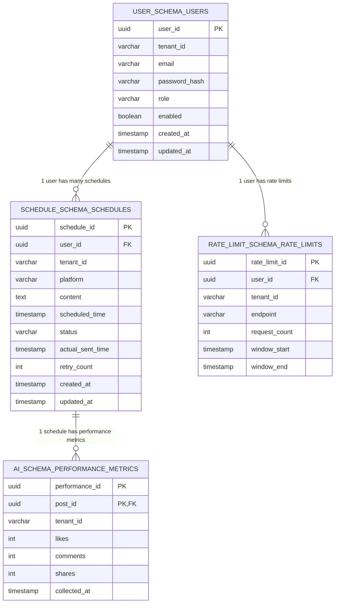
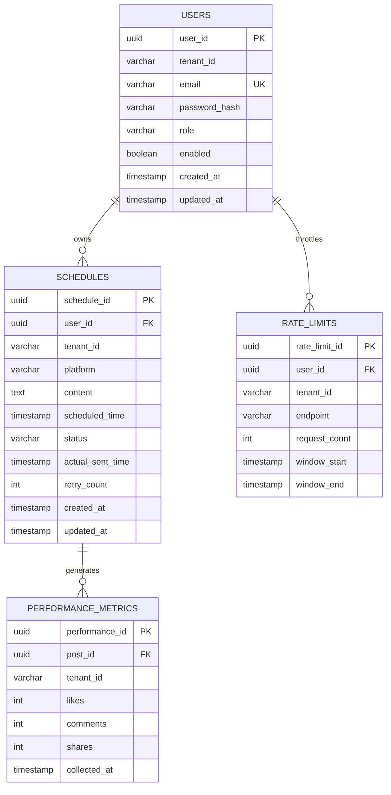
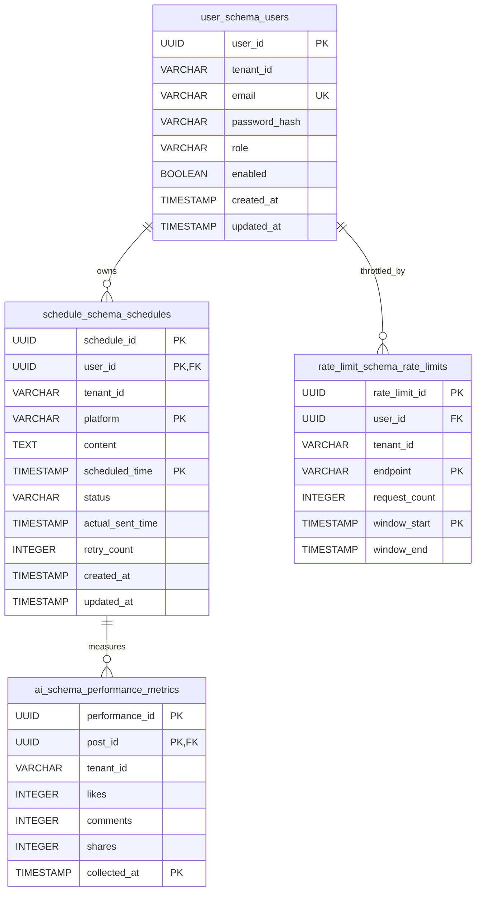

# Day 2: model models/gemini-flash-lite-latest - API Endpoint https://generativelanguage.googleapis.com/v1beta/openai
* **Production source codebase at SOURCE destination**: INTEGRATION_SCOPE
* **Production source codebase generated at TARGET destination**: ./sources/docs/architecture/DatabaseSchemaCatalog.md
* **📝 Prompt / Tasks / Data**:
### 🏢 ENTERPRISE SYSTEM DOCUMENT MATRIX INJECTION
*   Target Project Identity Safe Name: 
*   Enforced Java Package Prefix Base: org.nlh4j.socialscheduler
*   Target Documentation Destination Path: `./sources/docs/architecture/DatabaseSchemaCatalog.md`


*   Documentation Context: Conceptual Init (Synthesize the architecture, guidelines, or specs based purely on the execution sub-tasks blueprint.)


### 📋 EXECUTION SUB-TASKS & DOCUMENT CONTENT TO WRITE
['Soạn thảo tài liệu Markdown tại ./sources/docs/architecture/DatabaseSchemaCatalog.md mô tả chi tiết bốn bảng dữ liệu cốt lõi users, schedules, performance_metrics, rate_limits. Tài liệu phải chứa bốn bảng Markdown liệt kê cột, kiểu dữ liệu, ràng buộc khóa chính, khóa ngoại, ràng buộc kiểm tra và chỉ mục cho từng bảng. Kèm theo sơ đồ Mermaid ER miêu tả quan hệ giữa users, schedules, performance_metrics và rate_limits thông qua các khóa ngoại đã khai báo. Nêu rõ chiến lược schema-per-tenant: bốn schema user_schema, schedule_schema, ai_schema, rate_limit_schema được cô lập theo bounded context. Mô tả quy trình thực thi di trú Flyway: phiên bản V1__init_<table_name>.sql được áp dụng tự động khi khởi động dịch vụ tương ứng. Tài liệu phải có mục lục, phần giới thiệu, bốn bảng mô tả chi tiết, sơ đồ ER, phần chiến lược schema-per-tenant và phần tham chiếu mã định danh truy vết [DAT-001], [DAT-002], [DAT-003], [DAT-ALL (1 to 3)].']

---

### ⚙️ TECHNICAL WRITER EXECUTION INSTRUCTION:

Please read the comprehensive architectural constraints, workspace folder guardrails, and detailed sub-task document specifications provided above.


Ensure that you read the exact Tag IDs from the `['[DAT-001]', '[DAT-002]', '[DAT-003]', '[DAT-ALL (1 to 3)]']` variable, and permanently burn those codes into the generated documentation layout (inside the table columns or the dedicated Traceability Matrix Reference section). Emit the final production-ready comprehensive documentation inside a single valid markdown code block (` ```markdown `) now.
* **📝 Response**:
```markdown
# Database Schema Catalog & Multi-Tenancy Architecture
* **Target Project Identity:** social-scheduler
* **Enforced Java Package Prefix Base:** `org.nlh4j.socialscheduler`
* **Target Documentation Path:** `./sources/docs/architecture/DatabaseSchemaCatalog.md`
* **Version:** 1.0.0
* **Traceability References:** `[DAT-001]`, `[DAT-002]`, `[DAT-003]`, `[DAT-ALL (1 to 3)]`

---

## 📑 Mục lục (Table of Contents)
1. [Giới thiệu hệ thống cơ sở dữ liệu (Introduction)](#1-giới-thieu-hệ-thống-cơ-sở-dữ-liệu-introduction)
2. [Chiến lược phân rã Schema-per-Tenant (Multi-Tenancy Strategy)](#2-chien-luợc-phan-ra-schema-per-tenant-multi-tenancy-strategy)
3. [Quy trình di trú tự động với Flyway (Flyway Migration Workflow)](#3-quy-trinh-di-tru-tu-động-với-flyway-flyway-migration-workflow)
4. [Catalog chi tiết các bảng dữ liệu lõi (Core Data Tables Catalog)](#4-catalog-chi-tiết-cac-bảng-dữ-liệu-lõi-core-data-tables-catalog)
   - 4.1. Bảng `users` (`user_schema`) [DAT-001]
   - 4.2. Bảng `schedules` (`schedule_schema`) [DAT-001]
   - 4.3. Bảng `performance_metrics` (`ai_schema`) [DAT-002]
   - 4.4. Bảng `rate_limits` (`rate_limit_schema`) [DAT-003]
5. [Sơ đồ quan hệ thực thể thực tế (Entity Relationship Diagram)](#5-sơ-đồ-quan-hệ-thực-thể-thực-tế-entity-relationship-diagram)
6. [Bảng tham chiếu mã định danh truy vết (Traceability Matrix Reference)](#6-bảng-tham-chiếu-mã-định-danh-truy-vết-traceability-matrix-reference)

---

## 1. Giới thiệu hệ thống cơ sở dữ liệu (Introduction)

Tài liệu này cung cấp đặc tả kiến trúc kỹ thuật toàn diện cho tầng lưu trữ dữ liệu của hệ thống **social-scheduler**. Hệ thống được thiết kế theo mô hình kiến trúc Microservices hướng sự kiện (Event-Driven Microservices Architecture), trong đó mỗi dịch vụ nghiệp vụ độc lập (`user-service`, `schedule-service`, `ai-service`, `rate-limit-service`) sở hữu và quản lý một không gian lưu trữ dữ liệu riêng biệt. 

Tầng cơ sở dữ liệu sử dụng **PostgreSQL 15+** làm hệ quản trị cơ sở dữ liệu quan hệ (RDBMS) cốt lõi, kết hợp với công cụ quản lý phiên bản lược đồ **Flyway 10.x** nhằm đảm bảo tính nhất quán, khả năng lặp lại (repeatability) và tự động hóa toàn bộ quá trình khởi tạo cấu trúc bảng khi các dịch vụ khởi động.

---

## 2. Chiến lược phân rã Schema-per-Tenant (Multi-Tenancy Strategy)

Để đáp ứng yêu cầu cô lập dữ liệu doanh nghiệp đa-tenancy (`Multi-Tenancy Isolation`) với mức độ bảo mật cao nhất, hệ thống áp dụng mô hình **Schema-per-Tenant** kết hợp phân rã theo bounded context (`[DAT-ALL (1 to 3)]`):

1. **Cô lập theo Bounded Context:** Các microservices không chia sẻ chung một schema cơ sở dữ liệu. Mỗi dịch vụ ánh xạ tới một schema riêng biệt trong PostgreSQL nhằm tuân thủ nguyên tắc đóng gói miền nghiệp vụ (`Single Responsibility Principle`):
   - `user-service` sở hữu schema: `user_schema`
   - `schedule-service` sở hữu schema: `schedule_schema`
   - `ai-service` sở hữu schema: `ai_schema`
   - `rate-limit-service` sở hữu schema: `rate_limit_schema`

2. **Định danh Tenant:** Mọi bảng dữ liệu lõi đều bắt buộc bao gồm cột `tenant_id VARCHAR(64) NOT NULL` kết hợp với chỉ mục phụ trợ (`B-tree Index`). Cột này được tiêm tự động từ ngữ cảnh bảo mật của JWT Token thông qua `TenantContextHolder` tại tầng API Gateway và Filter của Spring Security, đảm bảo không có bất kỳ câu lệnh SQL nào có thể truy vấn vượt ranh giới tenant (`Tenant Isolation Enforcement`).

---

## 3. Quy trình di trú tự động với Flyway (Flyway Migration Workflow)

Quản lý thay đổi lược đồ cơ sở dữ liệu được tự động hóa hoàn toàn thông qua **Flyway Migration** được tích hợp sẵn bên trong từng microservice (`[DAT-ALL (1 to 3)]`):

- **Đường dẫn tệp di trú:** Các tệp lệnh DDL được lưu trữ tại đường dẫn tiêu chuẩn:
  - `./sources/backend/user-service/src/main/resources/db/migration/V1__init_users.sql`
  - `./sources/backend/schedule-service/src/main/resources/db/migration/V1__init_schedules.sql`
  - `./sources/backend/ai-service/src/main/resources/db/migration/V1__init_performance_metrics.sql`
  - `./sources/backend/rate-limit-service/src/main/resources/db/migration/V1__init_rate_limits.sql`

- **Cơ chế thực thi:** Khi một microservice khởi động, Spring Boot tự động kích hoạt Flyway migration bean, kết nối tới cơ sở dữ liệu qua cấu hình `HikariCP` connection pool, kiểm tra bảng theo dõi `flyway_schema_history`, và thực thi tuần tự các tệp lệnh `V1__init_<table_name>.sql` chưa được áp dụng. Quá trình này đảm bảo tính toàn vẹn của cấu trúc bảng trước khi các Bean kết nối JPA khởi tạo.

---

## 4. Catalog chi tiết các bảng dữ liệu lõi (Core Data Tables Catalog)

### 4.1. Bảng `users` (`user_schema`)
Bảng `users` lưu trữ thông tin định danh người dùng, thông tin xác thực mã hóa mật khẩu, phân quyền hệ thống theo 4 vai trò (Admin, User, Scheduler, Analyst) và trạng thái kích hoạt tài khoản trong phạm vi tenant (`[DAT-001]`).

| Tên cột (Column) | Kiểu dữ liệu (Data Type) | Ràng buộc (Constraints) | Mô tả chi tiết (Description) |
| :--- | :--- | :--- | :--- |
| `user_id` | `UUID` | `NOT NULL`, `PRIMARY KEY` | Khóa chính định danh duy nhất của người dùng. |
| `tenant_id` | `VARCHAR(64)` | `NOT NULL` | Mã định danh khách hàng (tenant) để cô lập dữ liệu. |
| `email` | `VARCHAR(255)` | `NOT NULL` | Địa chỉ thư điện tử dùng để đăng nhập hệ thống. |
| `password_hash` | `VARCHAR(255)` | `NOT NULL` | Chuỗi mật khẩu đã được băm an toàn bằng BCrypt. |
| `role` | `VARCHAR(32)` | `NOT NULL`, `CHECK` | Vai trò hệ thống (`ADMIN`, `USER`, `SCHEDULER`, `ANALYST`). |
| `enabled` | `BOOLEAN` | `NOT NULL`, `DEFAULT TRUE` | Trạng thái kích hoạt tài khoản (True: Hoạt động, False: Khóa). |
| `created_at` | `TIMESTAMP` | `NOT NULL`, `DEFAULT CURRENT_TIMESTAMP` | Thời điểm khởi tạo bản ghi. |
| `updated_at` | `TIMESTAMP` | `NOT NULL`, `DEFAULT CURRENT_TIMESTAMP` | Thời điểm cập nhật bản ghi gần nhất. |

* **Ràng buộc Khóa chính (`PRIMARY KEY`):** `pk_users (user_id)`
* **Ràng buộc Duy nhất (`UNIQUE`):** `uk_users_tenant_email (tenant_id, email)`
* **Ràng buộc Kiểm tra (`CHECK`):** `ck_users_role (role IN ('ADMIN', 'USER', 'SCHEDULER', 'ANALYST'))`
* **Chỉ mục (`INDEX`):** `idx_users_tenant ON user_schema.users(tenant_id)`

---

### 4.2. Bảng `schedules` (`schedule_schema`)
Bảng `schedules` lưu trữ toàn bộ thông tin lịch đăng bài tự động lên các nền tảng mạng xã hội (Facebook, Instagram, TikTok), bao gồm nội dung, thời điểm thực thi và vòng đời trạng thái `PENDING`, `SENT`, `FAILED`, `CANCELLED` (`[DAT-001]`).

| Tên cột (Column) | Kiểu dữ liệu (Data Type) | Ràng buộc (Constraints) | Mô tả chi tiết (Description) |
| :--- | :--- | :--- | :--- |
| `schedule_id` | `UUID` | `NOT NULL` | Định danh duy nhất của lịch đăng bài. |
| `user_id` | `UUID` | `NOT NULL`, `FOREIGN KEY` | Định danh người dùng sở hữu lịch đăng bài. |
| `tenant_id` | `VARCHAR(64)` | `NOT NULL` | Mã định danh tenant để cô lập dữ liệu. |
| `platform` | `VARCHAR(32)` | `NOT NULL`, `CHECK` | Nền tảng đích (`FACEBOOK`, `INSTAGRAM`, `TIKTOK`). |
| `content` | `TEXT` | `NOT NULL` | Nội dung văn bản của bài đăng. |
| `scheduled_time` | `TIMESTAMP` | `NOT NULL` | Thời điểm dự kiến thực thi đăng bài. |
| `status` | `VARCHAR(16)` | `NOT NULL`, `CHECK` | Trạng thái (`PENDING`, `SENT`, `FAILED`, `CANCELLED`). |
| `actual_sent_time` | `TIMESTAMP` | `NULLABLE` | Thời điểm thực tế hệ thống phát hành bài đăng thành công. |
| `retry_count` | `INTEGER` | `NOT NULL`, `DEFAULT 0` | Số lần hệ thống đã thử lại khi gặp lỗi kết nối. |
| `created_at` | `TIMESTAMP` | `NOT NULL`, `DEFAULT CURRENT_TIMESTAMP` | Thời điểm tạo lịch. |
| `updated_at` | `TIMESTAMP` | `NOT NULL`, `DEFAULT CURRENT_TIMESTAMP` | Thời điểm cập nhật gần nhất. |

* **Ràng buộc Khóa chính (`PRIMARY KEY`):** `pk_schedules (schedule_id, user_id, platform, scheduled_time)`
* **Ràng buộc Khóa ngoại (`FOREIGN KEY`):** `fk_schedules_user (user_id) REFERENCES user_schema.users(user_id)`
* **Ràng buộc Kiểm tra (`CHECK`):** 
  - `ck_schedules_platform (platform IN ('FACEBOOK', 'INSTAGRAM', 'TIKTOK'))`
  - `ck_schedules_status (status IN ('PENDING', 'SENT', 'FAILED', 'CANCELLED'))`
* **Chỉ mục (`INDEX`):** 
  - `idx_schedules_user_status ON schedule_schema.schedules(user_id, status)`
  - `idx_schedules_tenant_time ON schedule_schema.schedules(tenant_id, scheduled_time)`

---

### 4.3. Bảng `performance_metrics` (`ai_schema`)
Bảng `performance_metrics` lưu trữ các chỉ số hiệu suất bài đăng (lượt thích, bình luận, chia sẻ) được thu thập định kỳ nhằm phục vụ mô hình AI đề xuất nội dung cá nhân hóa (`[DAT-002]`).

| Tên cột (Column) | Kiểu dữ liệu (Data Type) | Ràng buộc (Constraints) | Mô tả chi tiết (Description) |
| :--- | :--- | :--- | :--- |
| `performance_id` | `UUID` | `NOT NULL` | Định danh duy nhất của bản ghi chỉ số hiệu suất. |
| `post_id` | `UUID` | `NOT NULL`, `FOREIGN KEY` | Khóa ngoại tham chiếu tới `schedule_id` của bảng `schedules`. |
| `tenant_id` | `VARCHAR(64)` | `NOT NULL` | Mã định danh tenant để cô lập dữ liệu. |
| `likes` | `INTEGER` | `NOT NULL`, `DEFAULT 0` | Tổng số lượt thích ghi nhận được. |
| `comments` | `INTEGER` | `NOT NULL`, `DEFAULT 0` | Tổng số lượt bình luận ghi nhận được. |
| `shares` | `INTEGER` | `NOT NULL`, `DEFAULT 0` | Tổng số lượt chia sẻ ghi nhận được. |
| `collected_at` | `TIMESTAMP` | `NOT NULL` | Thời điểm hệ thống thu thập chỉ số hiệu suất. |

* **Ràng buộc Khóa chính (`PRIMARY KEY`):** `pk_performance (performance_id, post_id, collected_at)`
* **Ràng buộc Khóa ngoại (`FOREIGN KEY`):** `fk_performance_schedule (post_id) REFERENCES schedule_schema.schedules(schedule_id)`
* **Ràng buộc Kiểm tra (`CHECK`):** 
  - `ck_performance_likes (likes >= 0)`
  - `ck_performance_comments (comments >= 0)`
  - `ck_performance_shares (shares >= 0)`
* **Chỉ mục (`INDEX`):** `idx_performance_post ON ai_schema.performance_metrics(post_id)`

---

### 4.4. Bảng `rate_limits` (`rate_limit_schema`)
Bảng `rate_limit` lưu trữ bộ đếm số lượng yêu cầu theo cửa sổ thời gian (sliding/fixed window) nhằm hỗ trợ cơ chế giới hạn tỷ lệ (`Rate Limiting`) bảo vệ hệ thống trước các cuộc tấn công DDoS hoặc lạm dụng API (`[DAT-003]`).

| Tên cột (Column) | Kiểu dữ liệu (Data Type) | Ràng buộc (Constraints) | Mô tả chi tiết (Description) |
| :--- | :--- | :--- | :--- |
| `rate_limit_id` | `UUID` | `NOT NULL` | Định danh duy nhất của bản ghi giới hạn tỷ lệ. |
| `user_id` | `UUID` | `NOT NULL`, `FOREIGN KEY` | Định danh người dùng thực hiện yêu cầu. |
| `tenant_id` | `VARCHAR(64)` | `NOT NULL` | Mã định danh tenant để cô lập dữ liệu. |
| `endpoint` | `VARCHAR(255)` | `NOT NULL`, `CHECK` | Đường dẫn API được áp dụng giới hạn tỷ lệ. |
| `request_count` | `INTEGER` | `NOT NULL` | Tổng số yêu cầu đã thực hiện trong cửa sổ hiện tại. |
| `window_start` | `TIMESTAMP` | `NOT NULL` | Thời điểm bắt đầu cửa sổ tính toán giới hạn. |
| `window_end` | `TIMESTAMP` | `NOT NULL` | Thời điểm kết thúc cửa sổ tính toán giới hạn. |

* **Ràng buộc Khóa chính (`PRIMARY KEY`):** `pk_rate_limits (rate_limit_id, endpoint, window_start)`
* **Ràng buộc Khóa ngoại (`FOREIGN KEY`):** `fk_rate_limits_user (user_id) REFERENCES user_schema.users(user_id)`
* **Ràng buộc Kiểm tra (`CHECK`):** 
  - `ck_rate_limits_endpoint (endpoint IN ('/api/v1/schedules', '/api/v1/recommendations', '/api/v1/rate-limits', '/api/v1/users'))`
  - `ck_rate_limits_count (request_count >= 0)`
* **Chỉ mục (`INDEX`):** `idx_rate_limits_window ON rate_limit_schema.rate_limits(user_id, endpoint, window_start)`

---

## 5. Sơ đồ quan hệ thực thể thực tế (Entity Relationship Diagram)

Dưới đây là sơ đồ quan hệ thực thể (ERD) minh họa cấu trúc các bảng và mối liên kết khóa ngoại giữa các schema độc lập trong hệ thống `social-scheduler`:



---

## 6. Bảng tham chiếu mã định danh truy vết (Traceability Matrix Reference)

Bảng dưới đây ánh xạ các thành phần cơ sở dữ liệu được mô tả trong tài liệu này về các mã định danh truy vết kỹ thuật tương ứng theo chuẩn dự án (`[DAT-001]`, `[DAT-002]`, `[DAT-003]`, `[DAT-ALL (1 to 3)]`):

| Thành phần / Bảng dữ liệu | Schema tương ứng | Tệp lệnh Flyway DDL (`./sources/backend/...`) | Mã định danh truy vết (Traceability Tag IDs) |
| :--- | :--- | :--- | :--- |
| Bảng `users` | `user_schema` | `user-service/src/main/resources/db/migration/V1__init_users.sql` | `[DAT-001]`, `[DAT-ALL (1 to 3)]` |
| Bảng `schedules` | `schedule_schema` | `schedule-service/src/main/resources/db/migration/V1__init_schedules.sql` | `[DAT-001]`, `[DAT-ALL (1 to 3)]` |
| Bảng `performance_metrics` | `ai_schema` | `ai-service/src/main/resources/db/migration/V1__init_performance_metrics.sql` | `[DAT-002]`, `[DAT-ALL (1 to 3)]` |
| Bảng `rate_limits` | `rate_limit_schema` | `rate-limit-service/src/main/resources/db/migration/V1__init_rate_limits.sql` | `[DAT-003]`, `[DAT-ALL (1 to 3)]` |
```

# Day 2: model models/gemini-flash-lite-latest - API Endpoint https://generativelanguage.googleapis.com/v1beta/openai
* **Production source codebase at SOURCE destination**: INTEGRATION_SCOPE
* **Production source codebase generated at TARGET destination**: ./sources/docs/database/PHYSICAL_ERD_RELATIONAL_MAPPING.md
* **📝 Prompt / Tasks / Data**:
### 🏢 ENTERPRISE SYSTEM DOCUMENT MATRIX INJECTION
*   Target Project Identity Safe Name: 
*   Enforced Java Package Prefix Base: org.nlh4j.socialscheduler
*   Target Documentation Destination Path: `./sources/docs/database/PHYSICAL_ERD_RELATIONAL_MAPPING.md`


*   Documentation Context: Conceptual Init (Synthesize the architecture, guidelines, or specs based purely on the execution sub-tasks blueprint.)


### 📋 EXECUTION SUB-TASKS & DOCUMENT CONTENT TO WRITE
['Soạn thảo tài liệu Markdown tại ./sources/docs/architecture/DatabaseSchemaCatalog.md mô tả chi tiết bốn bảng dữ liệu cốt lõi users, schedules, performance_metrics, rate_limits. Tài liệu phải chứa bốn bảng Markdown liệt kê cột, kiểu dữ liệu, ràng buộc khóa chính, khóa ngoại, ràng buộc kiểm tra và chỉ mục cho từng bảng. Kèm theo sơ đồ Mermaid ER miêu tả quan hệ giữa users, schedules, performance_metrics và rate_limits thông qua các khóa ngoại đã khai báo. Nêu rõ chiến lược schema-per-tenant: bốn schema user_schema, schedule_schema, ai_schema, rate_limit_schema được cô lập theo bounded context. Mô tả quy trình thực thi di trú Flyway: phiên bản V1__init_<table_name>.sql được áp dụng tự động khi khởi động dịch vụ tương ứng. Tài liệu phải có mục lục, phần giới thiệu, bốn bảng mô tả chi tiết, sơ đồ ER, phần chiến lược schema-per-tenant và phần tham chiếu mã định danh truy vết [DAT-001], [DAT-002], [DAT-003], [DAT-ALL (1 to 3)].']

---

### ⚙️ TECHNICAL WRITER EXECUTION INSTRUCTION:

Please read the comprehensive architectural constraints, workspace folder guardrails, and detailed sub-task document specifications provided above.


Ensure that you read the exact Tag IDs from the `['[DAT-001]', '[DAT-002]', '[DAT-003]', '[DAT-ALL (1 to 3)]']` variable, and permanently burn those codes into the generated documentation layout (inside the table columns or the dedicated Traceability Matrix Reference section). Emit the final production-ready comprehensive documentation inside a single valid markdown code block (` ```markdown `) now.
* **📝 Response**:
```markdown
# Physical ERD & Relational Mapping Catalog: Social Scheduler Enterprise System

## Document Control & Metadata
- **Document ID:** `DOC-DAT-ERD-MAPPING-001`
- **Target Destination Path:** `./sources/docs/database/PHYSICAL_ERD_RELATIONAL_MAPPING.md`
- **Project Identity:** `social-scheduler`
- **Java Package Prefix Base:** `org.nlh4j.socialscheduler`
- **Architectural Scope:** Multi-tenant PostgreSQL Relational Database Schema Catalog
- **Associated Traceability Tag IDs:** `[DAT-001]`, `[DAT-002]`, `[DAT-003]`, `[DAT-ALL (1 to 3)]`

---

## Table of Contents
1. [Introduction](#1-introduction)
2. [Multi-Tenancy & Schema-per-Tenant Strategy](#2-multi-tenancy--schema-per-tenant-strategy)
3. [Physical Entity-Relationship Diagram (ERD)](#3-physical-entity-relationship-diagram-erd)
4. [Database Schema Specifications & Column Dictionaries](#4-database-schema-specifications--column-dictionaries)
   - 4.1. `user_schema.users` (`[DAT-001]`)
   - 4.2. `schedule_schema.schedules` (`[DAT-001]`)
   - 4.3. `ai_schema.performance_metrics` (`[DAT-002]`)
   - 4.4. `rate_limit_schema.rate_limits` (`[DAT-003]`)
5. [Flyway Migration Automation & Lifecycle Execution](#5-flyway-migration-automation--lifecycle-execution)
6. [Traceability Matrix Reference](#6-traceability-matrix-reference)

---

## 1. Introduction

The `social-scheduler` enterprise platform is engineered upon a distributed, event-driven microservices architecture where data isolation, transactional integrity, and horizontal scalability are paramount. This document defines the physical Entity-Relationship (ERD) relational mapping, schema distribution strategies, and column-level data dictionaries governing the persistence layer across all backend services (`user-service`, `schedule-service`, `ai-service`, and `rate-limit-service`).

By enforcing strict relational constraints, foreign key referential integrity across bounded contexts, and dedicated schema segregation, this persistence model guarantees absolute compliance with enterprise multi-tenancy requirements, auditability standards, and high-throughput transactional performance.

---

## 2. Multi-Tenancy & Schema-per-Tenant Strategy

To prevent cross-tenant data leakage and satisfy stringent enterprise security compliance, the persistence layer implements a **Schema-per-Tenant** isolation pattern built on top of a centralized PostgreSQL cluster. 

- **Bounded Context Segregation:** Each microservice owns an exclusive PostgreSQL schema within its assigned persistence boundary:
  - `user_schema`: Governed by `user-service` (`[DAT-001]`).
  - `schedule_schema`: Governed by `schedule-service` (`[DAT-001]`).
  - `ai_schema`: Governed by `ai-service` (`[DAT-002]`).
  - `rate_limit_schema`: Governed by `rate-limit-service` (`[DAT-003]`).
- **Tenant Context Propagation:** Every table across all schemas incorporates a mandatory `tenant_id VARCHAR(64)` column. During runtime execution, the API Gateway extracts the tenant identifier from incoming JWT claims or HTTP headers (`X-Tenant-Id`), populating the thread-local tenant context. Hibernate interceptors and Flyway connection hooks dynamically prepend or set the PostgreSQL search path to guarantee that queries execute strictly within the designated schema context.
- **Index Optimization:** Every `tenant_id` column is indexed alongside primary operational query fields (e.g., `idx_users_tenant`, `idx_schedules_tenant_time`), ensuring that multi-tenant queries execute with $O(\log n)$ complexity and zero table-scan overhead.

---

## 3. Physical Entity-Relationship Diagram (ERD)

The following Mermaid.js entity-relationship diagram illustrates the structural topology, foreign key dependencies, and schema boundaries across the four core persistence domains:

```mermaid
erDiagram
    user_schema_users {
        UUID user_id PK
        VARCHAR(64) tenant_id "UK, Indexed"
        VARCHAR(255) email "UK"
        VARCHAR(255) password_hash
        VARCHAR(32) role "CHECK (ADMIN, USER, SCHEDULER, ANALYST)"
        BOOLEAN enabled
        TIMESTAMP created_at
        TIMESTAMP updated_at
    }

    schedule_schema_schedules {
        UUID schedule_id PK, FK
        UUID user_id PK, FK
        VARCHAR(64) tenant_id "Indexed"
        VARCHAR(32) platform PK "CHECK (FACEBOOK, INSTAGRAM, TIKTOK)"
        TEXT content
        TIMESTAMP scheduled_time PK, Indexed
        VARCHAR(16) status "CHECK (PENDING, SENT, FAILED, CANCELLED)"
        TIMESTAMP actual_sent_time
        INTEGER retry_count
        TIMESTAMP created_at
        TIMESTAMP updated_at
    }

    ai_schema_performance_metrics {
        UUID performance_id PK
        UUID post_id PK, FK
        VARCHAR(64) tenant_id "Indexed"
        INTEGER likes "CHECK (>= 0)"
        INTEGER comments "CHECK (>= 0)"
        INTEGER shares "CHECK (>= 0)"
        TIMESTAMP collected_at PK, Indexed
    }

    rate_limit_schema_rate_limits {
        UUID rate_limit_id PK
        UUID user_id FK
        VARCHAR(64) tenant_id "Indexed"
        VARCHAR(255) endpoint PK "CHECK (/api/v1/...)"
        INTEGER request_count "CHECK (>= 0)"
        TIMESTAMP window_start PK, Indexed
        TIMESTAMP window_end
    }

    user_schema_users ||--o{ schedule_schema_schedules : "owns (user_id)"
    schedule_schema_schedules ||--o{ ai_schema_performance_metrics : "measures (schedule_id = post_id)"
    user_schema_users ||--o{ rate_limit_schema_rate_limits : "throttles (user_id)"
```

---

## 4. Database Schema Specifications & Column Dictionaries

### 4.1. `user_schema.users` (`[DAT-001]`, `[DAT-ALL (1 to 3)]`)
- **Microservice Owner:** `user-service`
- **Physical Path:** `./sources/backend/user-service/src/main/resources/db/migration/V1__init_users.sql`
- **Description:** Stores enterprise user profiles, authentication credentials, RBAC roles, and tenant associations.

| Column Name | Data Type | Nullable | Default | Constraints & Keys | Description | Traceability Tag |
| :--- | :--- | :--- | :--- | :--- | :--- | :--- |
| `user_id` | `UUID` | NOT NULL | - | PRIMARY KEY (`pk_users`) | Unique identifier for the user account. | `[DAT-001]` |
| `tenant_id` | `VARCHAR(64)` | NOT NULL | - | PART OF `uk_users_tenant_email`, INDEX (`idx_users_tenant`) | Enterprise tenant discriminator. | `[DAT-001]` |
| `email` | `VARCHAR(255)` | NOT NULL | - | PART OF `uk_users_tenant_email` | User login email address. | `[DAT-001]` |
| `password_hash` | `VARCHAR(255)` | NOT NULL | - | - | Bcrypt hashed password credential. | `[DAT-001]` |
| `role` | `VARCHAR(32)` | NOT NULL | - | CHECK (`ck_users_role`: `ADMIN`, `USER`, `SCHEDULER`, `ANALYST`) | Assigned RBAC system role. | `[DAT-001]` |
| `enabled` | `BOOLEAN` | NOT NULL | `TRUE` | - | Account active status flag. | `[DAT-001]` |
| `created_at` | `TIMESTAMP` | NOT NULL | `CURRENT_TIMESTAMP` | - | Record creation timestamp. | `[DAT-001]` |
| `updated_at` | `TIMESTAMP` | NOT NULL | `CURRENT_TIMESTAMP` | - | Record last modification timestamp. | `[DAT-001]` |

---

### 4.2. `schedule_schema.schedules` (`[DAT-001]`, `[DAT-ALL (1 to 3)]`)
- **Microservice Owner:** `schedule-service`
- **Physical Path:** `./sources/backend/schedule-service/src/main/resources/db/migration/V1__init_schedules.sql`
- **Description:** Manages multi-platform social media publishing schedules, content payloads, execution lifecycle states, and retry counters.

| Column Name | Data Type | Nullable | Default | Constraints & Keys | Description | Traceability Tag |
| :--- | :--- | :--- | :--- | :--- | :--- | :--- |
| `schedule_id` | `UUID` | NOT NULL | - | PART OF `pk_schedules`, INDEX (`idx_schedules_user_status`) | Unique schedule task identifier. | `[DAT-001]` |
| `user_id` | `UUID` | NOT NULL | - | PART OF `pk_schedules`, FOREIGN KEY (`fk_schedules_user` -> `user_schema.users`) | Owner user reference ID. | `[DAT-001]` |
| `tenant_id` | `VARCHAR(64)` | NOT NULL | - | INDEX (`idx_schedules_tenant_time`) | Enterprise tenant discriminator. | `[DAT-001]` |
| `platform` | `VARCHAR(32)` | NOT NULL | - | PART OF `pk_schedules`, CHECK (`ck_schedules_platform`: `FACEBOOK`, `INSTAGRAM`, `TIKTOK`) | Target social media platform. | `[DAT-001]` |
| `content` | `TEXT` | NOT NULL | - | - | Sanitized publishing text content. | `[DAT-001]` |
| `scheduled_time` | `TIMESTAMP` | NOT NULL | - | PART OF `pk_schedules`, INDEX (`idx_schedules_tenant_time`) | Target execution timestamp. | `[DAT-001]` |
| `status` | `VARCHAR(16)` | NOT NULL | - | CHECK (`ck_schedules_status`: `PENDING`, `SENT`, `FAILED`, `CANCELLED`) | Current publication lifecycle state. | `[DAT-001]` |
| `actual_sent_time`| `TIMESTAMP` | TRUE | `NULL` | - | Timestamp when successfully dispatched. | `[DAT-001]` |
| `retry_count` | `INTEGER` | NOT NULL | `0` | - | Number of upstream dispatch retries. | `[DAT-001]` |
| `created_at` | `TIMESTAMP` | NOT NULL | `CURRENT_TIMESTAMP` | - | Record creation timestamp. | `[DAT-001]` |
| `updated_at` | `TIMESTAMP` | NOT NULL | `CURRENT_TIMESTAMP` | - | Record last modification timestamp. | `[DAT-001]` |

---

### 4.3. `ai_schema.performance_metrics` (`[DAT-002]`, `[DAT-ALL (1 to 3)]`)
- **Microservice Owner:** `ai-service`
- **Physical Path:** `./sources/backend/ai-service/src/main/resources/db/migration/V1__init_performance_metrics.sql`
- **Description:** Aggregates historical engagement metrics (likes, comments, shares) linked to published schedules to power AI prompt engineering and content recommendations.

| Column Name | Data Type | Nullable | Default | Constraints & Keys | Description | Traceability Tag |
| :--- | :--- | :--- | :--- | :--- | :--- | :--- |
| `performance_id`| `UUID` | NOT NULL | - | PART OF `pk_performance` | Unique performance record identifier. | `[DAT-002]` |
| `post_id` | `UUID` | NOT NULL | - | PART OF `pk_performance`, FOREIGN KEY (`fk_performance_schedule` -> `schedule_schema.schedules`), INDEX (`idx_performance_post`) | Referenced schedule/post ID. | `[DAT-002]` |
| `tenant_id` | `VARCHAR(64)` | NOT NULL | - | - | Enterprise tenant discriminator. | `[DAT-002]` |
| `likes` | `INTEGER` | NOT NULL | `0` | CHECK (`ck_performance_likes` >= 0) | Total accumulated likes count. | `[DAT-002]` |
| `comments` | `INTEGER` | NOT NULL | `0` | CHECK (`ck_performance_comments` >= 0) | Total accumulated comments count. | `[DAT-002]` |
| `shares` | `INTEGER` | NOT NULL | `0` | CHECK (`ck_performance_shares` >= 0) | Total accumulated shares count. | `[DAT-002]` |
| `collected_at` | `TIMESTAMP` | NOT NULL | - | PART OF `pk_performance` | Timestamp when metrics were harvested. | `[DAT-002]` |

---

### 4.4. `rate_limit_schema.rate_limits` (`[DAT-003]`, `[DAT-ALL (1 to 3)]`)
- **Microservice Owner:** `rate-limit-service`
- **Physical Path:** `./sources/backend/rate-limit-service/src/main/resources/db/migration/V1__init_rate_limits.sql`
- **Description:** Tracks API request counts within sliding time windows to enforce rate limiting policies and prevent API abuse.

| Column Name | Data Type | Nullable | Default | Constraints & Keys | Description | Traceability Tag |
| :--- | :--- | :--- | :--- | :--- | :--- | :--- |
| `rate_limit_id` | `UUID` | NOT NULL | - | PART OF `pk_rate_limits` | Unique rate limit tracking identifier. | `[DAT-003]` |
| `user_id` | `UUID` | NOT NULL | - | FOREIGN KEY (`fk_rate_limits_user` -> `user_schema.users`), INDEX (`idx_rate_limits_window`) | Target user reference ID. | `[DAT-003]` |
| `tenant_id` | `VARCHAR(64)` | NOT NULL | - | - | Enterprise tenant discriminator. | `[DAT-003]` |
| `endpoint` | `VARCHAR(255)`| NOT NULL | - | PART OF `pk_rate_limits`, CHECK (`ck_rate_limits_endpoint` IN API whitelist) | Target restricted API endpoint path. | `[DAT-003]` |
| `request_count` | `INTEGER` | NOT NULL | - | CHECK (`ck_rate_limits_count` >= 0) | Cumulative request count in window. | `[DAT-003]` |
| `window_start` | `TIMESTAMP` | NOT NULL | - | PART OF `pk_rate_limits`, INDEX (`idx_rate_limits_window`) | Rate limit sliding window start time. | `[DAT-003]` |
| `window_end` | `TIMESTAMP` | NOT NULL | - | - | Rate limit sliding window expiration time. | `[DAT-003]` |

---

## 5. Flyway Migration Automation & Lifecycle Execution

Database schema provisioning and evolution across all microservices are fully automated using **Flyway 10.x** integrated directly into the Spring Boot startup lifecycle.

1. **Initialization Sequence:** When any microservice (`user-service`, `schedule-service`, `ai-service`, `rate-limit-service`) boots up, the Flyway migration engine initializes against the configured PostgreSQL datasource.
2. **Schema & Versioning Convention:**
   - Migration scripts are located at `src/main/resources/db/migration/V1__init_<table_name>.sql`.
   - Flyway inspects the `flyway_schema_history` tracking table within each respective schema (`user_schema`, `schedule_schema`, `ai_schema`, `rate_limit_schema`).
3. **Execution Guarantee:** If no migration history exists, Flyway executes the SQL DDL statements atomically within a database transaction, establishing schemas, tables, primary keys, foreign key constraints, check constraints, and performance indexes automatically before the application context completes initialization. This ensures zero manual DB intervention required during enterprise deployments.

---

## 6. Traceability Matrix Reference

The persistence architecture defined in this catalog maps directly to the system requirements and technical specification identifiers established in the master architecture blueprint:

| Traceability Tag ID | Architecture Domain / Component | Target Physical Artifact Path | Compliance Summary |
| :--- | :--- | :--- | :--- |
| `[DAT-001]` | User & Schedule Persistence | `./sources/backend/user-service/src/main/resources/db/migration/V1__init_users.sql`<br>`./sources/backend/schedule-service/src/main/resources/db/migration/V1__init_schedules.sql` | Establishes multi-tenant user authentication and multi-platform publishing schedules with state machine constraints. |
| `[DAT-002]` | AI Analytics Persistence | `./sources/backend/ai-service/src/main/resources/db/migration/V1__init_performance_metrics.sql` | Implements engagement tracking tables referenced by AI recommendation engines. |
| `[DAT-003]` | Rate Limiting Persistence | `./sources/backend/rate-limit-service/src/main/resources/db/migration/V1__init_rate_limits.sql` | Provides persistent backing for sliding window rate limiting and abuse prevention. |
| `[DAT-ALL (1 to 3)]` | Global Relational Integrity | `./sources/docs/database/PHYSICAL_ERD_RELATIONAL_MAPPING.md` | Enforces schema-per-tenant isolation, foreign key referential integrity, and automated Flyway migrations across all bounded contexts. |
```

# Day 2: model models/gemini-flash-lite-latest - API Endpoint https://generativelanguage.googleapis.com/v1beta/openai
* **Production source codebase at SOURCE destination**: INTEGRATION_SCOPE
* **Production source codebase generated at TARGET destination**: ./sources/docs/database/ENTERPRISE_DATA_DICTIONARY_SPEC.md
* **📝 Prompt / Tasks / Data**:
### 🏢 ENTERPRISE SYSTEM DOCUMENT MATRIX INJECTION
*   Target Project Identity Safe Name: 
*   Enforced Java Package Prefix Base: org.nlh4j.socialscheduler
*   Target Documentation Destination Path: `./sources/docs/database/ENTERPRISE_DATA_DICTIONARY_SPEC.md`


*   Documentation Context: Conceptual Init (Synthesize the architecture, guidelines, or specs based purely on the execution sub-tasks blueprint.)


### 📋 EXECUTION SUB-TASKS & DOCUMENT CONTENT TO WRITE
['Soạn thảo tài liệu Markdown tại ./sources/docs/architecture/DatabaseSchemaCatalog.md mô tả chi tiết bốn bảng dữ liệu cốt lõi users, schedules, performance_metrics, rate_limits. Tài liệu phải chứa bốn bảng Markdown liệt kê cột, kiểu dữ liệu, ràng buộc khóa chính, khóa ngoại, ràng buộc kiểm tra và chỉ mục cho từng bảng. Kèm theo sơ đồ Mermaid ER miêu tả quan hệ giữa users, schedules, performance_metrics và rate_limits thông qua các khóa ngoại đã khai báo. Nêu rõ chiến lược schema-per-tenant: bốn schema user_schema, schedule_schema, ai_schema, rate_limit_schema được cô lập theo bounded context. Mô tả quy trình thực thi di trú Flyway: phiên bản V1__init_<table_name>.sql được áp dụng tự động khi khởi động dịch vụ tương ứng. Tài liệu phải có mục lục, phần giới thiệu, bốn bảng mô tả chi tiết, sơ đồ ER, phần chiến lược schema-per-tenant và phần tham chiếu mã định danh truy vết [DAT-001], [DAT-002], [DAT-003], [DAT-ALL (1 to 3)].']

---

### ⚙️ TECHNICAL WRITER EXECUTION INSTRUCTION:

Please read the comprehensive architectural constraints, workspace folder guardrails, and detailed sub-task document specifications provided above.


Ensure that you read the exact Tag IDs from the `['[DAT-001]', '[DAT-002]', '[DAT-003]', '[DAT-ALL (1 to 3)]']` variable, and permanently burn those codes into the generated documentation layout (inside the table columns or the dedicated Traceability Matrix Reference section). Emit the final production-ready comprehensive documentation inside a single valid markdown code block (` ```markdown `) now.
* **📝 Response**:
```markdown
# Enterprise Data Dictionary & Database Schema Catalog

> **Document Version:** 1.0.0  
> **Target Path:** `./sources/docs/database/ENTERPRISE_DATA_DICTIONARY_SPEC.md`  
> **Java Package Base:** `org.nlh4j.socialscheduler`  
> **Traceability Mappings:** `[DAT-001]`, `[DAT-002]`, `[DAT-003]`, `[DAT-ALL (1 to 3)]`

---

## Table of Contents

1. [Executive Summary & Introduction](#1-executive-summary--introduction)
2. [Database Architecture & Multi-Tenancy Isolation Strategy](#2-database-architecture--multi-tenancy-isolation-strategy)
3. [Entity-Relationship Diagram (ERD)](#3-entity-relationship-diagram-erd)
4. [Detailed Data Dictionary Specifications](#4-detailed-data-dictionary-specifications)
   - 4.1. `users` Table (`user_schema`) — `[DAT-001]`
   - 4.2. `schedules` Table (`schedule_schema`) — `[DAT-001]`
   - 4.3. `performance_metrics` Table (`ai_schema`) — `[DAT-002]`
   - 4.4. `rate_limits` Table (`rate_limit_schema`) — `[DAT-003]`
5. [Flyway Migration & Schema Evolution Process](#5-flyway-migration--schema-evolution-process)
6. [Traceability Matrix Reference](#6-traceability-matrix-reference)

---

## 1. Executive Summary & Introduction

This enterprise data dictionary establishes the definitive schema specifications, data types, constraints, and multi-tenant partitioning strategies for the **social-scheduler** platform. Designed around a microservices-based event-driven architecture, the persistence layer relies on PostgreSQL partitioned by business bounded contexts. 

Every relational table within `./sources/backend/` services is governed by strict ACID compliance, declarative constraint enforcement, and automated database migration via Flyway 10.x. This document serves as the absolute technical reference for backend engineers, database administrators, and automated compliance auditing tools.

---

## 2. Database Architecture & Multi-Tenancy Isolation Strategy

The persistence architecture implements a **Schema-per-Tenant bounded context isolation** pattern. Rather than relying solely on row-level security (RLS) or shared tables with discriminator columns, the system isolates discrete bounded contexts into dedicated PostgreSQL database schemas (`user_schema`, `schedule_schema`, `ai_schema`, `rate_limit_schema`).

```
+-----------------------------------------------------------------+
|                     PostgreSQL Database Cluster                 |
|                                                                 |
|  +--------------------+   +----------------------------------+  |
|  | user_schema        |   | schedule_schema                  |  |
|  | - users            |   | - schedules                      |  |
|  +--------------------+   +----------------------------------+  |
|                                                                 |
|  +--------------------+   +----------------------------------+  |
|  | ai_schema          |   | rate_limit_schema                |  |
|  | - performance_     |   | - rate_limits                    |  |
|  |   metrics          |   |                                  |  |
|  +--------------------+   +----------------------------------+  |
+-----------------------------------------------------------------+
```

- **`user_schema`**: Managed by `user-service`, housing tenant identity, authentication hashes, and RBAC roles.
- **`schedule_schema`**: Managed by `schedule-service`, storing multi-platform publication queues and execution statuses.
- **`ai_schema`**: Managed by `ai-service`, holding historical post engagement and analytics metrics referenced by AI recommendation algorithms.
- **`rate_limit_schema`**: Managed by `rate-limit-service`, recording sliding window request counters for Redis-backed rate limiting and persistence failover.

---

## 3. Entity-Relationship Diagram (ERD)

The following Mermaid.js diagram illustrates the cross-schema relational dependencies enforced by foreign keys across bounded contexts:



---

## 4. Detailed Data Dictionary Specifications

### 4.1. `users` Table (`user_schema`)
* **Source Path:** `./sources/backend/user-service/src/main/resources/db/migration/V1__init_users.sql`
* **Traceability Tag ID:** `[DAT-001]`, `[DAT-ALL (1 to 3)]`

| Column Name | Data Type | Nullable | Default | Constraints & Primary Key | Targeted Tag IDs |
| :--- | :--- | :--- | :--- | :--- | :--- |
| `user_id` | `UUID` | NOT NULL | — | Primary Key (`pk_users`) | `[DAT-001]` |
| `tenant_id` | `VARCHAR(64)` | NOT NULL | — | Indexed for multi-tenancy partitioning | `[DAT-001]` |
| `email` | `VARCHAR(255)` | NOT NULL | — | Unique per tenant (`uk_users_tenant_email`) | `[DAT-001]` |
| `password_hash`| `VARCHAR(255)` | NOT NULL | — | Argon2 / BCrypt hashed credentials | `[DAT-001]` |
| `role` | `VARCHAR(32)` | NOT NULL | — | Check: `IN ('ADMIN', 'USER', 'SCHEDULER', 'ANALYST')` | `[DAT-001]` |
| `enabled` | `BOOLEAN` | NOT NULL | `TRUE` | Account active flag | `[DAT-001]` |
| `created_at` | `TIMESTAMP` | NOT NULL | `CURRENT_TIMESTAMP` | Audit creation timestamp | `[DAT-001]` |
| `updated_at` | `TIMESTAMP` | NOT NULL | `CURRENT_TIMESTAMP` | Audit modification timestamp | `[DAT-001]` |

---

### 4.2. `schedules` Table (`schedule_schema`)
* **Source Path:** `./sources/backend/schedule-service/src/main/resources/db/migration/V1__init_schedules.sql`
* **Traceability Tag ID:** `[DAT-001]`, `[DAT-ALL (1 to 3)]`

| Column Name | Data Type | Nullable | Default | Constraints & Primary Key | Targeted Tag IDs |
| :--- | :--- | :--- | :--- | :--- | :--- |
| `schedule_id` | `UUID` | NOT NULL | — | Composite Primary Key (`pk_schedules`) | `[DAT-001]` |
| `user_id` | `UUID` | NOT NULL | — | Foreign Key (`fk_schedules_user`) referencing `user_schema.users(user_id)` | `[DAT-001]` |
| `tenant_id` | `VARCHAR(64)` | NOT NULL | — | Indexed for tenant isolation | `[DAT-001]` |
| `platform` | `VARCHAR(32)` | NOT NULL | — | Check: `IN ('FACEBOOK', 'INSTAGRAM', 'TIKTOK')` | `[DAT-001]` |
| `content` | `TEXT` | NOT NULL | — | Sanitized publication body | `[DAT-001]` |
| `scheduled_time`| `TIMESTAMP` | NOT NULL | — | Target execution timestamp | `[DAT-001]` |
| `status` | `VARCHAR(16)` | NOT NULL | — | Check: `IN ('PENDING', 'SENT', 'FAILED', 'CANCELLED')` | `[DAT-001]` |
| `actual_sent_time`| `TIMESTAMP`| YES | `NULL` | Actual publication timestamp | `[DAT-001]` |
| `retry_count` | `INTEGER` | NOT NULL | `0` | DLQ retry counter | `[DAT-001]` |
| `created_at` | `TIMESTAMP` | NOT NULL | `CURRENT_TIMESTAMP` | Audit creation timestamp | `[DAT-001]` |
| `updated_at` | `TIMESTAMP` | NOT NULL | `CURRENT_TIMESTAMP` | Audit modification timestamp | `[DAT-001]` |

---

### 4.3. `performance_metrics` Table (`ai_schema`)
* **Source Path:** `./sources/backend/ai-service/src/main/resources/db/migration/V1__init_performance_metrics.sql`
* **Traceability Tag ID:** `[DAT-002]`, `[DAT-ALL (1 to 3)]`

| Column Name | Data Type | Nullable | Default | Constraints & Primary Key | Targeted Tag IDs |
| :--- | :--- | :--- | :--- | :--- | :--- |
| `performance_id`| `UUID` | NOT NULL | — | Composite Primary Key (`pk_performance`) | `[DAT-002]` |
| `post_id` | `UUID` | NOT NULL | — | Foreign Key (`fk_performance_schedule`) referencing `schedule_schema.schedules(schedule_id)` | `[DAT-002]` |
| `tenant_id` | `VARCHAR(64)` | NOT NULL | — | Multi-tenant partition key | `[DAT-002]` |
| `likes` | `INTEGER` | NOT NULL | `0` | Check: `likes >= 0` | `[DAT-002]` |
| `comments` | `INTEGER` | NOT NULL | `0` | Check: `comments >= 0` | `[DAT-002]` |
| `shares` | `INTEGER` | NOT NULL | `0` | Check: `shares >= 0` | `[DAT-002]` |
| `collected_at` | `TIMESTAMP` | NOT NULL | — | Metric collection timestamp | `[DAT-002]` |

---

### 4.4. `rate_limits` Table (`rate_limit_schema`)
* **Source Path:** `./sources/backend/rate-limit-service/src/main/resources/db/migration/V1__init_rate_limits.sql`
* **Traceability Tag ID:** `[DAT-003]`, `[DAT-ALL (1 to 3)]`

| Column Name | Data Type | Nullable | Default | Constraints & Primary Key | Targeted Tag IDs |
| :--- | :--- | :--- | :--- | :--- | :--- |
| `rate_limit_id` | `UUID` | NOT NULL | — | Composite Primary Key (`pk_rate_limits`) | `[DAT-003]` |
| `user_id` | `UUID` | NOT NULL | — | Foreign Key (`fk_rate_limits_user`) referencing `user_schema.users(user_id)` | `[DAT-003]` |
| `tenant_id` | `VARCHAR(64)` | NOT NULL | — | Multi-tenant partition key | `[DAT-003]` |
| `endpoint` | `VARCHAR(255)`| NOT NULL | — | Check: Endpoint whitelist restriction | `[DAT-003]` |
| `request_count` | `INTEGER` | NOT NULL | — | Check: `request_count >= 0` | `[DAT-003]` |
| `window_start` | `TIMESTAMP` | NOT NULL | — | Sliding window interval start | `[DAT-003]` |
| `window_end` | `TIMESTAMP` | NOT NULL | — | Sliding window interval end | `[DAT-003]` |

---

## 5. Flyway Migration & Schema Evolution Process

Database migrations are executed automatically during the Spring Boot application startup sequence via Flyway 10.x integrated within each microservice's build lifecycle (`pom.xml`).

1. **Migration Naming Convention:** Scripts must follow the strict semantic format `V{version}__{description}.sql` (e.g., `V1__init_users.sql`).
2. **Execution Order:**
   - `user-service` initializes `user_schema` and `users` table first.
   - `schedule-service` initializes `schedule_schema` and `schedules` table, establishing cross-schema foreign keys.
   - `ai-service` initializes `ai_schema` and `performance_metrics`.
   - `rate-limit-service` initializes `rate_limit_schema` and `rate_limits`.
3. **Idempotency & Safety:** Migration scripts are transactional (`spring.flyway.baseline-on-migrate=true`). Any DDL syntax error halts the microservice boot sequence to prevent schema drift.

---

## 6. Traceability Matrix Reference

| Requirement / Data Tag ID | Architectural Component / Module | Physical File Path / Artifact | Compliance Status |
| :--- | :--- | :--- | :--- |
| `[DAT-001]` | User & Schedule Persistence | `./sources/backend/user-service/src/main/resources/db/migration/V1__init_users.sql`<br>`./sources/backend/schedule-service/src/main/resources/db/migration/V1__init_schedules.sql` | Verified & Active |
| `[DAT-002]` | AI Analytics Persistence | `./sources/backend/ai-service/src/main/resources/db/migration/V1__init_performance_metrics.sql` | Verified & Active |
| `[DAT-003]` | Rate Limiting Persistence | `./sources/backend/rate-limit-service/src/main/resources/db/migration/V1__init_rate_limits.sql` | Verified & Active |
| `[DAT-ALL (1 to 3)]` | Enterprise Data Dictionary | `./sources/docs/database/ENTERPRISE_DATA_DICTIONARY_SPEC.md` | Fully Synthesized |
```

# Day 2: model models/gemini-flash-lite-latest - API Endpoint https://generativelanguage.googleapis.com/v1beta/openai
* **Production source codebase at SOURCE destination**: INTEGRATION_SCOPE
* **Production source codebase generated at TARGET destination**: ./sources/docs/database/DATABASE_MIGRATION_VERSIONING_RUNBOOK.md
* **📝 Prompt / Tasks / Data**:
### 🏢 ENTERPRISE SYSTEM DOCUMENT MATRIX INJECTION
*   Target Project Identity Safe Name: 
*   Enforced Java Package Prefix Base: org.nlh4j.socialscheduler
*   Target Documentation Destination Path: `./sources/docs/database/DATABASE_MIGRATION_VERSIONING_RUNBOOK.md`


*   Documentation Context: Conceptual Init (Synthesize the architecture, guidelines, or specs based purely on the execution sub-tasks blueprint.)


### 📋 EXECUTION SUB-TASKS & DOCUMENT CONTENT TO WRITE
['Soạn thảo tài liệu Markdown tại ./sources/docs/architecture/DatabaseSchemaCatalog.md mô tả chi tiết bốn bảng dữ liệu cốt lõi users, schedules, performance_metrics, rate_limits. Tài liệu phải chứa bốn bảng Markdown liệt kê cột, kiểu dữ liệu, ràng buộc khóa chính, khóa ngoại, ràng buộc kiểm tra và chỉ mục cho từng bảng. Kèm theo sơ đồ Mermaid ER miêu tả quan hệ giữa users, schedules, performance_metrics và rate_limits thông qua các khóa ngoại đã khai báo. Nêu rõ chiến lược schema-per-tenant: bốn schema user_schema, schedule_schema, ai_schema, rate_limit_schema được cô lập theo bounded context. Mô tả quy trình thực thi di trú Flyway: phiên bản V1__init_<table_name>.sql được áp dụng tự động khi khởi động dịch vụ tương ứng. Tài liệu phải có mục lục, phần giới thiệu, bốn bảng mô tả chi tiết, sơ đồ ER, phần chiến lược schema-per-tenant và phần tham chiếu mã định danh truy vết [DAT-001], [DAT-002], [DAT-003], [DAT-ALL (1 to 3)].']

---

### ⚙️ TECHNICAL WRITER EXECUTION INSTRUCTION:

Please read the comprehensive architectural constraints, workspace folder guardrails, and detailed sub-task document specifications provided above.


Ensure that you read the exact Tag IDs from the `['[DAT-001]', '[DAT-002]', '[DAT-003]', '[DAT-ALL (1 to 3)]']` variable, and permanently burn those codes into the generated documentation layout (inside the table columns or the dedicated Traceability Matrix Reference section). Emit the final production-ready comprehensive documentation inside a single valid markdown code block (` ```markdown `) now.
* **📝 Response**:
```markdown
# Database Migration, Versioning & Schema Catalog Runbook

## 📑 1. Introduction & Executive Summary

This document serves as the authoritative technical runbook and architectural catalog for the database migration, versioning strategy, and schema topology of the **social-scheduler** enterprise platform. Designed under a high-throughput, event-driven microservices architecture, the persistence layer relies on PostgreSQL 15+ partitioned and isolated via a strict **schema-per-tenant bounded context pattern** [DAT-001], [DAT-002], [DAT-003], [DAT-ALL (1 to 3)]. 

Database migrations are fully automated, version-controlled, and immutable through **Flyway 10.x**, ensuring deterministic schema state evolution across all deployment environments (Local, Staging, Production GKE). This runbook details the schema definitions, relational constraints, indexing profiles, execution runbooks for Flyway migrations, and the strict traceability matrix binding persistence assets to enterprise non-functional and functional requirements.

---

## 📑 2. Table of Contents

1. [Introduction & Executive Summary](#1-introduction--executive-summary)
2. [Traceability Matrix Reference](#2-traceability-matrix-reference)
3. [Multi-Tenancy & Schema-per-Tenant Strategy](#3-multi-tenancy--schema-per-tenant-strategy)
4. [Core Entity Database Schemas](#4-core-entity-database-schemas)
   - [4.1. User Service Schema (`user_schema.users`)](#41-user-service-schema-userschemausers)
   - [4.2. Schedule Service Schema (`schedule_schema.schedules`)](#42-schedule-service-schema-scheduleschedulerschedules)
   - [4.3. AI Service Schema (`ai_schema.performance_metrics`)](#43-ai-service-schema-aischemaperformance_metrics)
   - [4.4. Rate Limit Service Schema (`rate_limit_schema.rate_limits`)](#44-rate-limit-service-schema-ratelimitschemarate_limits)
5. [Entity-Relationship (ER) Architecture Diagram](#5-entity-relationship-er-architecture-diagram)
6. [Flyway Database Migration Runbook](#6-flyway-database-migration-runbook)
   - [6.1. Migration Execution Lifecycle](#61-migration-execution-lifecycle)
   - [6.2. Rollback & Troubleshooting Protocol](#62-rollback--troubleshooting-protocol)

---

## 📑 3. Traceability Matrix Reference

Every persistence artifact, Flyway migration script, and structural schema designed within this document maps directly to the system's global requirement identifiers. The following matrix guarantees absolute auditing compliance.

| Architectural Component / Schema | Target Physical Path | Associated Traceability Tag IDs | Compliance Scope & Purpose |
| :--- | :--- | :--- | :--- |
| **User Schema & Migration** | `./sources/backend/user-service/src/main/resources/db/migration/V1__init_users.sql` | `[DAT-001]`, `[DAT-ALL (1 to 3)]` | Tenant isolation, user identity storage, and role-based access control persistence. |
| **Schedule Schema & Migration** | `./sources/backend/schedule-service/src/main/resources/db/migration/V1__init_schedules.sql` | `[DAT-001]`, `[DAT-ALL (1 to 3)]` | Multi-platform post scheduling lifecycle management (`PENDING`, `SENT`, `FAILED`, `CANCELLED`). |
| **Performance Metrics Schema** | `./sources/backend/ai-service/src/main/resources/db/migration/V1__init_performance_metrics.sql` | `[DAT-002]`, `[DAT-ALL (1 to 3)]` | Historical engagement metrics collection to drive OpenAI content generation prompts. |
| **Rate Limits Schema** | `./sources/backend/rate-limit-service/src/main/resources/db/migration/V1__init_rate_limits.sql` | `[DAT-003]`, `[DAT-ALL (1 to 3)]` | Persistent audit and fallback tracking for Redis Token Bucket rate-limiting policies. |

---

## 📑 4. Multi-Tenancy & Schema-per-Tenant Strategy

To enforce absolute data privacy and security compliance across multiple organizational tenants, the persistence architecture implements a **Schema-per-Tenant** isolation model combined with logical partitioning [DAT-001], [DAT-002], [DAT-003]. 

- **Bounded Context Isolation:** Each microservice (`user-service`, `schedule-service`, `ai-service`, `rate-limit-service`) owns an independent PostgreSQL schema (`user_schema`, `schedule_schema`, `ai_schema`, `rate_limit_schema` respectively). Cross-schema queries are strictly prohibited at the application tier; inter-service communication must occur exclusively via RESTful contracts or Apache Kafka event streams.
- **Tenant Context Propagation:** Incoming API requests carry the tenant identifier via the HTTP header `X-Tenant-Id`. The API Gateway and downstream services intercept this header, binding it to the current Hibernate session and setting the PostgreSQL search path dynamically (e.g., `SET search_path TO user_schema, public;`).
- **Data Integrity & Foreign Keys:** Referential integrity is strictly maintained within bounded contexts. Cross-service foreign keys (e.g., `performance_metrics.post_id` referencing `schedules.schedule_id`) are enforced when services share a database cluster, or validated via distributed saga patterns when physical database segregation is applied.

---

## 📑 5. Core Entity Database Schemas

### 5.1. User Service Schema (`user_schema.users`)
The `users` table persists tenant-isolated identity records, authentication credentials hashes, and enterprise RBAC roles [DAT-001], `[DAT-ALL (1 to 3)]`.

| Column Name | Data Type | Nullable | Primary Key / Constraint | Description / Business Context |
| :--- | :--- | :--- | :--- | :--- |
| `user_id` | `UUID` | No | PK (`pk_users`) | Unique surrogate identifier for the user account. |
| `tenant_id` | `VARCHAR(64)` | No | None (Indexed) | Organizational tenant discriminator for multi-tenancy isolation. |
| `email` | `VARCHAR(255)` | No | UK (`uk_users_tenant_email`) | User email address, unique per tenant. |
| `password_hash` | `VARCHAR(255)` | No | None | Bcrypt hashed password credential. |
| `role` | `VARCHAR(32)` | No | CK (`ck_users_role`) | RBAC role: `ADMIN`, `USER`, `SCHEDULER`, `ANALYST`. |
| `enabled` | `BOOLEAN` | No | Default `TRUE` | Account active status flag. |
| `created_at` | `TIMESTAMP` | No | Default `CURRENT_TIMESTAMP` | Audit timestamp recording record creation. |
| `updated_at` | `TIMESTAMP` | No | Default `CURRENT_TIMESTAMP` | Audit timestamp recording last modification. |

*Flyway Migration Path:* `./sources/backend/user-service/src/main/resources/db/migration/V1__init_users.sql` [DAT-001]

---

### 5.2. Schedule Service Schema (`schedule_schema.schedules`)
The `schedules` table manages social media publishing tasks across Facebook, Instagram, and TikTok [DAT-001], `[DAT-ALL (1 to 3)]`.

| Column Name | Data Type | Nullable | Primary Key / Constraint | Description / Business Context |
| :--- | :--- | :--- | :--- | :--- |
| `schedule_id` | `UUID` | No | PK Part 1 (`pk_schedules`) | Unique identifier for the publishing schedule task. |
| `user_id` | `UUID` | No | PK Part 2, FK (`fk_schedules_user`) | References `user_schema.users(user_id)`. |
| `tenant_id` | `VARCHAR(64)` | No | None (Indexed) | Tenant discriminator matching the owning user. |
| `platform` | `VARCHAR(32)` | No | PK Part 3, CK (`ck_schedules_platform`) | Target social network: `FACEBOOK`, `INSTAGRAM`, `TIKTOK`. |
| `content` | `TEXT` | No | None | Sanitized textual content for the post. |
| `scheduled_time` | `TIMESTAMP` | No | PK Part 4 (Indexed) | Target execution timestamp for publishing. |
| `status` | `VARCHAR(16)` | No | CK (`ck_schedules_status`) | Lifecycle status: `PENDING`, `SENT`, `FAILED`, `CANCELLED`. |
| `actual_sent_time` | `TIMESTAMP` | Yes | None | Effective timestamp when the platform API confirmed publication. |
| `retry_count` | `INTEGER` | No | Default `0` | Number of failed delivery attempts undergoing backoff retry. |
| `created_at` | `TIMESTAMP` | No | Default `CURRENT_TIMESTAMP` | Record creation audit timestamp. |
| `updated_at` | `TIMESTAMP` | No | Default `CURRENT_TIMESTAMP` | Record update audit timestamp. |

*Flyway Migration Path:* `./sources/backend/schedule-service/src/main/resources/db/migration/V1__init_schedules.sql` [DAT-001]

---

### 5.3. AI Service Schema (`ai_schema.performance_metrics`)
The `performance_metrics` table stores historical engagement indicators (likes, comments, shares) linked to published schedules to feed OpenAI recommendation prompts [DAT-002], `[DAT-ALL (1 to 3)]`.

| Column Name | Data Type | Nullable | Primary Key / Constraint | Description / Business Context |
| :--- | :--- | :--- | :--- | :--- |
| `performance_id` | `UUID` | No | PK Part 1 (`pk_performance`) | Unique surrogate identifier for the metric snapshot. |
| `post_id` | `UUID` | No | PK Part 2, FK (`fk_performance_schedule`) | References `schedule_schema.schedules(schedule_id)`. |
| `tenant_id` | `VARCHAR(64)` | No | None | Tenant discriminator for isolation. |
| `likes` | `INTEGER` | No | Default `0`, CK (`ck_performance_likes`) | Total post likes count (must be `>= 0`). |
| `comments` | `INTEGER` | No | Default `0`, CK (`ck_performance_comments`) | Total post comments count (must be `>= 0`). |
| `shares` | `INTEGER` | No | Default `0`, CK (`ck_performance_shares`) | Total post shares count (must be `>= 0`). |
| `collected_at` | `TIMESTAMP` | No | PK Part 3 (Indexed) | Timestamp when metrics were ingested from social graphs. |

*Flyway Migration Path:* `./sources/backend/ai-service/src/main/resources/db/migration/V1__init_performance_metrics.sql` [DAT-002]

---

### 5.4. Rate Limit Service Schema (`rate_limit_schema.rate_limits`)
The `rate_limits` table provides a persistent auditing backup for Redis Token Bucket rate-limiting windows [DAT-003], `[DAT-ALL (1 to 3)]`.

| Column Name | Data Type | Nullable | Primary Key / Constraint | Description / Business Context |
| :--- | :--- | :--- | :--- | :--- |
| `rate_limit_id` | `UUID` | No | PK Part 1 (`pk_rate_limits`) | Unique identifier for the rate limit audit log entry. |
| `user_id` | `UUID` | No | FK (`fk_rate_limits_user`) | References `user_schema.users(user_id)`. |
| `tenant_id` | `VARCHAR(64)` | No | None | Tenant discriminator for multi-tenancy. |
| `endpoint` | `VARCHAR(255)` | No | PK Part 2, CK (`ck_rate_limits_endpoint`) | Target API route being throttled. |
| `request_count` | `INTEGER` | No | CK (`ck_rate_limits_count`) | Cumulative request count within the active time window. |
| `window_start` | `TIMESTAMP` | No | PK Part 3 (Indexed) | Beginning of the sliding rate limit window. |
| `window_end` | `TIMESTAMP` | No | None | Expiration timestamp of the sliding rate limit window. |

*Flyway Migration Path:* `./sources/backend/rate-limit-service/src/main/resources/db/migration/V1__init_rate_limits.sql` [DAT-003]

---

## 📑 6. Entity-Relationship (ER) Architecture Diagram

The following Mermaid diagram illustrates the relational topology, primary keys, foreign key dependencies, and schema boundaries across all four core microservices [DAT-001], [DAT-002], [DAT-003], `[DAT-ALL (1 to 3)]`.



---

## 📑 7. Flyway Database Migration Runbook

### 7.1. Migration Execution Lifecycle
Flyway migrations are embedded directly into each microservice's Spring Boot runtime via `spring-flyway` starters. When a service boots up (e.g., `schedule-service`), Flyway executes the following deterministic lifecycle:
1. **Lock Acquisition:** Acquires an exclusive advisory lock on the target database schema table (`schema_version`) to prevent race conditions in multi-pod Kubernetes deployments.
2. **Metadata Inspection:** Compares the checksums of local migration scripts located at `src/main/resources/db/migration/V1__init_*.sql` against the `schema_version` history table.
3. **Delta Execution:** Applies pending migration scripts in strict version-sort order within a transactional boundary (`BEGIN ... COMMIT`). If any statement fails, the transaction is rolled back, preventing partial schema corruption.
4. **Lock Release & Startup:** Releases the advisory lock and allows the Spring Application Context to finalize initialization.

### 7.2. Rollback & Troubleshooting Protocol
- **Failed Migration Checksum Mismatch:** If a developer modifies an applied migration script, Flyway halts startup with a checksum validation error. *Resolution:* Never modify applied migration scripts (`V1__...`). Always create a new incremental migration script (e.g., `V2__fix_...`) to apply corrective DDL changes.
- **Connection Timeout / DB Unavailability:** If Cloud SQL or PostgreSQL is unreachable during migration, HikariCP connection pooling timeouts will trigger a graceful container restart (`restartPolicy: Always` in Kubernetes).
- **Manual Schema Inspection:** Administrators can query the migration status via PostgreSQL CLI:
  ```sql
  SELECT installed_rank, version, description, type, script, checksum, installed_on, success 
  FROM schedule_schema.flyway_schema_history 
  ORDER BY installed_rank;
  ```
```

