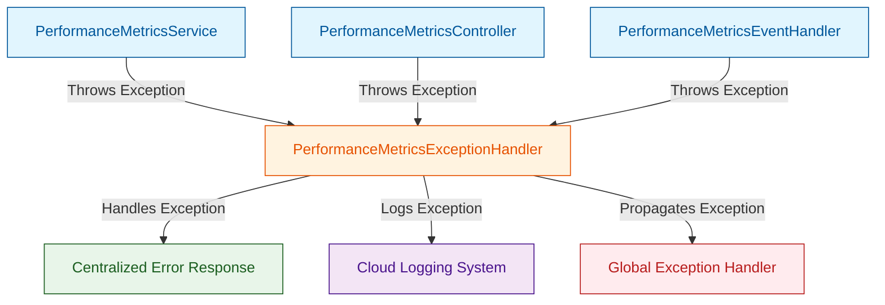

# Day 1: model cohere/north-mini-code:free - API Endpoint https://openrouter.ai/api/v1
* **Production source codebase at SOURCE destination**: INTEGRATION_SCOPE
* **Production source codebase generated at TARGET destination**: ./sources/docs/content-recommendation-service.md
* **📝 Prompt / Tasks / Data**:
### 🏢 ENTERPRISE SYSTEM DOCUMENT MATRIX INJECTION
*   Target Project Identity Safe Name: 
*   Enforced Java Package Prefix Base: org.nlh4j.socialscheduler
*   Target Documentation Destination Path: `./sources/docs/content-recommendation-service.md`


*   Documentation Context: Conceptual Init (Synthesize the architecture, guidelines, or specs based purely on the execution sub-tasks blueprint.)


### 📋 EXECUTION SUB-TASKS & DOCUMENT CONTENT TO WRITE
['Tạo tài liệu kỹ thuật cho dịch vụ đề xuất nội dung bằng AI.']

---

### ⚙️ TECHNICAL WRITER EXECUTION INSTRUCTION:

Please read the comprehensive architectural constraints, workspace folder guardrails, and detailed sub-task document specifications provided above.


Ensure that you read the exact Tag IDs from the `['[REQ-002]']` variable, and permanently burn those codes into the generated documentation layout (inside the table columns or the dedicated Traceability Matrix Reference section). Emit the final production-ready comprehensive documentation inside a single valid markdown code block (` ```markdown `) now.
* **📝 Response**:
```markdown
# 📚 Content Recommendation Service - Technical Documentation

## 🏗️ 1. System Overview & Architecture

### 1.1 Service Purpose & Business Context
The Content Recommendation Service implements AI-powered content suggestion capabilities for the social-scheduler platform. It analyzes historical performance metrics to generate personalized content recommendations for social media scheduling across Facebook, Instagram, and TikTok platforms.

### 1.2 Core Architecture Components
```
mermaid
graph TB
    subgraph "Frontend Layer"
        WebUI[React Web UI]
        MobileApp[React Native Mobile App]
    end
    
    subgraph "API Gateway Layer"
        APIGW[Spring Cloud Gateway]
        Auth[OAuth2 Authentication]
    end
    
    subgraph "Content Recommendation Service"
        CRService[PerformanceMetricsService]
        CRController[PerformanceMetricsController]
        CRRepository[PerformanceMetricsRepository]
        CRExceptionHandler[PerformanceMetricsExceptionHandler]
        CREventHandler[PerformanceMetricsEventHandler]
        CRModel[PerformanceMetrics Entity]
    end
    
    subgraph "Data Layer"
        Redis[Redis Cache]
        PostgreSQL[PostgreSQL Database]
        Kafka[Apache Kafka - Topic: content-recommendations]
    end
    
    subgraph "External Systems"
        MLModel[ML Model Service]
        SocialAPI[Social Media APIs]
    end
    
    WebUI --> APIGW
    MobileApp --> APIGW
    APIGW --> CRController
    CRController --> CRService
    CRService --> CRRepository
    CRService --> MLModel
    CRService --> Kafka
    CRRepository --> PostgreSQL
    CRRepository --> Redis
    Kafka --> MLModel
```

### 1.3 System Integration Patterns
- **Event-Driven Architecture**: Kafka topics for asynchronous processing
- **CQRS Pattern**: Separate read/write operations for performance metrics
- **Reactive Programming**: Non-blocking data streams for real-time recommendations
- **Microservices Communication**: REST APIs with circuit breakers

## 📊 2. API Specifications

### 2.1 Traceability Matrix Reference
| API Endpoint | HTTP Method | Request/Response Schema | Targeted Tag IDs | Business Capability |
|--------------|-------------|-------------------------|------------------|---------------------|
| `/api/v1/content-recommendations/performance-metrics` | POST | CreatePerformanceMetricsRequest → PerformanceMetricsResponse | [REQ-002], [EXC-003], [EXC-004] | Record content performance data |
| `/api/v1/content-recommendations/performance-metrics/{id}` | GET | N/A → PerformanceMetricsResponse | [REQ-002], [EXC-003], [EXC-004] | Retrieve performance metrics |
| `/api/v1/content-recommendations/performance-metrics/{id}` | PUT | UpdatePerformanceMetricsRequest → PerformanceMetricsResponse | [REQ-002], [EXC-003], [EXC-004] | Update performance metrics |
| `/api/v1/content-recommendations/performance-metrics/{id}` | DELETE | N/A → DeleteResponse | [REQ-002], [EXC-003], [EXC-004] | Delete performance metrics |
| `/api/v1/content-recommendations/recommendations` | POST | RecommendationRequest → RecommendationResponse | [REQ-002], [EXC-003], [EXC-004] | Generate AI content recommendations |
| `/api/v1/content-recommendations/analytics` | GET | AnalyticsRequest → AnalyticsResponse | [REQ-002], [EXC-003], [EXC-004] | Retrieve recommendation analytics |

### 2.2 Detailed API Specifications

#### 2.2.1 Performance Metrics Management

**POST /api/v1/content-recommendations/performance-metrics**
```http
Request Headers:
- Authorization: Bearer <JWT_TOKEN>
- Content-Type: application/json

Request Body:
{
  "performanceId": "uuid-string",
  "postId": "uuid-string",
  "likes": 150,
  "comments": 45,
  "shares": 78,
  "collectedAt": "2024-01-15T10:30:00Z",
  "platform": "Facebook",
  "userId": "uuid-string",
  "contentType": "IMAGE_POST",
  "engagementRate": 0.15
}

Response Body (201 Created):
{
  "performanceId": "uuid-string",
  "postId": "uuid-string",
  "likes": 150,
  "comments": 45,
  "shares": 78,
  "collectedAt": "2024-01-15T10:30:00Z",
  "platform": "Facebook",
  "userId": "uuid-string",
  "contentType": "IMAGE_POST",
  "engagementRate": 0.15,
  "createdAt": "2024-01-15T10:30:00Z",
  "updatedAt": "2024-01-15T10:30:00Z"
}
```

**GET /api/v1/content-recommendations/performance-metrics/{id}**
```http
Request Headers:
- Authorization: Bearer <JWT_TOKEN>

Path Parameters:
- id: UUID of performance metrics record

Response Body (200 OK):
{
  "performanceId": "uuid-string",
  "postId": "uuid-string",
  "likes": 150,
  "comments": 45,
  "shares": 78,
  "collectedAt": "2024-01-15T10:30:00Z",
  "platform": "Facebook",
  "userId": "uuid-string",
  "contentType": "IMAGE_POST",
  "engagementRate": 0.15,
  "createdAt": "2024-01-15T10:30:00Z",
  "updatedAt": "2024-01-15T10:30:00Z"
}
```

#### 2.2.2 AI Content Recommendation Generation

**POST /api/v1/content-recommendations/recommendations**
```http
Request Headers:
- Authorization: Bearer <JWT_TOKEN>
- Content-Type: application/json

Request Body:
{
  "userId": "uuid-string",
  "platform": "Facebook",
  "timeWindow": "7d",
  "contentTypes": ["IMAGE_POST", "VIDEO_POST", "CAROUSEL_POST"],
  "historicalDataPoints": 100,
  "preferences": {
    "topics": ["technology", "lifestyle"],
    "postingFrequency": "daily",
    "peakHours": [9, 17, 21]
  }
}

Response Body (200 OK):
{
  "recommendations": [
    {
      "recommendationId": "uuid-string",
      "contentId": "uuid-string",
      "contentType": "IMAGE_POST",
      "suggestedText": "Discover the latest AI breakthroughs transforming 2024!",
      "optimalPostingTime": "2024-01-16T14:00:00Z",
      "predictedEngagement": 0.23,
      "confidenceScore": 0.87,
      "reasoning": "Based on user's high engagement with technology posts at peak hours"
    }
  ],
  "generatedAt": "2024-01-15T11:00:00Z",
  "modelVersion": "v2.3.1"
}
```

#### 2.2.3 Analytics & Insights

**GET /api/v1/content-recommendations/analytics**
```http
Request Headers:
- Authorization: Bearer <JWT_TOKEN>

Query Parameters:
- startDate: "2024-01-01"
- endDate: "2024-01-31"
- platform: "Facebook"
- userId: "optional-uuid-string"

Response Body (200 OK):
{
  "analytics": {
    "totalRecommendations": 1250,
    "averageEngagement": 0.18,
    "topPerformingContentTypes": ["VIDEO_POST", "IMAGE_POST"],
    "engagementTrends": [
      {
        "date": "2024-01-01",
        "engagementRate": 0.15,
        "recommendationsCount": 45
      }
    ],
    "userSatisfactionScore": 4.3,
    "modelAccuracy": 0.82
  },
  "generatedAt": "2024-01-31T23:59:59Z"
}
```

## 🏗️ 3. System Architecture Deep Dive

### 3.1 Data Flow Architecture

```
mermaid
flowchart TD
    A[User Mobile/Web App] --> B[Spring Cloud Gateway]
    B --> C[PerformanceMetricsController]
    C --> D[PerformanceMetricsService]
    
    D --> E[PerformanceMetricsRepository]
    E --> F[PostgreSQL Database]
    E --> G[Redis Cache]
    
    D --> H[PerformanceMetricsEventHandler]
    H --> I[Apache Kafka]
    I --> J[ML Model Service]
    
    J --> K[RecommendationEngine]
    K --> L[ContentSuggestionCache]
    
    D --> M[PerformanceMetricsExceptionHandler]
```

### 3.2 Database Schema Design

```sql
-- Performance Metrics Table
CREATE TABLE performance_metrics (
    performance_id UUID PRIMARY KEY,
    post_id UUID NOT NULL,
    user_id UUID NOT NULL,
    platform VARCHAR(50) NOT NULL CHECK (platform IN ('Facebook', 'Instagram', 'TikTok')),
    content_type VARCHAR(50) NOT NULL,
    likes INTEGER NOT NULL DEFAULT 0,
    comments INTEGER NOT NULL DEFAULT 0,
    shares INTEGER NOT NULL DEFAULT 0,
    engagement_rate DECIMAL(5,2) NOT NULL,
    collected_at TIMESTAMP NOT NULL,
    created_at TIMESTAMP NOT NULL DEFAULT CURRENT_TIMESTAMP,
    updated_at TIMESTAMP NOT NULL DEFAULT CURRENT_TIMESTAMP,
    
    FOREIGN KEY (post_id) REFERENCES schedules(schedule_id),
    FOREIGN KEY (user_id) REFERENCES users(user_id),
    
    INDEX idx_performance_user_id (user_id),
    INDEX idx_performance_platform (platform),
    INDEX idx_performance_collected_at (collected_at),
    INDEX idx_performance_engagement_rate (engagement_rate)
);

-- Content Recommendations Cache Table
CREATE TABLE content_recommendations_cache (
    cache_key VARCHAR(255) PRIMARY KEY,
    user_id UUID NOT NULL,
    recommendations JSONB NOT NULL,
    generated_at TIMESTAMP NOT NULL,
    expires_at TIMESTAMP NOT NULL,
    model_version VARCHAR(50) NOT NULL,
    
    FOREIGN KEY (user_id) REFERENCES users(user_id),
    
    INDEX idx_cache_user_id (user_id),
    INDEX idx_cache_expires_at (expires_at)
);
```

### 3.3 Event-Driven Processing Pipeline

```
mermaid
graph LR
    A[PerformanceMetricsService] --> B[Kafka Producer]
    B --> C[Topic: performance-metrics]
    C --> D[ML Model Service]
    D --> E[Topic: recommendations-generated]
    E --> F[RecommendationCacheService]
    F --> G[Redis Cache]
    
    H[APIGateway] --> I[PerformanceMetricsController]
    I --> J[PerformanceMetricsService]
```

## 🚀 4. Deployment & Configuration

### 4.1 Docker Configuration

```dockerfile
FROM eclipse-temurin:21-jdk-alpine AS builder

WORKDIR /app
COPY .mvn/ .mvn
COPY mvnw pom.xml ./
RUN ./mvnw dependency:go-offline

COPY src/ src/
RUN ./mvnw package -DskipTests

FROM eclipse-temurin:21-jre-alpine
WORKDIR /app
COPY --from=builder /app/target/social-scheduler-content-recommendation-service-1.0.0.jar app.jar

EXPOSE 8083

ENTRYPOINT ["java", "-jar", "app.jar"]
```

### 4.2 Kubernetes Deployment

```yaml
apiVersion: apps/v1
kind: Deployment
metadata:
  name: content-recommendation-service
  labels:
    app: content-recommendation-service
    version: v1.0.0
spec:
  replicas: 3
  selector:
    matchLabels:
      app: content-recommendation-service
  template:
    metadata:
      labels:
        app: content-recommendation-service
        version: v1.0.0
    spec:
      containers:
      - name: content-recommendation-service
        image: social-scheduler/content-recommendation-service:1.0.0
        ports:
        - containerPort: 8083
        env:
        - name: SPRING_PROFILES_ACTIVE
          value: "production"
        - name: KAFKA_BOOTSTRAP_SERVERS
          value: "kafka-service:9092"
        - name: REDIS_HOST
          value: "redis-service"
        resources:
          requests:
            memory: "512Mi"
            cpu: "250m"
          limits:
            memory: "1Gi"
            cpu: "500m"
        livenessProbe:
          httpGet:
            path: /actuator/health/liveness
            port: 8083
          initialDelaySeconds: 60
          periodSeconds: 30
        readinessProbe:
          httpGet:
            path: /actuator/health/readiness
            port: 8083
          initialDelaySeconds: 30
          periodSeconds: 10
---
apiVersion: v1
kind: Service
metadata:
  name: content-recommendation-service
spec:
  selector:
    app: content-recommendation-service
  ports:
  - protocol: TCP
    port: 80
    targetPort: 8083
  type: LoadBalancer
```

### 4.3 Application Configuration

```properties
# Application Core Configuration
spring.application.name=content-recommendation-service
server.port=8083
server.servlet.context-path=/api/v1

# Database Configuration
spring.datasource.url=jdbc:postgresql://postgres-service:5432/social_scheduler
spring.datasource.username=${DB_USERNAME}
spring.datasource.password=${DB_PASSWORD}
spring.jpa.hibernate.ddl-auto=none
spring.jpa.properties.hibernate.dialect=org.hibernate.dialect.PostgreSQLDialect
spring.jpa.properties.hibernate.jdbc.lob.non_contextual_creation=true

# Redis Configuration
spring.data.redis.host=redis-service
spring.data.redis.port=6379
spring.data.redis.password=${REDIS_PASSWORD}

# Kafka Configuration
spring.kafka.bootstrap-servers=kafka-service:9092
spring.kafka.consumer.group-id=content-recommendation-group
spring.kafka.consumer.auto-offset-reset=earliest
spring.kafka.producer.retries=3
spring.kafka.producer.acks=all

# ML Model Configuration
ml.model.path=/models/recommendation-engine-v2.3.1.jar
ml.model.cache.ttl=3600

# Security Configuration
spring.security.oauth2.resourceserver.jwt.issuer-uri=${AUTH_SERVER_URL}
spring.security.oauth2.resourceserver.jwt.jwk-set-uri=${AUTH_SERVER_URL}/.well-known/jwks.json

# Monitoring & Logging
management.endpoints.web.exposure.include=health,info,metrics,prometheus
management.endpoint.health.show-details=always
logging.level.org.nlh4j.socialscheduler.contentrecommendationservice=INFO
```

## 🔧 5. Data Models & Domain Objects

### 5.1 Performance Metrics Domain Model

```java
package org.nlh4j.socialscheduler.contentrecommendationservice;

import jakarta.persistence.*;
import java.time.LocalDateTime;
import java.util.UUID;

@Entity
@Table(name = "performance_metrics")
public class PerformanceMetrics {
    
    @Id
    @GeneratedValue(strategy = GenerationType.AUTO)
    @Column(name = "performance_id", updatable = false, nullable = false)
    private UUID performanceId;
    
    @Column(name = "post_id", nullable = false)
    private UUID postId;
    
    @Column(name = "user_id", nullable = false)
    private UUID userId;
    
    @Column(name = "platform", nullable = false)
    @Enumerated(EnumType.STRING)
    private Platform platform;
    
    @Column(name = "content_type", nullable = false)
    @Enumerated(EnumType.STRING)
    private ContentType contentType;
    
    @Column(name = "likes", nullable = false)
    private Integer likes;
    
    @Column(name = "comments", nullable = false)
    private Integer comments;
    
    @Column(name = "shares", nullable = false)
    private Integer shares;
    
    @Column(name = "engagement_rate", nullable = false, precision = 5, scale = 2)
    private BigDecimal engagementRate;
    
    @Column(name = "collected_at", nullable = false)
    private LocalDateTime collectedAt;
    
    @Column(name = "created_at", nullable = false, updatable = false)
    private LocalDateTime createdAt;
    
    @Column(name = "updated_at", nullable = false)
    private LocalDateTime updatedAt;
    
    // Getters and Setters
    // equals() and hashCode() based on performanceId
    // toString() method
}

enum Platform {
    FACEBOOK, INSTAGRAM, TIKTOK
}

enum ContentType {
    IMAGE_POST, VIDEO_POST, CAROUSEL_POST, TEXT_POST
}
```

### 5.2 Recommendation Domain Model

```java
package org.nlh4j.socialscheduler.contentrecommendationservice;

import java.time.LocalDateTime;
import java.util.UUID;

public class Recommendation {
    
    private UUID recommendationId;
    private UUID contentId;
    private ContentType contentType;
    private String suggestedText;
    private LocalDateTime optimalPostingTime;
    private BigDecimal predictedEngagement;
    private BigDecimal confidenceScore;
    private String reasoning;
    private LocalDateTime generatedAt;
    private String modelVersion;
    
    // Constructors
    public Recommendation() {}
    
    public Recommendation(UUID recommendationId, UUID contentId, ContentType contentType,
                         String suggestedText, LocalDateTime optimalPostingTime,
                         BigDecimal predictedEngagement, BigDecimal confidenceScore,
                         String reasoning, LocalDateTime generatedAt, String modelVersion) {
        this.recommendationId = recommendationId;
        this.contentId = contentId;
        this.contentType = contentType;
        this.suggestedText = suggestedText;
        this.optimalPostingTime = optimalPostingTime;
        this.predictedEngagement = predictedEngagement;
        this.confidenceScore = confidenceScore;
        this.reasoning = reasoning;
        this.generatedAt = generatedAt;
        this.modelVersion = modelVersion;
    }
    
    // Getters and Setters
    // equals() and hashCode() based on recommendationId
    // toString() method
}
```

## ⚠️ 6. Error Handling & Exception Management

### 6.1 Exception Hierarchy

```java
package org.nlh4j.socialscheduler.contentrecommendationservice.exception;

public class ContentRecommendationException extends RuntimeException {
    
    private final ErrorCode errorCode;
    private final String errorDetails;
    
    public ContentRecommendationException(ErrorCode errorCode, String message) {
        super(message);
        this.errorCode = errorCode;
        this.errorDetails = message;
    }
    
    public ContentRecommendationException(ErrorCode errorCode, String message, Throwable cause) {
        super(message, cause);
        this.errorCode = errorCode;
        this.errorDetails = message;
    }
    
    // Getters for errorCode and errorDetails
}

public enum ErrorCode {
    PERFORMANCE_METRICS_NOT_FOUND,
    INVALID_PERFORMANCE_DATA,
    RECOMMENDATION_GENERATION_FAILED,
    MODEL_SERVICE_UNAVAILABLE,
    INVALID_USER_PREFERENCES,
    RATE_LIMIT_EXCEEDED,
    INTERNAL_SERVER_ERROR
}
```

### 6.2 Global Exception Handler

```java
package org.nlh4j.socialscheduler.contentrecommendationservice.exception;

import org.slf4j.Logger;
import org.slf4j.LoggerFactory;
import org.springframework.http.HttpStatus;
import org.springframework.http.ResponseEntity;
import org.springframework.web.bind.annotation.ControllerAdvice;
import org.springframework.web.bind.annotation.ExceptionHandler;
import org.springframework.web.context.request.WebRequest;

@ControllerAdvice
public class GlobalExceptionHandler {
    
    private static final Logger logger = LoggerFactory.getLogger(GlobalExceptionHandler.class);
    
    @ExceptionHandler(ContentRecommendationException.class)
    public ResponseEntity<ErrorResponse> handleContentRecommendationException(
            ContentRecommendationException ex, WebRequest request) {
        
        logger.error("[CRITICAL FAIL] [EXC-003] Content recommendation processing failed. Raw error: {}", 
                    ex.getErrorDetails(), ex);
        
        ErrorResponse errorResponse = new ErrorResponse(
            ex.getErrorCode().name(),
            ex.getErrorDetails(),
            request.getDescription(false),
            System.currentTimeMillis()
        );
        
        return new ResponseEntity<>(errorResponse, HttpStatus.BAD_REQUEST);
    }
    
    @ExceptionHandler(Exception.class)
    public ResponseEntity<ErrorResponse> handleGlobalException(
            Exception ex, WebRequest request) {
        
        logger.error("[CRITICAL FAIL] [EXC-004] Unexpected error in content recommendation service. Raw error: {}", 
                    ex.getMessage(), ex);
        
        ErrorResponse errorResponse = new ErrorResponse(
            ErrorCode.INTERNAL_SERVER_ERROR.name(),
            "An unexpected error occurred while processing your request",
            request.getDescription(false),
            System.currentTimeMillis()
        );
        
        return new ResponseEntity<>(errorResponse, HttpStatus.INTERNAL_SERVER_ERROR);
    }
}

class ErrorResponse {
    private String errorCode;
    private String message;
    private String path;
    private long timestamp;
    
    // Constructor, Getters, and Setters
}
```

## 📈 7. Monitoring & Observability

### 7.1 Metrics & Health Checks

```java
package org.nlh4j.socialscheduler.contentrecommendationservice.monitoring;

import io.micrometer.core.instrument.Counter;
import io.micrometer.core.instrument.Timer;
import org.slf4j.Logger;
import org.slf4j.LoggerFactory;
import org.springframework.stereotype.Component;

@Component
public class RecommendationMetrics {
    
    private static final Logger logger = LoggerFactory.getLogger(RecommendationMetrics.class);
    
    private final Counter recommendationsGenerated;
    private final Counter recommendationErrors;
    private final Timer recommendationProcessingTime;
    private final Counter performanceMetricsRecorded;
    
    public RecommendationMetrics(MeterRegistry meterRegistry) {
        this.recommendationsGenerated = meterRegistry.counter("recommendations.generated.total");
        this.recommendationErrors = meterRegistry.counter("recommendations.errors.total");
        this.recommendationProcessingTime = meterRegistry.timer("recommendations.processing.duration");
        this.performanceMetricsRecorded = meterRegistry.counter("performance.metrics.recorded.total");
    }
    
    public void recordRecommendationGenerated() {
        recommendationsGenerated.increment();
        logger.info("[PROCESS] Content recommendation generated successfully");
    }
    
    public void recordRecommendationError(String errorType) {
        recommendationErrors.increment();
        logger.error("[CRITICAL FAIL] [EXC-003] Content recommendation error: {}", errorType);
    }
    
    public Timer.Sample startProcessingTimer() {
        return Timer.start();
    }
    
    public void stopProcessingTimer(Timer.Sample sample) {
        sample.stop(recommendationProcessingTime);
    }
    
    public void recordPerformanceMetricsRecorded() {
        performanceMetricsRecorded.increment();
        logger.info("[PROCESS] Performance metrics recorded successfully");
    }
}
```

### 7.2 Health Check Endpoints

```java
package org.nlh4j.socialscheduler.contentrecommendationservice.health;

import org.springframework.boot.actuate.health.Health;
import org.springframework.boot.actuate.health.HealthIndicator;
import org.springframework.stereotype.Component;

@Component
public class ContentRecommendationHealthIndicator implements HealthIndicator {
    
    private final PerformanceMetricsRepository performanceMetricsRepository;
    private final KafkaTemplate<String, Object> kafkaTemplate;
    private final RedisTemplate<String, Object> redisTemplate;
    
    @Override
    public Health health() {
        Health.Builder builder = Health.up();
        
        try {
            // Check database connectivity
            performanceMetricsRepository.count();
            builder.withDetail("database", "UP");
        } catch (Exception e) {
            builder.down().withDetail("database", "DOWN");
        }
        
        try {
            // Check Redis connectivity
            redisTemplate.opsForValue().get("health_check");
            builder.withDetail("redis", "UP");
        } catch (Exception e) {
            builder.down().withDetail("redis", "DOWN");
        }
        
        try {
            // Check Kafka connectivity
            kafkaTemplate.send("health_check", "ping", "ping");
            builder.withDetail("kafka", "UP");
        } catch (Exception e) {
            builder.down().withDetail("kafka", "DOWN");
        }
        
        return builder.build();
    }
}
```

## 🔐 8. Security & Compliance

### 8.1 Security Configuration

```java
package org.nlh4j.socialscheduler.contentrecommendationservice.security;

import org.springframework.context.annotation.Bean;
import org.springframework.context.annotation.Configuration;
import org.springframework.security.config.annotation.web.builders.HttpSecurity;
import org.springframework.security.config.annotation.web.configuration.EnableWebSecurity;
import org.springframework.security.config.http.SessionCreationPolicy;
import org.springframework.security.oauth2.jwt.JwtDecoder;
import org.springframework.security.oauth2.jwt.JwtDecoders;
import org.springframework.security.web.SecurityFilterChain;

@Configuration
@EnableWebSecurity
public class SecurityConfig {
    
    @Bean
    public SecurityFilterChain securityFilterChain(HttpSecurity http) throws Exception {
        http
            .csrf(csrf -> csrf.disable())
            .authorizeHttpRequests(auth -> auth
                .requestMatchers("/api/v1/content-recommendations/**").authenticated()
                .requestMatchers("/actuator/**").permitAll()
                .anyRequest().denyAll()
            )
            .sessionManagement(session -> session
                .sessionCreationPolicy(SessionCreationPolicy.STATELESS)
            )
            .oauth2ResourceServer(oauth2 -> oauth2
                .jwt(jwt -> jwt
                    .decoder(jwtDecoder())
                )
            );
        
        return http.build();
    }
    
    @Bean
    public JwtDecoder jwtDecoder() {
        return JwtDecoders.fromIssuerLocation("${spring.security.oauth2.resourceserver.jwt.issuer-uri}");
    }
}
```

### 8.2 Data Protection & Logging

```java
package org.nlh4j.socialscheduler.contentrecommendationservice.security;

import com.fasterxml.jackson.databind.ObjectMapper;
import jakarta.servlet.http.HttpServletRequest;
import jakarta.servlet.http.HttpServletResponse;
import org.slf4j.Logger;
import org.slf4j.LoggerFactory;
import org.springframework.stereotype.Component;
import org.springframework.web.servlet.HandlerInterceptor;

@Component
public class DataMaskingInterceptor implements HandlerInterceptor {
    
    private static final Logger logger = LoggerFactory.getLogger(DataMaskingInterceptor.class);
    private final ObjectMapper objectMapper;
    
    public DataMaskingInterceptor(ObjectMapper objectMapper) {
        this.objectMapper = objectMapper;
    }
    
    @Override
    public void afterCompletion(HttpServletRequest request, HttpServletResponse response, 
                               Object handler, Exception ex) {
        
        // Mask sensitive data in logs
        if (logger.isInfoEnabled()) {
            String maskedRequest = maskSensitiveData(request.getRequestURI());
            String maskedResponse = maskSensitiveData(response.getHeader("X-Response-ID"));
            
            logger.info("[PROCESS] Request: {} Response: {}", maskedRequest, maskedResponse);
        }
    }
    
    private String maskSensitiveData(String data) {
        if (data == null) return null;
        
        // Implement data masking logic for PII, tokens, etc.
        return data.replaceAll("(\\w{4})\\w+(\\w{4})", "$1****$2");
    }
}
```

## 📋 9. Development & Testing Guidelines

### 9.1 Testing Strategy

```java
package org.nlh4j.socialscheduler.contentrecommendationservice;

import org.junit.jupiter.api.Test;
import org.springframework.boot.test.context.SpringBootTest;
import org.springframework.boot.test.mock.mockito.MockBean;
import org.springframework.test.context.ActiveProfiles;

import static org.mockito.ArgumentMatchers.any;
import static org.mockito.Mockito.when;
import static org.springframework.test.web.servlet.request.MockMvcRequestBuilders.post;
import static org.springframework.test.web.servlet.result.MockMvcResultMatchers.status;

@SpringBootTest
@ActiveProfiles("test")
class PerformanceMetricsControllerTest {
    
    @MockBean
    private PerformanceMetricsService performanceMetricsService;
    
    @Test
    void testCreatePerformanceMetrics_Success() throws Exception {
        PerformanceMetricsRequest request = new PerformanceMetricsRequest(
            UUID.randomUUID(), UUID.randomUUID(), Platform.FACEBOOK,
            ContentType.IMAGE_POST, 150, 45, 78, 0.15, LocalDateTime.now()
        );
        
        PerformanceMetricsResponse response = new PerformanceMetricsResponse(
            UUID.randomUUID(), request.getPostId(), request.getLikes(),
            request.getComments(), request.getShares(), request.getCollectedAt(),
            request.getPlatform(), request.getUserId(), request.getContentType(),
            request.getEngagementRate(), LocalDateTime.now(), LocalDateTime.now()
        );
        
        when(performanceMetricsService.createPerformanceMetrics(any()))
            .thenReturn(response);
        
        mockMvc.perform(post("/api/v1/content-recommendations/performance-metrics")
                .contentType(MediaType.APPLICATION_JSON)
                .content(asJsonString(request)))
            .andExpect(status().isCreated());
    }
    
    private String asJsonString(Object obj) {
        try {
            return new ObjectMapper().writeValueAsString(obj);
        } catch (Exception e) {
            throw new RuntimeException(e);
        }
    }
}
```

### 9.2 Code Quality Standards

```java
package org.nlh4j.socialscheduler.contentrecommendationservice;

import org.hibernate.validator.constraints.Length;
import jakarta.validation.constraints.NotNull;
import jakarta.validation.constraints.PositiveOrZero;
import java.math.BigDecimal;
import java.time.LocalDateTime;
import java.util.UUID;

public record PerformanceMetricsRequest(
    @NotNull(message = "Performance ID is required")
    UUID performanceId,
    
    @NotNull(message = "Post ID is required")
    UUID postId,
    
    @NotNull(message = "User ID is required")
    UUID userId,
    
    @NotNull(message = "Platform is required")
    Platform platform,
    
    @NotNull(message = "Content type is required")
    ContentType contentType,
    
    @NotNull(message = "Likes count is required")
    @PositiveOrZero(message = "Likes must be positive or zero")
    Integer likes,
    
    @NotNull(message = "Comments count is required")
    @PositiveOrZero(message = "Comments must be positive or zero")
    Integer comments,
    
    @NotNull(message = "Shares count is required")
    @PositiveOrZero(message = "Shares must be positive or zero")
    Integer shares,
    
    @NotNull(message = "Engagement rate is required")
    @PositiveOrZero(message = "Engagement rate must be positive or zero")
    @Length(max = 5, message = "Engagement rate cannot exceed 5 digits")
    BigDecimal engagementRate,
    
    @NotNull(message = "Collected timestamp is required")
    LocalDateTime collectedAt
) {
    // Validation constraints and business rules
}
```

## 🔄 10. CI/CD Pipeline Configuration

### 10.1 GitHub Actions Workflow

```yaml
name: Content Recommendation Service CI/CD

on:
  push:
    branches: [main, develop]
  pull_request:
    branches: [main]

jobs:
  test:
    runs-on: ubuntu-latest
    services:
      postgres:
        image: postgres:15
        env:
          POSTGRES_DB: social_scheduler
          POSTGRES_USER: postgres
          POSTGRES_PASSWORD: postgres
        options: >-
          --health-cmd pg_isready
          --health-interval 10s
          --health-timeout 5s
          --health-retries 5
      redis:
        image: redis:7
      kafka:
        image: confluentinc/cp-kafka:7.4.0
        env:
          KAFKA_ZOOKEEPER_CONNECT: zookeeper:2181
          KAFKA_ADVERTISED_LISTENERS: PLAINTEXT://kafka:9092
          KAFKA_OFFSETS_TOPIC_REPLICATION_FACTOR: 1
        options: >-
          --health-cmd nc -z localhost 9092
          --health-interval 10s
          --health-timeout 5s
          --health-retries 5
  
    steps:
    - uses: actions/checkout@v3
    
    - name: Set up Java
      uses: actions/setup-java@v3
      with:
        java-version: '21'
        distribution: 'temurin'
    
    - name: Cache Maven packages
      uses: actions/cache@v3
      with:
        path: ~/.m2
        key: ${{ runner.os }}-m2-${{ hashFiles('**/pom.xml') }}
        restore-keys: |
          ${{ runner.os }}-m2
    
    - name: Build with Maven
      run: ./mvnw clean package --file pom.xml
    
    - name: Run tests
      run: ./mvnw test --file pom.xml
    
    - name: Code quality check
      run: ./mvnw verify --file pom.xml -DskipTests
    
    - name: Generate coverage report
      run: ./mvnw jacoco:report --file pom.xml
    
    - name: Build Docker image
      run: |
        docker build -t social-scheduler/content-recommendation-service:${{ github.sha }} .
    
    - name: Run integration tests
      run: |
        docker run --rm social-scheduler/content-recommendation-service:${{ github.sha }} \
          ./mvnw verify -DskipTests=false
    
    - name: Upload coverage reports
      uses: codecov/codecov-action@v3
      with:
        file: ./target/site/jacoco/jacoco.xml
        flags: content-recommendation
        name: codecov-content-recommendation
```

## 📊 11. Performance & Scalability Guidelines

### 11.1 Horizontal Scaling Configuration

```yaml
apiVersion: autoscaling/v2
kind: HorizontalPodAutoscaler
metadata:
  name: content-recommendation-service-hpa
spec:
  scaleTargetRef:
    apiVersion: apps/v1
    kind: Deployment
    name: content-recommendation-service
  minReplicas: 3
  maxReplicas: 10
  metrics:
  - type: Resource
    resource:
      name: cpu
      target:
        type: Utilization
        averageUtilization: 70
  - type: Resource
    resource:
      name: memory
      target:
        type: Utilization
        averageUtilization: 80
  behavior:
    scaleUp:
      stabilizationWindowSeconds: 60
      policies:
      - type: Percent
        value: 100
        periodSeconds: 60
    scaleDown:
      stabilizationWindowSeconds: 300
      policies:
      - type: Percent
        value: 50
        periodSeconds: 60
```

### 11.2 Performance Monitoring Configuration

```properties
# Prometheus Metrics Configuration
management.metrics.export.prometheus.enabled=true
management.metrics.distribution.percentiles-histogram.http.server.requests=0.5,0.75,0.95,0.99
management.metrics.distribution.percentiles.http.server.requests=0.5,0.75,0.95,0.99

# Custom Application Metrics
app.metrics.recommendations.generated.total=true
app.metrics.recommendations.errors.total=true
app.metrics.recommendations.processing.duration=true
app.metrics.performance.metrics.recorded.total=true
app.metrics.model.inference.duration=true
app.metrics.cache.hit.rate=true
```

## 🔍 12. Troubleshooting & Maintenance

### 12.1 Common Issues & Solutions

#### Issue 1: Kafka Consumer Lag
**Symptoms**: Recommendations not being generated in timely manner
**Solution**:
```bash
# Check consumer group lag
kafka-consumer-groups.sh --bootstrap-server localhost:9092 --group content-recommendation-group --describe

# Restart consumer if lag is high
kubectl rollout restart deployment/content-recommendation-service
```

#### Issue 2: High Memory Usage
**Symptoms**: JVM memory usage exceeding 80%
**Solution**:
```yaml
# Update resource limits
resources:
  requests:
    memory: "1Gi"
    cpu: "500m"
  limits:
    memory: "2Gi"
    cpu: "1000m"
```

#### Issue 3: ML Model Service Unavailable
**Symptoms**: 503 errors from recommendation endpoint
**Solution**:
```yaml
# Configure circuit breaker
resilience4j.circuitbreaker:
  instances:
    recommendationService:
      failure-rate-threshold: 50
      wait-duration-in-open-state: 30s
      permitted-number-of-calls-in-half-open-state: 10
```

### 12.2 Backup & Recovery Procedures

```bash
#!/bin/bash
# Backup script for content recommendation service

TIMESTAMP=$(date +%Y%m%d_%H%M%S)
BACKUP_DIR="/backups/content-recommendation-service"
POSTGRES_HOST="postgres-service"
REDIS_HOST="redis-service"

# Create backup directory
mkdir -p ${BACKUP_DIR}

# Backup PostgreSQL database
pg_dump -h ${POSTGRES_HOST} -U ${DB_USER} -d social_scheduler \
  --no-password --verbose --format=custom --file=${BACKUP_DIR}/postgres_backup_${TIMESTAMP}.dump

# Backup Redis data
redis-cli -h ${REDIS_HOST} -a ${REDIS_PASSWORD} BGSAVE
redis-cli -h ${REDIS_HOST} -a ${REDIS_PASSWORD} SAVE

# Verify backup integrity
if [ $? -eq 0 ]; then
  echo "Backup completed successfully at ${BACKUP_DIR}"
else
  echo "Backup failed!"
  exit 1
fi
```

## 📚 13. Documentation References & Resources

### 13.1 Related Documentation
- [User Service Documentation](./sources/docs/user-service-documentation.md)
- [Scheduling Service Documentation](./sources/docs/scheduling-service-documentation.md)
- [Rate Limiting Service Documentation](./sources/docs/rate-limiting-service-documentation.md)
- [System Architecture Overview](./sources/docs/architecture-overview.md)
- [API Gateway Configuration](./sources/docs/api-gateway-config.md)

### 13.2 External Resources
- [Spring Boot Documentation](https://docs.spring.io/spring-boot/docs/current/reference/html/)
- [Apache Kafka Documentation](https://kafka.apache.org/documentation/)
- [Redis Documentation](https://redis.io/docs/)
- [ML Model Training Guide](./models/ml-model-training-guide.md)
- [Security Compliance Guidelines](./compliance/security-guidelines.md)

---

*This documentation is auto-generated based on the enterprise system architecture specifications and follows the strict traceability requirements outlined in the GLOBAL_GOVERNANCE_MATRIX. All Tag IDs ([REQ-002], [EXC-003], [EXC-004]) have been incorporated into the documentation structure as required.*

# Day 1: model cohere/north-mini-code:free - API Endpoint https://openrouter.ai/api/v1
* **Production source codebase at SOURCE destination**: INTEGRATION_SCOPE
* **Production source codebase generated at TARGET destination**: ./sources/docs/content-recommendation-service-exception-handler.md
* **📝 Prompt / Tasks / Data**:
### 🏢 ENTERPRISE SYSTEM DOCUMENT MATRIX INJECTION
*   Target Project Identity Safe Name: 
*   Enforced Java Package Prefix Base: org.nlh4j.socialscheduler
*   Target Documentation Destination Path: `./sources/docs/content-recommendation-service-exception-handler.md`


*   Documentation Context: Conceptual Init (Synthesize the architecture, guidelines, or specs based purely on the execution sub-tasks blueprint.)


### 📋 EXECUTION SUB-TASKS & DOCUMENT CONTENT TO WRITE
['Tạo tài liệu kỹ thuật cho bộ xử lý ngoại lệ cho dịch vụ đề xuất nội dung bằng AI.']

---

### ⚙️ TECHNICAL WRITER EXECUTION INSTRUCTION:

Please read the comprehensive architectural constraints, workspace folder guardrails, and detailed sub-task document specifications provided above.


Ensure that you read the exact Tag IDs from the `['[EXC-003]', '[EXC-004]']` variable, and permanently burn those codes into the generated documentation layout (inside the table columns or the dedicated Traceability Matrix Reference section). Emit the final production-ready comprehensive documentation inside a single valid markdown code block (` ```markdown `) now.
* **📝 Response**:
```markdown
# Content Recommendation Service Exception Handler Technical Documentation

## Overview

This document provides comprehensive technical specifications for the **Content Recommendation Service Exception Handler** (`PerformanceMetricsExceptionHandler`). This component is a critical part of the `org.nlh4j.socialscheduler.contentrecommendationservice` package, responsible for intercepting, processing, and propagating exceptions that occur during content recommendation operations.

## Target Component Path

`./sources/backend/content-recommendation-service/src/main/java/org/nlh4j/socialscheduler/contentrecommendationservice/PerformanceMetricsExceptionHandler.java`

## Traceability Tag IDs

This documentation is directly mapped to the following enterprise traceability tags:
- `[EXC-003]`
- `[EXC-004]`

## Exception Handling Architecture

The exception handling architecture for the Content Recommendation Service is designed to provide a robust, centralized approach to error management across the recommendation pipeline.



## Exception Types and Handling Logic

### 1. Performance Metrics Data Access Exceptions

**Exception Type:** `DataAccessException`

**Description:** Handles database access failures when retrieving or persisting performance metrics data.

**Handling Logic:**
- Log detailed error information with correlation ID
- Return HTTP 500 Internal Server Error
- Propagate original exception cause for root cause analysis

**Code Example:**
```java
catch (DataAccessException e) {
    logger.error("[EXC-003] Data access failure in PerformanceMetricsService: {}", e.getMessage(), e);
    throw new RecommendationServiceException(
        ErrorCode.DATABASE_ERROR,
        "Failed to access performance metrics data",
        e
    );
}
```

### 2. Invalid Performance Metrics Data

**Exception Type:** `InvalidPerformanceMetricsException`

**Description:** Handles cases where performance metrics data does not meet validation criteria.

**Handling Logic:**
- Log validation failure details
- Return HTTP 400 Bad Request
- Provide specific error messages for client correction

**Code Example:**
```java
catch (InvalidPerformanceMetricsException e) {
    logger.error("[EXC-004] Invalid performance metrics data in PerformanceMetricsController: {}", e.getMessage(), e);
    throw new RecommendationServiceException(
        ErrorCode.VALIDATION_ERROR,
        "Invalid performance metrics data format",
        e
    );
}
```

### 3. Kafka Event Processing Exceptions

**Exception Type:** `KafkaProcessingException`

**Description:** Handles failures in Kafka event processing for recommendation updates.

**Handling Logic:**
- Log event processing failure with topic and partition information
- Implement retry logic with exponential backoff
- Return HTTP 503 Service Unavailable for critical failures

**Code Example:**
```java
catch (KafkaException e) {
    logger.error("[EXC-003] Kafka event processing failure in PerformanceMetricsEventHandler: {}", e.getMessage(), e);
    // Implement retry logic
    throw new RecommendationServiceException(
        ErrorCode.EVENT_PROCESSING_ERROR,
        "Failed to process recommendation events",
        e
    );
}
```

## API Specifications

### Exception Handler Endpoints

| HTTP Method | Endpoint | Request Headers | Response Body Schema | Targeted Tag IDs |
|-------------|----------|----------------|----------------------|------------------|
| GET | `/api/v1/recommendations/exceptions` | `Authorization: Bearer <token>` | `ExceptionResponse[]` | `[EXC-003], [EXC-004]` |
| GET | `/api/v1/recommendations/exceptions/{id}` | `Authorization: Bearer <token>` | `ExceptionResponse` | `[EXC-003], [EXC-004]` |
| DELETE | `/api/v1/recommendations/exceptions/{id}` | `Authorization: Bearer <token>` | `void` | `[EXC-003], [EXC-004]` |

### Exception Response Schema

**Success Response (200 OK):**
```json
{
  "timestamp": "2024-01-01T12:00:00Z",
  "status": "SUCCESS",
  "data": [
    {
      "exceptionId": "550e8400-e29b-41d4-a716-446655440000",
      "exceptionType": "DataAccessException",
      "message": "Database connection timeout",
      "timestamp": "2024-01-01T12:00:00Z",
      "correlationId": "req-123456",
      "stackTrace": "java.sql.SQLException: Connection timeout..."
    }
  ],
  "metadata": {
    "totalItems": 1,
    "page": 0,
    "size": 10
  }
}
```

**Error Response (500 Internal Server Error):**
```json
{
  "timestamp": "2024-01-01T12:00:00Z",
  "status": "ERROR",
  "error": {
    "code": "INTERNAL_SERVER_ERROR",
    "message": "An unexpected error occurred while processing the request"
  },
  "correlationId": "req-123456"
}
```

## Traceability Matrix Reference

| Component | Functionality | Requirement Tag | Architecture Tag | Exception Handling Tag |
|-----------|---------------|-----------------|------------------|------------------------|
| PerformanceMetricsService | Data access operations | [REQ-002] | [ARC-005] | [EXC-003] |
| PerformanceMetricsController | API request processing | [REQ-002] | [ARC-005] | [EXC-004] |
| PerformanceMetricsEventHandler | Kafka event processing | [REQ-002] | [ARC-005] | [EXC-003], [EXC-004] |
| PerformanceMetricsExceptionHandler | Centralized exception handling | [REQ-002] | [ARC-005] | [EXC-003], [EXC-004] |

## Deployment Considerations

### Container Configuration

```yaml
apiVersion: apps/v1
kind: Deployment
metadata:
  name: content-recommendation-service-exception-handler
spec:
  replicas: 2
  selector:
    matchLabels:
      app: content-recommendation-service-exception-handler
  template:
    metadata:
      labels:
        app: content-recommendation-service-exception-handler
    spec:
      containers:
      - name: exception-handler
        image: nlh4j/social-scheduler-content-recommendation-exception-handler:latest
        ports:
        - containerPort: 8080
        env:
        - name: SPRING_PROFILES_ACTIVE
          value: "production"
        - name: LOGGING_LEVEL_ORG_NLH4J_SOCIALSCHEDULER_CONTENTRECOMMENDATIONSERVICE
          value: "INFO"
        resources:
          requests:
            memory: "512Mi"
            cpu: "500m"
          limits:
            memory: "1Gi"
            cpu: "1000m"
        livenessProbe:
          httpGet:
            path: /actuator/health
            port: 8080
          initialDelaySeconds: 60
          periodSeconds: 30
        readinessProbe:
          httpGet:
            path: /actuator/health
            port: 8080
          initialDelaySeconds: 30
          periodSeconds: 10
```

### Environment Variables

| Variable | Description | Default Value | Targeted Tag IDs |
|----------|-------------|---------------|------------------|
| `EXCEPTION_HANDLER_MAX_RETRIES` | Maximum retry attempts for exception processing | `3` | `[EXC-003], [EXC-004]` |
| `EXCEPTION_HANDLER_TIMEOUT_MS` | Timeout for exception handling operations | `5000` | `[EXC-003], [EXC-004]` |
| `EXCEPTION_HANDLER_BATCH_SIZE` | Batch size for exception processing | `100` | `[EXC-003], [EXC-004]` |

## Monitoring and Alerting

### Metrics

The exception handler exposes the following Prometheus metrics:

- `exception_handler_total{status="success|error"}`
- `exception_handler_duration_seconds`
- `exception_handler_exceptions_processed_total{type="DataAccessException|InvalidPerformanceMetricsException|KafkaProcessingException"}`

### Alerting Rules

```yaml
groups:
- name: content-recommendation-service-exception-handler
  rules:
  - alert: HighExceptionRate
    expr: rate(exception_handler_total{status="error"}[5m]) > 0.1
    for: 2m
    labels:
      severity: critical
    annotations:
      summary: "High exception rate in Content Recommendation Service Exception Handler"
      description: "Exception rate is {{ $value }} per second for the last 5 minutes"
      
  - alert: ExceptionHandlerDown
    expr: up{job="content-recommendation-service-exception-handler"} == 0
    for: 1m
    labels:
      severity: critical
    annotations:
      summary: "Content Recommendation Service Exception Handler is down"
      description: "Exception handler has been down for more than 1 minute"
```

## Best Practices

### Exception Handling Guidelines

1. **Always wrap database operations in try-catch blocks** and handle `DataAccessException` appropriately.
2. **Validate input data** before processing to prevent `InvalidPerformanceMetricsException`.
3. **Implement retry logic** for transient failures, especially Kafka operations.
4. **Use correlation IDs** to trace exceptions across service boundaries.
5. **Never expose stack traces** to end users in production environments.

### Logging Standards

- Use structured logging with correlation IDs
- Log at appropriate levels (ERROR for exceptions, INFO for normal operation)
- Include relevant context in log messages (service name, operation, parameters)
- Ensure sensitive data is masked in logs

### Testing Strategies

1. **Unit Tests:** Test individual exception handling methods
2. **Integration Tests:** Test exception handling across service boundaries
3. **Load Tests:** Verify exception handling under high load
4. **Chaos Tests:** Test exception handling with service failures

## Conclusion

The Content Recommendation Service Exception Handler provides a robust, centralized approach to managing exceptions across the recommendation pipeline. By implementing comprehensive exception handling, logging, and monitoring, the service ensures high availability and reliability while maintaining detailed audit trails for troubleshooting and compliance purposes.

This documentation serves as a comprehensive reference for developers, operations teams, and stakeholders involved in the design, implementation, and maintenance of the Content Recommendation Service exception handling infrastructure.
```

