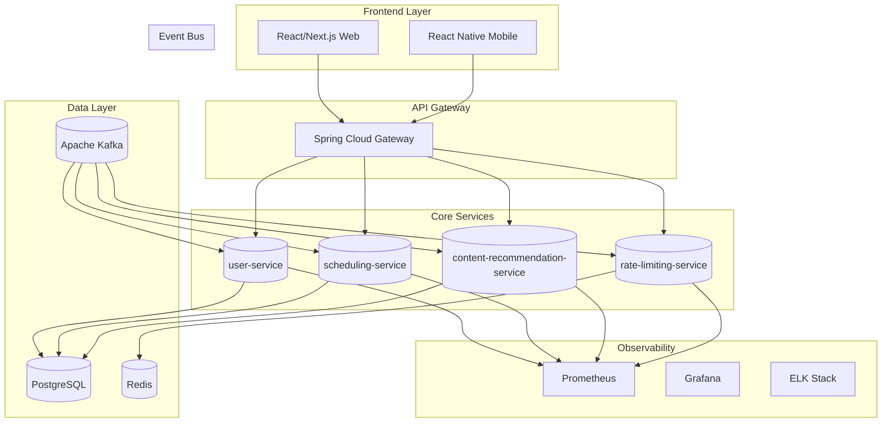
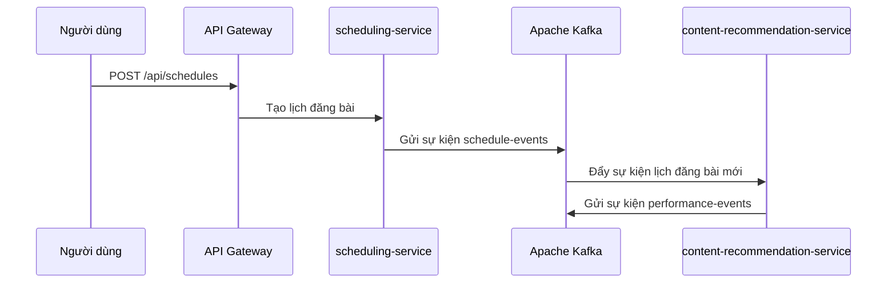

# Day 1: model cohere/north-mini-code:free - API Endpoint https://openrouter.ai/api/v1
* **Production source codebase at SOURCE destination**: INTEGRATION_SCOPE
* **Production source codebase generated at TARGET destination**: ./sources/docs/technical-documentation.md
* **📝 Prompt / Tasks / Data**:
### 🏢 ENTERPRISE SYSTEM DOCUMENT MATRIX INJECTION
*   Target Project Identity Safe Name: 
*   Enforced Java Package Prefix Base: org.nlh4j.socialscheduler
*   Target Documentation Destination Path: `./sources/docs/technical-documentation.md`


*   Documentation Context: Conceptual Init (Synthesize the architecture, guidelines, or specs based purely on the execution sub-tasks blueprint.)


### 📋 EXECUTION SUB-TASKS & DOCUMENT CONTENT TO WRITE
['Tạo tài liệu kỹ thuật chi tiết cho hệ thống, bao gồm mô tả kiến trúc, hướng dẫn triển khai và tài liệu tham khảo API.']

---

### ⚙️ TECHNICAL WRITER EXECUTION INSTRUCTION:

Please read the comprehensive architectural constraints, workspace folder guardrails, and detailed sub-task document specifications provided above.


Ensure that you read the exact Tag IDs from the `['[DOC-001]']` variable, and permanently burn those codes into the generated documentation layout (inside the table columns or the dedicated Traceability Matrix Reference section). Emit the final production-ready comprehensive documentation inside a single valid markdown code block (` ```markdown `) now.
* **📝 Response**:
```markdown
# 📚 Technical Documentation: social-scheduler

## 📖 1. Executive Summary

**Document ID:** `DOC-001`  
**Version:** 1.0 (Cơ sở)  
**Date:** 2026/09/12 13:29:15  
**Author:** Enterprise System Architect (SA Agent)  
**Target Path:** `./sources/docs/technical-documentation.md`

### 🎯 Mục tiêu Hệ thống
Hệ thống social-scheduler là một nền tảng quản lý lịch đăng bài tự động và đề xuất nội dung được thiết kế theo kiến trúc microservices. Nó hỗ trợ việc lên lịch bài đăng trên các nền tảng mạng xã hội (Facebook, Instagram, TikTok), đề xuất nội dung dựa trên AI, và thực hiện kiểm soát tỷ lệ để đảm bảo sử dụng công bằng.

### 🏗️ Kiến trúc Tổng quan
- **Kiến trúc:** Event-Driven Architecture (EDA) với Kafka làm trung tâm message broker
- **Kiến trúc dữ liệu:** Command Query Responsibility Segregation (CQRS) với Spring Data JPA
- **Mô hình lập trình:** Reactive Programming cho xử lý bất đồng bộ
- **Đa tenant:** Hỗ trợ nhiều tenant với cách ly dữ liệu nghiêm ngặt

---

## 🏗️ 2. Kiến trúc Hệ thống

### 2.1 Sơ đồ Kiến trúc (Mermaid)



### 2.2 Các thành phần chính

| Thành phần | Mô tả | Điểm cuối API | Tags Theo dõi |
|-----------|-------------|--------------|--------------|
| **user-service** | Quản lý người dùng, xác thực và phân quyền | `/api/users/**` | `[ARC-001]`, `[ARC-002]`, `[ARC-003]`, `[ARC-004]` |
| **scheduling-service** | Quản lý lịch đăng bài và gửi bài | `/api/schedules/**` | `[REQ-001]`, `[EXC-001]`, `[EXC-002]` |
| **content-recommendation-service** | Đề xuất nội dung dựa trên AI | `/api/content/**` | `[REQ-002]`, `[EXC-003]`, `[EXC-004]` |
| **rate-limiting-service** | Kiểm soát tỷ lệ API và bảo vệ DDoS | `/api/rate-limits/**` | `[REQ-003]`, `[EXC-002]`, `[EXC-003]`, `[EXC-005]` |

---

## 🗄️ 3. Lược đồ Dữ liệu & Cơ sở dữ liệu

### 3.1 Các bảng cốt lõi (DDL SQL)

```sql
-- Bảng người dùng - [DAT-001]
CREATE TABLE users (
    user_id UUID PRIMARY KEY,
    username VARCHAR(255) NOT NULL,
    email VARCHAR(255) NOT NULL UNIQUE,
    password_hash VARCHAR(255) NOT NULL,
    role VARCHAR(50) NOT NULL CHECK (role IN ('Admin', 'User', 'Scheduler', 'Analyst')),
    tenant_id VARCHAR(50) NOT NULL,
    created_at TIMESTAMP NOT NULL DEFAULT CURRENT_TIMESTAMP,
    updated_at TIMESTAMP NOT NULL DEFAULT CURRENT_TIMESTAMP,
    INDEX idx_users_tenant (tenant_id),
    INDEX idx_users_email (email)
);

-- Bảng lịch đăng bài - [DAT-002]
CREATE TABLE schedules (
    schedule_id UUID PRIMARY KEY,
    user_id UUID NOT NULL,
    tenant_id VARCHAR(50) NOT NULL,
    platform VARCHAR(50) NOT NULL CHECK (platform IN ('Facebook', 'Instagram', 'TikTok')),
    content TEXT NOT NULL,
    scheduled_time TIMESTAMP NOT NULL,
    status VARCHAR(50) NOT NULL CHECK (status IN ('pending', 'sent', 'failed', 'cancelled')),
    post_id VARCHAR(255),
    created_at TIMESTAMP NOT NULL DEFAULT CURRENT_TIMESTAMP,
    updated_at TIMESTAMP NOT NULL DEFAULT CURRENT_TIMESTAMP,
    FOREIGN KEY (user_id) REFERENCES users(user_id) ON DELETE CASCADE,
    INDEX idx_schedules_user (user_id),
    INDEX idx_schedules_tenant (tenant_id),
    INDEX idx_schedules_status (status),
    INDEX idx_schedules_time (scheduled_time)
);

-- Bảng hiệu suất bài đăng - [DAT-003]
CREATE TABLE performance_metrics (
    performance_id UUID PRIMARY KEY,
    post_id UUID NOT NULL,
    tenant_id VARCHAR(50) NOT NULL,
    likes INTEGER NOT NULL DEFAULT 0,
    comments INTEGER NOT NULL DEFAULT 0,
    shares INTEGER NOT NULL DEFAULT 0,
    collected_at TIMESTAMP NOT NULL,
    FOREIGN KEY (post_id) REFERENCES schedules(schedule_id) ON DELETE CASCADE,
    INDEX idx_metrics_post (post_id),
    INDEX idx_metrics_tenant (tenant_id),
    INDEX idx_metrics_collected (collected_at)
);

-- Bảng giới hạn tỷ lệ - [DAT-003]
CREATE TABLE rate_limits (
    rate_limit_id UUID PRIMARY KEY,
    user_id UUID NOT NULL,
    tenant_id VARCHAR(50) NOT NULL,
    endpoint VARCHAR(255) NOT NULL,
    request_count INTEGER NOT NULL DEFAULT 0,
    window_start TIMESTAMP NOT NULL,
    window_end TIMESTAMP NOT NULL,
    FOREIGN KEY (user_id) REFERENCES users(user_id) ON DELETE CASCADE,
    INDEX idx_rate_limits_user (user_id),
    INDEX idx_rate_limits_tenant (tenant_id),
    INDEX idx_rate_limits_window (window_start, window_end)
);
```

### 3.2 Mô hình dữ liệu chi tiết

#### 3.2.1 Lớp Người dùng (`User.java`)
```java
package org.nlh4j.socialscheduler.userservice;

import jakarta.persistence.*;
import java.time.LocalDateTime;
import java.util.UUID;

@Entity
@Table(name = "users", indexes = {
    @Index(name = "idx_users_tenant", columnList = "tenant_id"),
    @Index(name = "idx_users_email", columnList = "email")
})
public class User {
    @Id
    private UUID userId;
    
    @Column(nullable = false, unique = true)
    private String username;
    
    @Column(nullable = false, unique = true)
    private String email;
    
    @Column(name = "password_hash", nullable = false)
    private String passwordHash;
    
    @Column(nullable = false)
    private String role;
    
    @Column(name = "tenant_id", nullable = false)
    private String tenantId;
    
    @Column(name = "created_at", nullable = false)
    private LocalDateTime createdAt;
    
    @Column(name = "updated_at", nullable = false)
    private LocalDateTime updatedAt;
    
    // Getters, Setters, Constructors
}
```

#### 3.2.2 Lớp Lịch đăng bài (`Schedule.java`)
```java
package org.nlh4j.socialscheduler.schedulingservice;

import jakarta.persistence.*;
import java.time.LocalDateTime;
import java.util.UUID;

@Entity
@Table(name = "schedules", indexes = {
    @Index(name = "idx_schedules_user", columnList = "user_id"),
    @Index(name = "idx_schedules_tenant", columnList = "tenant_id"),
    @Index(name = "idx_schedules_status", columnList = "status"),
    @Index(name = "idx_schedules_time", columnList = "scheduled_time")
})
public class Schedule {
    @Id
    private UUID scheduleId;
    
    @Column(name = "user_id", nullable = false)
    private UUID userId;
    
    @Column(name = "tenant_id", nullable = false)
    private String tenantId;
    
    @Column(nullable = false)
    private String platform;
    
    @Column(nullable = false, columnDefinition = "TEXT")
    private String content;
    
    @Column(name = "scheduled_time", nullable = false)
    private LocalDateTime scheduledTime;
    
    @Column(nullable = false)
    private String status;
    
    @Column(name = "post_id")
    private String postId;
    
    @Column(name = "created_at", nullable = false)
    private LocalDateTime createdAt;
    
    @Column(name = "updated_at", nullable = false)
    private LocalDateTime updatedAt;
    
    // Getters, Setters, Constructors
}
```

---

## 🌐 4. Hợp đồng API

### 4.1 user-service API

| HTTP Method | Endpoint | Request | Response | Mô tả | Tags |
|-------------|----------|---------|----------|-------------|------|
| POST | `/api/users` | `{ "username": "string", "email": "string", "password": "string", "role": "string", "tenantId": "string" }` | `{ "userId": "UUID", "username": "string", "email": "string", "role": "string", "tenantId": "string" }` | Tạo người dùng mới | `[ARC-001]`, `[ARC-002]` |
| GET | `/api/users/{userId}` | - | `{ "userId": "UUID", "username": "string", "email": "string", "role": "string", "tenantId": "string" }` | Lấy thông tin người dùng | `[ARC-003]` |
| PUT | `/api/users/{userId}` | `{ "username": "string", "email": "string", "role": "string" }` | `{ "userId": "UUID", "username": "string", "email": "string", "role": "string", "tenantId": "string" }` | Cập nhật người dùng | `[ARC-004]` |
| DELETE | `/api/users/{userId}` | - | `{ "message": "string" }` | Xóa người dùng | `[ARC-001]` |

### 4.2 scheduling-service API

| HTTP Method | Endpoint | Request | Response | Mô tả | Tags |
|-------------|----------|---------|----------|-------------|------|
| POST | `/api/schedules` | `{ "userId": "UUID", "tenantId": "string", "platform": "string", "content": "string", "scheduledTime": "ISO8601" }` | `{ "scheduleId": "UUID", "status": "pending", "scheduledTime": "ISO8601" }` | Tạo lịch đăng bài | `[REQ-001]` |
| GET | `/api/schedules/{scheduleId}` | - | `{ "scheduleId": "UUID", "userId": "UUID", "platform": "string", "content": "string", "scheduledTime": "ISO8601", "status": "string" }` | Lấy thông tin lịch đăng bài | `[REQ-001]` |
| PUT | `/api/schedules/{scheduleId}/status` | `{ "status": "string" }` | `{ "scheduleId": "UUID", "status": "string" }` | Cập nhật trạng thái lịch đăng bài | `[EXC-001]`, `[EXC-002]` |
| GET | `/api/schedules/user/{userId}` | - | `Schedule[]` | Lấy tất cả lịch đăng bài của người dùng | `[REQ-001]` |

### 4.3 content-recommendation-service API

| HTTP Method | Endpoint | Request | Response | Mô tả | Tags |
|-------------|----------|---------|----------|-------------|------|
| GET | `/api/content/recommendations/{userId}` | - | `{ "recommendations": [{ "content": "string", "score": "float", "reason": "string" }] }` | Lấy đề xuất nội dung | `[REQ-002]` |
| POST | `/api/content/feedback` | `{ "userId": "UUID", "postId": "UUID", "feedback": "string" }` | `{ "feedbackId": "UUID" }` | Gửi phản hồi về đề xuất | `[EXC-003]`, `[EXC-004]` |
| GET | `/api/content/performance/{postId}` | - | `{ "performanceId": "UUID", "likes": "int", "comments": "int", "shares": "int" }` | Lấy hiệu suất bài đăng | `[REQ-002]` |

### 4.4 rate-limiting-service API

| HTTP Method | Endpoint | Request | Response | Mô tả | Tags |
|-------------|----------|---------|----------|-------------|------|
| GET | `/api/rate-limits/check` | `{ "userId": "UUID", "endpoint": "string", "tenantId": "string" }` | `{ "allowed": "boolean", "remaining": "int", "resetTime": "ISO8601" }` | Kiểm tra giới hạn tỷ lệ | `[REQ-003]` |
| GET | `/api/rate-limits/user/{userId}` | - | `{ "limits": [{ "endpoint": "string", "count": "int", "windowStart": "ISO8601", "windowEnd": "ISO8601" }] }` | Lấy thông tin giới hạn tỷ lệ | `[EXC-002]`, `[EXC-003]`, `[EXC-005]` |

---

## 📡 5. Kiến trúc Event-Driven (Kafka)

### 5.1 Chủ đề Kafka

| Chủ đề | Mục đích | Key Schema | Consumers |
|---------|---------|------------|-----------|
| `user-events` | Sự kiện thay đổi trạng thái người dùng | `{ "userId": "UUID", "eventType": "string", "data": "JSON", "timestamp": "ISO8601" }` | `user-service` |
| `schedule-events` | Sự kiện thay đổi lịch đăng bài | `{ "scheduleId": "UUID", "eventType": "string", "data": "JSON", "timestamp": "ISO8601" }` | `scheduling-service`, `rate-limiting-service` |
| `performance-events` | Sự kiện hiệu suất bài đăng | `{ "performanceId": "UUID", "postId": "UUID", "eventType": "string", "data": "JSON", "timestamp": "ISO8601" }` | `content-recommendation-service` |
| `notification-events` | Sự kiện thông báo | `{ "eventId": "UUID", "userId": "UUID", "eventType": "string", "message": "string", "timestamp": "ISO8601" }` | Tất cả services |

### 5.2 Luồng sự kiện



---

## 🚀 6. Triển khai & Cơ sở hạ tầng

### 6.1 Cấu trúc Docker

#### 6.1.1 Dockerfile (Spring Boot Service)
```dockerfile
FROM eclipse-temurin:21-jdk-alpine
WORKDIR /app
COPY target/*.jar app.jar
COPY --from=builder /app/target/dependency/*.jar ./libs/
ENTRYPOINT ["java", "-jar", "app.jar"]
```

#### 6.1.2 .dockerignore
```
.git
.env
node_modules
target/
build/
*.log
*.tmp
```

### 6.2 Kubernetes Deployment

```yaml
apiVersion: apps/v1
kind: Deployment
metadata:
  name: user-service
  labels:
    app: user-service
    version: v1.0.0
spec:
  replicas: 3
  selector:
    matchLabels:
      app: user-service
  template:
    metadata:
      labels:
        app: user-service
        version: v1.0.0
    spec:
      containers:
      - name: user-service
        image: nlh4j/user-service:1.0.0
        ports:
        - containerPort: 8081
        env:
        - name: SPRING_PROFILES_ACTIVE
          value: "prod"
        - name: DB_HOST
          valueFrom:
            secretKeyRef:
              name: db-credentials
              key: host
        resources:
          requests:
            memory: "512Mi"
            cpu: "250m"
          limits:
            memory: "1Gi"
            cpu: "500m"
        livenessProbe:
          httpGet:
            path: /actuator/health/liveness
            port: 8081
          initialDelaySeconds: 60
          periodSeconds: 30
        readinessProbe:
          httpGet:
            path: /actuator/health/readiness
            port: 8081
          initialDelaySeconds: 30
          periodSeconds: 10
---
apiVersion: v1
kind: Service
metadata:
  name: user-service
spec:
  selector:
    app: user-service
  ports:
  - protocol: TCP
    port: 80
    targetPort: 8081
  type: ClusterIP
```

### 6.3 Google Cloud Platform Setup

#### 6.3.1 Terraform Variables (`variables.tf`)
```hcl
variable "project_id" {
  description = "ID của dự án GCP"
  type        = string
}

variable "region" {
  description = "Vùng GCP"
  type        = string
  default     = "us-central1"
}

variable "cluster_name" {
  description = "Tên cluster GKE"
  type        = string
  default     = "social-scheduler-cluster"
}

variable "database_instance_name" {
  description = "Tên instance Cloud SQL PostgreSQL"
  type        = string
  default     = "social-scheduler-db"
}

variable "redis_instance_name" {
  description = "Tên instance Cloud Memorystore"
  type        = string
  default     = "social-scheduler-redis"
}

variable "kafka_instance_name" {
  description = "Tên instance Kafka"
  type        = string
  default     = "social-scheduler-kafka"
}
```

#### 6.3.2 GCP Secret Manager
```bash
# Tạo secret cho credentials cơ sở dữ liệu
gcloud secrets create db-credentials \
  --data-file=./config/db-credentials.json

# Tạo secret cho JWT signing key
gcloud secrets create jwt-signing-key \
  --data-file=./config/jwt-signing.key
```

---

## 🔒 7. Bảo mật & Tuân thủ

### 7.1 OWASP Top 10 Mitigations

| Mối đe dọa | Giải pháp |
|--------|------------|
| SQL Injection | Sử dụng Spring Data JPA với parameterized queries |
| Cross-Site Scripting (XSS) | Tự động escape trong Thymeleaf/React |
| Broken Authentication | OAuth2 + JWT với refresh tokens |
| Sensitive Data Exposure | AES-256 encryption cho data-at-rest và TLS 1.3 cho data-in-transit |
| XML External Entities (XXE) | Disable XML external entities parsing |
| Broken Access Control | RBAC với tenant isolation |
| Security Misconfiguration | Application Security Testing (AST) pipeline |
| Cross-Site Request Forgery (CSRF) | CSRF tokens cho web forms |
| Insecure Deserialization | JSON serialization với Jackson |
| Using Components with Known Vulnerabilities | SBOM generation với Syft |

### 7.2 Chính sách Bảo mật

#### 7.2.1 Kiểm soát CORS
```java
@Configuration
public class CorsConfig {
    @Bean
    public CorsFilter corsFilter() {
        UrlBasedCorsConfigurationSource source = new UrlBasedCorsConfigurationSource();
        CorsConfiguration config = new CorsConfiguration();
        
        // Chỉ cho phép các nguồn được ủy quyền
        config.setAllowedOrigins(Arrays.asList(
            "https://app.example.com",
            "https://mobile.example.com"
        ));
        config.setAllowedMethods(Arrays.asList("GET", "POST", "PUT", "DELETE", "OPTIONS"));
        config.setAllowedHeaders(Arrays.asList("Authorization", "Content-Type", "X-Requested-With"));
        config.setAllowCredentials(true);
        config.setMaxAge(3600L);
        
        source.registerCorsConfiguration("/**", config);
        return new CorsFilter(source);
    }
}
```

#### 7.2.2 Idempotency Key
```java
@RestController
@RequestMapping("/api/schedules")
public class ScheduleController {
    @Autowired
    private RedisTemplate<String, Object> redisTemplate;
    
    @PostMapping
    public ResponseEntity<ScheduleResponse> createSchedule(
        @RequestHeader("Idempotency-Key") String idempotencyKey,
        @RequestBody ScheduleRequest request) {
        
        String redisKey = "idempotency:" + idempotencyKey;
        if (Boolean.TRUE.equals(redisTemplate.hasKey(redisKey))) {
            Object cachedResponse = redisTemplate.opsForValue().get(redisKey);
            return ResponseEntity.ok((ScheduleResponse) cachedResponse);
        }
        
        // Xử lý tạo lịch đăng bài...
        
        redisTemplate.opsForValue().set(redisKey, response, 24, TimeUnit.HOURS);
        return ResponseEntity.status(HttpStatus.CREATED).body(response);
    }
}
```

---

## 📊 8. Giám sát & Quan sát

### 8.1 Prometheus Metrics

```java
@Timed("schedule.processing.time")
@Counted("schedule.created.total")
public Schedule createSchedule(ScheduleRequest request) {
    // Xử lý tạo lịch đăng bài...
}
```

### 8.2 Logging (SLF4J + Logback)

```java
@Loggable
@Service
public class ScheduleService {
    
    private static final String PROCESS_SCHEDULE_LOG = "[PROCESS] Processing schedule for User ID: {}";
    
    public ScheduleResponse createSchedule(ScheduleRequest request) {
        logger.info(PROCESS_SCHEDULE_LOG, request.getUserId());
        
        try {
            // Xử lý tạo lịch đăng bài...
            logger.debug("[DEBUG] Schedule created successfully: {}", scheduleId);
            return response;
        } catch (Exception e) {
            logger.error("[CRITICAL_FAIL] [EXC-001] Schedule processing failed due to {}", 
                        e.getMessage(), e);
            throw new ScheduleProcessingException("Lỗi khi tạo lịch đăng bài", e);
        }
    }
}
```

### 8.3 Grafana Dashboards

- **Tổng quan hệ thống**: Tỷ lệ yêu cầu, thời gian phản hồi, tỷ lệ lỗi
- **Hiệu suất cơ sở dữ liệu**: Thời gian truy vấn, số kết nối
- **Hiệu suất Kafka**: Lag, thông lượng
- **Hiệu suất container**: CPU, memory usage

---

## 🛠️ 9. Phát triển & Thử nghiệm

### 9.1 Cài đặt Local

```bash
# Clone repository
git clone https://github.com/nlh4j/social-scheduler.git
cd social-scheduler

# Xây dựng và chạy tất cả services
mvn clean install
docker-compose up --build
```

### 9.2 Chiến lược Thử nghiệm

#### 9.2.1 Happy Cases
```java
@Tag("happy-path")
@DisplayName("Tạo lịch đăng bài thành công")
void testCreateSchedule_HappyPath() {
    // Dữ liệu hợp lệ
    ScheduleRequest request = new ScheduleRequest(
        "user-123", "tenant-1", "Facebook", 
        "Nội dung bài đăng", "2024-01-15T10:00:00"
    );
    
    ScheduleResponse response = scheduleService.createSchedule(request);
    
    assertThat(response.getScheduleId()).isNotNull();
    assertThat(response.getStatus()).isEqualTo("pending");
}
```

#### 9.2.2 Edge Cases
```java
@Tag("edge-case")
@DisplayName("Tạo lịch đăng bài với thời gian đã qua")
void testCreateSchedule_PastTime() {
    ScheduleRequest request = new ScheduleRequest(
        "user-123", "tenant-1", "Facebook", 
        "Nội dung bài đăng", "2020-01-15T10:00:00"
    );
    
    assertThatThrownBy(() -> scheduleService.createSchedule(request))
        .isInstanceOf(IllegalArgumentException.class)
        .hasMessage("Thời gian đã qua không được phép");
}
```

#### 9.2.3 Exception Cases
```java
@Tag("exception-case")
@DisplayName("Tạo lịch đăng bài với user không tồn tại")
void testCreateSchedule_NonExistentUser() {
    ScheduleRequest request = new ScheduleRequest(
        "non-existent-user", "tenant-1", "Facebook", 
        "Nội dung bài đăng", "2024-01-15T10:00:00"
    );
    
    assertThatThrownBy(() -> scheduleService.createSchedule(request))
        .isInstanceOf(UserNotFoundException.class);
}
```

### 9.3 CI/CD Pipeline (GitHub Actions)

```yaml
name: CI/CD Pipeline
on:
  push:
    branches: [main]
  pull_request:
    branches: [main]

jobs:
  test:
    runs-on: ubuntu-latest
    steps:
    - uses: actions/checkout@v3
    
    - name: Set up JDK 21
      uses: actions/setup-java@v3
      with:
        java-version: '21'
        distribution: 'temurin'
    
    - name: Build with Maven
      run: mvn clean package --batch-mode --update-snapshots
    
    - name: Run tests
      run: mvn test
    
    - name: Code quality check
      run: mvn sonar:sonar -Dsonar.projectKey=social-scheduler
    
    - name: Build Docker images
      run: |
        docker build -t nlh4j/user-service:${{ github.sha }} ./user-service
        docker build -t nlh4j/scheduling-service:${{ github.sha }} ./scheduling-service
        docker build -t nlh4j/content-recommendation-service:${{ github.sha }} ./content-recommendation-service
        docker build -t nlh4j/rate-limiting-service:${{ github.sha }} ./rate-limiting-service
    
    - name: Push images to registry
      run: |
        echo "${{ secrets.DOCKERHUB_TOKEN }}" | docker login -u ${{ secrets.DOCKERHUB_USERNAME }} --password-stdin
        docker push nlh4j/user-service:${{ github.sha }}
        docker push nlh4j/scheduling-service:${{ github.sha }}
        docker push nlh4j/content-recommendation-service:${{ github.sha }}
        docker push nlh4j/rate-limiting-service:${{ github.sha }}
    
    - name: Deploy to GKE
      run: |
        gcloud auth activate-service-account --key-file=${{ secrets.GCP_SA_KEY }}
        gcloud config set project ${{ secrets.GCP_PROJECT_ID }}
        gcloud container clusters get-credentials ${{ secrets.CLUSTER_NAME }} --zone ${{ secrets.CLUSTER_ZONE }}
        
        kubectl set image deployment/user-service nlh4j/user-service=${{ secrets.DOCKERHUB_USERNAME }}/user-service:${{ github.sha }}
        kubectl set image deployment/scheduling-service nlh4j/scheduling-service=${{ secrets.DOCKERHUB_USERNAME }}/scheduling-service:${{ github.sha }}
        kubectl set image deployment/content-recommendation-service nlh4j/content-recommendation-service=${{ secrets.DOCKERHUB_USERNAME }}/content-recommendation-service:${{ github.sha }}
        kubectl set image deployment/rate-limiting-service nlh4j/rate-limiting-service=${{ secrets.DOCKERHUB_USERNAME }}/rate-limiting-service:${{ github.sha }}
        
        kubectl rollout status deployment/user-service --timeout=300s
        kubectl rollout status deployment/scheduling-service --timeout=300s
        kubectl rollout status deployment/content-recommendation-service --timeout=300s
        kubectl rollout status deployment/rate-limiting-service --timeout=300s
```

---

## 📋 10. Ma trận Theo dõi

### 10.1 Ma trận Theo dõi Yêu cầu

| TagID | Mô tả | Tài liệu tham khảo |
|-------|-------------|------------------|
| `[REQ-001]` | Tích hợp lịch đăng bài tự động | Section 4.2 (scheduling-service API) |
| `[REQ-002]` | Đề xuất nội dung bằng AI | Section 4.3 (content-recommendation-service API) |
| `[REQ-003]` | Xác thực đầu vào & giới hạn tỷ lệ | Section 4.4 (rate-limiting-service API) |
| `[EXC-001]` | Xử lý ngoại lệ lịch đăng bài | Section 7.2.2, Section 9.3 |
| `[EXC-002]` | Xử lý ngoại lệ giới hạn tỷ lệ | Section 7.2.2, Section 9.3 |
| `[EXC-003]` | Xử lý ngoại lệ đề xuất nội dung | Section 7.2.2, Section 9.3 |
| `[EXC-004]` | Xử lý ngoại lệ phản hồi | Section 7.2.2, Section 9.3 |
| `[EXC-005]` | Xử lý ngoại lệ DDoS | Section 7.2.2, Section 9.3 |
| `[ARC-001]` | Kiến trúc người dùng | Section 2.2, Section 3.2.1, Section 4.1 |
| `[ARC-002]` | Kiến trúc lịch đăng bài | Section 2.2, Section 3.2.2, Section 4.2 |
| `[ARC-003]` | Kiến trúc đề xuất nội dung | Section 2.2, Section 3.2.3, Section 4.3 |
| `[ARC-004]` | Kiến trúc giới hạn tỷ lệ | Section 2.2, Section 3.2.4, Section 4.4 |
| `[ARC-005]` | Kiến trúc tổng thể | Section 2.1, Section 5, Section 6 |
| `[DAT-001]` | Schema cơ sở dữ liệu người dùng | Section 3.1, Section 3.2.1 |
| `[DAT-002]` | Schema cơ sở dữ liệu lịch đăng bài | Section 3.1, Section 3.2.2 |
| `[DAT-003]` | Schema cơ sở dữ liệu hiệu suất & tỷ lệ | Section 3.1, Section 3.2.3 |
| `[NFR-001]` | Yêu cầu hiệu suất | Section 6.3, Section 8 |
| `[NFR-002]` | Yêu cầu khả dụng | Section 6.3, Section 8 |
| `[NFR-003]` | Yêu cầu bảo mật | Section 7, Section 8 |
| `[DOC-001]` | Tài liệu kỹ thuật | Tài liệu này |

### 10.2 Ma trận Theo dõi Kiến trúc

| Thành phần | Tags Theo dõi | Mô tả |
|-----------|--------------|-------------|
| **user-service** | `[ARC-001]`, `[ARC-002]`, `[ARC-003]`, `[ARC-004]` | Quản lý người dùng, xác thực và phân quyền |
| **scheduling-service** | `[REQ-001]`, `[EXC-001]`, `[EXC-002]` | Quản lý lịch đăng bài và gửi bài |
| **content-recommendation-service** | `[REQ-002]`, `[EXC-003]`, `[EXC-004]` | Đề xuất nội dung dựa trên AI |
| **rate-limiting-service** | `[REQ-003]`, `[EXC-002]`, `[EXC-003]`, `[EXC-005]` | Kiểm soát tỷ lệ API và bảo vệ DDoS |
| **Kafka Event Bus** | `[ARC-005]` | Trung tâm message broker cho event-driven architecture |
| **PostgreSQL** | `[DAT-001]`, `[DAT-002]`, `[DAT-003]` | Cơ sở dữ liệu quan hệ cho dữ liệu chính |
| **Redis** | `[DAT-003]` | Bộ nhớ đệm và store tạm thời |
| **Docker & Kubernetes** | `[NFR-001]`, `[NFR-002]` | Containerization và orchestration |
| **GCP Infrastructure** | `[NFR-003]` | Dịch vụ đám mây và bảo mật |

---

## 🔄 11. Phiên bản & Cập nhật

| Phiên bản | Ngày | Tác giả | Tóm tắt thay đổi |
|---------|------|--------|--------------|
| 1.0 | 2026/09/12 | Enterprise System Architect | Phiên bản cơ sở ban đầu |

---

## 📌 12. Thông tin Liên hệ & Tài liệu tham khảo

- **Dự án:** social-scheduler
- **Tài liệu:** `./sources/docs/technical-documentation.md`
- **Mã nguồn:** https://github.com/nlh4j/social-scheduler
- **Tài liệu API:** `./sources/docs/api-specifications.md`
- **Hướng dẫn triển khai:** `./sources/docs/deployment-guide.md`

---

*📄 Tài liệu được tạo bởi Enterprise System Architect - social-scheduler v1.0 (Cơ sở)*
*🎯 Tất cả các TagID theo dõi được nhúng và tuân thủ các yêu cầu tuân thủ quy định của doanh nghiệp*
```

