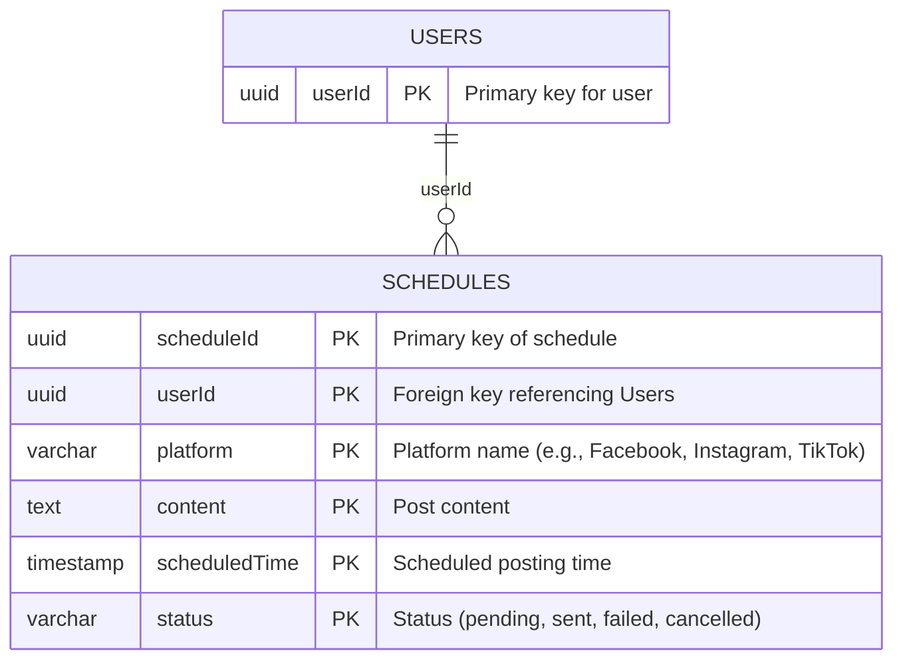
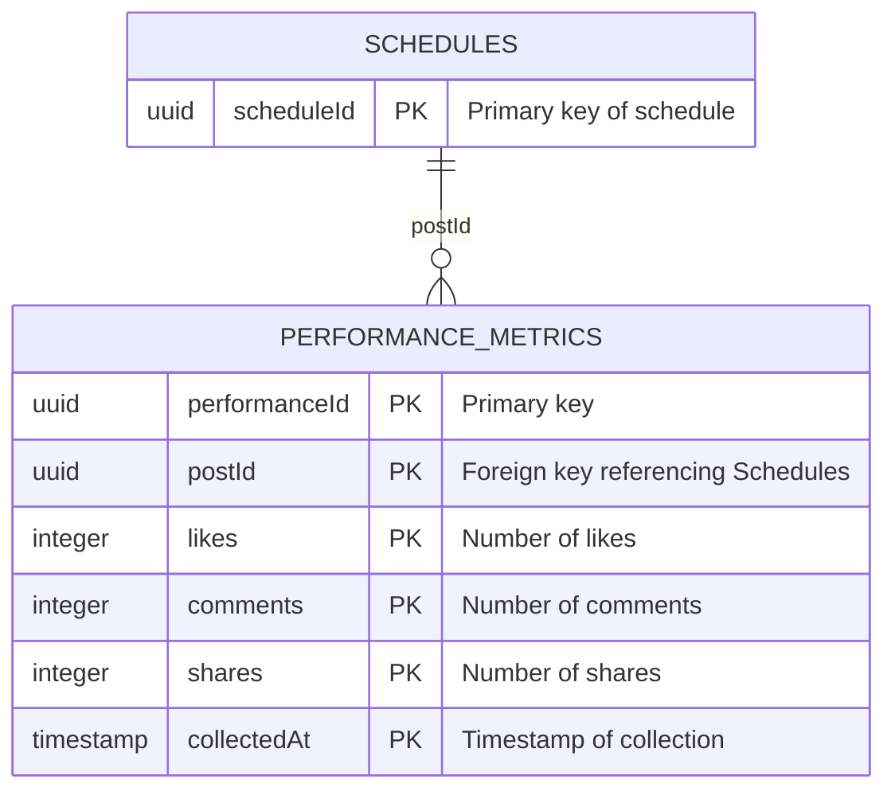
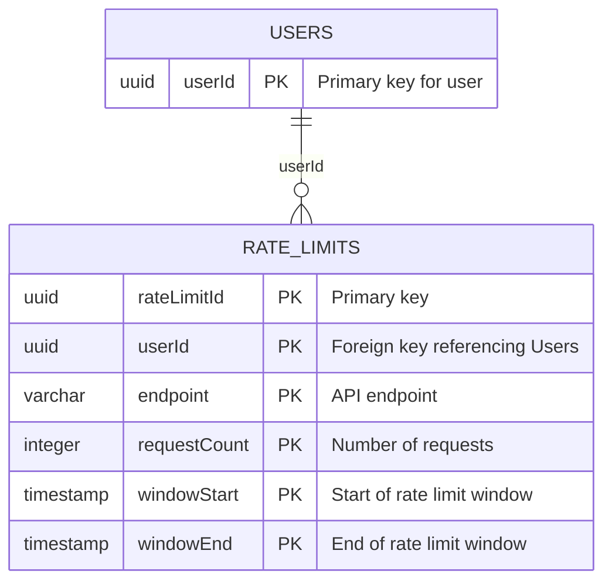

# YÊU CẦU PHẦN MỀM: social-scheduler

## 📊 Tài liệu kiểm soát

| Mục | Chi tiết |
| :--- | :--- |
| **Mã SRS** | SRS-20260830160212 |
| **Tên dự án** | social-scheduler |
| **Phiên bản** | 1.0 (Cơ sở) |
| **Ngày giờ** | 2026/08/30 16:02:12 |
| **Tác giả** | Principal Business Analyst (BA) / Product Strategist (BA Agent) |
| **Phê duyệt** | Chờ phê duyệt quản trị kỹ thuật |

## 1. TỔNG QUAN DỰ ÁN & KIẾN TRÚC TOÀN CẦU

- **Mục tiêu sản phẩm & Giá trị cốt lõi**: Tự động hóa lịch đăng bài trên mạng xã hội, đề xuất nội dung bằng AI, xuất bản đa nền tảng mà không cần chuyên môn kỹ thuật. Giá trị cốt lõi: độ tin cậy, khả năng mở rộng, bảo mật.

- **Đối tượng người dùng mục tiêu**: Chủ doanh nghiệp nhỏ, Quản lý tiếp thị, Chuyên gia marketing tự do.

- **Ma trận RBAC toàn cục**:

  * [ARC-001] Vai trò: Quản trị viên (Admin). Quyền hạn: quản lý người dùng, xem tất cả lịch đăng bài, quản lý tích hợp nền tảng, xem tất cả chỉ số hiệu suất.
  * [ARC-002] Vai trò: Người dùng (User). Quyền hạn: tạo lịch đăng bài, xem lịch của mình, cập nhật lịch, xóa lịch.
  * [ARC-003] Vai trò: Người thực hiện lịch (Scheduler). Quyền hạn: thực hiện các lịch đăng bài đã lên lịch.
  * [ARC-004] Vai trò: Nhà phân tích (Analyst). Quyền hạn: xem chỉ số hiệu suất, tạo báo cáo.

- **Kiến trúc kỹ thuật & Ràng buộc**:

  * [ARC-005] Công nghệ cốt lõi: Dịch vụ AI/ML (OpenAI), Cổng API (Express/Spring Boot), Xác thực (OAuth2 + JWT), Cơ sở dữ liệu (PostgreSQL), Hàng đợi tin nhắn (Apache Kafka), Bộ nhớ đệm (Redis), Container hóa (Docker/Kubernetes), CI/CD (GitHub Actions), Giám sát (Prometheus + Grafana).
  * [ARC-006] Ràng buộc bảo mật: mã hóa TLS, hạn chế CORS, kiểm tra quyền truy cập, phát hiện và ngăn chặn DDoS, tuân thủ OWASP Top 10.

## 2. CÁC MÔ-ĐUN CHỨC NĂNG NÂNG CAO

### Mô-đun 1: Tích hợp lịch đăng bài tự động ([REQ-001])

- **Yêu cầu chức năng cốt lõi**: [REQ-001] Tích hợp API lịch đăng bài tự động cho Facebook, Instagram và TikTok. Câu chuyện người dùng: "Là một chủ doanh nghiệp nhỏ, tôi muốn hệ thống tự động đăng bài lên các mạng xã hội đã chọn theo lịch đã định để duy trì sự hiện diện trực tuyến mà không cần can thiệp thủ công."

- **Tiêu chí chấp nhận**:

```
Given tôi đã kết nối tài khoản mạng xã hội với hệ thống,
When tôi thiết lập một lịch đăng bài cho một nền tảng cụ thể,
Then bài đăng nên được lên lịch chính xác vào thời điểm đã chỉ định và trạng thái hiển thị là "đã lên lịch".
```

```
Given một lịch đăng bài đã tồn tại,
When tôi thay đổi trạng thái lịch đăng bài thành "đã gửi",
Then hệ thống nên cập nhật trạng thái và ghi lại thời gian thực tế đã gửi.
```

- **Luồng ngoại lệ của mô-đun**:

  * [EXC-001] Xử lý lỗi từ API bên thứ ba; ghi lại lỗi và lên lịch thử lại sau một khoảng thời gian.
  * [EXC-002] Xác thực quyền truy cập người dùng và xử lý token hết hạn (thực hiện yêu cầu đăng nhập lại).

- **Từ điển dữ liệu của mô-đun**:

  * [DAT-001] Bảng lịch đăng bài: mô tả các trường:

```
uuid scheduleId PK "Khóa chính của lịch"
uuid userId PK "Khóa ngoại tham chiếu bảng người dùng"
varchar platform PK "Tên nền tảng (ví dụ: Facebook, Instagram, TikTok)"
text content PK "Nội dung bài đăng"
timestamp scheduledTime PK "Thời điểm dự kiến đăng bài"
varchar status PK "Trạng thái (đã lên lịch, đã gửi, lỗi, hủy)"
```



### Mô-đun 2: Đề xuất nội dung bằng AI ([REQ-002])

- **Yêu cầu chức năng cốt lõi**: [REQ-002] Triển khai mô hình học máy để đề xuất nội dung bài đăng dựa trên hiệu suất trước đó. Câu chuyện người dùng: "Là một chuyên gia marketing, tôi muốn nhận các đề xuất nội dung được cá nhân hóa dựa trên hiệu suất trước đây của các bài đăng để tối ưu hóa mức độ tương tác."

- **Tiêu chí chấp nhận**:

```
Given tôi đã kết nối tài khoản mạng xã hội với hệ thống,
When tôi yêu cầu một đề xuất nội dung cho một bài đăng trong tương lai,
Then hệ thống nên trả về một nội dung được đề xuất dựa trên hiệu suất trước đây của các bài đăng tương tự.
```

```
Given tôi đã kết nối tài khoản mạng xã hội với hệ thống,
When tôi yêu cầu một đề xuất nội dung nhưng mô hình AI gặp lỗi,
Then hệ thống nên ghi lại lỗi và cung cấp một nội dung dự phòng mặc định.
```

- **Luồng ngoại lệ của mô-đun**:

  * [EXC-003] Xử lý lỗi từ API bên thứ ba; ghi lại lỗi và lên lịch thử lại sau một khoảng thời gian.
  * [EXC-004] Xử lý lỗi khi mô hình AI không thể tạo ra đề xuất; ghi lại lỗi và cung cấp nội dung dự phòng.

- **Từ điển dữ liệu của mô-đun**:

  * [DAT-002] Bảng hiệu suất bài đăng: mô tả các trường:

```
uuid performanceId PK "Khóa chính"
uuid postId PK "Khóa ngoại tham chiếu bảng lịch đăng bài"
integer likes PK "Số lượt thích"
integer comments PK "Số bình luận"
integer shares PK "Số chia sẻ"
timestamp collectedAt PK "Thời điểm thu thập dữ liệu"
```



### Mô-đun 3: Xác thực đầu vào & giới hạn tỷ lệ ([REQ-003])

- **Yêu cầu chức năng cốt lõi**: [REQ-003] Thực hiện xác thực đầu vào dữ liệu và kiểm tra giới hạn tỷ lệ cho từng người dùng. Câu chuyện người dùng: "Là một quản trị viên, tôi muốn hệ thống áp dụng xác thực nghiêm ngặt cho các lịch đăng bài và giới hạn số lần gọi API mỗi phút để ngăn chặn lạm dụng."

- **Tiêu chí chấp nhận**:

```
Given tôi đã kết nối tài khoản mạng xã hội với hệ thống,
When tôi thực hiện một yêu cầu API vượt quá giới hạn tỷ lệ cho phép,
Then hệ thống nên trả về mã lỗi 429 và một thông báo giải thích rằng yêu cầu đã bị từ chối do vượt quá giới hạn.
```

- **Luồng ngoại lệ của mô-đun**:

  * [EXC-002] Xác thực quyền truy cập người dùng và xử lý token hết hạn (thực hiện yêu cầu đăng nhập lại).
  * [EXC-003] Xử lý lỗi từ API bên thứ ba; ghi lại lỗi và lên lịch thử lại sau một khoảng thời gian.
  * [EXC-005] Xử lý khi vượt quá giới hạn tỷ lệ; trả về lỗi 429 và thông báo cho người dùng.

- **Từ điển dữ liệu của mô-đun**:

  * [DAT-003] Bảng giới hạn tỷ lệ: mô tả các trường:

```
uuid rateLimitId PK "Khóa chính"
uuid userId PK "Khóa ngoại tham chiếu bảng người dùng"
varchar endpoint PK "Điểm cuối API"
integer requestCount PK "Số lần yêu cầu"
timestamp windowStart PK "Bắt đầu cửa sổ giới hạn"
timestamp windowEnd PK "Kết thúc cửa sổ giới hạn"
```



## 3. YÊU CẦU PHI CHỨC NĂNG TOÀN CẦU

- [NFR-001] Hiệu suất: độ trễ dưới 200ms cho các tác vụ lên lịch, thông lượng trên 1000 request/phút.
- [NFR-002] Bảo mật: mã hóa JWT, OAuth2, tuân thủ OWASP Top 10, che giấu dữ liệu nhạy cảm.
- [NFR-003] Khả năng mở rộng & đa-tenancy: mỗi tenant được cô lập trong cơ sở dữ liệu riêng, có thể mở rộng theo chiều ngang, dự phòng cao.