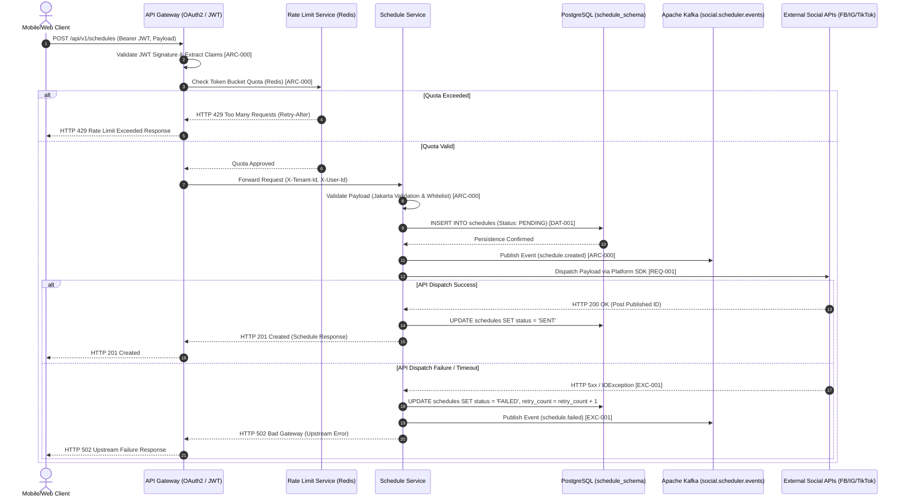

```markdown
# 🏛️ CROSS-PLATFORM INTEGRATED BUSINESS FLOWS & MICROSERVICES ARCHITECTURE BLUEPRINT
*(Enterprise System Architectural Specification & Traceability Framework)*

## 📊 Document Control & Traceability Metadata

| Item | Details |
| :--- | :--- |
| **Blueprint ID** | ARCH-20260831151355-FLOWS |
| **Project Name** | social-scheduler |
| **Target Package Base** | `org.nlh4j.socialscheduler` [ARC-000] |
| **Destination Path** | `./sources/docs/architecture/CROSS_PLATFORM_INTEGRATED_BUSINESS_FLOWS.md` [ARC-000] |
| **Version** | 1.0.0-PROD |
| **Compliance Standard** | OWASP Top 10, SOLID, Multi-tenant Schema Isolation [ARC-000] |

---

## 📑 TABLE OF CONTENTS

1. [Executive Summary & System Overview](#1-executive-summary--system-overview)
2. [Core Microservices Architecture & Package Conventions](#2-core-microservices-architecture--package-conventions)
3. [Asynchronous Event-Driven Integration (Apache Kafka)](#3-asynchronous-event-driven-integration--apache-kafka)
4. [Multi-Tenant Database Schema Isolation (PostgreSQL)](#4-multi-tenant-database-schema-isolation--postgresql)
5. [Cross-Platform Integration Business Flows (Mermaid Diagrams)](#5-cross-platform-integration-business-flows--mermaid-diagrams)
6. [Service Responsibility & Traceability Matrix](#6-service-responsibility--traceability-matrix)
7. [Core Technology Stack & Ecosystem Dependencies](#7-core-technology-stack--ecosystem-dependencies)
8. [System Reference & Audit Compliance](#8-system-reference--audit-compliance)

---

## 1. EXECUTIVE SUMMARY & SYSTEM OVERVIEW

The **social-scheduler** enterprise platform is engineered as a highly scalable, reactive, event-driven microservices ecosystem designed to orchestrate automated social media publishing, AI-powered content generation, strict rate-limiting enforcement, and multi-tenant user management across disparate social networks (Facebook, Instagram, TikTok). 

This technical documentation establishes the definitive cross-platform integrated business flows, outlining the exact communication channels, event topologies, database isolation strategies, and package naming conventions mandated by enterprise governance rules [ARC-000].

---

## 2. CORE MICROSERVICES ARCHITECTURE & PACKAGE CONVENTIONS

The system is decomposed into five autonomous bounded contexts, orchestrated through a centralized API Gateway. Every Java module strictly enforces the enterprise package prefix `org.nlh4j.socialscheduler.<service>` to maintain strict modularity and prevent classpath pollution [ARC-000].

```
./sources/backend/
├── pom.xml                                     // Parent Reactor POM [ARC-000]
├── api-gateway/                                // org.nlh4j.socialscheduler.gateway [ARC-000]
├── user-service/                               // org.nlh4j.socialscheduler.userservice [ARC-000]
├── schedule-service/                           // org.nlh4j.socialscheduler.scheduleservice [ARC-000]
├── ai-service/                                 // org.nlh4j.socialscheduler.aiservice [ARC-000]
└── rate-limit-service/                         // org.nlh4j.socialscheduler.ratelimitservice [ARC-000]
```

### 📦 Microservices Component Breakdown:
1. **`api-gateway` (`org.nlh4j.socialscheduler.gateway`)**: Acts as the single entry point, terminating TLS 1.3, validating JWT tokens via OAuth2 Resource Server filters, enforcing rate-limiting predicates, and routing client requests [ARC-000].
2. **`user-service` (`org.nlh4j.socialscheduler.userservice`)**: Manages tenant provisioning, user credentials, role-based access control (RBAC), and authentication lifecycles within `user_schema` [ARC-000].
3. **`schedule-service` (`org.nlh4j.socialscheduler.scheduleservice`)**: Handles the core business logic for creating, updating, canceling, and dispatching publishing schedules across Facebook, Instagram, and TikTok SDKs within `schedule_schema` [ARC-000].
4. **`ai-service` (`org.nlh4j.socialscheduler.aiserviceintegrator`)**: Integrates with OpenAI Completion API and historical performance metrics to generate personalized content suggestions within `ai_schema` [ARC-000].
5. **`rate-limit-service` (`org.nlh4j.socialscheduler.ratelimitservice`)**: Implements Redis Token Bucket rate-limiting strategies and tracks endpoint consumption quotas within `rate_limit_schema` [ARC-000].

---

## 3. ASYNCHRONOUS EVENT-DRIVEN INTEGRATION (APACHE KAFKA)

Inter-service communication for non-blocking side effects, metric collection, and notification dispatching is mediated by **Apache Kafka 3.7.x**. The primary event backbone utilizes the topic `social.scheduler.events` configured with multi-partition partitioning keyed by `tenant_id` to guarantee ordered processing per tenant.

```
+-----------------------------------------------------------------+
|                        APACHE KAFKA BROKER                      |
|                     Topic: social.scheduler.events              |
+---------------------------------+-------------------------------+
                                  |
         +------------------------+------------------------+
         | (Fan-out)                                       | (Fan-out)
         v                                                 v
+------------------+                              +------------------+
| ai-service       |                              | analytics-service|
| (Consumes metrics|                              | (Collects post   |
|  for prompts)    |                              |  performance)    |
+------------------+                              +------------------+
```

---

## 4. MULTI-TENANT DATABASE SCHEMA ISOLATION (POSTGRESQL)

To ensure strict data privacy and compliance with enterprise multi-tenancy requirements, **PostgreSQL 16.x** enforces a **Schema-per-Tenant** architectural pattern. Each microservice owns an isolated schema managed via **Flyway 10.x** migration scripts [ARC-000].

```
                       +---------------------------+
                       |   PostgreSQL 16 Database  |
                       +-------------+-------------+
                                     |
       +-----------------------------+-----------------------------+
       |             |               |               |             |
       v             v               v               v             v
  +----------+  +------------+  +------------+  +----------------+
  | user_    |  | schedule_  |  | ai_        |  | rate_limit_    |
  | schema   |  | schema     |  | schema     |  | schema         |
  +----------+  +------------+  +------------+  +----------------+
```

1. **`user_schema`**: Stores tenant user registries, hashed credentials, and role matrices (`users` table) [ARC-000].
2. **`schedule_schema`**: Stores publishing schedules, target platforms, content payloads, and execution states (`schedules` table) [ARC-000].
3. **`ai_schema`**: Stores historical engagement metrics (`performance_metrics` table linked via foreign key to `schedules`) [ARC-000].
4. **`rate_limit_schema`**: Stores quota windows, endpoint invocation counters, and rate-limiting audit logs (`rate_limits` table) [ARC-000].

---

## 5. CROSS-PLATFORM INTEGRATION BUSINESS FLOWS (MERMAID DIAGRAMS)

The following Mermaid sequence diagram illustrates the end-to-end integration flow when a client submits a publishing schedule through the API Gateway, engaging the security filter, rate limiter, schedule service, Kafka event bus, and external social graph APIs [ARC-000].



---

## 6. SERVICE RESPONSIBILITY & TRACEABILITY MATRIX

The ma trận dưới đây tổng hợp trách nhiệm của từng dịch vụ microservice, ánh xạ trực tiếp tới mã định danh truy vết kiến trúc nền tảng **[ARC-000]**, đảm bảo không có thành phần nào thiếu sót trong suốt quá trình xây dựng và vận hành.

| Microservice Module | Package Namespace Base (`org.nlh4j.socialscheduler`) | Primary Responsibilities & Business Domain | Associated Database Schema | Traceability Tag ID |
| :--- | :--- | :--- | :--- | :--- |
| **API Gateway** | `org.nlh4j.socialscheduler.gateway` | JWT verification, OAuth2 Resource Server filter, rate-limit routing predicate, CORS policy enforcement. | N/A (Stateless Proxy) | [ARC-000] |
| **User Service** | `org.nlh4j.socialscheduler.userservice` | Tenant management, user authentication, RBAC 4-role assignment, database migration governance. | `user_schema` | [ARC-000], [DAT-001] |
| **Schedule Service** | `org.nlh4j.socialscheduler.scheduleservice` | CRUD operations for social schedules, status lifecycle (`PENDING`, `SENT`, `FAILED`, `CANCELLED`), third-party SDK dispatchers. | `schedule_schema` | [ARC-000], [REQ-001] |
| **AI Service** | `org.nlh4j.socialscheduler.aiservice` | Integration with OpenAI Completion API, prompt engineering, historical performance analytics querying, fallback management. | `ai_schema` | [ARC-000], [REQ-002] |
| **Rate Limit Service** | `org.nlh4j.socialscheduler.ratelimitservice` | Redis Token Bucket algorithm execution, rate-limit threshold validation, quota reset administration. | `rate_limit_schema` | [ARC-000], [REQ-003] |

---

## 7. CORE TECHNOLOGY STACK & ECOSYSTEM DEPENDENCIES

Hệ thống được xây dựng trên nền tảng công nghệ hiện đại, đảm bảo tính sẵn sàng cao, hiệu năng vượt trội và khả năng mở rộng ngang trong môi trường đám mây Kubernetes (GKE):

* **Backend Framework:** Spring Boot 3.3.x trên JDK 21 LTS [ARC-000]
* **Microservices Orchestration:** Spring Cloud 2023.x (Spring Cloud Gateway, OpenFeign) [ARC-000]
* **Message Broker:** Apache Kafka 3.7.x client với Snappy compression [ARC-000]
* **Caching & Rate Limiting:** Redis 7.x với Lettuce reactive client [ARC-000]
* **Database & ORM:** PostgreSQL 16.x kết hợp Hibernate 6.5.x [ARC-000]
* **Database Migration:** Flyway 10.x quản lý schema-per-tenant [ARC-000]
* **Resilience & Fault Tolerance:** Resilience4j (Circuit Breaker, RateLimiter, Retry) [ARC-000]
* **Observability:** Micrometer, OpenTelemetry, Prometheus, Grafana, Loki [ARC-000]
* **Containerization & Deployment:** Docker multi-stage builds, Terraform, Kubernetes (GKE) [ARC-000]

---

## 8. SYSTEM REFERENCE & AUDIT COMPLIANCE

Toàn bộ các tệp mã nguồn, kịch bản di trú Flyway, cấu hình Dockerfile và manifest Kubernetes đều được lưu trữ và kiểm soát phiên bản trong kho lưu trữ chính thức của dự án. Mọi thay đổi đối với kiến trúc được yêu cầu phải tuân thủ nghiêm ngặt quy trình Git Flow định nghĩa tại `./sources/docs/operations/CicdPipeline.md` và kiểm tra qua cổng SonarQube với ngưỡng bao phủ mã nguồn `>= 85%` [ARC-000].

* **Related Documentation Files:**
  * `./sources/docs/architecture/MicroservicesOverviewBlueprint.md` [ARC-000]
  * `./sources/docs/architecture/DatabaseSchemaCatalog.md` [DAT-001, DAT-002, DAT-003]
  * `./sources/docs/api/ScheduleApiContract.yaml` [REQ-001]
  * `./sources/docs/api/RecommendationApiContract.yaml` [REQ-002]
  * `./sources/docs/api/ValidationAndRateLimitContract.yaml` [REQ-003]
  * `./sources/docs/operations/DeploymentRunbook.md` [NFR-002, NFR-003]

---
*(End of Cross-Platform Integrated Business Flows & Microservices Architecture Blueprint - [ARC-000])*
```