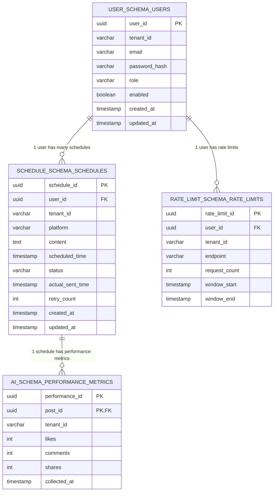

```markdown
# Database Schema Catalog & Multi-Tenancy Architecture
* **Target Project Identity:** social-scheduler
* **Enforced Java Package Prefix Base:** `org.nlh4j.socialscheduler`
* **Target Documentation Path:** `./sources/docs/architecture/DatabaseSchemaCatalog.md`
* **Version:** 1.0.0
* **Traceability References:** `[DAT-001]`, `[DAT-002]`, `[DAT-003]`, `[DAT-ALL (1 to 3)]`

---

## 📑 Mục lục (Table of Contents)
1. [Giới thiệu hệ thống cơ sở dữ liệu (Introduction)](#1-giới-thieu-hệ-thống-cơ-sở-dữ-liệu-introduction)
2. [Chiến lược phân rã Schema-per-Tenant (Multi-Tenancy Strategy)](#2-chien-luợc-phan-ra-schema-per-tenant-multi-tenancy-strategy)
3. [Quy trình di trú tự động với Flyway (Flyway Migration Workflow)](#3-quy-trinh-di-tru-tu-động-với-flyway-flyway-migration-workflow)
4. [Catalog chi tiết các bảng dữ liệu lõi (Core Data Tables Catalog)](#4-catalog-chi-tiết-cac-bảng-dữ-liệu-lõi-core-data-tables-catalog)
   - 4.1. Bảng `users` (`user_schema`) [DAT-001]
   - 4.2. Bảng `schedules` (`schedule_schema`) [DAT-001]
   - 4.3. Bảng `performance_metrics` (`ai_schema`) [DAT-002]
   - 4.4. Bảng `rate_limits` (`rate_limit_schema`) [DAT-003]
5. [Sơ đồ quan hệ thực thể thực tế (Entity Relationship Diagram)](#5-sơ-đồ-quan-hệ-thực-thể-thực-tế-entity-relationship-diagram)
6. [Bảng tham chiếu mã định danh truy vết (Traceability Matrix Reference)](#6-bảng-tham-chiếu-mã-định-danh-truy-vết-traceability-matrix-reference)

---

## 1. Giới thiệu hệ thống cơ sở dữ liệu (Introduction)

Tài liệu này cung cấp đặc tả kiến trúc kỹ thuật toàn diện cho tầng lưu trữ dữ liệu của hệ thống **social-scheduler**. Hệ thống được thiết kế theo mô hình kiến trúc Microservices hướng sự kiện (Event-Driven Microservices Architecture), trong đó mỗi dịch vụ nghiệp vụ độc lập (`user-service`, `schedule-service`, `ai-service`, `rate-limit-service`) sở hữu và quản lý một không gian lưu trữ dữ liệu riêng biệt. 

Tầng cơ sở dữ liệu sử dụng **PostgreSQL 15+** làm hệ quản trị cơ sở dữ liệu quan hệ (RDBMS) cốt lõi, kết hợp với công cụ quản lý phiên bản lược đồ **Flyway 10.x** nhằm đảm bảo tính nhất quán, khả năng lặp lại (repeatability) và tự động hóa toàn bộ quá trình khởi tạo cấu trúc bảng khi các dịch vụ khởi động.

---

## 2. Chiến lược phân rã Schema-per-Tenant (Multi-Tenancy Strategy)

Để đáp ứng yêu cầu cô lập dữ liệu doanh nghiệp đa-tenancy (`Multi-Tenancy Isolation`) với mức độ bảo mật cao nhất, hệ thống áp dụng mô hình **Schema-per-Tenant** kết hợp phân rã theo bounded context (`[DAT-ALL (1 to 3)]`):

1. **Cô lập theo Bounded Context:** Các microservices không chia sẻ chung một schema cơ sở dữ liệu. Mỗi dịch vụ ánh xạ tới một schema riêng biệt trong PostgreSQL nhằm tuân thủ nguyên tắc đóng gói miền nghiệp vụ (`Single Responsibility Principle`):
   - `user-service` sở hữu schema: `user_schema`
   - `schedule-service` sở hữu schema: `schedule_schema`
   - `ai-service` sở hữu schema: `ai_schema`
   - `rate-limit-service` sở hữu schema: `rate_limit_schema`

2. **Định danh Tenant:** Mọi bảng dữ liệu lõi đều bắt buộc bao gồm cột `tenant_id VARCHAR(64) NOT NULL` kết hợp với chỉ mục phụ trợ (`B-tree Index`). Cột này được tiêm tự động từ ngữ cảnh bảo mật của JWT Token thông qua `TenantContextHolder` tại tầng API Gateway và Filter của Spring Security, đảm bảo không có bất kỳ câu lệnh SQL nào có thể truy vấn vượt ranh giới tenant (`Tenant Isolation Enforcement`).

---

## 3. Quy trình di trú tự động với Flyway (Flyway Migration Workflow)

Quản lý thay đổi lược đồ cơ sở dữ liệu được tự động hóa hoàn toàn thông qua **Flyway Migration** được tích hợp sẵn bên trong từng microservice (`[DAT-ALL (1 to 3)]`):

- **Đường dẫn tệp di trú:** Các tệp lệnh DDL được lưu trữ tại đường dẫn tiêu chuẩn:
  - `./sources/backend/user-service/src/main/resources/db/migration/V1__init_users.sql`
  - `./sources/backend/schedule-service/src/main/resources/db/migration/V1__init_schedules.sql`
  - `./sources/backend/ai-service/src/main/resources/db/migration/V1__init_performance_metrics.sql`
  - `./sources/backend/rate-limit-service/src/main/resources/db/migration/V1__init_rate_limits.sql`

- **Cơ chế thực thi:** Khi một microservice khởi động, Spring Boot tự động kích hoạt Flyway migration bean, kết nối tới cơ sở dữ liệu qua cấu hình `HikariCP` connection pool, kiểm tra bảng theo dõi `flyway_schema_history`, và thực thi tuần tự các tệp lệnh `V1__init_<table_name>.sql` chưa được áp dụng. Quá trình này đảm bảo tính toàn vẹn của cấu trúc bảng trước khi các Bean kết nối JPA khởi tạo.

---

## 4. Catalog chi tiết các bảng dữ liệu lõi (Core Data Tables Catalog)

### 4.1. Bảng `users` (`user_schema`)
Bảng `users` lưu trữ thông tin định danh người dùng, thông tin xác thực mã hóa mật khẩu, phân quyền hệ thống theo 4 vai trò (Admin, User, Scheduler, Analyst) và trạng thái kích hoạt tài khoản trong phạm vi tenant (`[DAT-001]`).

| Tên cột (Column) | Kiểu dữ liệu (Data Type) | Ràng buộc (Constraints) | Mô tả chi tiết (Description) |
| :--- | :--- | :--- | :--- |
| `user_id` | `UUID` | `NOT NULL`, `PRIMARY KEY` | Khóa chính định danh duy nhất của người dùng. |
| `tenant_id` | `VARCHAR(64)` | `NOT NULL` | Mã định danh khách hàng (tenant) để cô lập dữ liệu. |
| `email` | `VARCHAR(255)` | `NOT NULL` | Địa chỉ thư điện tử dùng để đăng nhập hệ thống. |
| `password_hash` | `VARCHAR(255)` | `NOT NULL` | Chuỗi mật khẩu đã được băm an toàn bằng BCrypt. |
| `role` | `VARCHAR(32)` | `NOT NULL`, `CHECK` | Vai trò hệ thống (`ADMIN`, `USER`, `SCHEDULER`, `ANALYST`). |
| `enabled` | `BOOLEAN` | `NOT NULL`, `DEFAULT TRUE` | Trạng thái kích hoạt tài khoản (True: Hoạt động, False: Khóa). |
| `created_at` | `TIMESTAMP` | `NOT NULL`, `DEFAULT CURRENT_TIMESTAMP` | Thời điểm khởi tạo bản ghi. |
| `updated_at` | `TIMESTAMP` | `NOT NULL`, `DEFAULT CURRENT_TIMESTAMP` | Thời điểm cập nhật bản ghi gần nhất. |

* **Ràng buộc Khóa chính (`PRIMARY KEY`):** `pk_users (user_id)`
* **Ràng buộc Duy nhất (`UNIQUE`):** `uk_users_tenant_email (tenant_id, email)`
* **Ràng buộc Kiểm tra (`CHECK`):** `ck_users_role (role IN ('ADMIN', 'USER', 'SCHEDULER', 'ANALYST'))`
* **Chỉ mục (`INDEX`):** `idx_users_tenant ON user_schema.users(tenant_id)`

---

### 4.2. Bảng `schedules` (`schedule_schema`)
Bảng `schedules` lưu trữ toàn bộ thông tin lịch đăng bài tự động lên các nền tảng mạng xã hội (Facebook, Instagram, TikTok), bao gồm nội dung, thời điểm thực thi và vòng đời trạng thái `PENDING`, `SENT`, `FAILED`, `CANCELLED` (`[DAT-001]`).

| Tên cột (Column) | Kiểu dữ liệu (Data Type) | Ràng buộc (Constraints) | Mô tả chi tiết (Description) |
| :--- | :--- | :--- | :--- |
| `schedule_id` | `UUID` | `NOT NULL` | Định danh duy nhất của lịch đăng bài. |
| `user_id` | `UUID` | `NOT NULL`, `FOREIGN KEY` | Định danh người dùng sở hữu lịch đăng bài. |
| `tenant_id` | `VARCHAR(64)` | `NOT NULL` | Mã định danh tenant để cô lập dữ liệu. |
| `platform` | `VARCHAR(32)` | `NOT NULL`, `CHECK` | Nền tảng đích (`FACEBOOK`, `INSTAGRAM`, `TIKTOK`). |
| `content` | `TEXT` | `NOT NULL` | Nội dung văn bản của bài đăng. |
| `scheduled_time` | `TIMESTAMP` | `NOT NULL` | Thời điểm dự kiến thực thi đăng bài. |
| `status` | `VARCHAR(16)` | `NOT NULL`, `CHECK` | Trạng thái (`PENDING`, `SENT`, `FAILED`, `CANCELLED`). |
| `actual_sent_time` | `TIMESTAMP` | `NULLABLE` | Thời điểm thực tế hệ thống phát hành bài đăng thành công. |
| `retry_count` | `INTEGER` | `NOT NULL`, `DEFAULT 0` | Số lần hệ thống đã thử lại khi gặp lỗi kết nối. |
| `created_at` | `TIMESTAMP` | `NOT NULL`, `DEFAULT CURRENT_TIMESTAMP` | Thời điểm tạo lịch. |
| `updated_at` | `TIMESTAMP` | `NOT NULL`, `DEFAULT CURRENT_TIMESTAMP` | Thời điểm cập nhật gần nhất. |

* **Ràng buộc Khóa chính (`PRIMARY KEY`):** `pk_schedules (schedule_id, user_id, platform, scheduled_time)`
* **Ràng buộc Khóa ngoại (`FOREIGN KEY`):** `fk_schedules_user (user_id) REFERENCES user_schema.users(user_id)`
* **Ràng buộc Kiểm tra (`CHECK`):** 
  - `ck_schedules_platform (platform IN ('FACEBOOK', 'INSTAGRAM', 'TIKTOK'))`
  - `ck_schedules_status (status IN ('PENDING', 'SENT', 'FAILED', 'CANCELLED'))`
* **Chỉ mục (`INDEX`):** 
  - `idx_schedules_user_status ON schedule_schema.schedules(user_id, status)`
  - `idx_schedules_tenant_time ON schedule_schema.schedules(tenant_id, scheduled_time)`

---

### 4.3. Bảng `performance_metrics` (`ai_schema`)
Bảng `performance_metrics` lưu trữ các chỉ số hiệu suất bài đăng (lượt thích, bình luận, chia sẻ) được thu thập định kỳ nhằm phục vụ mô hình AI đề xuất nội dung cá nhân hóa (`[DAT-002]`).

| Tên cột (Column) | Kiểu dữ liệu (Data Type) | Ràng buộc (Constraints) | Mô tả chi tiết (Description) |
| :--- | :--- | :--- | :--- |
| `performance_id` | `UUID` | `NOT NULL` | Định danh duy nhất của bản ghi chỉ số hiệu suất. |
| `post_id` | `UUID` | `NOT NULL`, `FOREIGN KEY` | Khóa ngoại tham chiếu tới `schedule_id` của bảng `schedules`. |
| `tenant_id` | `VARCHAR(64)` | `NOT NULL` | Mã định danh tenant để cô lập dữ liệu. |
| `likes` | `INTEGER` | `NOT NULL`, `DEFAULT 0` | Tổng số lượt thích ghi nhận được. |
| `comments` | `INTEGER` | `NOT NULL`, `DEFAULT 0` | Tổng số lượt bình luận ghi nhận được. |
| `shares` | `INTEGER` | `NOT NULL`, `DEFAULT 0` | Tổng số lượt chia sẻ ghi nhận được. |
| `collected_at` | `TIMESTAMP` | `NOT NULL` | Thời điểm hệ thống thu thập chỉ số hiệu suất. |

* **Ràng buộc Khóa chính (`PRIMARY KEY`):** `pk_performance (performance_id, post_id, collected_at)`
* **Ràng buộc Khóa ngoại (`FOREIGN KEY`):** `fk_performance_schedule (post_id) REFERENCES schedule_schema.schedules(schedule_id)`
* **Ràng buộc Kiểm tra (`CHECK`):** 
  - `ck_performance_likes (likes >= 0)`
  - `ck_performance_comments (comments >= 0)`
  - `ck_performance_shares (shares >= 0)`
* **Chỉ mục (`INDEX`):** `idx_performance_post ON ai_schema.performance_metrics(post_id)`

---

### 4.4. Bảng `rate_limits` (`rate_limit_schema`)
Bảng `rate_limit` lưu trữ bộ đếm số lượng yêu cầu theo cửa sổ thời gian (sliding/fixed window) nhằm hỗ trợ cơ chế giới hạn tỷ lệ (`Rate Limiting`) bảo vệ hệ thống trước các cuộc tấn công DDoS hoặc lạm dụng API (`[DAT-003]`).

| Tên cột (Column) | Kiểu dữ liệu (Data Type) | Ràng buộc (Constraints) | Mô tả chi tiết (Description) |
| :--- | :--- | :--- | :--- |
| `rate_limit_id` | `UUID` | `NOT NULL` | Định danh duy nhất của bản ghi giới hạn tỷ lệ. |
| `user_id` | `UUID` | `NOT NULL`, `FOREIGN KEY` | Định danh người dùng thực hiện yêu cầu. |
| `tenant_id` | `VARCHAR(64)` | `NOT NULL` | Mã định danh tenant để cô lập dữ liệu. |
| `endpoint` | `VARCHAR(255)` | `NOT NULL`, `CHECK` | Đường dẫn API được áp dụng giới hạn tỷ lệ. |
| `request_count` | `INTEGER` | `NOT NULL` | Tổng số yêu cầu đã thực hiện trong cửa sổ hiện tại. |
| `window_start` | `TIMESTAMP` | `NOT NULL` | Thời điểm bắt đầu cửa sổ tính toán giới hạn. |
| `window_end` | `TIMESTAMP` | `NOT NULL` | Thời điểm kết thúc cửa sổ tính toán giới hạn. |

* **Ràng buộc Khóa chính (`PRIMARY KEY`):** `pk_rate_limits (rate_limit_id, endpoint, window_start)`
* **Ràng buộc Khóa ngoại (`FOREIGN KEY`):** `fk_rate_limits_user (user_id) REFERENCES user_schema.users(user_id)`
* **Ràng buộc Kiểm tra (`CHECK`):** 
  - `ck_rate_limits_endpoint (endpoint IN ('/api/v1/schedules', '/api/v1/recommendations', '/api/v1/rate-limits', '/api/v1/users'))`
  - `ck_rate_limits_count (request_count >= 0)`
* **Chỉ mục (`INDEX`):** `idx_rate_limits_window ON rate_limit_schema.rate_limits(user_id, endpoint, window_start)`

---

## 5. Sơ đồ quan hệ thực thể thực tế (Entity Relationship Diagram)

Dưới đây là sơ đồ quan hệ thực thể (ERD) minh họa cấu trúc các bảng và mối liên kết khóa ngoại giữa các schema độc lập trong hệ thống `social-scheduler`:



---

## 6. Bảng tham chiếu mã định danh truy vết (Traceability Matrix Reference)

Bảng dưới đây ánh xạ các thành phần cơ sở dữ liệu được mô tả trong tài liệu này về các mã định danh truy vết kỹ thuật tương ứng theo chuẩn dự án (`[DAT-001]`, `[DAT-002]`, `[DAT-003]`, `[DAT-ALL (1 to 3)]`):

| Thành phần / Bảng dữ liệu | Schema tương ứng | Tệp lệnh Flyway DDL (`./sources/backend/...`) | Mã định danh truy vết (Traceability Tag IDs) |
| :--- | :--- | :--- | :--- |
| Bảng `users` | `user_schema` | `user-service/src/main/resources/db/migration/V1__init_users.sql` | `[DAT-001]`, `[DAT-ALL (1 to 3)]` |
| Bảng `schedules` | `schedule_schema` | `schedule-service/src/main/resources/db/migration/V1__init_schedules.sql` | `[DAT-001]`, `[DAT-ALL (1 to 3)]` |
| Bảng `performance_metrics` | `ai_schema` | `ai-service/src/main/resources/db/migration/V1__init_performance_metrics.sql` | `[DAT-002]`, `[DAT-ALL (1 to 3)]` |
| Bảng `rate_limits` | `rate_limit_schema` | `rate-limit-service/src/main/resources/db/migration/V1__init_rate_limits.sql` | `[DAT-003]`, `[DAT-ALL (1 to 3)]` |
```