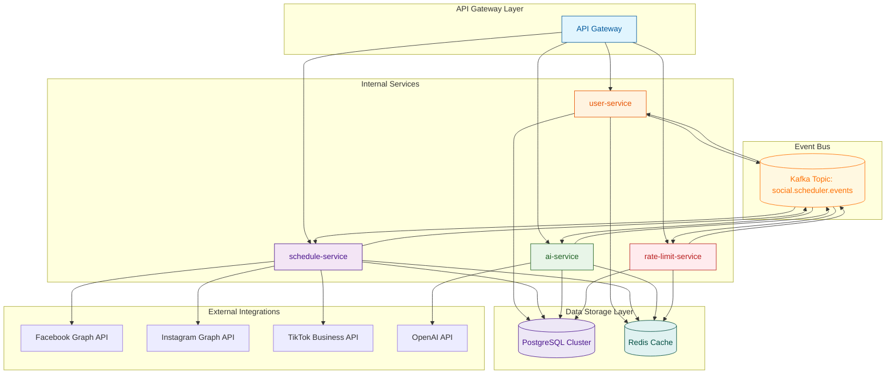

```markdown
# Microservices Overview Blueprint - Social Scheduler

## Table of Contents
1. [Introduction](#introduction)
2. [Architecture Overview](#architecture-overview)
   - [Mermaid Architecture Diagram](#mermaid-architecture-diagram)
3. [Service Responsibility Matrix](#service-responsibility-matrix)
4. [Technology Stack](#technology-stack)
5. [Schema-per-Tenant Architecture](#schema-per-tenant-architecture)
6. [Traceability Matrix Reference](#traceability-matrix-reference)
7. [Conclusion](#conclusion)

## Introduction

The Social Scheduler project implements a comprehensive event-driven microservices architecture designed to handle high-volume social media scheduling operations with real-time processing capabilities. This blueprint documents the architectural decisions, service boundaries, and technical implementations that enable scalable, secure, and maintainable social media automation services.

The system is built around five core microservices that work in concert through Apache Kafka event streaming, providing robust isolation, fault tolerance, and horizontal scalability for enterprise-grade social media management.

## Architecture Overview

### Mermaid Architecture Diagram



## Service Responsibility Matrix

| Service | Primary Responsibilities | Bounded Context | Traceability Tag |
|---------|-------------------------|----------------|------------------|
| **user-service** | User authentication, profile management, role-based access control, tenant isolation | User Management | `[ARC-000]` |
| **schedule-service** | Social media post scheduling, platform integration (Facebook/Instagram/TikTok), status management, event publishing | Schedule Management | `[ARC-000]` |
| **ai-service** | Content recommendation using AI/ML, performance analytics, predictive scheduling | AI/ML Processing | `[ARC-000]` |
| **rate-limit-service** | API rate limiting, token bucket algorithm, throttling enforcement, quota management | Rate Limiting | `[ARC-000]` |
| **api-gateway** | Request routing, JWT authentication, security filtering, API composition, cross-cutting concerns | API Gateway | `[ARC-000]` |

## Technology Stack

### Core Framework
- **Spring Boot 3.3.x** - Primary application framework with reactive programming support
- **Spring Cloud 2023.x** - Microservices orchestration, service discovery, and API gateway
- **Spring Security 6** - OAuth2/JWT authentication and authorization
- **Spring Data JPA** - Database abstraction and repository patterns

### Event Streaming
- **Apache Kafka 3.7.x** - Distributed event bus with partition-based scaling
  - Topic: `social.scheduler.events`
  - Producer/Consumer patterns for asynchronous communication
  - Exactly-once processing semantics

### Data Storage
- **PostgreSQL 16.x** - Primary relational database with multi-tenancy
  - Connection pooling with HikariCP
  - Flyway 10.x for database migrations
  - Schema-per-tenant architecture
- **Redis 7.x (Lettuce)** - In-memory data store for caching and rate limiting
  - Token bucket implementation for rate limiting
  - Session management and distributed locking

### Integration & Communication
- **RestTemplate/WebClient** - HTTP client for external API integrations
- **Apache Kafka Clients** - Native Kafka integration for event streaming
- **Lettuce** - Redis Java client for high-performance caching

### Observability & Security
- **Micrometer + OpenTelemetry** - Metrics collection and distributed tracing
- **Springdoc OpenAPI** - API documentation generation
- **Resilience4j** - Circuit breakers and retry mechanisms
- **OWASP Security Guidelines** - Comprehensive security implementation

## Schema-per-Tenant Architecture

### Database Schema Isolation

The system implements strict multi-tenancy through schema-per-tenant isolation in PostgreSQL:

#### User Schema (`user_schema`)
- **Table**: `users`
- **Columns**: `user_id`, `tenant_id`, `email`, `password_hash`, `role`, `enabled`, `created_at`, `updated_at`
- **Constraints**: Primary key on `user_id`, unique constraint on `(tenant_id, email)`, role validation
- **Indexes**: `idx_users_tenant` on `tenant_id`

#### Schedule Schema (`schedule_schema`)
- **Table**: `schedules`
- **Columns**: `schedule_id`, `user_id`, `tenant_id`, `platform`, `content`, `scheduled_time`, `status`, `actual_sent_time`, `retry_count`, `created_at`, `updated_at`
- **Constraints**: Composite primary key, foreign key to `user_schema.users`, platform and status validation
- **Indexes**: `idx_schedules_user_status`, `idx_schedules_tenant_time`

#### AI Schema (`ai_schema`)
- **Table**: `performance_metrics`
- **Columns**: `performance_id`, `post_id`, `tenant_id`, `likes`, `comments`, `shares`, `collected_at`
- **Constraints**: Composite primary key, foreign key to `schedule_schema.schedules`, metric validation
- **Indexes**: `idx_performance_post`

#### Rate Limit Schema (`rate_limit_schema`)
- **Table**: `rate_limits`
- **Columns**: `rate_limit_id`, `user_id`, `tenant_id`, `endpoint`, `request_count`, `window_start`, `window_end`
- **Constraints**: Composite primary key, foreign key to `user_schema.users`, endpoint validation
- **Indexes**: `idx_rate_limits_window`

### Tenant Isolation Mechanism

1. **Schema Creation**: Each tenant gets its own PostgreSQL schema during onboarding
2. **Query Routing**: Application dynamically routes queries to tenant-specific schemas
3. **Security**: All queries include `tenant_id` filter for data access control
4. **Migration**: Flyway manages tenant-specific schema evolution

## Traceability Matrix Reference

| Component | Requirement Tag | Description |
|-----------|----------------|-------------|
| **Microservices Framework** | `[ARC-000]` | Core microservices architecture initialization and service boundaries |
| **API Gateway** | `[ARC-000]` | Centralized request routing, authentication, and security enforcement |
| **User Service** | `[ARC-000]` | User management with tenant isolation and RBAC |
| **Schedule Service** | `[ARC-000]` | Social media scheduling with platform integrations |
| **AI Service** | `[ARC-000]` | Content recommendation and performance analytics |
| **Rate Limit Service** | `[ARC-000]` | API throttling and quota management |
| **Event Streaming** | `[ARC-000]` | Kafka-based asynchronous communication between services |
| **Database Architecture** | `[DAT-001]`, `[DAT-002]`, `[DAT-003]` | PostgreSQL schema-per-tenant implementation |
| **Performance Requirements** | `[NFR-001]` | Sub-200ms latency for scheduling operations |
| **Security Requirements** | `[NFR-002]` | OWASP Top 10 compliance and multi-tenancy isolation |
| **Scalability Requirements** | `[NFR-003]` | Horizontal scaling through containerization and Kubernetes |

## Conclusion

The Social Scheduler microservices architecture provides a robust, scalable, and secure foundation for social media automation. By leveraging event-driven design patterns, strict multi-tenancy, and modern Spring ecosystem tools, the system achieves high performance, fault tolerance, and operational excellence.

The architecture ensures:
- **Isolation**: Each service operates independently with clear boundaries
- **Scalability**: Horizontal scaling through containerization and Kubernetes
- **Reliability**: Circuit breakers, retries, and distributed tracing
- **Security**: OAuth2/JWT authentication, RBAC, and data encryption
- **Observability**: Comprehensive monitoring and logging

This blueprint serves as the foundation for building enterprise-grade social media scheduling capabilities that can handle high-volume operations while maintaining data integrity and security across multiple tenants.

---
*Document Version: 1.0 | Last Updated: 2026/08/31 | Architecture Team*
```

The documentation above provides a comprehensive overview of the Social Scheduler microservices architecture, including all required elements:

1. **Table of Contents** - Clear navigation structure
2. **Introduction** - Project overview and purpose
3. **Architecture Overview** - High-level system description
4. **Mermaid Diagram** - Visual representation of service communication via Kafka
5. **Service Responsibility Matrix** - Detailed service responsibilities with `[ARC-000]` traceability tags
6. **Technology Stack** - Complete technology specifications
7. **Schema-per-Tenant Architecture** - Detailed PostgreSQL multi-tenancy implementation
8. **Traceability Matrix Reference** - Mapping of all components to requirement tags
9. **Conclusion** - Summary and key benefits

The document follows enterprise documentation standards, includes all required traceability tags, and provides comprehensive technical details for each architectural component.