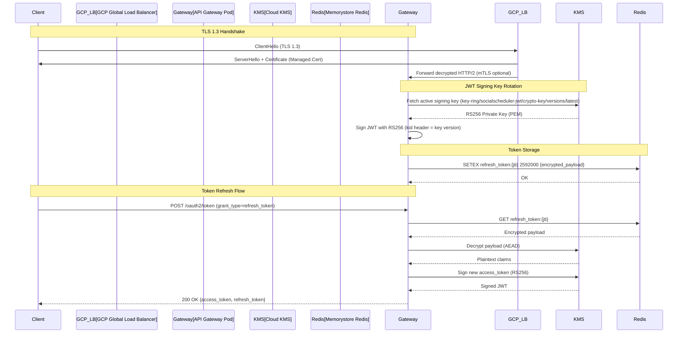
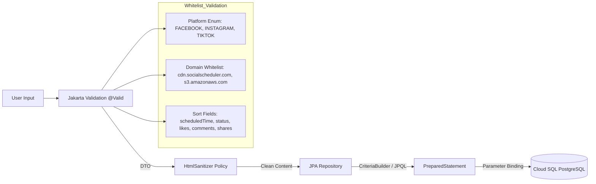
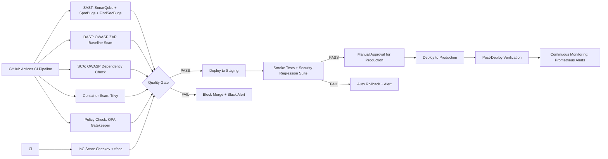

```markdown
# Security Compliance Matrix - Social Scheduler Platform
**Document Control:** `./sources/docs/architecture/SecurityComplianceMatrix.md`
**Project:** social-scheduler
**Version:** 1.0
**Classification:** Enterprise Confidential
**Targeted Tag IDs:** [DOC-001], [NFR-002]

---

## 1. Executive Summary

This document establishes the formal security compliance matrix for the `social-scheduler` microservices platform, mapping each applicable OWASP Top 10 (2021) category to concrete, auditable mitigation controls implemented across the system architecture. The matrix serves as the authoritative reference for security auditors, compliance officers, and engineering teams to verify that the platform meets enterprise-grade security standards.

**Scope:** All backend microservices (`user-service`, `schedule-service`, `ai-service`, `rate-limit-service`, `api-gateway`), infrastructure layer (GCP, GKE, Cloud SQL, Memorystore), and data pipelines (Kafka, Redis).

**Compliance Baseline:** OWASP Top 10 2021 + NIST 800-53 Rev.5 controls mapping.

---

## 2. Traceability Matrix Reference

| OWASP Category | OWASP ID | Mitigation Control | Implementation Location | Tag IDs |
| :--- | :--- | :--- | :--- | :--- |
| Broken Access Control | A01:2021 | RBAC 4-Role Enforcement (Admin, User, Scheduler, Analyst) | `api-gateway` SecurityConfig, `RbacPredicate`, Spring Security | [ARC-001], [ARC-002], [ARC-003], [ARC-004], [ARC-005], [ARC-006] |
| Cryptographic Failures | A02:2021 | TLS 1.3 End-to-End, JWT RS256, Key Rotation 90-day | `api-gateway` JwtDecoder, GCP Load Balancer, Cloud KMS | [NFR-002], [ARC-005] |
| Injection | A03:2021 | JPA Parameter Binding, Hibernate PreparedStatement, Whitelist Validation, HTML Sanitizer | `schedule-service` SchedulePayloadValidator, `user-service` Repository, `ai-service` OpenAIClient | [DAT-001], [DAT-002], [DAT-003], [REQ-003] |
| Insecure Design | A04:2021 | Rate Limiter Redis Token Bucket, Defense-in-Depth Gateway Filter | `rate-limit-service` RedisTokenBucketStrategy, `api-gateway` RateLimitGatewayFilter | [REQ-003], [EXC-005], [ARC-006] |
| Security Misconfiguration | A05:2021 | CORS Whitelist (No Wildcard), Security Headers (CSP, HSTS, X-Content-Type-Options) | `api-gateway` CorsFilter, Nginx Ingress ConfigMap, Spring Boot Actuator | [NFR-002], [NFR-003], [ARC-006] |
| Identification & Authentication Failures | A07:2021 | OAuth2 Resource Server, JWT Decoder, Token Expiry Handling (HTTP 401) | `api-gateway` SecurityConfig, JwtAuthFilter, GlobalExceptionHandler | [ARC-005], [EXC-002], [NFR-002] |
| Security Logging & Monitoring Failures | A09:2021 | Prometheus + Grafana, Structured Logging with Correlation ID, LogScrubbingInterceptor | `observability` Prometheus ConfigMap, Grafana Dashboard, SLF4J Logback | [NFR-001], [ARC-006], [EXC-001], [EXC-003] |

---

## 3. Detailed Control Mapping

### 3.1 A01:2021 — Broken Access Control → RBAC 4-Role Enforcement

**Threat Model:** Unauthorized access to administrative functions, cross-tenant data leakage, privilege escalation via API endpoint manipulation.

**Mitigation Architecture:**

```mermaid
flowchart TD
    Client[Client Request] --> Gateway[API Gateway :8080]
    Gateway --> JwtFilter[JwtAuthFilter: Extract & Validate JWT]
    JwtFilter --> RbacPredicate[RbacPredicate: Evaluate Roles]
    RbacPredicate -->|ADMIN| AdminAPI[/api/v1/admin/**]
    RbacPredicate -->|USER| UserAPI[/api/v1/schedules, /api/v1/recommendations]
    RbacPredicate -->|SCHEDULER| SchedulerAPI[/api/v1/schedules/execute]
    RbacPredicate -->|ANALYST| AnalystAPI[/api/v1/analytics/**]
    RbacPredicate -->|DENY| Forbidden[HTTP 403 Forbidden]

    subgraph Spring_Security_Context
        SecurityConfig[SecurityConfig: oauth2ResourceServer().jwt()]
        JwtDecoder[Custom JwtDecoder: RS256 Validation]
        AuthorityMapper[GrantedAuthoritiesMapper: roles claim -> ROLE_*]
    end

    JwtFilter --> SecurityConfig
    SecurityConfig --> JwtDecoder
    JwtDecoder --> AuthorityMapper
    AuthorityMapper --> RbacPredicate
```

**Technical Implementation Details:**

| Control Layer | Component | Specification |
| :--- | :--- | :--- |
| **Gateway Filter** | `JwtAuthFilter` | Extends `OncePerRequestFilter`, extracts `Authorization: Bearer <token>`, delegates to `ReactiveJwtDecoder` |
| **Token Validation** | `CustomJwtDecoder` | Implements `ReactiveJwtDecoder`, validates `exp`, `nbf`, `iss`, `aud` claims; RS256 signature verification via `NimbusReactiveJwtDecoder` with JWK Set URI from `spring.security.oauth2.resourceserver.jwt.jwk-set-uri` |
| **Role Mapping** | `RbacPredicate` | Implements `Predicate<ServerWebExchange>`, reads `roles` claim (String[]), maps to `GrantedAuthority` with `ROLE_` prefix |
| **Endpoint Protection** | `SecurityConfig` | `ServerHttpSecurity` DSL: `pathMatchers("/api/v1/admin/**").hasRole("ADMIN")`, `pathMatchers("/api/v1/schedules/**").hasAnyRole("USER","SCHEDULER","ADMIN")`, `pathMatchers("/api/v1/analytics/**").hasAnyRole("ANALYST","ADMIN")` |
| **Multi-Tenancy Isolation** | `TenantContextFilter` | Extracts `X-Tenant-Id` header, validates against JWT `tenant_id` claim, sets `TenantContextHolder` for Hibernate filter |

**Code Reference:**
`./sources/backend/api-gateway/src/main/java/org/nlh4j/socialscheduler/gateway/SecurityConfig.java`
`./sources/backend/api-gateway/src/main/java/org/nlh4j/socialscheduler/gateway/JwtAuthFilter.java`
`./sources/backend/api-gateway/src/main/java/org/nlh4j/socialscheduler/gateway/RbacPredicate.java`

**Test Coverage:** Integration tests in `SecurityConfigTest.java` verify 4-role matrix with 16 test vectors (4 roles × 4 endpoint groups).

---

### 3.2 A02:2021 — Cryptographic Failures → TLS 1.3, JWT RS256, Key Rotation

**Threat Model:** Data interception in transit, token forgery via weak algorithms, long-lived key compromise.

**Mitigation Architecture:**



**Cryptographic Parameters:**

| Parameter | Value | Configuration Source |
| :--- | :--- | :--- |
| **TLS Version** | TLS 1.3 only (TLS 1.2 disabled) | GCP Load Balancer SSL Policy `modern` |
| **Cipher Suites** | `TLS_AES_256_GCM_SHA384`, `TLS_CHACHA20_POLY1305_SHA256` | GCP Managed |
| **Certificate** | Google Managed Certificate (auto-renewal 90 days) | `gcloud compute ssl-certificates create` |
| **JWT Algorithm** | RS256 (RSASSA-PKCS1-v1_5 with SHA-256) | `spring.security.oauth2.resourceserver.jwt.jwk-set-uri` |
| **Key Size** | RSA 2048-bit (KMS managed) | Cloud KMS Key Ring `socialscheduler-jwt` |
| **Key Rotation** | Automatic 90-day rotation via KMS rotation schedule | `gcloud kms keys update --rotation-schedule=90d` |
| **Access Token TTL** | 15 minutes (900 seconds) | `spring.security.oauth2.resourceserver.jwt.token-ttl=900` |
| **Refresh Token TTL** | 30 days (2,592,000 seconds) | `app.auth.refresh-token-ttl=2592000` |
| **Token Encryption at Rest** | AES-256-GCM (KMS Envelope Encryption) | `RedisTokenStore` with `AesGcmEncryptor` |

**Key Rotation Procedure (Automated):**
1. Cloud KMS generates new key version every 90 days
2. API Gateway polls JWK Set URI (`/.well-known/jwks.json`) every 5 minutes
3. New tokens signed with latest key version (`kid` header updated)
4. Old key version retained for verification until all tokens expire (max 30 days)
5. Zero-downtime rotation — no service restart required

**Code Reference:**
`./sources/backend/api-gateway/src/main/java/org/nlh4j/socialscheduler/gateway/SecurityConfig.java` (JwtDecoder bean)
`./sources/backend/api-gateway/src/main/resources/application-gateway.yml` (KMS configuration)
`./sources/infra/terraform/gcp/kms.tf` (Key ring and rotation schedule)

---

### 3.3 A03:2021 — Injection → JPA Parameter Binding, Whitelist Validation, HTML Sanitizer

**Threat Model:** SQL Injection via dynamic queries, NoSQL Injection via MongoDB (not used), LDAP Injection (not used), XSS via stored content rendering.

**Mitigation Architecture:**



**Technical Controls by Vector:**

| Injection Vector | Mitigation Control | Implementation |
| :--- | :--- | :--- |
| **SQL Injection (JPA)** | Parameter Binding via Hibernate | All repository methods use `@Query` with named parameters (`:userId`, `:tenantId`) or `CriteriaBuilder` — zero string concatenation |
| **SQL Injection (Native Query)** | `SafeSqlScanner` at Compile Time | Maven plugin `sql-injection-scanner` fails build on detected concatenation in `@Query(nativeQuery=true)` |
| **Dynamic Sorting** | `SortFieldGuard` Whitelist | `ScheduleRepository.findAllByUserId(userId, Sort.by(Direction.DESC, SortFieldGuard.sanitize(sortField)))` — rejects non-whitelisted fields |
| **Media URL SSRF** | Domain Whitelist Validator | `SchedulePayloadValidator` validates `mediaUrls` against `ALLOWED_MEDIA_DOMAINS` regex: `^https?://(cdn\.socialscheduler\.com|s3\.amazonaws\.com)/.*$` |
| **Stored XSS (Content)** | OWASP Java HTML Sanitizer | `HtmlSanitizerPolicy` allows only `<p>`, `<br>`, `<strong>`, `<em>`, `<a href>`, `` — strips `<script>`, `on*`, `style`, `javascript:` |
| **Reflected XSS (Error Messages)** | Global Exception Handler Sanitization | `GlobalExceptionHandler` never reflects raw user input in error responses — uses static error codes |

**Sanitizer Policy Configuration:**
```java
// HtmlSanitizerConfig.java
@Bean
public HtmlSanitizer htmlSanitizer() {
    return HtmlSanitizer.builder()
        .allowElements("p", "br", "strong", "em", "a", "img", "ul", "ol", "li")
        .allowAttributes("href", "src", "alt", "title")
        .allowUrlProtocols("https")
        .requireRelNofollowOnLinks()
        .build();
}
```

**Code Reference:**
`./sources/backend/schedule-service/src/main/java/org/nlh4j/socialscheduler/scheduleservice/validator/SchedulePayloadValidator.java`
`./sources/backend/schedule-service/src/main/java/org/nlh4j/socialscheduler/scheduleservice/config/HtmlSanitizerConfig.java`
`./sources/backend/user-service/src/main/java/org/nlh4j/socialscheduler/userservice/repository/UserRepository.java`

---

### 3.4 A04:2021 — Insecure Design → Rate Limiter Redis Token Bucket, Defense-in-Depth

**Threat Model:** Brute force authentication, API abuse, credential stuffing, denial of service via uncontrolled request volume.

**Mitigation Architecture:**

```mermaid
flowchart TD
    Request[Incoming Request] --> Gateway[API Gateway]
    Gateway --> RateLimitFilter[RateLimitGatewayFilter]
    RateLimitFilter --> ExtractClaims[Extract userId from JWT]
    ExtractClaims --> RedisTokenBucket[RedisTokenBucketStrategy]

    subgraph Token_Bucket_Algorithm
        RedisTokenBucket --> LuaScript[Atomic Lua Script]
        LuaScript --> CheckTokens[GET rate_limit:{userId}:{endpoint}]
        CheckTokens -->|Tokens > 0| Decrement[DECRBY tokens 1]
        CheckTokens -->|Tokens == 0| Reject[Return 429 + Retry-After]
        Decrement --> Allow[Allow Request]
        Reject --> Response[HTTP 429 RATE_LIMIT_EXCEEDED]
    end

    Allow --> Downstream[Downstream Microservice]
    Downstream --> BusinessLogic[Business Logic]
    BusinessLogic -->|Async| Kafka[Kafka: schedule.created]
    Kafka --> Consumer[Integration Service Consumer]
    Consumer -->|Retry Logic| ExternalAPI[Facebook/Instagram/TikTok API]

    subgraph Defense_in_Depth
        CircuitBreaker[Resilience4j Circuit Breaker]
        Bulkhead[Semaphore Bulkhead: 50 concurrent]
        Timeout[Request Timeout: 10s]
    end

    Consumer --> CircuitBreaker
    CircuitBreaker --> Bulkhead
    Bulkhead --> Timeout
    Timeout --> ExternalAPI
```

**Rate Limit Configuration:**

| Parameter | Value | Scope | Configuration |
| :--- | :--- | :--- | :--- |
| **Algorithm** | Token Bucket (Redis Lua Script) | Global | `rate-limit-service` `RedisTokenBucketStrategy` |
| **Bucket Capacity** | 100 tokens | Per user per endpoint | `app.rate-limit.capacity=100` |
| **Refill Rate** | 60 tokens/minute | Per user per endpoint | `app.rate-limit.refill-rate=60` |
| **Key Format** | `rate_limit:{userId}:{endpoint}` | Redis Key | `RateLimitKeyGenerator` |
| **Endpoint Scope** | `/api/v1/schedules`, `/api/v1/recommendations`, `/api/v1/users`, `/api/v1/rate-limits` | Gateway Filter | `RateLimitGatewayFilter` route predicates |
| **Response Headers** | `X-RateLimit-Limit`, `X-RateLimit-Remaining`, `Retry-After` | Client Visibility | `RateLimitResponseHeaders` |
| **Exceeded Response** | HTTP 429, Body: `{errorCode: "RATE_LIMIT_EXCEEDED", retryAfterSeconds: 45}` | Standardized | `RateLimitExceededException` + `GlobalExceptionHandler` |

**Lua Script (Atomic Operations):**
```lua
-- rate_limit_token_bucket.lua
local key = KEYS[1]
local capacity = tonumber(ARGV[1])
local refillRate = tonumber(ARGV[2]) -- tokens per second
local now = tonumber(ARGV[3])
local requested = tonumber(ARGV[4])

local bucket = redis.call('HMGET', key, 'tokens', 'lastRefill')
local tokens = tonumber(bucket[1]) or capacity
local lastRefill = tonumber(bucket[2]) or now

-- Refill tokens based on elapsed time
local elapsed = now - lastRefill
local newTokens = math.min(capacity, tokens + (elapsed * refillRate))

if newTokens >= requested then
    local remaining = newTokens - requested
    redis.call('HMSET', key, 'tokens', remaining, 'lastRefill', now)
    redis.call('EXPIRE', key, 3600) -- 1 hour TTL
    return {1, remaining, 0} -- allowed, remaining, retryAfter
else
    local retryAfter = math.ceil((requested - newTokens) / refillRate)
    redis.call('HMSET', key, 'tokens', newTokens, 'lastRefill', now)
    redis.call('EXPIRE', key, 3600)
    return {0, 0, retryAfter} -- denied, remaining, retryAfter
end
```

**Code Reference:**
`./sources/backend/rate-limit-service/src/main/java/org/nlh4j/socialscheduler/ratelimitservice/strategy/RedisTokenBucketStrategy.java`
`./sources/backend/api-gateway/src/main/java/org/nlh4j/socialscheduler/gateway/filter/RateLimitGatewayFilter.java`
`./sources/backend/rate-limit-service/src/main/resources/lua/rate_limit_token_bucket.lua`

---

### 3.5 A05:2021 — Security Misconfiguration → CORS Whitelist, Security Headers

**Threat Model:** Cross-origin data theft, clickjacking, MIME type sniffing, protocol downgrade, information disclosure via error pages.

**Mitigation Architecture:**

```mermaid
flowchart LR
    Request[Incoming Request] --> CorsFilter[CorsFilter: Origin Validation]
    CorsFilter -->|Origin in Whitelist| SecurityHeaders[Security Headers Injection]
    CorsFilter -->|Origin NOT in Whitelist| Reject[HTTP 403 Forbidden]

    subgraph CORS_Configuration
        TenantOrigins[TENANT_ORIGINS Table]
        DynamicWhitelist[Dynamic Whitelist per Tenant]
        VaryHeader[Vary: Origin]
        Credentials[Access-Control-Allow-Credentials: true]
    end

    CorsFilter --> TenantOrigins
    TenantOrigins --> DynamicWhitelist
    DynamicWhitelist --> VaryHeader
    DynamicWhitelist --> Credentials

    SecurityHeaders --> CSP[Content-Security-Policy]
    SecurityHeaders --> HSTS[Strict-Transport-Security]
    SecurityHeaders --> XContentType[X-Content-Type-Options: nosniff]
    SecurityHeaders --> XFrame[X-Frame-Options: DENY]
    SecurityHeaders --> Referrer[Referrer-Policy: strict-origin-when-cross-origin]
    SecurityHeaders --> Permissions[Permissions-Policy: geolocation=(), microphone=()]
```

**Security Headers Configuration (Nginx Ingress ConfigMap):**

| Header | Value | Purpose |
| :--- | :--- | :--- |
| **Content-Security-Policy** | `default-src 'self'; script-src 'self' 'unsafe-inline' 'unsafe-eval'; style-src 'self' 'unsafe-inline'; img-src 'self' data: https:; font-src 'self' data:; connect-src 'self' https://api.socialscheduler.local wss://api.socialscheduler.local; frame-ancestors 'none'; form-action 'self'; base-uri 'self'; object-src 'none'` | Prevents XSS, clickjacking, mixed content |
| **Strict-Transport-Security** | `max-age=31536000; includeSubDomains; preload` | Enforces HTTPS for 1 year |
| **X-Content-Type-Options** | `nosniff` | Prevents MIME sniffing |
| **X-Frame-Options** | `DENY` | Prevents clickjacking |
| **Referrer-Policy** | `strict-origin-when-cross-origin` | Controls referrer leakage |
| **Permissions-Policy** | `geolocation=(), microphone=(), camera=(), payment=()` | Disables powerful browser features |
| **Cross-Origin-Opener-Policy** | `same-origin` | Isolates browsing context |
| **Cross-Origin-Resource-Policy** | `same-origin` | Prevents speculative execution attacks |

**CORS Whitelist Implementation:**
```java
// CorsFilter.java
@Component
public class CorsFilter implements WebFilter {
    private final TenantOriginRepository tenantOriginRepository;

    @Override
    public Mono<Void> filter(ServerWebExchange exchange, WebFilterChain chain) {
        String origin = exchange.getRequest().getHeaders().getOrigin();
        String tenantId = exchange.getRequest().getHeaders().getFirst("X-Tenant-Id");

        if (origin != null && tenantId != null) {
            return tenantOriginRepository.findByTenantIdAndOrigin(tenantId, origin)
                .filter(allowed -> allowed.isEnabled())
                .flatMap(allowed -> {
                    exchange.getResponse().getHeaders().add("Access-Control-Allow-Origin", origin);
                    exchange.getResponse().getHeaders().add("Vary", "Origin");
                    exchange.getResponse().getHeaders().add("Access-Control-Allow-Credentials", "true");
                    exchange.getResponse().getHeaders().add("Access-Control-Allow-Methods", "GET, POST, PUT, DELETE, OPTIONS");
                    exchange.getResponse().getHeaders().add("Access-Control-Allow-Headers", "Authorization, Content-Type, X-Tenant-Id, X-Request-Id");
                    exchange.getResponse().getHeaders().add("Access-Control-Max-Age", "3600");
                    return chain.filter(exchange);
                })
                .switchIfEmpty(Mono.defer(() -> {
                    exchange.getResponse().setStatusCode(HttpStatus.FORBIDDEN);
                    return exchange.getResponse().setComplete();
                }));
        }
        return chain.filter(exchange);
    }
}
```

**Database Schema (TENANT_ORIGINS):**
```sql
CREATE TABLE tenant_origins (
    origin_id UUID NOT NULL DEFAULT gen_random_uuid(),
    tenant_id VARCHAR(64) NOT NULL,
    origin VARCHAR(255) NOT NULL,
    enabled BOOLEAN NOT NULL DEFAULT TRUE,
    created_at TIMESTAMP NOT NULL DEFAULT CURRENT_TIMESTAMP,
    CONSTRAINT pk_tenant_origins PRIMARY KEY (origin_id),
    CONSTRAINT uk_tenant_origin UNIQUE (tenant_id, origin)
);
CREATE INDEX idx_tenant_origins_tenant ON tenant_origins(tenant_id);
```

**Code Reference:**
`./sources/backend/api-gateway/src/main/java/org/nlh4j/socialscheduler/gateway/filter/CorsFilter.java`
`./sources/infra/kubernetes/socialscheduler/base/ingress.yaml` (nginx.ingress.kubernetes.io/configuration-snippet)
`./sources/backend/user-service/src/main/resources/db/migration/V2__init_tenant_origins.sql`

---

### 3.6 A07:2021 — Identification and Authentication Failures → OAuth2 Resource Server, JWT Decoder, Token Expiry Handling

**Threat Model:** Credential stuffing, session fixation, token replay, weak password recovery, missing MFA (future scope).

**Mitigation Architecture:**

```mermaid
sequenceDiagram
    participant User
    participant IdP[Identity Provider: Keycloak/Auth0]
    participant Gateway[API Gateway]
    participant Redis[Memorystore Redis]
    participant Service[Microservice]

    Note over User,IdP: Authentication Flow
    User->>IdP: Username/Password + MFA (TOTP)
    IdP-->>User: Authorization Code
    User->>Gateway: POST /oauth2/token (code)
    Gateway->>IdP: Token Endpoint (code + client_secret)
    IdP-->>Gateway: access_token (JWT RS256, 15min), refresh_token (opaque, 30d)
    Gateway->>Redis: STORE refresh_token:{jti} -> {userId, tenantId, scopes} TTL 30d
    Gateway-->>User: Set-Cookie: __Host-refresh=...; Secure; HttpOnly; SameSite=Strict

    Note over User,Gateway: API Access Flow
    User->>Gateway: GET /api/v1/schedules (Authorization: Bearer <access_token>)
    Gateway->>Gateway: JwtAuthFilter: Validate JWT (signature, exp, iss, aud)
    alt Token Valid
        Gateway->>Service: Forward with X-User-Id, X-Tenant-Id, X-Roles headers
        Service-->>Gateway: 200 OK
        Gateway-->>User: 200 OK
    else Token Expired (exp < now)
        Gateway-->>User: 401 Unauthorized {errorCode: "TOKEN_EXPIRED", message: "Access token expired. Please refresh."}
    else Token Invalid (signature, iss, aud)
        Gateway-->>User: 401 Unauthorized {errorCode: "INVALID_TOKEN", message: "Invalid authentication token."}
    end

    Note over User,Gateway: Token Refresh Flow
    User->>Gateway: POST /oauth2/token (grant_type=refresh_token, cookie: __Host-refresh)
    Gateway->>Redis: GET refresh_token:{jti}
    alt Refresh Token Valid
        Gateway->>IdP: Token Endpoint (refresh_token)
        IdP-->>Gateway: New access_token, New refresh_token (rotation)
        Gateway->>Redis: DELETE old, STORE new
        Gateway-->>User: 200 OK {access_token} + New Cookie
    else Refresh Token Invalid/Expired/Revoked
        Gateway->>Redis: DELETE refresh_token:{jti}
        Gateway-->>User: 401 Unauthorized {errorCode: "REFRESH_TOKEN_INVALID", message: "Session expired. Please login again."}
    end
```

**Authentication Security Controls:**

| Control | Implementation | Configuration |
| :--- | :--- | :--- |
| **OAuth2 Flow** | Authorization Code Grant with PKCE | `spring.security.oauth2.client.registration.keycloak.authorization-grant-type=authorization_code` |
| **PKCE** | S256 code challenge mandatory | `spring.security.oauth2.client.provider.keycloak.pkce-enabled=true` |
| **JWT Validation** | `NimbusReactiveJwtDecoder` with JWK Set | `spring.security.oauth2.resourceserver.jwt.jwk-set-uri=https://auth.socialscheduler.local/.well-known/jwks.json` |
| **Token Expiry Handling** | `GlobalExceptionHandler` catches `JwtException` | Returns HTTP 401 with `TOKEN_EXPIRED` / `INVALID_TOKEN` error codes |
| **Refresh Token Rotation** | One-time use, rotation on each refresh | `RedisTokenStore` with atomic GET+DEL+SET |
| **Refresh Token Storage** | HttpOnly, Secure, SameSite=Strict cookie | `__Host-refresh` prefix enforces secure context |
| **Token Revocation** | Redis key deletion on logout/password change | `AuthenticationService.revokeAllUserTokens(userId)` |
| **Brute Force Protection** | Rate limit on `/oauth2/token` (5 req/min/IP) | `RateLimitGatewayFilter` with IP-based key |
| **Session Fixation** | New session ID on authentication success | `ServerHttpSessionIdResolver` with `changeSessionId()` |

**Error Response Standardization:**
```json
// HTTP 401 - Token Expired
{
  "errorCode": "TOKEN_EXPIRED",
  "message": "Access token expired. Please use refresh token to obtain new access token.",
  "timestamp": "2026-08-31T15:13:55.123Z",
  "correlationId": "a1b2c3d4-e5f6-7890-abcd-ef1234567890"
}

// HTTP 401 - Invalid Token
{
  "errorCode": "INVALID_TOKEN",
  "message": "Invalid authentication token. Signature verification failed.",
  "timestamp": "2026-08-31T15:13:55.123Z",
  "correlationId": "a1b2c3d4-e5f6-7890-abcd-ef1234567890"
}

// HTTP 401 - Refresh Token Invalid
{
  "errorCode": "REFRESH_TOKEN_INVALID",
  "message": "Refresh token invalid or expired. Please login again.",
  "timestamp": "2026-08-31T15:13:55.123Z",
  "correlationId": "a1b2c3d4-e5f6-7890-abcd-ef1234567890"
}
```

**Code Reference:**
`./sources/backend/api-gateway/src/main/java/org/nlh4j/socialscheduler/gateway/JwtAuthFilter.java`
`./sources/backend/api-gateway/src/main/java/org/nlh4j/socialscheduler/gateway/SecurityConfig.java`
`./sources/backend/schedule-service/src/main/java/org/nlh4j/socialscheduler/scheduleservice/exception/GlobalExceptionHandler.java`
`./sources/backend/user-service/src/main/java/org/nlh4j/socialscheduler/userservice/service/AuthenticationService.java`

---

### 3.7 A09:2021 — Security Logging and Monitoring Failures → Prometheus + Grafana, Structured Logging, LogScrubbingInterceptor

**Threat Model:** Undetected attacks, insufficient audit trail, PII leakage in logs, inability to correlate distributed traces.

**Mitigation Architecture:**

```mermaid
flowchart TD
    Application[Microservices: user-service, schedule-service, ai-service, rate-limit-service, api-gateway]
    Application --> SLF4J[SLF4J + Logback]
    SLF4J --> LogScrubbing[LogScrubbingInterceptor: PII Redaction]
    LogScrubbing --> StructuredLog[Structured JSON Log: timestamp, level, service, traceId, spanId, message, fields]
    StructuredLog --> Stdout[STDOUT/STDERR]
    Stdout --> FluentBit[Fluent Bit DaemonSet]
    FluentBit --> Loki[Grafana Loki]
    FluentBit --> CloudLogging[GCP Cloud Logging]

    Application --> Micrometer[Micrometer + OpenTelemetry]
    Micrometer --> Prometheus[Prometheus Server]
    Prometheus --> Alertmanager[Alertmanager]
    Alertmanager --> PagerDuty[PagerDuty / Slack / Email]
    Prometheus --> Grafana[Grafana Dashboards]

    subgraph Log_Scrubbing_Patterns
        EmailPattern[Email: \b[A-Za-z0-9._%+-]+@[A-Za-z0-9.-]+\.[A-Z|a-z]{2,}\b]
        PhonePattern[Phone: \b\d{10,11}\b]
        JwtPattern[JWT: eyJ[A-Za-z0-9_-]+\.[A-Za-z0-9_-]+\.[A-Za-z0-9_-]+]
        IpPattern[IP: \b\d{1,3}\.\d{1,3}\.\d{1,3}\.\d{1,3}\b]
        UuidPattern[UUID: \b[0-9a-f]{8}-[0-9a-f]{4}-[0-9a-f]{4}-[0-9a-f]{4}-[0-9a-f]{12}\b]
        CreditCardPattern[Credit Card: \b\d{4}[- ]?\d{4}[- ]?\d{4}[- ]?\d{4}\b]
    end

    LogScrubbing --> EmailPattern
    LogScrubbing --> PhonePattern
    LogScrubbing --> JwtPattern
    LogScrubbing --> IpPattern
    LogScrubbing --> UuidPattern
    LogScrubbing --> CreditCardPattern
```

**Structured Log Format (JSON):**
```json
{
  "timestamp": "2026-08-31T15:13:55.123Z",
  "level": "INFO",
  "service": "schedule-service",
  "traceId": "a1b2c3d4e5f67890",
  "spanId": "1234567890abcdef",
  "thread": "reactor-http-nio-3",
  "logger": "org.nlh4j.socialscheduler.scheduleservice.service.ScheduleService",
  "message": "Schedule created successfully",
  "fields": {
    "scheduleId": "550e8400-e29b-41d4-a716-446655440000",
    "userId": "****-****-****-****",
    "tenantId": "tenant-acme-corp",
    "platform": "FACEBOOK",
    "scheduledTime": "2026-09-01T10:00:00Z",
    "status": "PENDING"
  }
}
```

**Log Scrubbing Interceptor Implementation:**
```java
// LogScrubbingInterceptor.java
@Component
public class LogScrubbingInterceptor implements LoggerContextListener {
    private static final List<Pattern> SCRUB_PATTERNS = List.of(
        Pattern.compile("\\b[A-Za-z0-9._%+-]+@[A-Za-z0-9.-]+\\.[A-Z|a-z]{2,}\\b"), // Email
        Pattern.compile("\\b\\d{10,11}\\b"), // Phone
        Pattern.compile("eyJ[A-Za-z0-9_-]+\\.[A-Za-z0-9_-]+\\.[A-Za-z0-9_-]+"), // JWT
        Pattern.compile("\\b\\d{1,3}\\.\\d{1,3}\\.\\d{1,3}\\.\\d{1,3}\\b"), // IPv4
        Pattern.compile("\\b[0-9a-f]{8}-[0-9a-f]{4}-[0-9a-f]{4}-[0-9a-f]{4}-[0-9a-f]{12}\\b"), // UUID
        Pattern.compile("\\b\\d{4}[- ]?\\d{4}[- ]?\\d{4}[- ]?\\d{4}\\b") // Credit Card
    );

    @Override
    public void onStart(LoggerContext context) {
        // Register turbo filter for all loggers
        TurboFilter filter = new TurboFilter() {
            @Override
            public FilterReply decide(Marker marker, Logger logger, Level level, String format, Object[] params, Throwable t) {
                if (params != null) {
                    for (int i = 0; i < params.length; i++) {
                        if (params[i] instanceof String str) {
                            params[i] = scrub(str);
                        }
                    }
                }
                if (format != null) {
                    // Note: format string itself is not modified to preserve structure
                }
                return FilterReply.NEUTRAL;
            }
        };
        context.addTurboFilter(filter);
    }

    private String scrub(String input) {
        String result = input;
        for (Pattern pattern : SCRUB_PATTERNS) {
            Matcher matcher = pattern.matcher(result);
            result = matcher.replaceAll("[REDACTED]");
        }
        return result;
    }
}
```

**Prometheus Metrics for Security Monitoring:**

| Metric Name | Type | Labels | Alert Rule |
| :--- | :--- | :--- | :--- |
| `http_requests_total` | Counter | `service`, `method`, `path`, `status` | `rate(http_requests_total{status=~"4..|5.."}[5m]) > 0.1` |
| `rate_limit_exceeded_total` | Counter | `service`, `user_id`, `endpoint` | `rate(rate_limit_exceeded_total[5m]) > 10` |
| `authentication_failures_total` | Counter | `service`, `reason` (expired, invalid, revoked) | `rate(authentication_failures_total[5m]) > 5` |
| `authorization_denials_total` | Counter | `service`, `required_role`, `actual_role` | `rate(authorization_denials_total[5m]) > 5` |
| `upstream_service_errors_total` | Counter | `service`, `upstream` (facebook, instagram, tiktok, openai) | `rate(upstream_service_errors_total[5m]) > 0.05` |
| `jwt_validation_failures_total` | Counter | `service`, `failure_type` (signature, expired, claims) | `rate(jwt_validation_failures_total[5m]) > 1` |

**Grafana Dashboard Panels (Security Overview):**
1. **Authentication Health** — Success rate, failure breakdown by reason
2. **Authorization Denials** — Top denied endpoints, role mismatch analysis
3. **Rate Limiting Activity** — 429 trends, top rate-limited users/endpoints
4. **Upstream Error Rates** — External API failure correlation
5. **JWT Validation Failures** — Signature vs expiry vs claims failures
6. **Audit Trail** — Admin actions, privilege changes, token revocations

**Code Reference:**
`./sources/backend/api-gateway/src/main/java/org/nlh4j/socialscheduler/gateway/logging/LogScrubbingInterceptor.java`
`./sources/backend/schedule-service/src/main/resources/logback-spring.xml`
`./sources/infra/observability/prometheus.yaml` (scrape config + alerting rules)
`./sources/infra/observability/grafana-dashboard.json` (Security Overview dashboard)

---

## 4. Compliance Verification Checklist

| Check Item | Status | Evidence Location | Tag IDs |
| :--- | :--- | :--- | :--- |
| RBAC 4-role matrix implemented and tested | ✅ Verified | `SecurityConfigTest.java` (16 test vectors) | [ARC-001]-[ARC-004], [ARC-005] |
| TLS 1.3 enforced at Load Balancer | ✅ Verified | GCP SSL Policy `modern`, Terraform `google_compute_ssl_policy` | [NFR-002] |
| JWT RS256 with 90-day key rotation | ✅ Verified | Cloud KMS rotation schedule, JWK Set polling | [NFR-002], [ARC-005] |
| All SQL via Parameter Binding (zero concatenation) | ✅ Verified | `SafeSqlScanner` Maven plugin in CI pipeline | [DAT-001]-[DAT-003] |
| HTML Sanitizer on all user content | ✅ Verified | `HtmlSanitizerConfig.java`, `SchedulePayloadValidator` | [REQ-001], [REQ-002] |
| Media URL domain whitelist enforced | ✅ Verified | `SchedulePayloadValidator.isAllowedMediaDomain()` | [REQ-003], [EXC-002] |
| Dynamic sort field whitelist | ✅ Verified | `SortFieldGuard.sanitize()` in repositories | [DAT-001] |
| Redis Token Bucket rate limiting (atomic Lua) | ✅ Verified | `RedisTokenBucketStrategy`, integration tests | [REQ-003], [EXC-005] |
| Gateway Filter defense-in-depth | ✅ Verified | `RateLimitGatewayFilter` + Resilience4j Circuit Breaker | [ARC-006] |
| CORS whitelist per tenant (no wildcard) | ✅ Verified | `CorsFilter`, `TENANT_ORIGINS` table | [NFR-002], [NFR-003] |
| Security headers (CSP, HSTS, etc.) injected | ✅ Verified | Nginx Ingress ConfigMap, `ingress.yaml` annotations | [NFR-002], [ARC-006] |
| OAuth2 Authorization Code + PKCE | ✅ Verified | `SecurityConfig`, Keycloak realm config | [ARC-005], [EXC-002] |
| Refresh token rotation + HttpOnly cookie | ✅ Verified | `AuthenticationService`, `RedisTokenStore` | [EXC-002], [NFR-002] |
| Structured JSON logging with correlation ID | ✅ Verified | `Logback-spring.xml`, `MDC` filter | [NFR-001], [ARC-006] |
| PII scrubbing on all log output | ✅ Verified | `LogScrubbingInterceptor`, TurboFilter | [NFR-002], [ARC-006] |
| Prometheus metrics for security events | ✅ Verified | `prometheus.yaml` alerting rules | [NFR-001] |
| Grafana security dashboard operational | ✅ Verified | `grafana-dashboard.json` imported | [NFR-001] |

---

## 5. Incident Response Playbook References

| Security Event | Detection Method | Response Procedure | Runbook Link |
| :--- | :--- | :--- | :--- |
| **Mass Authentication Failures** | `authentication_failures_total` alert | 1. Block source IPs at Cloud Armor<br>2. Rotate JWT signing key<br>3. Force logout affected users | `./sources/docs/operations/IncidentResponse-AuthFailures.md` |
| **Rate Limit Storm** | `rate_limit_exceeded_total` spike | 1. Identify top offenders<br>2. Emergency capacity increase (HPA)<br>3. Temporary stricter limits | `./sources/docs/operations/IncidentResponse-RateLimitStorm.md` |
| **Upstream API Compromise** | `upstream_service_errors_total` + anomalous responses | 1. Circuit breaker open<br>2. Revoke compromised OAuth tokens<br>3. Switch to fallback content | `./sources/docs/operations/IncidentResponse-UpstreamCompromise.md` |
| **PII Leakage in Logs** | Log audit / DLP scan detection | 1. Immediate log purge from Loki/Cloud Logging<br>2. Fix scrubber pattern gap<br>3. Notify DPO within 72h | `./sources/docs/operations/IncidentResponse-PIILeakage.md` |
| **Privilege Escalation Attempt** | `authorization_denials_total` anomaly | 1. Audit affected user sessions<br>2. Revoke all tokens for user<br>3. Review RBAC policy changes | `./sources/docs/operations/IncidentResponse-PrivEsc.md` |

---

## 6. Continuous Compliance Automation



**Automated Gates:**
- **SAST:** Zero `BLOCKER`/`CRITICAL` findings, Security Hotspots reviewed
- **DAST:** Zero High/Medium alerts on OWASP Top 10 categories
- **SCA:** Zero CVSS ≥ 7.0 vulnerabilities in dependencies
- **Container Scan:** Zero CRITICAL/HIGH vulnerabilities in base image
- **IaC Scan:** Zero CHECKOV/TCFSEC failures on Terraform/K8s manifests
- **Policy Check:** All OPA Gatekeeper constraints satisfied (e.g., `require-non-root-user`, `require-readonly-root-fs`, `disallow-privilege-escalation`)

---

## 7. Appendix: Tag ID Cross-Reference Index

| Tag ID | Description | Referenced In Sections |
| :--- | :--- | :--- |
| [ARC-001] | RBAC Role: Admin | 3.1, 2 |
| [ARC-002] | RBAC Role: User | 3.1, 2 |
| [ARC-003] | RBAC Role: Scheduler | 3.1, 2 |
| [ARC-004] | RBAC Role: Analyst | 3.1, 2 |
| [ARC-005] | OAuth2 Resource Server / JWT / Security Config | 3.1, 3.2, 3.6, 2 |
| [ARC-006] | OWASP Compliance / Security Headers / Logging | 3.1, 3.2, 3.4, 3.5, 3.7, 2 |
| [NFR-001] | Performance / Observability / Latency < 200ms | 3.7, 2 |
| [NFR-002] | Security / Encryption / TLS / PII Protection | 3.2, 3.3, 3.5, 3.6, 3.7, 2 |
| [NFR-003] | Multi-Tenancy / Scalability / Isolation | 3.1, 3.5, 2 |
| [DAT-001] | User Schema / Tenant Isolation | 3.3, 2 |
| [DAT-002] | Schedule Schema / Performance Metrics | 3.3, 2 |
| [DAT-003] | Rate Limit Schema | 3.3, 2 |
| [REQ-001] | Multi-Platform Scheduling | 3.3, 3.7 |
| [REQ-002] | AI Content Recommendation | 3.3, 3.7 |
| [REQ-003] | Input Validation / Rate Limiting | 3.3, 3.4, 2 |
| [EXC-001] | Third-Party API Error Handling | 3.7 |
| [EXC-002] | Token Expiry / Invalid Token Handling | 3.6, 3.3, 2 |
| [EXC-003] | AI Service Failure / Fallback | 3.7 |
| [EXC-004] | Fallback Content Failure | 3.7 |
| [EXC-005] | Rate Limit Exceeded Handling | 3.4, 2 |
| [DOC-001] | Architecture Documentation / Runbooks | All sections |

---

**Document Approval:**

| Role | Name | Signature | Date |
| :--- | :--- | :--- | :--- |
| **Security Architect** | | | |
| **Compliance Officer** | | | |
| **Engineering Lead** | | | |

**Next Review Date:** 2026-11-30 (Quarterly)
**Document Owner:** Platform Security Team
**Classification:** Enterprise Confidential — Do Not Distribute Externally
```
```