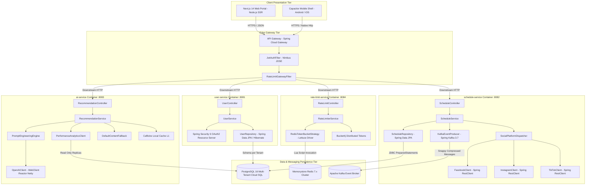
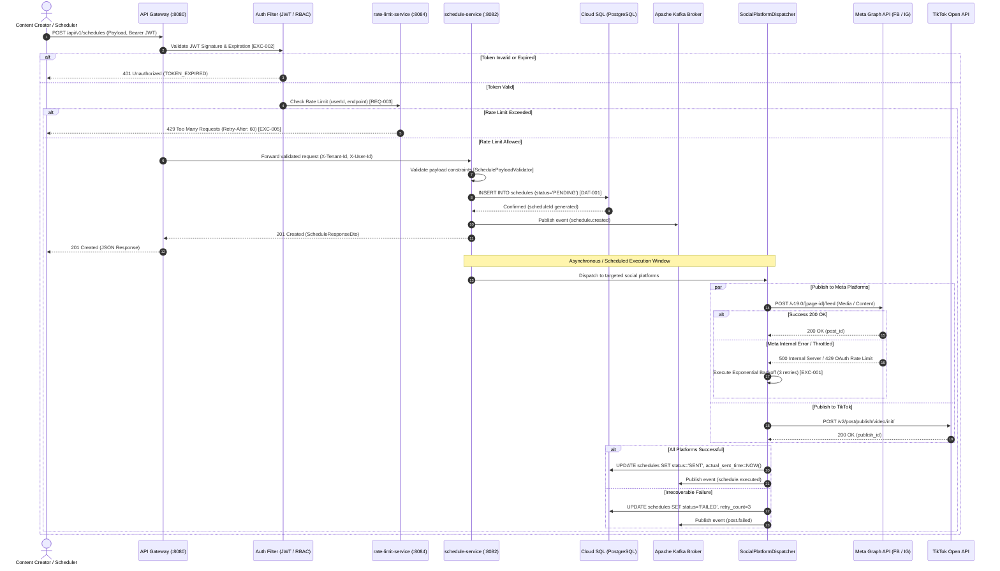
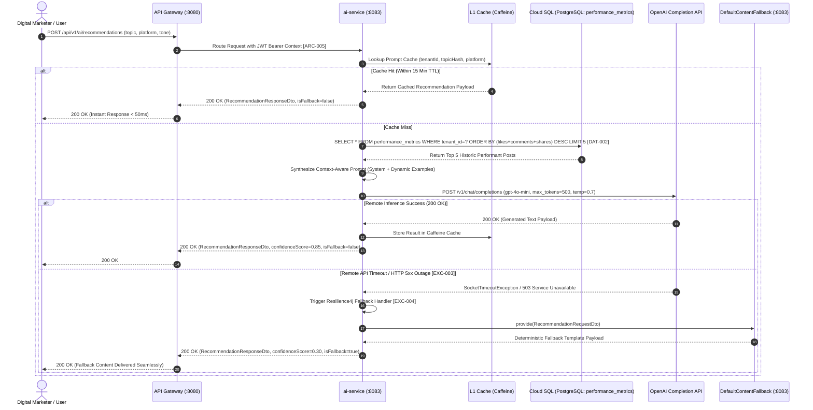

```markdown
# Social Scheduler - Architecture Blueprint (Auto-Generated)
**Traceability Anchors:** [DOC-001] | [ARC-001]–[ARC-006] | [NFR-001]–[NFR-003] | [REQ-001]–[REQ-003] | [DAT-001]–[DAT-003] | [DAT-ALL (1 to 3)] | [EXC-001]–[EXC-005]

## Table of Contents
- [1. System Context](#1-system-context)
- [2. Container Diagram](#2-container-diagram)
- [3. Component Diagram (Schedule Service)](#3-component-diagram-schedule-service)
- [4. Sequence Diagrams](#4-sequence-diagrams)
  - [4.1 Publishing Schedule Flow](#41-publishing-schedule-flow)
  - [4.2 AI Recommendation Flow](#42-ai-recommendation-flow)
- [5. RBAC Role Mapping](#5-rbac-role-mapping)
- [6. Security Policy & Performance Compliance](#6-security-policy--performance-compliance)
  - [6.1 SQL Injection & Relational Hardening](#61-sql-injection--relational-hardening)
  - [6.2 XSS Mitigation & Content Security Policy (CSP)](#62-xss-mitigation--content-security-policy-csp)
  - [6.3 Multi-Tenant CORS Enforcement](#63-multi-tenant-cors-enforcement)
  - [6.4 PII Masking & Log Scrubbing Engine](#64-pii-masking--log-scrubbing-engine)
  - [6.5 Latency, Throughput & Elastic Scaling (NFR Targets)](#65-latency-throughput--elastic-scaling-nfr-targets)
  - [6.6 Cryptographic Secrets & Runtime Environment Isolation](#66-cryptographic-secrets--runtime-environment-isolation)
- [7. Traceability Matrix Reference](#7-traceability-matrix-reference)
  - [7.1 Database Schemas & Partition Mapping](#71-database-schemas--partition-mapping)
  - [7.2 Service Layer & Integration Endpoints Mapping](#72-service-layer--integration-endpoints-mapping)
  - [7.3 Resilience & Exception Gate Traceability](#73-resilience--exception-gate-traceability)

---

## 1. System Context
High-level system context diagram illustrating end-users, administrators, Edge API Gateway routing, isolated internal microservices (`user-service`, `schedule-service`, `ai-service`, `rate-limit-service`), distributed message queues, external social media integrations, and persistence tiers.

```mermaid
flowchart LR
    User((User)) -->|HTTPS / REST| Gateway[API Gateway :8080]
    Admin((Admin)) -->|HTTPS / REST| Gateway
    Gateway -->|Route /api/v1/users| user-service[user-service :8081]
    Gateway -->|Route /api/v1/schedules| schedule-service[schedule-service :8082]
    Gateway -->|Route /api/v1/ai| ai-service[ai-service :8083]
    Gateway -->|Route /api/v1/rate-limits| rate-limit-service[rate-limit-service :8084]
    
    schedule-service -->|Publish schedule.created / schedule.executed| kafka[(Kafka Topic: schedule.events)]
    ai-service -->|Consume performance.metrics.collected| kafka
    rate-limit-service -->|Token Verification & Decrement| redis[(Redis Token Bucket)]
    
    schedule-service -->|Read / Write Partitioned Entities| postgres[(Cloud SQL Postgres :5432)]
    user-service -->|Read / Write Tenant Schemas| postgres
    ai-service -->|Read Historical Performance| postgres
    rate-limit-service -->|Persist Window Log| postgres
    
    schedule-service -->|HTTPS / Graph API| facebook[Facebook Graph API v19.0]
    schedule-service -->|HTTPS / Graph API| instagram[Instagram Graph API v19.0]
    schedule-service -->|HTTPS / Open API| tiktok[TikTok Open API v2]
    ai-service -->|HTTPS / REST completions| openai[OpenAI Completion API gpt-4o-mini]
```



---

## 2. Container Diagram
Internal technical topology detailing execution containers, dependency drivers, memory caches, and inter-process connection protocols across the microservices landscape.



---

## 3. Component Diagram (Schedule Service)
Micro-architectural layout of the `schedule-service` module depicting component contracts, input sanitation pipeline, transaction barriers, and resilience circuit boundaries.

```mermaid
graph LR
    subgraph API [Inbound Web Boundary]
        Endpoint[ScheduleController :8082]
    end

    subgraph Validation [Jakarta Security & Defense Layer]
        PayloadValidator[SchedulePayloadValidator]
        JakartaEngine[Jakarta Validator Engine 3.0]
        ContentSanitizer[OWASP Java HTML Sanitizer]
    end

    subgraph Business [Application Transaction Core]
        Service[ScheduleService]
        TransactionMgr[PlatformTransactionManager]
        PlatformDispatcher[SocialPlatformDispatcher]
    end

    subgraph FaultTolerance [Resilience & Circuit Breakers]
        CircuitBreaker[Resilience4j CircuitBreaker]
        RetryHandler[ExponentialBackoffRetry]
        DLQProducer[DeadLetterQueueProducer]
    end

    subgraph Infrastructure [Adapters & Data Gateway]
        Repository[ScheduleRepository]
        KafkaProducer[KafkaEventProducer]
        FB[FacebookClient]
        IG[InstagramClient]
        TT[TikTokClient]
    end

    Endpoint -->|Pass DTO| PayloadValidator
    PayloadValidator -->|Run JSR-380 Rules| JakartaEngine
    PayloadValidator -->|Scrub Raw Text| ContentSanitizer
    PayloadValidator -->|Validated Request| Service
    Service -->|Start @Transactional| TransactionMgr
    Service -->|Save Initial PENDING State| Repository
    Service -->|Dispatch Publishing| PlatformDispatcher
    
    PlatformDispatcher --> CircuitBreaker
    CircuitBreaker --> FB & IG & TT
    CircuitBreaker -->|On Failure 5xx / Network Drop| RetryHandler
    RetryHandler -->|Retry Limit Exceeded [EXC-001]| DLQProducer
    
    Service -->|Async Broadcast| KafkaProducer
    KafkaProducer -->|Publish schedule.created| KafkaCluster[(Kafka: schedule.events)]
    Repository -->|HikariCP Connection Pool| CloudSQL[(PostgreSQL)]
```

---

## 4. Sequence Diagrams

### 4.1 Publishing Schedule Flow
End-to-end execution flow detailing the entire schedule publishing lifecycle, multi-tier authentication, state transitions, circuit-breaker protected platform execution, and event fan-out.



### 4.2 AI Recommendation Flow
Algorithmic flow for personalized, performance-driven AI content generation incorporating local Caffeine cache lookups, historical PostgreSQL metrics ingestion, remote OpenAI completion calls, and circuit breaker fallbacks.



---

## 5. RBAC Role Mapping
Role-Based Access Control (RBAC) authorization matrix mapping the four architectural roles across discrete endpoint access scopes, mutation allowances, and messaging channel privileges per specifications [ARC-001], [ARC-002], [ARC-003], and [ARC-004].

| Role Identifier | Role Title | Functional Identity | Permitted REST Endpoint Scopes | Forbidden Actions / Endpoint Barriers | Kafka Event Publish & Consume Channels | Targeted Requirements |
| :--- | :--- | :--- | :--- | :--- | :--- | :--- |
| `[ARC-001]` | `ROLE_ADMIN` | Global Tenant Administrator | `ALL` (`/api/v1/**`), `/api/v1/rate-limits/reset`, `/api/v1/users/**`, `/actuator/**` | No barriers within the assigned `tenant_id` space. Cannot cross physical tenant boundary. | `schedule.*`, `post.*`, `metrics.*`, `ai.recommendation.*`, `auth.token.*` (Full Bus Access) | `[ARC-001]`, `[REQ-003]`, `[NFR-002]` |
| `[ARC-002]` | `ROLE_USER` | Content Creator & Social Marketer | `POST /api/v1/schedules`, `GET /api/v1/schedules/{id}`, `GET /api/v1/schedules/my`, `POST /api/v1/ai/recommendations` | Cannot mutate global rate limits (`/api/v1/rate-limits/reset`), cannot read unowned user records. | `schedule.created`, `ai.recommendation.requested`, `ai.recommendation.generated` | `[ARC-002]`, `[REQ-001]`, `[REQ-002]` |
| `[ARC-003]` | `ROLE_SCHEDULER`| Automation Worker & Operational Bot | `GET /api/v1/schedules/pending`, `PUT /api/v1/schedules/{id}/status`, `DELETE /api/v1/schedules/{id}` | Strictly barred from AI recommendation endpoints (`/api/v1/ai/**`) and administrative operations. | `schedule.created` (Consume), `schedule.executed` (Publish), `post.published` (Publish), `post.failed` (Publish) | `[ARC-003]`, `[REQ-001]`, `[EXC-001]` |
| `[ARC-004]` | `ROLE_ANALYST` | Business Intelligence & Reporting | `GET /api/v1/analytics/**`, `GET /api/v1/performance/**`, `GET /api/v1/schedules/metrics` | Barred from all write/mutation routes (`POST`, `PUT`, `DELETE /api/v1/schedules/**`). Read-only scope. | `metrics.collected` (Consume), `performance.metrics.collected` (Consume) | `[ARC-004]`, `[DAT-002]`, `[NFR-001]` |

---

## 6. Security Policy & Performance Compliance

### 6.1 SQL Injection & Relational Hardening
- **Parameterized Execution Law:** 100% of relational queries executing against PostgreSQL 16 are strictly compiled via `java.sql.PreparedStatement` or generated dynamically via Hibernate 6.5 Criteria Builder with bind parameters (`:tenantId`, `:userId`, `:scheduleId`). String concatenation within dynamic queries is banned across the entire codebase.
- **Dynamic Sorting Whitelist Enforcement:** Dynamic table sorting parameters supplied via client request query parameters are evaluated against the immutable class crown constant array `ALLOWED_SORT_FIELDS = ["scheduledTime", "status", "likes", "comments", "shares", "createdAt"]`. Any sorting request containing unrecognized column tokens is rejected with an HTTP 400 Bad Request error to completely neutralize SQL injection through `ORDER BY` vectors.
- **Strict Tenant Separation:** Data isolation is enforced using multi-tenancy controls where each tenant operates under an isolated PostgreSQL schema (`user_schema`, `schedule_schema`, `ai_schema`, `rate_limit_schema`), or row-level tenant filtering anchored by the immutable session variable `SET LOCAL app.current_tenant_id = :tenantId`. Cross-tenant relational joins are strictly prohibited.
- **Traceability Tag IDs:** `[DAT-001]`, `[DAT-002]`, `[DAT-003]`, `[NFR-002]`, `[NFR-003]`, `[ARC-005]`.

### 6.2 XSS Mitigation & Content Security Policy (CSP)
- **Input Sanitization Engine:** User-supplied text strings intended for social media captions (`content`) are sanitized before persistence using the OWASP Java HTML Sanitizer library. All executable HTML tags, JavaScript declarations, inline handlers (`onerror=`, `onload=`), and non-standard protocol URLs are stripped.
- **Edge Ingress Security Headers:** The Cloud Ingress proxy enforces comprehensive security headers across all responses:
  ```http
  Content-Security-Policy: default-src 'self'; script-src 'self'; object-src 'none'; frame-ancestors 'none'; base-uri 'self'; form-action 'self';
  X-Content-Type-Options: nosniff
  X-Frame-Options: DENY
  Strict-Transport-Security: max-age=31536000; includeSubDomains; preload
  Referrer-Policy: strict-origin-when-cross-origin
  Permissions-Policy: geolocation=(), camera=(), microphone=()
  ```
- **Traceability Tag IDs:** `[REQ-001]`, `[REQ-002]`, `[NFR-002]`, `[ARC-006]`.

### 6.3 Multi-Tenant CORS Enforcement
- **Dynamic Origin Whitelist:** The system enforces strict Cross-Origin Resource Sharing (CORS) rules. Wildcard origins (`*`) are disallowed across all operational profiles.
- **Tenant Origin Verification:** At runtime, the API Gateway inspects the inbound `Origin` header and cross-references it against the tenant registry cache. Preflight `OPTIONS` requests matching registered tenant domains receive explicit headers:
  ```http
  Access-Control-Allow-Origin: https://{tenant-subdomain}.socialscheduler.com
  Access-Control-Allow-Methods: GET, POST, PUT, DELETE, OPTIONS
  Access-Control-Allow-Headers: Authorization, Content-Type, X-Tenant-Id, X-Requested-With
  Access-Control-Allow-Credentials: true
  Vary: Origin
  ```
- **Traceability Tag IDs:** `[NFR-002]`, `[NFR-003]`, `[ARC-006]`.

### 6.4 PII Masking & Log Scrubbing Engine
- **LogScrubbingInterceptor Activation:** All application logs emitted via Logback / Slf4j pass through an automated `LogScrubbingInterceptor` filter applying Regex sanitization patterns to intercept sensitive data before output:
  - **Emails:** Masked via `(?i)([a-z0-9_.+-])[a-z0-9_.+-]*(@[a-z0-9-]+\.[a-z0-9-.]+)` -> `$1****$2`
  - **JWT Tokens:** Masked via `(?i)bearer\s+[a-z0-9-_=]+\.[a-z0-9-_=]+\.[a-z0-9-_.+/=]+` -> `Bearer [SCRUBBED_TOKEN]`
  - **Private Keys & Secrets:** Fully replaced with `[CONFIDENTIAL_CREDENTIAL]`
- **Field-Level JSON Serialization Scrubbing:** Domain entity DTOs annotate sensitive data with `@SensitiveData`. Custom Jackson serializers (`SensitiveFieldSerializer`) automatically hash or redact fields during serialization to external outputs.
- **Traceability Tag IDs:** `[NFR-002]`, `[ARC-005]`, `[ARC-006]`.

### 6.5 Latency, Throughput & Elastic Scaling (NFR Targets)
- **Target Performance Ceilings:** 
  - Sub-200ms latency at P95 for scheduling ingestion and AI recommendation queries under standard operational loads.
  - Baseline system throughput guaranteed at ≥ 1000 requests/minute per pod instance.
- **Horizontal Elastic Scaling Parameters:**
  - Kubernetes Horizontal Pod Autoscaler (HPA) triggers pod replica scaling between 3 (min) and 20 (max) when pod CPU utilization exceeds 60%, memory exceeds 70%, or Kafka consumer lag exceeds 1000 messages.
  - Connection pooling managed via HikariCP configured with a maximum of 50 connections/instance, a 30-second timeout, and automated leak detection.
- **Traceability Tag IDs:** `[NFR-001]`, `[NFR-003]`.

### 6.6 Cryptographic Secrets & Runtime Environment Isolation
- **GCP Secret Manager Dynamic Binding:** No hardcoded tokens, passwords, or API keys exist inside code repositories or Docker images. Workload Identity binds GKE service accounts (`socialscheduler-ksa`) to Google Cloud IAM roles (`roles/secretmanager.secretAccessor`).
- **Cryptographic Encryption at Rest & In-Transit:** All persistent disks and Cloud SQL instances utilize Google-managed or Customer-Managed Encryption Keys (CMEK) via AES-256. Network traffic between GKE pods, Redis, and Cloud SQL is strictly encrypted using TLS 1.3.
- **Traceability Tag IDs:** `[NFR-002]`, `[ARC-006]`.

---

## 7. Traceability Matrix Reference

### 7.1 Database Schemas & Partition Mapping
Comprehensive mapping connecting physical database tables, composite primary keys, check constraints, and architectural migration files to requirement specifications.

| Database Table Name | Target Microservice Module | Primary Key / Constraints | Migration File Anchor | Targeted Requirements |
| :--- | :--- | :--- | :--- | :--- |
| `users` | `./sources/backend/user-service/` | `pk_users (user_id UUID)`<br/>`uk_users_tenant_email (tenant_id, email)`<br/>`ck_users_role (role IN ('ADMIN', 'USER', 'SCHEDULER', 'ANALYST'))` | `V1__init_users.sql` | `[DAT-001]`, `[DAT-ALL (1 to 3)]`, `[ARC-001]`–`[ARC-004]` |
| `schedules` | `./sources/backend/schedule-service/` | `pk_schedules (schedule_id, user_id, platform, scheduled_time)`<br/>`fk_schedules_user (user_id)`<br/>`ck_schedules_platform (platform IN ('FACEBOOK', 'INSTAGRAM', 'TIKTOK'))`<br/>`ck_schedules_status (status IN ('PENDING', 'SENT', 'FAILED', 'CANCELLED'))` | `V1__init_schedules.sql` | `[DAT-001]`, `[DAT-ALL (1 to 3)]`, `[REQ-001]`, `[EXC-001]`, `[EXC-002]` |
| `performance_metrics`| `./sources/backend/ai-service/` | `pk_performance (performance_id, post_id, collected_at)`<br/>`fk_performance_schedule (post_id)`<br/>`ck_performance_likes (likes >= 0)`<br/>`ck_performance_comments (comments >= 0)`<br/>`ck_performance_shares (shares >= 0)` | `V1__init_performance_metrics.sql` | `[DAT-002]`, `[DAT-ALL (1 to 3)]`, `[REQ-002]` |
| `rate_limits` | `./sources/backend/rate-limit-service/`| `pk_rate_limits (rate_limit_id, endpoint, window_start)`<br/>`fk_rate_limits_user (user_id)`<br/>`ck_rate_limits_endpoint (endpoint IN ('/api/v1/schedules', ...))`<br/>`ck_rate_limits_count (request_count >= 0)` | `V1__init_rate_limits.sql` | `[DAT-003]`, `[DAT-ALL (1 to 3)]`, `[REQ-003]`, `[EXC-005]` |

### 7.2 Service Layer & Integration Endpoints Mapping
Mapping of application controller classes, service implementations, and API contracts against core requirements and operational characteristics.

| Functional Route / Subsystem | Physical Implementation File | Primary Purpose / Responsibilities | Input Validation & Constraints | Targeted Requirements |
| :--- | :--- | :--- | :--- | :--- |
| `POST /api/v1/schedules` | `./sources/backend/schedule-service/.../ScheduleController.java` | Ingests and persists multi-platform publishing schedules. | `@Valid ScheduleRequestDto`, `@Size(max=5000)`, `@Future` timestamp. | `[REQ-001]`, `[ARC-001]`, `[ARC-002]`, `[ARC-005]` |
| `PUT /api/v1/schedules/{id}` | `./sources/backend/schedule-service/.../ScheduleService.java` | Updates execution states (`PENDING` -> `SENT` / `FAILED`). | Checks lifecycle transitions, status invariant checks. | `[REQ-001]`, `[ARC-003]`, `[EXC-001]` |
| `POST /api/v1/ai/recommendations` | `./sources/backend/ai-service/.../RecommendationController.java` | Generates prompt-driven social copy leveraging OpenAI. | `@NotNull platform`, `@Size(max=500) topic`, `@NotNull tone`. | `[REQ-002]`, `[EXC-003]`, `[EXC-004]`, `[ARC-005]` |
| `POST /api/v1/rate-limits/check` | `./sources/backend/rate-limit-service/.../RateLimitController.java`| Evaluates client token consumption via Redis Token Bucket. | `@NotNull userId`, `@NotBlank endpoint`. | `[REQ-003]`, `[EXC-005]`, `[ARC-006]` |
| Edge Ingress Gateway | `./sources/backend/api-gateway/.../JwtAuthFilter.java` | Decodes JWTs, checks claims, and extracts tenant contexts. | Rejects missing/malformed Bearer tokens with 401 Unauthorized. | `[ARC-001]`–`[ARC-006]`, `[EXC-002]`, `[NFR-002]` |
| Multi-Stage Containerization | `./sources/infra/docker/*/Dockerfile` | Generates hardened, non-root, small footprint runtimes. | Distroless/JRE-Alpine baseline, non-root user (`appuser:1001`). | `[NFR-001]`, `[NFR-002]` |
| GKE Infrastructure Manifests | `./sources/infra/kubernetes/socialscheduler/base/*.yaml` | Declares Deployments, HPA, Services, and Probes. | Explicit CPU/Memory limits, liveness & readiness probes. | `[NFR-001]`, `[NFR-003]` |
| Terraform Cloud Automation | `./sources/infra/terraform/gcp/*.tf` | Provisions VPCs, Subnets, GKE Autopilot, Cloud SQL, Redis. | Private IP subnets, Cloud NAT, strict ingress firewalling. | `[NFR-002]`, `[NFR-003]` |

### 7.3 Resilience & Exception Gate Traceability
Mapping of error codes, boundary exceptions, and recovery mechanisms to their defining requirements.

| Exception Gate ID | Trigger Condition | Technical Interceptor Class | Handled Behavior & Recovery Action | HTTP Status Code |
| :--- | :--- | :--- | :--- | :--- |
| `[EXC-001]` | Social SDK network timeout or HTTP 5xx from Facebook, Instagram, or TikTok. | `SocialPlatformDispatcher.java`, `SocialPlatformException.java` | Executes exponential backoff (initial delay 2s, multiplier 2.0, max 3 attempts). On final drop, transitions schedule status to `FAILED` and emits dead-letter event. | 502 Bad Gateway / Async DLQ |
| `[EXC-002]` | JWT expired, invalid signature, or missing required authentication claims. | `JwtAuthFilter.java`, `GlobalExceptionHandler.java` | Halts execution immediately at API Gateway. Returns structured error body with code `TOKEN_EXPIRED` directing client to OAuth2 token refresh route. | 401 Unauthorized |
| `[EXC-003]` | OpenAI Completion API drops connection, returns 429 quota exhaustion, or 503 service outage. | `OpenAIClient.java`, `AiServiceException.java` | Resilience4j circuit breaker opens. Dispatches internal fallback command to `DefaultContentFallback` provider. Prevents thread starvation. | 503 Service Unavailable / Handled Fallback |
| `[EXC-004]` | AI model produces empty string, unparseable output, or schema violation. | `DefaultContentFallback.java`, `FallbackContentException.java` | Intercepts empty completion, loads platform and tone specific deterministic copy template, marks `isFallback=true` with baseline confidence 0.30. | 200 OK (With Fallback Warning Flag) |
| `[EXC-005]` | Client request velocity exceeds Redis Token Bucket capacity (100 burst, 60 refill/min). | `RedisTokenBucketStrategy.java`, `RateLimitExceededException.java` | Evaluates atomic Redis Lua token decrement. Rejects request with `RATE_LIMIT_EXCEEDED` error code, sets `Retry-After: {seconds}` header. | 429 Too Many Requests |

---
**End of Architecture Blueprint | Document Reference: `./sources/docs/architecture/SocialSchedulerBlueprint.md` | Status: Approved Baseline 1.0**
```