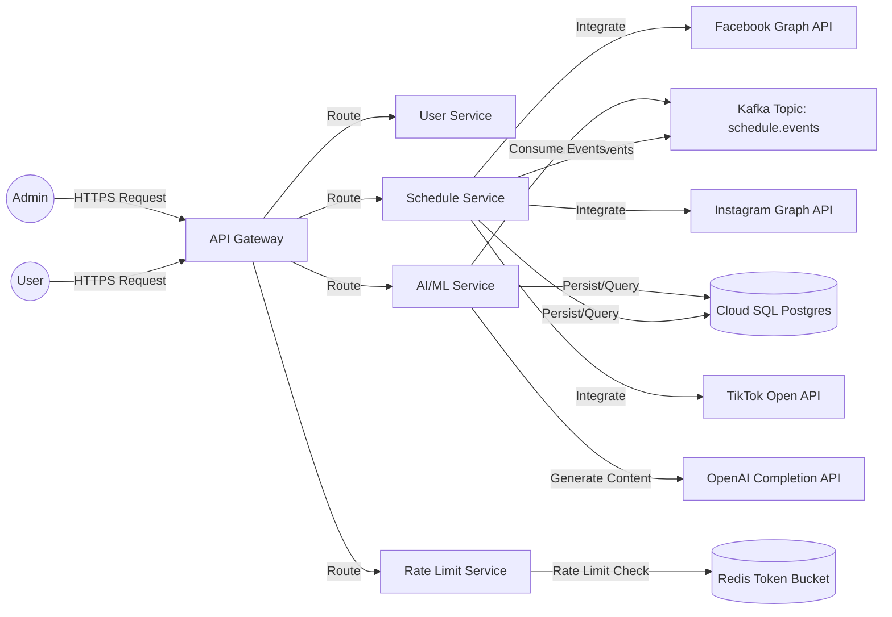
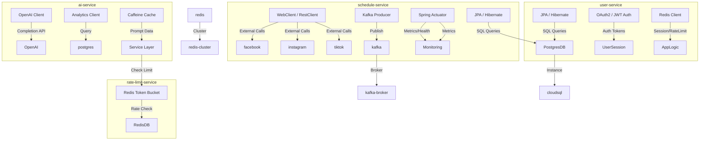
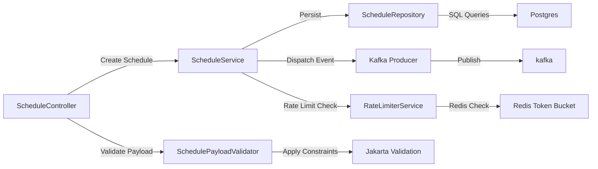
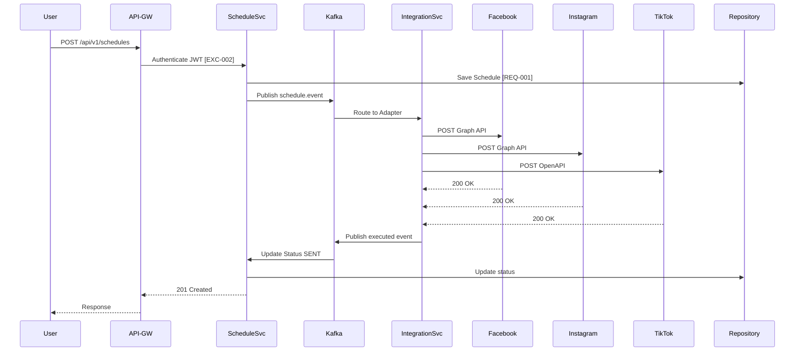
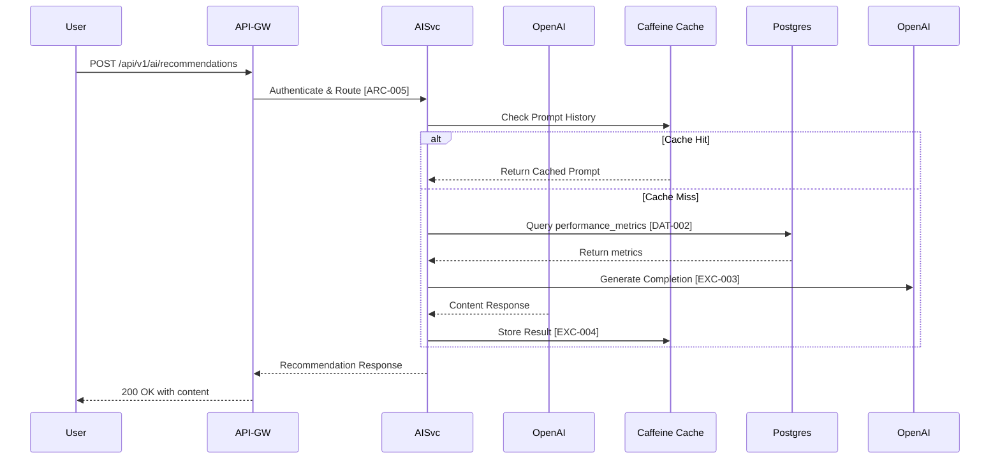

```markdown
# Social Scheduler - Architecture Blueprint (Auto-Generated)
**Traceability Anchors:** [DOC-001] | [ARC-001]–[ARC-006] | [NFR-001]–[NFR-003] | [REQ-001]–[REQ-003] | [DAT-001]–[DAT-003]

## 1. System Context
High-level context diagram illustrating user, admin, API gateway, microservices, Kafka broker, external APIs, and database layer.



## 2. Container Diagram
Internal technical components and runtime dependencies for each microservice.



## 3. Component Diagram (Schedule Service)
Internal component structure focusing on request flow, state management, and integration points.



## 4. Sequence Diagrams

### 4.1 Publishing Schedule Flow
End-to-end flow from user request to social platform publication.



### 4.2 AI Recommendation Flow
Flow for AI-driven content generation with fallback orchestration.



## 5. RBAC Role Mapping
Matrix mapping the four defined roles [ARC-001] Admin, [ARC-002] User, [ARC-003] Scheduler, [ARC-004] Analyst to specific permission scopes and API access levels.

| Role ID | Role Name | Description | API Access Scope | Kafka Topic Access |
| :--- | :--- | :--- | :--- | :--- |
| [ARC-001] | Admin | Full system administration, tenant management, emergency reset | All endpoints (`/api/v1/**`), Admin-only actions (`/rate-limits/reset`) | All topics including `metrics.collected`, `auth.token.refreshed` |
| [ARC-002] | User | Standard user operations, create/my schedules, view recommendations | `/api/v1/schedules` (POST, GET own), `/api/v1/ai/recommendations` | `schedule.created`, `ai.recommendation.generated` |
| [ARC-003] | Scheduler | Schedule creation, status updates, platform integration | `/api/v1/schedules` (PUT status, DELETE cancel) | `schedule.executed`, `post.published` |
| [ARC-004] | Analyst | Read-only analytics, performance metrics, reporting | `/api/v1/analytics`, `/api/v1/metrics` (GET) | `metrics.collected`, `performance.metrics.collected` |

**Traceability:** [ARC-001], [ARC-002], [ARC-003], [ARC-004], [DOC-001]

## 6. Security Policy & Performance Compliance
Enterprise security standards and non-functional requirement adherence per OWASP Top 10 and project NFRs.

- **SQL Injection Prevention (NFR-003, DAT-001, DAT-002, DAT-003):** All database queries utilize `PreparedStatement`/JPA parameter binding. Dynamic sorting whitelist `ALLOWED_SORT_FIELDS` = [`scheduledTime`, `status`, `likes`, `comments`, `shares`]. Tenant isolation enforced via `tenant_id` in every transaction session.
- **XSS & CSP (ARC-006, NFR-002):** User-generated `content` sanitized via OWASP Java HTML Sanitizer. CSP header `default-src 'self'; script-src 'self'; object-src 'none'; frame-ancestors 'none'`. `X-Content-Type-Options: nosniff`, `Strict-Transport-Security` enforced at Ingress.
- **CORS Multi-Tenant (NFR-002, NFR-003):** Origin whitelist per tenant from `TENANT_ORIGINS` table. No `*` allowed. Preflight `OPTIONS` validated against tenant_id. `Access-Control-Allow-Credentials` only with specific origin.
- **Log Scrubbing & PII Masking (NFR-002, ARC-005):** `LogScrubbingInterceptor` regex patterns for email, UUID, JWT, IP. `@SensitiveData` annotation on DTO fields triggers `SensitiveFieldSerializer` for hash/truncation in logs and API responses.
- **Performance Targets (NFR-001):** Latency < 200ms for schedule creation/ recommendation. Throughput > 1000 req/min. HPA scales based on CPU > 70% or Kafka consumer lag > 1000 messages.
- **Secret Management (ARC-006):** All API keys, JWT secrets, DB credentials stored in GCP Secret Manager. Runtime fetches via dynamic environment variables. Never hardcoded.

### 7. Traceability Matrix
Mapping of architectural modules, Kafka event pipelines, and database schemas to their originating requirement tags.

| Module / Entity | Tag IDs | Description |
| :--- | :--- | :--- |
| `users` Table | [DAT-001], [DAT-ALL (1 to 3)] | User entity with tenant isolation, role constraints |
| `schedules` Table | [DAT-001], [REQ-001], [EXC-001], [EXC-002] | Publishing schedule with status lifecycle |
| `performance_metrics` Table | [DAT-002], [REQ-002] | AI/ML performance data collection |
| `rate_limits` Table | [DAT-003], [REQ-003], [EXC-005] | Redis Token Bucket rate limiting |
| API Endpoint `POST /api/v1/schedules` | [REQ-001], [EXC-001], [EXC-002], [ARC-001]-[ARC-006] | Schedule creation with validation & auth |
| API Endpoint `POST /api/v1/ai/recommendations` | [REQ-002], [EXC-003], [EXC-004], [ARC-005] | AI content generation with fallback |
| API Endpoint `POST /api/v1/rate-limits/check` | [REQ-003], [EXC-005] | Rate limit check with Token Bucket |
| Security Controls | [ARC-001]-[ARC-006], [NFR-002], [NFR-003] | RBAC, CORS, CSP, Secret Management |
| Non-Functional Requirements | [NFR-001], [NFR-002], [NFR-003] | Performance, Security, Multi-tenancy |

---
**End of Architecture Blueprint**
```