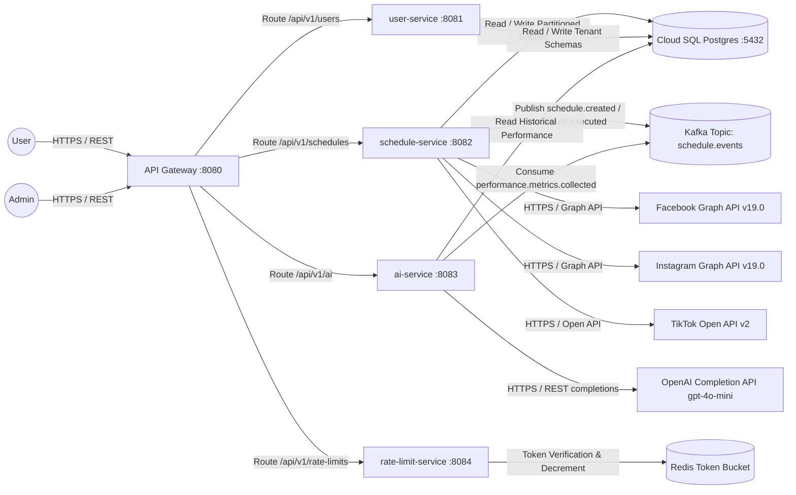

```markdown
# Social Scheduler - Architecture Blueprint (Auto-Generated & Incremental Update)
**Traceability Anchors:** [DOC-001] | [ARC-001]–[ARC-006] | [NFR-001]–[NFR-003] | [REQ-001]–[REQ-003] | [DAT-001]–[DAT-003] | [DAT-ALL (1 to 3)] | [EXC-001]–[EXC-005]

## Table of Contents
- [1. System Context](#1-system-context)
- [2. Container Diagram](#2-container-diagram)
- [3. Component Diagram (Schedule Service)](#3-component-diagram-schedule-service)
- [4. Sequence Diagrams](#4-sequence-diagrams)
  - [4.1 Publishing Schedule Flow](#41-publishing-schedule-flow)
  - [4.2 AI Recommendation Flow](#42-ai-recommendation-flow)
- [5. RBAC Role Mapping](#5-rbac-role-mapping)
- [6. Security Policy & Performance Compliance](#6-security-policy--performance-compliance)
  - [6.1 SQL Injection & Relational Hardening](#61-sql-injection--relational-hardening)
  - [6.2 XSS Mitigation & Content Security Policy (CSP)](#62-xss-mitigation--content-security-policy-csp)
  - [6.3 Multi-Tenant CORS Enforcement](#63-multi-tenant-cors-enforcement)
  - [6.4 PII Masking & Log Scrubbing Engine](#64-pii-masking--log-scrubbing-engine)
  - [6.5 Latency, Throughput & Elastic Scaling (NFR Targets)](#65-latency-throughput--elastic-scaling-nfr-targets)
  - [6.6 Cryptographic Secrets & Runtime Environment Isolation](#66-cryptographic-secrets--runtime-environment-isolation)
- [7. Traceability Matrix Reference](#7-traceability-matrix-reference)
  - [7.1. Database Schemas & Partition Mapping](#71-database-schemas--partition-mapping)
  - [7.2 Service Layer & Integration Endpoints Mapping](#72-service-layer--integration-endpoints-mapping)
  - [7.3 Resilience & Exception Gate Traceability](#73-resilience--exception-gate-traceability)
- [8. DevOps Operational Runbook & CI/CD Pipeline Integration](#8-devops-operational-runbook--cicd-pipeline-integration)
  - [8.1 Multi-Stage Containerization Architecture](#81-multi-stage-containerization-architecture)
  - [8.2 Terraform Infrastructure as Code (GCP & GKE)](#82-terraform-infrastructure-as-code-gcp--gke)
  - [8.3 Kubernetes Production Manifests & Autoscaling](#83-kubernetes-production-manifests--autoscaling)
  - [8.4 Prometheus & Grafana Observability Framework](#84-prometheus--grafana-observability-framework)
  - [8.5 Automated GitHub Actions CI/CD Pipeline Architecture](#85-automated-github-actions-cicd-pipeline-architecture)

---

## 1. System Context
High-level system context diagram illustrating end-users, administrators, Edge API Gateway routing, isolated internal microservices (`user-service`, `schedule-service`, `ai-service`, `rate-limit-service`), distributed message queues, external social media integrations, and persistence tiers.



---

## 2. Container Diagram
Internal technical topology detailing execution containers, dependency drivers, memory caches, and inter-process connection protocols across the microservices landscape.

```mermaid
graph TD
    subgraph Client