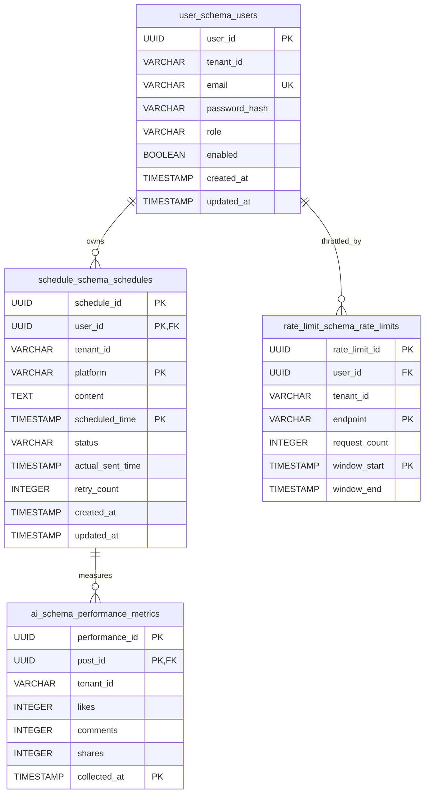

```markdown
# Database Migration, Versioning & Schema Catalog Runbook

## 📑 1. Introduction & Executive Summary

This document serves as the authoritative technical runbook and architectural catalog for the database migration, versioning strategy, and schema topology of the **social-scheduler** enterprise platform. Designed under a high-throughput, event-driven microservices architecture, the persistence layer relies on PostgreSQL 15+ partitioned and isolated via a strict **schema-per-tenant bounded context pattern** [DAT-001], [DAT-002], [DAT-003], [DAT-ALL (1 to 3)]. 

Database migrations are fully automated, version-controlled, and immutable through **Flyway 10.x**, ensuring deterministic schema state evolution across all deployment environments (Local, Staging, Production GKE). This runbook details the schema definitions, relational constraints, indexing profiles, execution runbooks for Flyway migrations, and the strict traceability matrix binding persistence assets to enterprise non-functional and functional requirements.

---

## 📑 2. Table of Contents

1. [Introduction & Executive Summary](#1-introduction--executive-summary)
2. [Traceability Matrix Reference](#2-traceability-matrix-reference)
3. [Multi-Tenancy & Schema-per-Tenant Strategy](#3-multi-tenancy--schema-per-tenant-strategy)
4. [Core Entity Database Schemas](#4-core-entity-database-schemas)
   - [4.1. User Service Schema (`user_schema.users`)](#41-user-service-schema-userschemausers)
   - [4.2. Schedule Service Schema (`schedule_schema.schedules`)](#42-schedule-service-schema-scheduleschedulerschedules)
   - [4.3. AI Service Schema (`ai_schema.performance_metrics`)](#43-ai-service-schema-aischemaperformance_metrics)
   - [4.4. Rate Limit Service Schema (`rate_limit_schema.rate_limits`)](#44-rate-limit-service-schema-ratelimitschemarate_limits)
5. [Entity-Relationship (ER) Architecture Diagram](#5-entity-relationship-er-architecture-diagram)
6. [Flyway Database Migration Runbook](#6-flyway-database-migration-runbook)
   - [6.1. Migration Execution Lifecycle](#61-migration-execution-lifecycle)
   - [6.2. Rollback & Troubleshooting Protocol](#62-rollback--troubleshooting-protocol)

---

## 📑 3. Traceability Matrix Reference

Every persistence artifact, Flyway migration script, and structural schema designed within this document maps directly to the system's global requirement identifiers. The following matrix guarantees absolute auditing compliance.

| Architectural Component / Schema | Target Physical Path | Associated Traceability Tag IDs | Compliance Scope & Purpose |
| :--- | :--- | :--- | :--- |
| **User Schema & Migration** | `./sources/backend/user-service/src/main/resources/db/migration/V1__init_users.sql` | `[DAT-001]`, `[DAT-ALL (1 to 3)]` | Tenant isolation, user identity storage, and role-based access control persistence. |
| **Schedule Schema & Migration** | `./sources/backend/schedule-service/src/main/resources/db/migration/V1__init_schedules.sql` | `[DAT-001]`, `[DAT-ALL (1 to 3)]` | Multi-platform post scheduling lifecycle management (`PENDING`, `SENT`, `FAILED`, `CANCELLED`). |
| **Performance Metrics Schema** | `./sources/backend/ai-service/src/main/resources/db/migration/V1__init_performance_metrics.sql` | `[DAT-002]`, `[DAT-ALL (1 to 3)]` | Historical engagement metrics collection to drive OpenAI content generation prompts. |
| **Rate Limits Schema** | `./sources/backend/rate-limit-service/src/main/resources/db/migration/V1__init_rate_limits.sql` | `[DAT-003]`, `[DAT-ALL (1 to 3)]` | Persistent audit and fallback tracking for Redis Token Bucket rate-limiting policies. |

---

## 📑 4. Multi-Tenancy & Schema-per-Tenant Strategy

To enforce absolute data privacy and security compliance across multiple organizational tenants, the persistence architecture implements a **Schema-per-Tenant** isolation model combined with logical partitioning [DAT-001], [DAT-002], [DAT-003]. 

- **Bounded Context Isolation:** Each microservice (`user-service`, `schedule-service`, `ai-service`, `rate-limit-service`) owns an independent PostgreSQL schema (`user_schema`, `schedule_schema`, `ai_schema`, `rate_limit_schema` respectively). Cross-schema queries are strictly prohibited at the application tier; inter-service communication must occur exclusively via RESTful contracts or Apache Kafka event streams.
- **Tenant Context Propagation:** Incoming API requests carry the tenant identifier via the HTTP header `X-Tenant-Id`. The API Gateway and downstream services intercept this header, binding it to the current Hibernate session and setting the PostgreSQL search path dynamically (e.g., `SET search_path TO user_schema, public;`).
- **Data Integrity & Foreign Keys:** Referential integrity is strictly maintained within bounded contexts. Cross-service foreign keys (e.g., `performance_metrics.post_id` referencing `schedules.schedule_id`) are enforced when services share a database cluster, or validated via distributed saga patterns when physical database segregation is applied.

---

## 📑 5. Core Entity Database Schemas

### 5.1. User Service Schema (`user_schema.users`)
The `users` table persists tenant-isolated identity records, authentication credentials hashes, and enterprise RBAC roles [DAT-001], `[DAT-ALL (1 to 3)]`.

| Column Name | Data Type | Nullable | Primary Key / Constraint | Description / Business Context |
| :--- | :--- | :--- | :--- | :--- |
| `user_id` | `UUID` | No | PK (`pk_users`) | Unique surrogate identifier for the user account. |
| `tenant_id` | `VARCHAR(64)` | No | None (Indexed) | Organizational tenant discriminator for multi-tenancy isolation. |
| `email` | `VARCHAR(255)` | No | UK (`uk_users_tenant_email`) | User email address, unique per tenant. |
| `password_hash` | `VARCHAR(255)` | No | None | Bcrypt hashed password credential. |
| `role` | `VARCHAR(32)` | No | CK (`ck_users_role`) | RBAC role: `ADMIN`, `USER`, `SCHEDULER`, `ANALYST`. |
| `enabled` | `BOOLEAN` | No | Default `TRUE` | Account active status flag. |
| `created_at` | `TIMESTAMP` | No | Default `CURRENT_TIMESTAMP` | Audit timestamp recording record creation. |
| `updated_at` | `TIMESTAMP` | No | Default `CURRENT_TIMESTAMP` | Audit timestamp recording last modification. |

*Flyway Migration Path:* `./sources/backend/user-service/src/main/resources/db/migration/V1__init_users.sql` [DAT-001]

---

### 5.2. Schedule Service Schema (`schedule_schema.schedules`)
The `schedules` table manages social media publishing tasks across Facebook, Instagram, and TikTok [DAT-001], `[DAT-ALL (1 to 3)]`.

| Column Name | Data Type | Nullable | Primary Key / Constraint | Description / Business Context |
| :--- | :--- | :--- | :--- | :--- |
| `schedule_id` | `UUID` | No | PK Part 1 (`pk_schedules`) | Unique identifier for the publishing schedule task. |
| `user_id` | `UUID` | No | PK Part 2, FK (`fk_schedules_user`) | References `user_schema.users(user_id)`. |
| `tenant_id` | `VARCHAR(64)` | No | None (Indexed) | Tenant discriminator matching the owning user. |
| `platform` | `VARCHAR(32)` | No | PK Part 3, CK (`ck_schedules_platform`) | Target social network: `FACEBOOK`, `INSTAGRAM`, `TIKTOK`. |
| `content` | `TEXT` | No | None | Sanitized textual content for the post. |
| `scheduled_time` | `TIMESTAMP` | No | PK Part 4 (Indexed) | Target execution timestamp for publishing. |
| `status` | `VARCHAR(16)` | No | CK (`ck_schedules_status`) | Lifecycle status: `PENDING`, `SENT`, `FAILED`, `CANCELLED`. |
| `actual_sent_time` | `TIMESTAMP` | Yes | None | Effective timestamp when the platform API confirmed publication. |
| `retry_count` | `INTEGER` | No | Default `0` | Number of failed delivery attempts undergoing backoff retry. |
| `created_at` | `TIMESTAMP` | No | Default `CURRENT_TIMESTAMP` | Record creation audit timestamp. |
| `updated_at` | `TIMESTAMP` | No | Default `CURRENT_TIMESTAMP` | Record update audit timestamp. |

*Flyway Migration Path:* `./sources/backend/schedule-service/src/main/resources/db/migration/V1__init_schedules.sql` [DAT-001]

---

### 5.3. AI Service Schema (`ai_schema.performance_metrics`)
The `performance_metrics` table stores historical engagement indicators (likes, comments, shares) linked to published schedules to feed OpenAI recommendation prompts [DAT-002], `[DAT-ALL (1 to 3)]`.

| Column Name | Data Type | Nullable | Primary Key / Constraint | Description / Business Context |
| :--- | :--- | :--- | :--- | :--- |
| `performance_id` | `UUID` | No | PK Part 1 (`pk_performance`) | Unique surrogate identifier for the metric snapshot. |
| `post_id` | `UUID` | No | PK Part 2, FK (`fk_performance_schedule`) | References `schedule_schema.schedules(schedule_id)`. |
| `tenant_id` | `VARCHAR(64)` | No | None | Tenant discriminator for isolation. |
| `likes` | `INTEGER` | No | Default `0`, CK (`ck_performance_likes`) | Total post likes count (must be `>= 0`). |
| `comments` | `INTEGER` | No | Default `0`, CK (`ck_performance_comments`) | Total post comments count (must be `>= 0`). |
| `shares` | `INTEGER` | No | Default `0`, CK (`ck_performance_shares`) | Total post shares count (must be `>= 0`). |
| `collected_at` | `TIMESTAMP` | No | PK Part 3 (Indexed) | Timestamp when metrics were ingested from social graphs. |

*Flyway Migration Path:* `./sources/backend/ai-service/src/main/resources/db/migration/V1__init_performance_metrics.sql` [DAT-002]

---

### 5.4. Rate Limit Service Schema (`rate_limit_schema.rate_limits`)
The `rate_limits` table provides a persistent auditing backup for Redis Token Bucket rate-limiting windows [DAT-003], `[DAT-ALL (1 to 3)]`.

| Column Name | Data Type | Nullable | Primary Key / Constraint | Description / Business Context |
| :--- | :--- | :--- | :--- | :--- |
| `rate_limit_id` | `UUID` | No | PK Part 1 (`pk_rate_limits`) | Unique identifier for the rate limit audit log entry. |
| `user_id` | `UUID` | No | FK (`fk_rate_limits_user`) | References `user_schema.users(user_id)`. |
| `tenant_id` | `VARCHAR(64)` | No | None | Tenant discriminator for multi-tenancy. |
| `endpoint` | `VARCHAR(255)` | No | PK Part 2, CK (`ck_rate_limits_endpoint`) | Target API route being throttled. |
| `request_count` | `INTEGER` | No | CK (`ck_rate_limits_count`) | Cumulative request count within the active time window. |
| `window_start` | `TIMESTAMP` | No | PK Part 3 (Indexed) | Beginning of the sliding rate limit window. |
| `window_end` | `TIMESTAMP` | No | None | Expiration timestamp of the sliding rate limit window. |

*Flyway Migration Path:* `./sources/backend/rate-limit-service/src/main/resources/db/migration/V1__init_rate_limits.sql` [DAT-003]

---

## 📑 6. Entity-Relationship (ER) Architecture Diagram

The following Mermaid diagram illustrates the relational topology, primary keys, foreign key dependencies, and schema boundaries across all four core microservices [DAT-001], [DAT-002], [DAT-003], `[DAT-ALL (1 to 3)]`.



---

## 📑 7. Flyway Database Migration Runbook

### 7.1. Migration Execution Lifecycle
Flyway migrations are embedded directly into each microservice's Spring Boot runtime via `spring-flyway` starters. When a service boots up (e.g., `schedule-service`), Flyway executes the following deterministic lifecycle:
1. **Lock Acquisition:** Acquires an exclusive advisory lock on the target database schema table (`schema_version`) to prevent race conditions in multi-pod Kubernetes deployments.
2. **Metadata Inspection:** Compares the checksums of local migration scripts located at `src/main/resources/db/migration/V1__init_*.sql` against the `schema_version` history table.
3. **Delta Execution:** Applies pending migration scripts in strict version-sort order within a transactional boundary (`BEGIN ... COMMIT`). If any statement fails, the transaction is rolled back, preventing partial schema corruption.
4. **Lock Release & Startup:** Releases the advisory lock and allows the Spring Application Context to finalize initialization.

### 7.2. Rollback & Troubleshooting Protocol
- **Failed Migration Checksum Mismatch:** If a developer modifies an applied migration script, Flyway halts startup with a checksum validation error. *Resolution:* Never modify applied migration scripts (`V1__...`). Always create a new incremental migration script (e.g., `V2__fix_...`) to apply corrective DDL changes.
- **Connection Timeout / DB Unavailability:** If Cloud SQL or PostgreSQL is unreachable during migration, HikariCP connection pooling timeouts will trigger a graceful container restart (`restartPolicy: Always` in Kubernetes).
- **Manual Schema Inspection:** Administrators can query the migration status via PostgreSQL CLI:
  ```sql
  SELECT installed_rank, version, description, type, script, checksum, installed_on, success 
  FROM schedule_schema.flyway_schema_history 
  ORDER BY installed_rank;
  ```
```