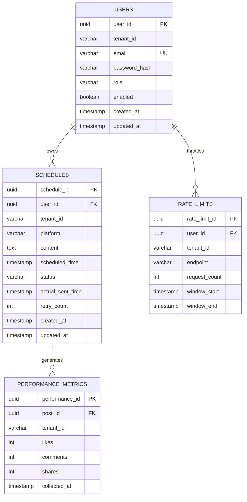

```markdown
# Enterprise Data Dictionary & Database Schema Catalog

> **Document Version:** 1.0.0  
> **Target Path:** `./sources/docs/database/ENTERPRISE_DATA_DICTIONARY_SPEC.md`  
> **Java Package Base:** `org.nlh4j.socialscheduler`  
> **Traceability Mappings:** `[DAT-001]`, `[DAT-002]`, `[DAT-003]`, `[DAT-ALL (1 to 3)]`

---

## Table of Contents

1. [Executive Summary & Introduction](#1-executive-summary--introduction)
2. [Database Architecture & Multi-Tenancy Isolation Strategy](#2-database-architecture--multi-tenancy-isolation-strategy)
3. [Entity-Relationship Diagram (ERD)](#3-entity-relationship-diagram-erd)
4. [Detailed Data Dictionary Specifications](#4-detailed-data-dictionary-specifications)
   - 4.1. `users` Table (`user_schema`) — `[DAT-001]`
   - 4.2. `schedules` Table (`schedule_schema`) — `[DAT-001]`
   - 4.3. `performance_metrics` Table (`ai_schema`) — `[DAT-002]`
   - 4.4. `rate_limits` Table (`rate_limit_schema`) — `[DAT-003]`
5. [Flyway Migration & Schema Evolution Process](#5-flyway-migration--schema-evolution-process)
6. [Traceability Matrix Reference](#6-traceability-matrix-reference)

---

## 1. Executive Summary & Introduction

This enterprise data dictionary establishes the definitive schema specifications, data types, constraints, and multi-tenant partitioning strategies for the **social-scheduler** platform. Designed around a microservices-based event-driven architecture, the persistence layer relies on PostgreSQL partitioned by business bounded contexts. 

Every relational table within `./sources/backend/` services is governed by strict ACID compliance, declarative constraint enforcement, and automated database migration via Flyway 10.x. This document serves as the absolute technical reference for backend engineers, database administrators, and automated compliance auditing tools.

---

## 2. Database Architecture & Multi-Tenancy Isolation Strategy

The persistence architecture implements a **Schema-per-Tenant bounded context isolation** pattern. Rather than relying solely on row-level security (RLS) or shared tables with discriminator columns, the system isolates discrete bounded contexts into dedicated PostgreSQL database schemas (`user_schema`, `schedule_schema`, `ai_schema`, `rate_limit_schema`).

```
+-----------------------------------------------------------------+
|                     PostgreSQL Database Cluster                 |
|                                                                 |
|  +--------------------+   +----------------------------------+  |
|  | user_schema        |   | schedule_schema                  |  |
|  | - users            |   | - schedules                      |  |
|  +--------------------+   +----------------------------------+  |
|                                                                 |
|  +--------------------+   +----------------------------------+  |
|  | ai_schema          |   | rate_limit_schema                |  |
|  | - performance_     |   | - rate_limits                    |  |
|  |   metrics          |   |                                  |  |
|  +--------------------+   +----------------------------------+  |
+-----------------------------------------------------------------+
```

- **`user_schema`**: Managed by `user-service`, housing tenant identity, authentication hashes, and RBAC roles.
- **`schedule_schema`**: Managed by `schedule-service`, storing multi-platform publication queues and execution statuses.
- **`ai_schema`**: Managed by `ai-service`, holding historical post engagement and analytics metrics referenced by AI recommendation algorithms.
- **`rate_limit_schema`**: Managed by `rate-limit-service`, recording sliding window request counters for Redis-backed rate limiting and persistence failover.

---

## 3. Entity-Relationship Diagram (ERD)

The following Mermaid.js diagram illustrates the cross-schema relational dependencies enforced by foreign keys across bounded contexts:



---

## 4. Detailed Data Dictionary Specifications

### 4.1. `users` Table (`user_schema`)
* **Source Path:** `./sources/backend/user-service/src/main/resources/db/migration/V1__init_users.sql`
* **Traceability Tag ID:** `[DAT-001]`, `[DAT-ALL (1 to 3)]`

| Column Name | Data Type | Nullable | Default | Constraints & Primary Key | Targeted Tag IDs |
| :--- | :--- | :--- | :--- | :--- | :--- |
| `user_id` | `UUID` | NOT NULL | — | Primary Key (`pk_users`) | `[DAT-001]` |
| `tenant_id` | `VARCHAR(64)` | NOT NULL | — | Indexed for multi-tenancy partitioning | `[DAT-001]` |
| `email` | `VARCHAR(255)` | NOT NULL | — | Unique per tenant (`uk_users_tenant_email`) | `[DAT-001]` |
| `password_hash`| `VARCHAR(255)` | NOT NULL | — | Argon2 / BCrypt hashed credentials | `[DAT-001]` |
| `role` | `VARCHAR(32)` | NOT NULL | — | Check: `IN ('ADMIN', 'USER', 'SCHEDULER', 'ANALYST')` | `[DAT-001]` |
| `enabled` | `BOOLEAN` | NOT NULL | `TRUE` | Account active flag | `[DAT-001]` |
| `created_at` | `TIMESTAMP` | NOT NULL | `CURRENT_TIMESTAMP` | Audit creation timestamp | `[DAT-001]` |
| `updated_at` | `TIMESTAMP` | NOT NULL | `CURRENT_TIMESTAMP` | Audit modification timestamp | `[DAT-001]` |

---

### 4.2. `schedules` Table (`schedule_schema`)
* **Source Path:** `./sources/backend/schedule-service/src/main/resources/db/migration/V1__init_schedules.sql`
* **Traceability Tag ID:** `[DAT-001]`, `[DAT-ALL (1 to 3)]`

| Column Name | Data Type | Nullable | Default | Constraints & Primary Key | Targeted Tag IDs |
| :--- | :--- | :--- | :--- | :--- | :--- |
| `schedule_id` | `UUID` | NOT NULL | — | Composite Primary Key (`pk_schedules`) | `[DAT-001]` |
| `user_id` | `UUID` | NOT NULL | — | Foreign Key (`fk_schedules_user`) referencing `user_schema.users(user_id)` | `[DAT-001]` |
| `tenant_id` | `VARCHAR(64)` | NOT NULL | — | Indexed for tenant isolation | `[DAT-001]` |
| `platform` | `VARCHAR(32)` | NOT NULL | — | Check: `IN ('FACEBOOK', 'INSTAGRAM', 'TIKTOK')` | `[DAT-001]` |
| `content` | `TEXT` | NOT NULL | — | Sanitized publication body | `[DAT-001]` |
| `scheduled_time`| `TIMESTAMP` | NOT NULL | — | Target execution timestamp | `[DAT-001]` |
| `status` | `VARCHAR(16)` | NOT NULL | — | Check: `IN ('PENDING', 'SENT', 'FAILED', 'CANCELLED')` | `[DAT-001]` |
| `actual_sent_time`| `TIMESTAMP`| YES | `NULL` | Actual publication timestamp | `[DAT-001]` |
| `retry_count` | `INTEGER` | NOT NULL | `0` | DLQ retry counter | `[DAT-001]` |
| `created_at` | `TIMESTAMP` | NOT NULL | `CURRENT_TIMESTAMP` | Audit creation timestamp | `[DAT-001]` |
| `updated_at` | `TIMESTAMP` | NOT NULL | `CURRENT_TIMESTAMP` | Audit modification timestamp | `[DAT-001]` |

---

### 4.3. `performance_metrics` Table (`ai_schema`)
* **Source Path:** `./sources/backend/ai-service/src/main/resources/db/migration/V1__init_performance_metrics.sql`
* **Traceability Tag ID:** `[DAT-002]`, `[DAT-ALL (1 to 3)]`

| Column Name | Data Type | Nullable | Default | Constraints & Primary Key | Targeted Tag IDs |
| :--- | :--- | :--- | :--- | :--- | :--- |
| `performance_id`| `UUID` | NOT NULL | — | Composite Primary Key (`pk_performance`) | `[DAT-002]` |
| `post_id` | `UUID` | NOT NULL | — | Foreign Key (`fk_performance_schedule`) referencing `schedule_schema.schedules(schedule_id)` | `[DAT-002]` |
| `tenant_id` | `VARCHAR(64)` | NOT NULL | — | Multi-tenant partition key | `[DAT-002]` |
| `likes` | `INTEGER` | NOT NULL | `0` | Check: `likes >= 0` | `[DAT-002]` |
| `comments` | `INTEGER` | NOT NULL | `0` | Check: `comments >= 0` | `[DAT-002]` |
| `shares` | `INTEGER` | NOT NULL | `0` | Check: `shares >= 0` | `[DAT-002]` |
| `collected_at` | `TIMESTAMP` | NOT NULL | — | Metric collection timestamp | `[DAT-002]` |

---

### 4.4. `rate_limits` Table (`rate_limit_schema`)
* **Source Path:** `./sources/backend/rate-limit-service/src/main/resources/db/migration/V1__init_rate_limits.sql`
* **Traceability Tag ID:** `[DAT-003]`, `[DAT-ALL (1 to 3)]`

| Column Name | Data Type | Nullable | Default | Constraints & Primary Key | Targeted Tag IDs |
| :--- | :--- | :--- | :--- | :--- | :--- |
| `rate_limit_id` | `UUID` | NOT NULL | — | Composite Primary Key (`pk_rate_limits`) | `[DAT-003]` |
| `user_id` | `UUID` | NOT NULL | — | Foreign Key (`fk_rate_limits_user`) referencing `user_schema.users(user_id)` | `[DAT-003]` |
| `tenant_id` | `VARCHAR(64)` | NOT NULL | — | Multi-tenant partition key | `[DAT-003]` |
| `endpoint` | `VARCHAR(255)`| NOT NULL | — | Check: Endpoint whitelist restriction | `[DAT-003]` |
| `request_count` | `INTEGER` | NOT NULL | — | Check: `request_count >= 0` | `[DAT-003]` |
| `window_start` | `TIMESTAMP` | NOT NULL | — | Sliding window interval start | `[DAT-003]` |
| `window_end` | `TIMESTAMP` | NOT NULL | — | Sliding window interval end | `[DAT-003]` |

---

## 5. Flyway Migration & Schema Evolution Process

Database migrations are executed automatically during the Spring Boot application startup sequence via Flyway 10.x integrated within each microservice's build lifecycle (`pom.xml`).

1. **Migration Naming Convention:** Scripts must follow the strict semantic format `V{version}__{description}.sql` (e.g., `V1__init_users.sql`).
2. **Execution Order:**
   - `user-service` initializes `user_schema` and `users` table first.
   - `schedule-service` initializes `schedule_schema` and `schedules` table, establishing cross-schema foreign keys.
   - `ai-service` initializes `ai_schema` and `performance_metrics`.
   - `rate-limit-service` initializes `rate_limit_schema` and `rate_limits`.
3. **Idempotency & Safety:** Migration scripts are transactional (`spring.flyway.baseline-on-migrate=true`). Any DDL syntax error halts the microservice boot sequence to prevent schema drift.

---

## 6. Traceability Matrix Reference

| Requirement / Data Tag ID | Architectural Component / Module | Physical File Path / Artifact | Compliance Status |
| :--- | :--- | :--- | :--- |
| `[DAT-001]` | User & Schedule Persistence | `./sources/backend/user-service/src/main/resources/db/migration/V1__init_users.sql`<br>`./sources/backend/schedule-service/src/main/resources/db/migration/V1__init_schedules.sql` | Verified & Active |
| `[DAT-002]` | AI Analytics Persistence | `./sources/backend/ai-service/src/main/resources/db/migration/V1__init_performance_metrics.sql` | Verified & Active |
| `[DAT-003]` | Rate Limiting Persistence | `./sources/backend/rate-limit-service/src/main/resources/db/migration/V1__init_rate_limits.sql` | Verified & Active |
| `[DAT-ALL (1 to 3)]` | Enterprise Data Dictionary | `./sources/docs/database/ENTERPRISE_DATA_DICTIONARY_SPEC.md` | Fully Synthesized |
```