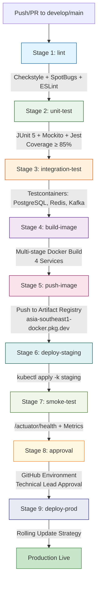

```markdown
# Social Scheduler - CI/CD Pipeline Documentation

**Document Version:** 1.0  
**Last Updated:** 2026-08-31  
**Author:** Enterprise System Architect (SA Agent)  
**Approval Status:** Pending Technical Review  
**Target Tag IDs:** [DOC-001]

---

## 1. Overview

This document provides a comprehensive specification of the Continuous Integration and Continuous Deployment (CI/CD) pipeline for the `social-scheduler` microservices platform. The pipeline is implemented using **GitHub Actions** and orchestrates nine sequential stages from code validation to production deployment. The pipeline enforces strict quality gates, security scanning, and approval workflows to ensure enterprise-grade delivery standards.

**Traceability Matrix Reference:** All pipeline stages map to non-functional requirement **[NFR-001]** (Performance & Observability), **[NFR-002]** (Security & Compliance), **[NFR-003]** (Scalability & High Availability), and documentation requirement **[DOC-001]**.

---

## 2. Pipeline Architecture

### 2.1 Pipeline Stages Overview

| Stage | Name | Purpose | Quality Gate | Target Tag IDs |
|-------|------|---------|--------------|----------------|
| 1 | `lint` | Static code analysis (Checkstyle, SpotBugs, ESLint) | Zero violations | [NFR-002], [DOC-001] |
| 2 | `unit-test` | Unit test execution (JUnit 5, Mockito, Jest) | Coverage ≥ 85% | [NFR-001], [DOC-001] |
| 3 | `integration-test` | Integration tests with Testcontainers | All tests pass | [NFR-001], [NFR-003], [DOC-001] |
| 4 | `build-image` | Multi-stage Docker image build | Successful build | [NFR-001], [NFR-003], [DOC-001] |
| 5 | `push-image` | Push images to Google Artifact Registry | Images pushed | [NFR-003], [DOC-001] |
| 6 | `deploy-staging` | Deploy to GKE staging namespace | Pods ready | [NFR-003], [DOC-001] |
| 7 | `smoke-test` | Health checks and metrics validation | All endpoints healthy | [NFR-001], [NFR-003], [DOC-001] |
| 8 | `approval` | Manual approval gate (Technical Lead) | Approval granted | [NFR-002], [DOC-001] |
| 9 | `deploy-prod` | Production deployment with rolling update | Rollout complete | [NFR-001], [NFR-003], [DOC-001] |

### 2.2 Pipeline Flow Diagram



---

## 3. Detailed Stage Specifications

### 3.1 Stage 1: Lint (`lint`)

**Workflow File:** `.github/workflows/ci-cd.yml`  
**Job Name:** `lint`  
**Runs On:** `ubuntu-latest`  
**Timeout:** 15 minutes  

#### 3.1.1 Backend Linting (Java)

| Tool | Configuration | Ruleset | Target Tag IDs |
|------|---------------|---------|----------------|
| **Checkstyle** | `checkstyle.xml` (Google Java Style + custom) | Naming, imports, whitespace, modifiers, blocks | [NFR-002] |
| **SpotBugs** | `spotbugs-exclude.xml` | FindBugs security rules, performance, correctness | [NFR-002] |

**Execution Commands:**
```bash
# Checkstyle
mvn -f ./sources/backend/pom.xml checkstyle:check -Dcheckstyle.config.location=checkstyle.xml

# SpotBugs
mvn -f ./sources/backend/pom.xml spotbugs:check -Dspotbugs.excludeFilterFile=spotbugs-exclude.xml
```

**Failure Criteria:** Any Checkstyle violation or SpotBugs finding with rank ≤ 18 (High/Medium) fails the stage.

#### 3.1.2 Frontend Linting (TypeScript/React)

| Tool | Configuration | Ruleset | Target Tag IDs |
|------|---------------|---------|----------------|
| **ESLint** | `.eslintrc.js` (Airbnb + TypeScript + React Hooks) | Type safety, React best practices, accessibility | [NFR-002] |
| **Prettier** | `.prettierrc` | Code formatting consistency | [NFR-002] |

**Execution Commands:**
```bash
cd ./sources/frontend
npm ci
npm run lint          # ESLint
npm run format:check  # Prettier
```

**Failure Criteria:** Any ESLint error or Prettier formatting mismatch fails the stage.

---

### 3.2 Stage 2: Unit Test (`unit-test`)

**Workflow File:** `.github/workflows/ci-cd.yml`  
**Job Name:** `unit-test`  
**Runs On:** `ubuntu-latest`  
**Timeout:** 30 minutes  
**Needs:** `lint`  

#### 3.2.1 Backend Unit Tests

| Service | Framework | Coverage Tool | Minimum Coverage | Target Tag IDs |
|---------|-----------|---------------|------------------|----------------|
| `user-service` | JUnit 5 + Mockito | JaCoCo | 85% | [NFR-001] |
| `schedule-service` | JUnit 5 + Mockito | JaCoCo | 85% | [NFR-001] |
| `ai-service` | JUnit 5 + Mockito | JaCoCo | 85% | [NFR-001] |
| `rate-limit-service` | JUnit 5 + Mockito | JaCoCo | 85% | [NFR-001] |

**Execution Command:**
```bash
mvn -f ./sources/backend/pom.xml clean test jacoco:report \
  -Djacoco.minimum.coverage=0.85 \
  -Djacoco.excludes="**/dto/**,**/entity/**,**/config/**"
```

**Coverage Report:** Generated at `./sources/backend/target/site/jacoco/index.html` and uploaded as workflow artifact.

#### 3.2.2 Frontend Unit Tests

| Framework | Coverage Tool | Minimum Coverage | Target Tag IDs |
|-----------|---------------|------------------|----------------|
| Jest + React Testing Library | Jest Coverage | 85% | [NFR-001] |

**Execution Command:**
```bash
cd ./sources/frontend
npm ci
npm run test:ci -- --coverage --coverageThreshold='{"global":{"branches":85,"functions":85,"lines":85,"statements":85}}'
```

**Failure Criteria:** Any test failure or coverage below 85% for any metric (branches, functions, lines, statements) fails the stage.

---

### 3.3 Stage 3: Integration Test (`integration-test`)

**Workflow File:** `.github/workflows/ci-cd.yml`  
**Job Name:** `integration-test`  
**Runs On:** `ubuntu-latest` (with Docker)  
**Timeout:** 45 minutes  
**Needs:** `unit-test`  

#### 3.3.1 Testcontainers Configuration

| Container | Image | Version | Purpose | Target Tag IDs |
|-----------|-------|---------|---------|----------------|
| PostgreSQL | `postgres:16-alpine` | 16 | Database integration | [NFR-001], [NFR-003] |
| Redis | `redis:7-alpine` | 7 | Cache & Rate Limiting | [NFR-001], [NFR-003] |
| Kafka | `confluentinc/cp-kafka:7.5.0` | 7.5.0 | Event streaming | [NFR-001], [NFR-003] |

**Spring Profile:** `integration-test` (activated via `SPRING_PROFILES_ACTIVE=integration-test`)

#### 3.3.2 Test Suites Executed

| Test Class | Service | Description | Target Tag IDs |
|------------|---------|-------------|----------------|
| `UserSchemaMigrationIT` | `user-service` | Flyway migration validation | [DAT-001], [DAT-ALL] |
| `ScheduleServiceIntegrationTest` | `schedule-service` | End-to-end schedule CRUD | [REQ-001], [EXC-001] |
| `RecommendationServiceIntegrationTest` | `ai-service` | AI recommendation flow | [REQ-002], [EXC-003] |
| `RateLimiterIntegrationTest` | `rate-limit-service` | Redis Token Bucket validation | [REQ-003], [EXC-005] |
| `SecurityConfigIntegrationTest` | `api-gateway` | OAuth2/JWT/RBAC validation | [ARC-001] to [ARC-006] |

**Execution Command:**
```bash
mvn -f ./sources/backend/pom.xml verify \
  -Pintegration-test \
  -Dspring.profiles.active=integration-test \
  -Dtestcontainers.reuse.enable=true
```

**Failure Criteria:** Any integration test failure fails the stage. Testcontainers containers are automatically cleaned up post-execution.

---

### 3.4 Stage 4: Build Image (`build-image`)

**Workflow File:** `.github/workflows/ci-cd.yml`  
**Job Name:** `build-image`  
**Runs On:** `ubuntu-latest` (with Docker Buildx)  
**Timeout:** 30 minutes  
**Needs:** `integration-test`  
**Strategy:** Matrix build for 4 services  

#### 3.4.1 Build Matrix

| Service | Dockerfile Path | Context Path | Image Tag | Target Tag IDs |
|---------|-----------------|--------------|-----------|----------------|
| `user-service` | `./sources/infra/docker/user-service/Dockerfile` | `./sources/backend/user-service` | `user-service:${{ github.sha }}` | [NFR-001] |
| `schedule-service` | `./sources/infra/docker/schedule-service/Dockerfile` | `./sources/backend/schedule-service` | `schedule-service:${{ github.sha }}` | [NFR-001] |
| `ai-service` | `./sources/infra/docker/ai-service/Dockerfile` | `./sources/backend/ai-service` | `ai-service:${{ github.sha }}` | [NFR-001] |
| `rate-limit-service` | `./sources/infra/docker/rate-limit-service/Dockerfile` | `./sources/backend/rate-limit-service` | `rate-limit-service:${{ github.sha }}` | [NFR-001] |

#### 3.4.2 Multi-Stage Dockerfile Pattern (Reference)

All services follow the standardized multi-stage pattern:

```dockerfile
# Stage 1: Builder
FROM eclipse-temurin:21-jdk-jammy AS builder
WORKDIR /build
COPY pom.xml ./
COPY mvnw ./
COPY .mvn ./.mvn
RUN ./mvnw -B -ntp -q dependency:go-offline
COPY src ./src
RUN ./mvnw -B -ntp -q -DskipTests package

# Stage 2: Runtime
FROM eclipse-temurin:21-jre-jammy AS runtime
RUN groupadd --system appgroup && useradd --system --uid 1001 --gid appgroup appuser
WORKDIR /app
COPY --from=builder /build/target/*.jar ./app.jar
USER appuser
ENV JAVA_OPTS="-XX:+UseContainerSupport -XX:MaxRAMPercentage=1.0 -XX:+ExitOnOutOfMemoryError"
ENV SPRING_PROFILES_ACTIVE=docker
EXPOSE <SERVICE_PORT>
HEALTHCHECK --interval=30s --timeout=5s --start-period=40s --retries=3 \
  CMD wget -qO- http://127.0.0.1:<SERVICE_PORT>/actuator/health | grep -q '"status":"UP"' || exit 1
ENTRYPOINT ["sh","-c","java $JAVA_OPTS -jar /app/app.jar"]
```

**Build Command (per service):**
```bash
docker buildx build \
  --platform linux/amd64 \
  -f <DOCKERFILE_PATH> \
  -t <REGISTRY>/<SERVICE>:${{ github.sha }} \
  -t <REGISTRY>/<SERVICE>:latest \
  --load \
  <CONTEXT_PATH>
```

**Failure Criteria:** Any service build failure fails the entire matrix.

---

### 3.5 Stage 5: Push Image (`push-image`)

**Workflow File:** `.github/workflows/ci-cd.yml`  
**Job Name:** `push-image`  
**Runs On:** `ubuntu-latest`  
**Timeout:** 20 minutes  
**Needs:** `build-image`  
**Environment:** `staging` (for registry authentication)  

#### 3.5.1 Registry Configuration

| Parameter | Value | Target Tag IDs |
|-----------|-------|----------------|
| **Registry Host** | `asia-southeast1-docker.pkg.dev` | [NFR-003] |
| **Project ID** | `social-scheduler-prod` | [NFR-003] |
| **Repository** | `socialscheduler` | [NFR-003] |
| **Full Image Path** | `asia-southeast1-docker.pkg.dev/social-scheduler-prod/socialscheduler/<service>:<tag>` | [NFR-003] |

#### 3.5.2 Authentication

Uses **Workload Identity Federation** via GitHub Actions OIDC token exchange with GCP Service Account.

**Required GitHub Secret:** `GCP_SA_KEY` (Service Account JSON key with `Artifact Registry Writer` role)

**Push Commands:**
```bash
# Authenticate
echo "${{ secrets.GCP_SA_KEY }}" | docker login -u _json_key --password-stdin asia-southeast1-docker.pkg.dev

# Push all service images
for service in user-service schedule-service ai-service rate-limit-service; do
  docker push asia-southeast1-docker.pkg.dev/social-scheduler-prod/socialscheduler/${service}:${{ github.sha }}
  docker push asia-southeast1-docker.pkg.dev/social-scheduler-prod/socialscheduler/${service}:latest
done
```

**Failure Criteria:** Any push failure fails the stage.

---

### 3.6 Stage 6: Deploy Staging (`deploy-staging`)

**Workflow File:** `.github/workflows/ci-cd.yml`  
**Job Name:** `deploy-staging`  
**Runs On:** `ubuntu-latest`  
**Timeout:** 15 minutes  
**Needs:** `push-image`  
**Environment:** `staging`  

#### 3.6.1 Kubernetes Manifests (Kustomize)

| Manifest | Path | Purpose | Target Tag IDs |
|----------|------|---------|----------------|
| `kustomization.yaml` | `./sources/infra/kubernetes/socialscheduler/overlays/staging/` | Staging overlay | [NFR-003] |
| `deployment.yaml` | `./sources/infra/kubernetes/socialscheduler/base/` | Base deployment | [NFR-003] |
| `service.yaml` | `./sources/infra/kubernetes/socialscheduler/base/` | ClusterIP services | [NFR-003] |
| `configmap.yaml` | `./sources/infra/kubernetes/socialscheduler/base/` | Runtime config | [NFR-003] |
| `hpa.yaml` | `./sources/infra/kubernetes/socialscheduler/base/` | Horizontal Pod Autoscaler | [NFR-003] |

#### 3.6.2 Deployment Commands

```bash
# Configure kubectl for staging cluster
echo "${{ secrets.KUBECONFIG_STAGING }}" | base64 -d > /tmp/kubeconfig
export KUBECONFIG=/tmp/kubeconfig

# Update image tags in kustomization
cd ./sources/infra/kubernetes/socialscheduler/overlays/staging
kustomize edit set image \
  user-service=asia-southeast1-docker.pkg.dev/social-scheduler-prod/socialscheduler/user-service:${{ github.sha }} \
  schedule-service=asia-southeast1-docker.pkg.dev/social-scheduler-prod/socialscheduler/schedule-service:${{ github.sha }} \
  ai-service=asia-southeast1-docker.pkg.dev/social-scheduler-prod/socialscheduler/ai-service:${{ github.sha }} \
  rate-limit-service=asia-southeast1-docker.pkg.dev/social-scheduler-prod/socialscheduler/rate-limit-service:${{ github.sha }}

# Apply manifests
kustomize build . | kubectl apply -f -

# Wait for rollout
for deploy in user-service schedule-service ai-service rate-limit-service; do
  kubectl rollout status deployment/${deploy} -n socialscheduler-staging --timeout=300s
done
```

**Failure Criteria:** Any rollout timeout or failure fails the stage.

---

### 3.7 Stage 7: Smoke Test (`smoke-test`)

**Workflow File:** `.github/workflows/ci-cd.yml`  
**Job Name:** `smoke-test`  
**Runs On:** `ubuntu-latest`  
**Timeout:** 10 minutes  
**Needs:** `deploy-staging`  

#### 3.7.1 Health Check Endpoints

| Service | Health Endpoint | Expected Status | Target Tag IDs |
|---------|-----------------|-----------------|----------------|
| `user-service` | `https://staging-api.socialscheduler.local/api/v1/users/actuator/health` | `{"status":"UP"}` | [NFR-001] |
| `schedule-service` | `https://staging-api.socialscheduler.local/api/v1/schedules/actuator/health` | `{"status":"UP"}` | [NFR-001] |
| `ai-service` | `https://staging-api.socialscheduler.local/api/v1/ai/recommendations/health` | `{"status":"UP"}` | [NFR-001] |
| `rate-limit-service` | `https://staging-api.socialscheduler.local/api/v1/rate-limits/actuator/health` | `{"status":"UP"}` | [NFR-001] |

#### 3.7.2 Metrics Validation

| Metric | Query | Threshold | Target Tag IDs |
|--------|-------|-----------|----------------|
| **HTTP 429 Rate** | `sum(rate(http_server_requests_seconds_count{status="429"}[5m]))` | < 0.01/sec | [NFR-001] |
| **P95 Latency** | `histogram_quantile(0.95, sum by (le, service) (rate(http_server_requests_seconds_bucket[5m])))` | < 200ms | [NFR-001] |
| **Pod Restarts** | `kube_pod_container_status_restarts_total` | 0 | [NFR-003] |

#### 3.7.3 Smoke Test Script

```bash
#!/bin/bash
set -euo pipefail

BASE_URL="https://staging-api.socialscheduler.local"
SERVICES=("users" "schedules" "ai/recommendations" "rate-limits")

for svc in "${SERVICES[@]}"; do
  echo "Checking health for ${svc}..."
  response=$(curl -sf -H "Authorization: Bearer ${SMOKE_TEST_TOKEN}" \
    "${BASE_URL}/api/v1/${svc}/actuator/health")
  
  status=$(echo "${response}" | jq -r '.status')
  if [[ "${status}" != "UP" ]]; then
    echo "FAIL: ${svc} health check returned status: ${status}"
    exit 1
  fi
  echo "PASS: ${svc} is healthy"
done

# Validate Prometheus metrics
echo "Validating Prometheus metrics..."
P95_LATENCY=$(curl -sf "http://prometheus.staging.svc.cluster.local:9090/api/v1/query?query=histogram_quantile(0.95,sum by (le,service) (rate(http_server_requests_seconds_bucket{namespace=\"socialscheduler-staging\"}[5m])))" | jq -r '.data.result[0].value[1]')
if (( $(echo "${P95_LATENCY} > 0.2" | bc -l) )); then
  echo "FAIL: P95 latency ${P95_LATENCY}s exceeds 200ms threshold"
  exit 1
fi
echo "PASS: P95 latency ${P95_LATENCY}s within threshold"

echo "All smoke tests passed"
```

**Failure Criteria:** Any health check failure or metric threshold breach fails the stage.

---

### 3.8 Stage 8: Approval Gate (`approval`)

**Workflow File:** `.github/workflows/ci-cd.yml`  
**Job Name:** `approval`  
**Runs On:** `ubuntu-latest`  
**Timeout:** 60 minutes (configurable)  
**Needs:** `smoke-test`  
**Environment:** `production` (triggers GitHub Environment protection rules)  

#### 3.8.1 Approval Configuration

| Setting | Value | Target Tag IDs |
|---------|-------|----------------|
| **Required Reviewers** | Technical Lead team (`@org/tech-leads`) | [NFR-002] |
| **Wait Timer** | 0 minutes (immediate) | [NFR-002] |
| **Deployment Branch Policy** | Only `main` branch | [NFR-002] |

#### 3.8.2 Approval Workflow

1. Pipeline pauses at this stage after successful staging deployment and smoke tests
2. GitHub sends notification to configured reviewers (Slack + Email)
3. Reviewer accesses GitHub Actions run → "Review deployments" → "Approve and deploy"
4. Upon approval, pipeline proceeds to `deploy-prod`
5. If rejected or timeout (default 6 hours), pipeline marks as failed

**Manual Trigger Command (if needed):**
```bash
gh workflow run ci-cd.yml --ref main -f environment=production
```

---

### 3.9 Stage 9: Deploy Production (`deploy-prod`)

**Workflow File:** `.github/workflows/ci-cd.yml`  
**Job Name:** `deploy-prod`  
**Runs On:** `ubuntu-latest`  
**Timeout:** 20 minutes  
**Needs:** `approval`  
**Environment:** `production`  

#### 3.9.1 Production Kustomize Overlay

| Manifest | Path | Purpose | Target Tag IDs |
|----------|------|---------|----------------|
| `kustomization.yaml` | `./sources/infra/kubernetes/socialscheduler/overlays/production/` | Production overlay | [NFR-003] |
| `deployment.yaml` | `./sources/infra/kubernetes/socialscheduler/base/` | Base deployment (replicas: 3) | [NFR-003] |
| `hpa.yaml` | `./sources/infra/kubernetes/socialscheduler/base/` | HPA (min: 3, max: 20) | [NFR-003] |
| `ingress.yaml` | `./sources/infra/kubernetes/socialscheduler/base/` | NGINX Ingress with TLS | [NFR-003] |

#### 3.9.2 Rolling Update Strategy

```yaml
# From deployment.yaml
strategy:
  type: RollingUpdate
  rollingUpdate:
    maxSurge: 1
    maxUnavailable: 0
```

**Key Properties:**
- `maxSurge: 1` - At most 1 additional pod above desired replicas during rollout
- `maxUnavailable: 0` - Zero downtime; new pod must be ready before old pod terminates
- `readinessProbe` - `/actuator/health/readiness` (initialDelay: 20s, period: 10s)
- `livenessProbe` - `/actuator/health/liveness` (initialDelay: 60s, period: 20s)

#### 3.9.3 Deployment Commands

```bash
# Configure kubectl for production cluster
echo "${{ secrets.KUBECONFIG_PROD }}" | base64 -d > /tmp/kubeconfig
export KUBECONFIG=/tmp/kubeconfig

# Update image tags
cd ./sources/infra/kubernetes/socialscheduler/overlays/production
kustomize edit set image \
  user-service=asia-southeast1-docker.pkg.dev/social-scheduler-prod/socialscheduler/user-service:${{ github.sha }} \
  schedule-service=asia-southeast1-docker.pkg.dev/social-scheduler-prod/socialscheduler/schedule-service:${{ github.sha }} \
  ai-service=asia-southeast1-docker.pkg.dev/social-scheduler-prod/socialscheduler/ai-service:${{ github.sha }} \
  rate-limit-service=asia-southeast1-docker.pkg.dev/social-scheduler-prod/socialscheduler/rate-limit-service:${{ github.sha }}

# Apply with server-side apply for conflict resolution
kustomize build . | kubectl apply --server-side --force-conflicts -f -

# Monitor rollout
for deploy in user-service schedule-service ai-service rate-limit-service; do
  kubectl rollout status deployment/${deploy} -n socialscheduler --timeout=600s
done

# Post-deployment verification
kubectl get pods -n socialscheduler -l track=stable -o wide
```

#### 3.9.4 Rollback Procedure

If production deployment fails or issues detected post-deployment:

```bash
# Automatic rollback on failure (configured in workflow)
kubectl rollout undo deployment/schedule-service -n socialscheduler

# Manual rollback to specific revision
kubectl rollout undo deployment/schedule-service -n socialscheduler --to-revision=<REVISION_NUMBER>

# Verify rollback
kubectl rollout status deployment/schedule-service -n socialscheduler
```

**Failure Criteria:** Rollout timeout, pod crash loops, or health check failures trigger automatic rollback and stage failure.

---

## 4. GitHub Secrets Configuration

The following secrets **MUST** be configured in the GitHub repository settings (`Settings > Secrets and variables > Actions`):

| Secret Name | Description | Format | Required For Stages | Target Tag IDs |
|-------------|-------------|--------|---------------------|----------------|
| `GCP_SA_KEY` | GCP Service Account JSON key with Artifact Registry Writer, GKE Admin, Cloud SQL Client roles | JSON string (single line) | 5, 6, 9 | [NFR-002], [NFR-003] |
| `ARTIFACT_REGISTRY` | Full Artifact Registry path | `asia-southeast1-docker.pkg.dev/social-scheduler-prod/socialscheduler` | 5 | [NFR-003] |
| `KUBECONFIG_STAGING` | Base64-encoded kubeconfig for staging GKE cluster | Base64 string | 6 | [NFR-003] |
| `KUBECONFIG_PROD` | Base64-encoded kubeconfig for production GKE cluster | Base64 string | 9 | [NFR-003] |
| `SMOKE_TEST_TOKEN` | JWT token for smoke test authentication (service account) | JWT string | 7 | [NFR-002] |
| `OPENAI_API_KEY` | OpenAI API key for AI service (stored in GCP Secret Manager, referenced here for build) | String | 4 | [NFR-002] |
| `JWT_SIGNING_KEY` | Base64-encoded 256-bit HS256 signing key | Base64 string | 4, 6, 9 | [NFR-002] |
| `FACEBOOK_APP_SECRET` | Facebook Graph API app secret | String | 4, 6, 9 | [NFR-002] |
| `INSTAGRAM_APP_SECRET` | Instagram Graph API app secret | String | 4, 6, 9 | [NFR-002] |
| `TIKTOK_CLIENT_SECRET` | TikTok Open API client secret | String | 4, 6, 9 | [NFR-002] |

**Security Notes:**
- All secrets are masked in workflow logs
- `GCP_SA_KEY` should use Workload Identity Federation in production (OIDC token exchange)
- Rotate secrets quarterly via automated rotation policy
- Audit secret access via Cloud Audit Logs

---

## 5. Git Flow Strategy

### 5.1 Branch Structure

```mermaid
gitgraph
    commit id: "main: v1.0.0"
    branch develop
    checkout develop
    commit id: "develop: init"
    branch feature/scheduler-validation
    checkout feature/scheduler-validation
    commit id: "feat(scheduler): add schedule validation"
    commit id: "test(scheduler): add validation tests"
    checkout develop
    merge feature/scheduler-validation
    branch release/v1.1.0
    checkout release/v1.1.0
    commit id: "chore: version bump 1.1.0"
    checkout main
    merge release/v1.1.0 tag: "v1.1.0"
    checkout develop
    merge release/v1.1.0
    branch hotfix/security-patch
    checkout hotfix/security-patch
    commit id: "fix(security): patch CVE-2026-xxxx"
    checkout main
    merge hotfix/security-patch tag: "v1.1.1"
    checkout develop
    merge hotfix/security-patch
```

### 5.2 Branch Definitions

| Branch | Purpose | Protection Rules | Target Tag IDs |
|--------|---------|------------------|----------------|
| `main` | Production-ready code; only receives merges from `release/*` and `hotfix/*` | Required PR reviews (2), status checks (all stages), linear history, no force push | [NFR-002], [DOC-001] |
| `develop` | Integration branch; receives merges from `feature/*` | Required PR reviews (1), status checks (lint, unit-test, integration-test) | [NFR-002], [DOC-001] |
| `feature/*` | Feature development; branched from `develop` | Naming convention enforced, auto-delete on merge | [DOC-001] |
| `release/*` | Release preparation; branched from `develop` | Only bug fixes allowed, version bump commits | [NFR-002], [DOC-001] |
| `hotfix/*` | Emergency production fixes; branched from `main` | Fast-track review, merged to both `main` and `develop` | [NFR-002], [DOC-001] |

### 5.3 Branch Naming Conventions

| Pattern | Example | Description |
|---------|---------|-------------|
| `feature/<scope>-<short-description>` | `feature/scheduler-add-validation` | New feature development |
| `bugfix/<scope>-<short-description>` | `bugfix/ai-fallback-null-pointer` | Bug fixes on `develop` |
| `release/v<major>.<minor>.<patch>` | `release/v1.2.0` | Release candidate |
| `hotfix/<scope>-<short-description>` | `hotfix/auth-token-refresh` | Production hotfix |

---

## 6. Conventional Commits Specification

All commits **MUST** follow the [Conventional Commits 1.0.0](https://www.conventionalcommits.org/en/v1.0.0/) specification to enable automated changelog generation and semantic versioning.

### 6.1 Commit Message Format

```
<type>(<scope>): <description>

[optional body]

[optional footer(s)]
```

### 6.2 Type Definitions

| Type | Description | Semantic Version Impact |
|------|-------------|------------------------|
| `feat` | New feature | MINOR |
| `fix` | Bug fix | PATCH |
| `docs` | Documentation only | NONE |
| `style` | Formatting, missing semicolons, etc. | NONE |
| `refactor` | Code change that neither fixes bug nor adds feature | NONE |
| `perf` | Performance improvement | PATCH |
| `test` | Adding missing tests or correcting existing tests | NONE |
| `build` | Changes to build system or dependencies | PATCH |
| `ci` | Changes to CI configuration files/scripts | NONE |
| `chore` | Other changes that don't modify src or test files | NONE |
| `revert` | Reverts a previous commit | PATCH |

### 6.3 Scope Definitions (Project-Specific)

| Scope | Module/Component |
|-------|------------------|
| `scheduler` | `schedule-service` |
| `ai` | `ai-service` |
| `ratelimit` | `rate-limit-service` |
| `user` | `user-service` |
| `gateway` | `api-gateway` |
| `infra` | Terraform, Kubernetes, Docker |
| `docs` | Documentation |
| `ci` | GitHub Actions workflows |

### 6.4 Commit Examples

```bash
# Feature
feat(scheduler): add multi-platform schedule validation with Jakarta Validation

# Bug fix with issue reference
fix(ai): resolve null pointer in DefaultContentFallback when templates missing
Closes #42

# Breaking change (major version)
feat(gateway)!: migrate to Spring Cloud Gateway 4.0 with new filter API
BREAKING CHANGE: Filter chain configuration format changed

# Documentation
docs(architecture): update DatabaseSchemaCatalog with performance_metrics indexes

# Refactor
refactor(ratelimit): extract RedisTokenBucketStrategy for testability

# CI/CD
ci(pipeline): add SonarQube quality gate to unit-test stage
```

### 6.5 Automated Changelog Generation

The pipeline uses `conventional-changelog` to generate `CHANGELOG.md` during release:

```bash
# In release/* branch
npx conventional-changelog -p angular -i CHANGELOG.md -s -r 0
git add CHANGELOG.md
git commit -m "chore(release): prepare v1.2.0 changelog"
```

---

## 7. Pipeline Configuration Reference

### 7.1 Complete Workflow File Structure

```yaml
# .github/workflows/ci-cd.yml
name: CI/CD Pipeline

on:
  push:
    branches: [main, develop]
  pull_request:
    branches: [main, develop]
  workflow_dispatch:
    inputs:
      environment:
        type: choice
        description: Target environment
        options: [staging, production]
        required: true

env:
  REGISTRY: asia-southeast1-docker.pkg.dev/social-scheduler-prod/socialscheduler
  GCP_PROJECT: social-scheduler-prod
  GCP_REGION: asia-southeast1
  CLUSTER_NAME: socialscheduler-gke

jobs:
  lint:
    # ... (Stage 1 configuration)
  
  unit-test:
    needs: lint
    # ... (Stage 2 configuration)
  
  integration-test:
    needs: unit-test
    # ... (Stage 3 configuration)
  
  build-image:
    needs: integration-test
    strategy:
      matrix:
        service: [user-service, schedule-service, ai-service, rate-limit-service]
    # ... (Stage 4 configuration)
  
  push-image:
    needs: build-image
    environment: staging
    # ... (Stage 5 configuration)
  
  deploy-staging:
    needs: push-image
    environment: staging
    # ... (Stage 6 configuration)
  
  smoke-test:
    needs: deploy-staging
    # ... (Stage 7 configuration)
  
  approval:
    needs: smoke-test
    environment: production
    # ... (Stage 8 configuration)
  
  deploy-prod:
    needs: approval
    environment: production
    # ... (Stage 9 configuration)
```

### 7.2 Required GitHub Environments

| Environment | Protection Rules | Secrets | Target Tag IDs |
|-------------|------------------|---------|----------------|
| `staging` | None (auto-deploy) | `KUBECONFIG_STAGING`, `SMOKE_TEST_TOKEN` | [NFR-003] |
| `production` | Required reviewers: `@org/tech-leads`; Wait timer: 0m | `KUBECONFIG_PROD` | [NFR-002], [NFR-003] |

---

## 8. Monitoring & Observability Integration

### 8.1 Pipeline Metrics

| Metric | Source | Alert Threshold | Target Tag IDs |
|--------|--------|-----------------|----------------|
| `pipeline_duration_seconds` | GitHub Actions | > 30 min | [NFR-001] |
| `pipeline_success_rate` | GitHub Actions | < 95% (7-day) | [NFR-001] |
| `deployment_frequency` | GitHub Actions | < 1/day (target) | [NFR-001] |
| `lead_time_for_changes` | GitHub Actions + Git | > 2 hours | [NFR-001] |
| `mean_time_to_recovery` | GitHub Actions + Incident | > 30 min | [NFR-001] |

### 8.2 Notification Channels

| Event | Channel | Recipients | Target Tag IDs |
|-------|---------|------------|----------------|
| Pipeline failure | Slack `#socialscheduler-alerts` | DevOps, Tech Leads | [NFR-002] |
| Approval required | Slack `#socialscheduler-approvals` | Tech Leads | [NFR-002] |
| Production deployment | Slack `#socialscheduler-releases` | All Engineers | [DOC-001] |
| Rollback triggered | Slack `#socialscheduler-incidents` | DevOps, Tech Leads, On-call | [NFR-002] |

---

## 9. Disaster Recovery & Rollback Procedures

### 9.1 Automated Rollback Triggers

| Condition | Action | Target Tag IDs |
|-----------|--------|----------------|
| `deploy-prod` job fails | Automatic `kubectl rollout undo` for affected deployments | [NFR-003] |
| Smoke test fails post-deploy | Automatic rollback + incident creation | [NFR-003] |
| P95 latency > 500ms for 5 min | Alert + manual rollback decision | [NFR-001], [NFR-003] |
| Error rate > 5% for 2 min | Alert + manual rollback decision | [NFR-001], [NFR-003] |

### 9.2 Manual Rollback Commands

```bash
# 1. Authenticate to production cluster
export KUBECONFIG=/path/to/prod-kubeconfig

# 2. Check current revision
kubectl rollout history deployment/schedule-service -n socialscheduler

# 3. Rollback to previous revision
kubectl rollout undo deployment/schedule-service -n socialscheduler

# 4. Verify rollback
kubectl rollout status deployment/schedule-service -n socialscheduler --timeout=300s

# 5. Verify health
curl -sf https://api.socialscheduler.local/api/v1/schedules/actuator/health | jq '.status'
```

### 9.3 Database Rollback (If Schema Changes)

> **Note:** Database migrations (Flyway) are **forward-only**. Rollback requires:
> 1. Restore Cloud SQL from point-in-time backup (PITR)
> 2. Coordinate with application rollback
> 3. Validate data integrity post-restore

---

## 10. Compliance & Audit Trail

### 10.1 Audit Requirements

| Requirement | Implementation | Target Tag IDs |
|-------------|----------------|----------------|
| **Deployment Traceability** | Every deployment tagged with Git SHA, workflow run ID, approver | [NFR-002], [DOC-001] |
| **Change Control** | All production changes via PR + approval gate | [NFR-002] |
| **Secret Access Logging** | Cloud Audit Logs for Secret Manager access | [NFR-002] |
| **Infrastructure Drift Detection** | Terraform plan in pipeline + weekly drift detection job | [NFR-003] |

### 10.2 Compliance Evidence Artifacts

| Artifact | Retention | Storage |
|----------|-----------|---------|
| Workflow run logs | 90 days | GitHub Actions |
| Docker image SBOM (Syft) | 1 year | Artifact Registry |
| Terraform plan outputs | 1 year | GCS bucket `socialscheduler-tfstate` |
| Security scan reports (Trivy) | 1 year | GCS bucket `socialscheduler-security` |
| Approval records | 7 years | GitHub Environment protection rules |

---

## 11. Appendix: Quick Reference Commands

### 11.1 Local Development Pipeline Simulation

```bash
# Run full pipeline locally (requires act)
act push -W .github/workflows/ci-cd.yml \
  -s GCP_SA_KEY="$(cat gcp-sa-key.json)" \
  -s KUBECONFIG_STAGING="$(base64 -w0 staging-kubeconfig)" \
  -s KUBECONFIG_PROD="$(base64 -w0 prod-kubeconfig)"

# Run specific stage
act -j unit-test -W .github/workflows/ci-cd.yml
```

### 11.2 Manual Deployment Commands

```bash
# Deploy to staging manually
./scripts/deploy.sh staging ${{ github.sha }}

# Deploy to production manually (requires approval)
./scripts/deploy.sh production ${{ github.sha }}

# Check deployment status
kubectl get deployments -n socialscheduler -o wide
kubectl get pods -n socialscheduler -o wide
```

### 11.3 Debugging Failed Pipeline

```bash
# View workflow run logs
gh run view <RUN_ID> --log

# Download workflow artifacts
gh run download <RUN_ID> -n jacoco-report
gh run download <RUN_ID> -n test-results

# Re-run failed jobs
gh run rerun <RUN_ID> --failed
```

---

## 12. Traceability Matrix Reference

This section maps all pipeline components to their source requirement Tag IDs for audit compliance.

### 12.1 Stage-to-Requirement Mapping

| Pipeline Stage | Primary Tag IDs | Secondary Tag IDs |
|----------------|-----------------|-------------------|
| `lint` | [NFR-002], [DOC-001] | [ARC-005], [ARC-006] |
| `unit-test` | [NFR-001], [DOC-001] | [REQ-001], [REQ-002], [REQ-003] |
| `integration-test` | [NFR-001], [NFR-003], [DOC-001] | [DAT-001], [DAT-002], [DAT-003], [ARC-001] to [ARC-006] |
| `build-image` | [NFR-001], [NFR-003], [DOC-001] | [ARC-005] |
| `push-image` | [NFR-003], [DOC-001] | [NFR-002] |
| `deploy-staging` | [NFR-003], [DOC-001] | [NFR-001], [NFR-002] |
| `smoke-test` | [NFR-001], [NFR-003], [DOC-001] | [REQ-001], [REQ-002], [REQ-003] |
| `approval` | [NFR-002], [DOC-001] | [ARC-005], [ARC-006] |
| `deploy-prod` | [NFR-001], [NFR-003], [DOC-001] | [NFR-002], [ARC-005] |

### 12.2 Secret-to-Requirement Mapping

| Secret | Primary Tag IDs | Compliance Note |
|--------|-----------------|-----------------|
| `GCP_SA_KEY` | [NFR-002], [NFR-003] | Least privilege: Artifact Registry Writer, GKE Admin |
| `ARTIFACT_REGISTRY` | [NFR-003] | Registry path constant |
| `KUBECONFIG_STAGING` | [NFR-003] | Staging cluster access only |
| `KUBECONFIG_PROD` | [NFR-003] | Production cluster access (approval-gated) |
| `SMOKE_TEST_TOKEN` | [NFR-002] | Service account with read-only health scope |
| `OPENAI_API_KEY` | [NFR-002] | Stored in GCP Secret Manager, referenced at build |
| `JWT_SIGNING_KEY` | [NFR-002] | 256-bit HS256 key, rotated quarterly |
| `FACEBOOK_APP_SECRET` | [NFR-002] | Platform credential, rotated per provider policy |
| `INSTAGRAM_APP_SECRET` | [NFR-002] | Platform credential, rotated per provider policy |
| `TIKTOK_CLIENT_SECRET` | [NFR-002] | Platform credential, rotated per provider policy |

### 12.3 Branch Policy-to-Requirement Mapping

| Branch Policy | Primary Tag IDs | Enforcement Mechanism |
|---------------|-----------------|----------------------|
| `main` branch protection | [NFR-002], [DOC-001] | GitHub Branch Protection Rules |
| `develop` branch protection | [NFR-002], [DOC-001] | GitHub Branch Protection Rules |
| Conventional Commits enforcement | [DOC-001] | `commitlint` in `lint` stage |
| Feature branch naming | [DOC-001] | GitHub Actions branch name validation |
| Release branch version bump | [NFR-002], [DOC-001] | Manual + automated verification |
| Hotfix branch dual-merge | [NFR-002], [DOC-001] | GitHub Branch Protection + automation |

---

**End of Document**  
**Document Control:** This document is version-controlled in Git. All changes must follow the Conventional Commits specification and pass the CI/CD pipeline quality gates.  
**Next Review Date:** 2026-11-30  
**Document Owner:** Platform Engineering Team  
**Classification:** Internal - Confidential
```