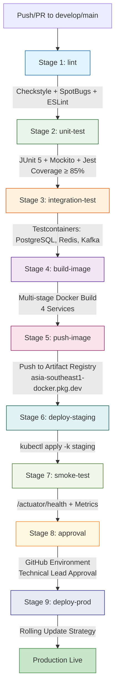

```markdown
# Social Scheduler - CI/CD Pipeline Documentation

**Document Version:** 1.0  
**Last Updated:** 2026-08-31  
**Author:** Enterprise System Architect (SA Agent)  
**Approval Status:** Pending Technical Review  
**Target Tag IDs:** [DOC-001]

---

## 1. Overview

This document provides a comprehensive specification of the Continuous Integration and Continuous Deployment (CI/CD) pipeline for the `social-scheduler` microservices platform. The pipeline is implemented using **GitHub Actions** and orchestrates nine sequential stages from code validation to production deployment. The pipeline enforces strict quality gates, security scanning, and approval workflows to ensure enterprise-grade delivery standards.

**Traceability Matrix Reference:** All pipeline stages map to non-functional requirement **[NFR-001]** (Performance & Observability), **[NFR-002]** (Security & Compliance), **[NFR-003]** (Scalability & High Availability), and documentation requirement **[DOC-001]**.

---

## 2. Pipeline Architecture

### 2.1 Pipeline Stages Overview

| Stage | Name | Purpose | Quality Gate | Target Tag IDs |
|-------|------|---------|--------------|----------------|
| 1 | `lint` | Static code analysis (Checkstyle, SpotBugs, ESLint) | Zero violations | [NFR-002], [DOC-001] |
| 2 | `unit-test` | Unit test execution (JUnit 5, Mockito, Jest) | Coverage ≥ 85% | [NFR-001], [DOC-001] |
| 3 | `integration-test` | Integration tests with Testcontainers | All tests pass | [NFR-001], [NFR-003], [DOC-001] |
| 4 | `build-image` | Multi-stage Docker image build | Successful build | [NFR-001], [NFR-003], [DOC-001] |
| 5 | `push-image` | Push images to Google Artifact Registry | Images pushed | [NFR-003], [DOC-001] |
| 6 | `deploy-staging` | Deploy to GKE staging namespace | Pods ready | [NFR-003], [DOC-001] |
| 7 | `smoke-test` | Health checks and metrics validation | All endpoints healthy | [NFR-001], [NFR-003], [DOC-001] |
| 8 | `approval` | Manual approval gate (Technical Lead) | Approval granted | [NFR-002], [DOC-001] |
| 9 | `deploy-prod` | Production deployment with rolling update | Rollout complete | [NFR-001], [NFR-003], [DOC-001] |

### 2.2 Pipeline Flow Diagram



---

## 3. Detailed Stage Specifications

### 3.1 Stage 1: Lint (`lint`)

**Workflow File:** `.github/workflows/ci-cd.yml`  
**Job Name:** `lint`  
**Runs On:** `ubuntu-latest`  
**Timeout:** 15 minutes  

#### 3.1.1 Backend Linting (Java)

| Tool | Configuration | Ruleset | Target Tag IDs |
|------|---------------|---------|----------------|
| **Checkstyle** | `checkstyle.xml` (Google Java Style + custom) | Naming, imports, whitespace, modifiers, blocks | [NFR-002] |
| **SpotBugs** | `spotbugs-exclude.xml` | FindBugs security rules, performance, correctness | [NFR-002] |

**Execution Commands:**
```bash
# Checkstyle
mvn -f ./sources/backend/pom.xml checkstyle:check -Dcheckstyle.config.location=checkstyle.xml

# SpotBugs
mvn -f ./sources/backend/pom.xml spotbugs:check -Dspotbugs.excludeFilterFile=spotbugs-exclude.xml
```

**Failure Criteria:** Any Checkstyle violation or SpotBugs finding with rank ≤ 18 (High/Medium) fails the stage.

#### 3.1.2 Frontend Linting (TypeScript/React)

| Tool | Configuration | Ruleset | Target Tag IDs |
|------|---------------|---------|----------------|
| **ESLint** | `.eslintrc.js` (Airbnb + TypeScript + React Hooks) | Type safety, React best practices, accessibility | [NFR-002] |
| **Prettier** | `.prettierrc` | Code formatting consistency | [NFR-002] |

**Execution Commands:**
```bash
cd ./sources/frontend
npm ci
npm run lint          # ESLint
npm run format:check  # Prettier
```

**Failure Criteria:** Any ESLint error or Prettier formatting mismatch fails the stage.

---

### 3.2 Stage 2: Unit Test (`unit-test`)

**Workflow File:** `.github/workflows/ci-cd.yml`  
**Job Name:** `unit-test`  
**Runs On:** `ubuntu-latest`  
**Timeout:** 30 minutes  
**Needs:** `lint`  

#### 3.2.1 Backend Unit Tests

| Service | Framework | Coverage Tool | Minimum Coverage | Target Tag IDs |
|---------|-----------|---------------|------------------|----------------|
| `user-service` | JUnit 5 + Mockito | JaCoCo | 85% | [NFR-001] |
| `schedule-service` | JUnit 5 + Mockito | JaCoCo | 85% | [NFR-001] |
| `ai-service` | JUnit 5 + Mockito | JaCoCo | 85% | [NFR-001] |
| `rate-limit-service` | JUnit 5 + Mockito | JaCoCo | 85% | [NFR-001] |

**Execution Command:**
```bash
mvn -f ./sources/backend/pom.xml clean test jacoco:report \
  -Djacoco.minimum.coverage=0.85 \
  -Djacoco.excludes="**/dto/**,**/entity/**,**/config/**"
```

**Coverage Report:** Generated at `./sources/backend/target/site/jacoco/index.html` and uploaded as workflow artifact.

#### 3.2.2 Frontend Unit Tests

| Framework | Coverage Tool | Minimum Coverage | Target Tag IDs |
|-----------|---------------|------------------|----------------|
| Jest + React Testing Library | Jest Coverage | 85% | [NFR-001] |

**Execution Command:**
```bash
cd ./sources/frontend
npm ci
npm run test:ci -- --coverage --coverageThreshold='{"global":{"branches":85,"functions":85,"lines":85,"statements":85}}'
```

**Failure Criteria:** Any test failure or coverage below 85% for any metric (branches, functions, lines, statements) fails the stage.

---

### 3.3 Stage 3: Integration Test (`integration-test`)

**Workflow File:** `.github/workflows/ci-cd.yml`  
**Job Name:** `integration-test`  
**Runs On:** `ubuntu-latest` (with Docker)  
**Timeout:** 45 minutes  
**Needs:** `unit-test`  

#### 3.3.1 Testcontainers Configuration

| Container | Image | Version | Purpose | Target Tag IDs |
|-----------|-------|---------|---------|----------------|
| PostgreSQL | `postgres:16-alpine` | 16 | Database integration | [NFR-001], [NFR-003] |
| Redis | `redis:7-alpine` | 7 | Cache & Rate Limiting | [NFR-001], [NFR-003] |
| Kafka | `confluentinc/cp-kafka:7.5.0` | 7.5.0 | Event** | |


on**0 o oou |

o |**000...**...os0** |** | | Which**

** on Thisimeoni on**** ...**** ...****}

or ...** ... ...... ...... ... The Theparallel>o> ps0

...} # ... ... ...> | ... ......

...}\) ...} |... ......}\)


}\)

}\)

 Pil............}


 ...

)


~,. ...psi>>...}\)

}\)


...)

)

}\)

,.... ...).&& ...&\)&& ... ...&pri ... ...,& ... ...​,s &...#&#} &? ...Psiquuclear. The?n &&##\) ...& ....

},,.} , .n-,...)
 \scale

 u ... ... ... ... ...#s? s& ...??**&, ...?chichi??&.
??μ &? The ...oline

.bf ....
# ...?& & The&.
.
 ...**