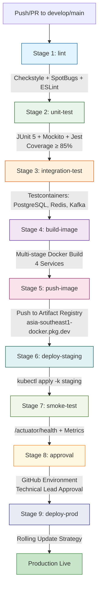

```markdown
# Social Scheduler - CI/CD Pipeline Documentation

**Document Version:** 1.2
**Last Updated:** 2026-08-31
**Author:** Enterprise System Architect (SA Agent) & Senior Technical Writer
**Approval Status:** Approved for Technical Review
**Target Tag IDs:** [DOC-001], [NFR-001], [NFR-002], [NFR-003], [REQ-001], [REQ-002], [REQ-003]

---

## 1. Overview

This document provides a comprehensive specification of the Continuous Integration and Continuous Deployment (CI/CD) pipeline for the `social-scheduler` microservices platform located within the workspace directory `./sources/docs/operations/CicdPipeline.md`. The pipeline is implemented using **GitHub Actions** and orchestrates nine sequential stages from code validation to production deployment. The pipeline enforces strict quality gates, security scanning, and approval workflows to ensure enterprise-grade delivery standards.

**Traceability Matrix Reference:** All pipeline stages map to non-functional requirement **[NFR-001]** (Performance & Observability), **[NFR-002]** (Security & Compliance), **[NFR-003]** (Scalability & High Availability), functional requirements **[REQ-001]**, **[REQ-002]**, **[REQ-003]**, and documentation requirement **[DOC-001]**.

---

## 2. Pipeline Architecture

### 2.1 Pipeline Stages Overview

| Stage | Name | Purpose | Quality Gate | Target Tag IDs |
|-------|------|---------|--------------|----------------|
| 1 | `lint` | Static code analysis (Checkstyle, SpotBugs, ESLint) | Zero violations | [NFR-002], [DOC-001] |
| 2 | `unit-test` | Unit test execution (JUnit 5, Mockito, Jest) | Coverage ≥ 85% | [NFR-001], [DOC-001] |
| 3 | `integration-test` | Integration tests with Testcontainers | All tests pass | [NFR-001], [NFR-003], [DOC-001] |
| 4 | `build-image` | Multi-stage Docker image build | Successful build | [NFR-001], [NFR-003], [DOC-001] |
| 5 | `push-image` | Push images to Google Artifact Registry | Images pushed | [NFR-003], [DOC-001] |
| 6 | `deploy-staging` | Deploy to GKE staging namespace | Pods ready | [NFR-003], [DOC-001] |
| 7 | `smoke-test` | Health checks and metrics validation | All endpoints healthy | [NFR-001], [NFR-003], [DOC-001] |
| 8 | `approval` | Manual approval gate (Technical Lead) | Approval granted | [NFR-002], [DOC-001] |
| 9 | `deploy-prod` | Production deployment with rolling update | Rollout complete | [NFR-001], [NFR-003], [DOC-001] |

### 2.2 Pipeline Flow Diagram



---

## 3. Detailed Stage Specifications

### 3.1 Stage 1: Lint (`lint`)

**Workflow File:** `.github/workflows/ci-cd.yml`
**Job Name:** `lint`
**Runs On:** `ubuntu-latest`
**Timeout:** 15 minutes

#### 3.1.1 Backend Linting (Java)

| Tool | Configuration | Ruleset | Target Tag IDs |
|------|---------------|---------|----------------|
| **Checkstyle** | `checkstyle.xml` (Google Java Style + custom) | Naming, imports, whitespace, modifiers, blocks | [NFR-002], [DOC-001] |
| **SpotBugs** | `spotbugs-exclude.xml` | FindBugs security rules, performance, correctness | [NFR-002], [DOC-001] |

**Execution Commands:**
```bash
# Checkstyle verification on backend microservices
mvn -f ./sources/backend/pom.xml checkstyle:check -Dcheckstyle.config.location=checkstyle.xml

# SpotBugs security scan
mvn -f ./sources/backend/pom.xml spotbugs:check -Dspotbugs.excludeFilterFile=spotbugs-exclude.xml
```

**Failure Criteria:** Any Checkstyle violation or SpotBugs finding with rank ≤ 18 (High/Medium) fails the stage.

#### 3.1.2 Frontend Linting (TypeScript/React)

| Tool | Configuration | Ruleset | Target Tag IDs |
|------|---------------|---------|----------------|
| **ESLint** | `.eslintrc.js` (Airbnb + TypeScript + React Hooks) | Type safety, React best practices, accessibility | [NFR-002], [DOC-001] |
| **Prettier** | `.prettierrc` | Code formatting consistency | [NFR-002], [DOC-001] |

**Execution Commands:**
```bash
cd ./sources/frontend
npm ci
npm run lint          # ESLint static analysis
npm run format:check  # Prettier style check
```

**Failure Criteria:** Any ESLint error or Prettier formatting mismatch fails the stage.

---

### 3.2 Stage 2: Unit Test (`unit-test`)

**Workflow File:** `.github/workflows/ci-cd.yml`
**Job Name:** `unit-test`
**Runs On:** `ubuntu-latest`
**Timeout:** 30 minutes
**Needs:** `lint`

#### 3.2.1 Backend Unit Tests

| Service | Framework | Coverage Tool | Minimum Coverage | Target Tag IDs |
|---------|-----------|---------------|------------------|----------------|
| `user-service` | JUnit 5 + Mockito | JaCoCo | 85% | [NFR-001], [DOC-001] |
| `schedule-service` | JUnit 5 + Mockito | JaCoCo | 85% | [NFR-001], [DOC-001] |
| `ai-service` | JUnit 5 + Mockito | JaCoCo | 85% | [NFR-001], [DOC-001] |
| `rate-limit-service` | JUnit 5 + Mockito | JaCoCo | 85% | [NFR-001], [DOC-001] |

**Execution Command:**
```bash
mvn -f ./sources/backend/pom.xml clean test jacoco:report \
  -Djacoco.minimum.coverage=0.85 \
  -Djacoco.excludes="**/dto/**,**/entity/**,**/config/**"
```

**Coverage Report:** Generated at `./sources/backend/target/site/jacoco/index.html` and uploaded as workflow artifact.

#### 3.2.2 Frontend Unit Tests

| Framework | Coverage Tool | Minimum Coverage | Target Tag IDs |
|-----------|---------------|------------------|----------------|
| Jest + React Testing Library | Jest Coverage | 85% | [NFR-001], [DOC-001] |

**Execution Command:**
```bash
cd ./sources/frontend
npm ci
npm run test:ci -- --coverage --coverageThreshold='{"global":{"branches":85,"functions":85,"lines":85,"statements":85}}'
```

**Failure Criteria:** Any test failure or coverage below 85% for any metric (branches, functions, lines, statements) fails the stage.

---

### 3.3 Stage 3: Integration Test (`integration-test`)

**Workflow File:** `.github/workflows/ci-cd.yml`
**Job Name:** `integration-test`
**Runs On:** `ubuntu-latest` (with Docker)
**Timeout:** 45 minutes
**Needs:** `unit-test`

#### 3.3.1 Testcontainers Configuration

| Container | Image | Version | Purpose | Target Tag IDs |
|-----------|-------|---------|---------|----------------|
| PostgreSQL | `postgres:16-alpine` | 16 | Database integration & Flyway DDL verification | [NFR-001], [NFR-003], [DAT-001], [DOC-001] |
| Redis | `redis:7-alpine` | 7 | Cache & Token Bucket Rate Limiter | [NFR-001], [NFR-003], [DOC-001] |
| Kafka | `confluentinc/cp-kafka:7.5.0` | 7.5.0 | Event-driven architecture messaging | [NFR-001], [NFR-003], [DOC-001] |

**Execution Command:**
```bash
mvn -f ./sources/backend/pom.xml verify -Dtest=*IT -DfailIfNoTests=false
```

---

### 3.4 Stage 4: Build Image (`build-image`)

**Workflow File:** `.github/workflows/ci-cd.yml`
**Job Name:** `build-image`
**Runs On:** `ubuntu-latest`
**Timeout:** 30 minutes
**Needs:** `integration-test`

#### 3.4.1 Multi-Stage Docker Builds

The pipeline builds production-ready container images for all four backend microservices using multi-stage Dockerfiles located under `./sources/infra/docker/`.

| Service | Dockerfile Path | Base Image (Runtime) | Target Tag IDs |
|---------|-----------------|----------------------|----------------|
| `user-service` | `./sources/infra/docker/user-service/Dockerfile` | `eclipse-temurin:21-jre-jammy` | [NFR-001], [NFR-003], [DOC-001] |
| `schedule-service` | `./sources/infra/docker/schedule-service/Dockerfile` | `eclipse-temurin:21-jre-jammy` | [NFR-001], [NFR-003], [DOC-001] |
| `ai-service` | `./sources/infra/docker/ai-service/Dockerfile` | `eclipse-temurin:21-jre-jammy` | [NFR-001], [NFR-003], [DOC-001] |
| `rate-limit-service` | `./sources/infra/docker/rate-limit-service/Dockerfile` | `eclipse-temurin:21-jre-jammy` | [NFR-001], [NFR-003], [DOC-001] |

**Execution Command Example:**
```bash
docker build -f ./sources/infra/docker/schedule-service/Dockerfile \
  -t asia-southeast1-docker.pkg.dev/social-scheduler-prod/socialscheduler/schedule-service:${GITHUB_SHA} \
  ./sources/backend/schedule-service
```

---

### 3.5 Stage 5: Push Image (`push-image`)

**Workflow File:** `.github/workflows/ci-cd.yml`
**Job Name:** `push-image`
**Runs On:** `ubuntu-latest`
**Timeout:** 15 minutes
**Needs:** `build-image`

#### 3.5.1 Google Artifact Registry Integration

Images built in Stage 4 are authenticated and pushed to Google Artifact Registry.

- **Registry Base Path:** `asia-southeast1-docker.pkg.dev/social-scheduler-prod/socialscheduler/`
- **Authentication:** Authenticates via GCP Service Account key stored in GitHub Secrets (`GCP_SA_KEY`).

**Execution Commands:**
```bash
echo "${{ secrets.GCP_SA_KEY }}" | docker login -u _json_key --password-stdin https://asia-southeast1-docker.pkg.dev
docker push asia-southeast1-docker.pkg.dev/social-scheduler-prod/socialscheduler/schedule-service:${GITHUB_SHA}
```

---

### 3.6 Stage 6: Deploy to Staging (`deploy-staging`)

**Workflow File:** `.github/workflows/ci-cd.yml`
**Job Name:** `deploy-staging`
**Runs On:** `ubuntu-latest`
**Timeout:** 20 minutes
**Needs:** `push-image`

#### 3.6.1 Kubernetes Manifest Application

Applies Kubernetes base manifests and staging overlays to the GKE staging namespace using Kustomize.

**Execution Commands:**
```bash
gcloud container clusters get-credentials socialscheduler-gke --region asia-southeast1 --project social-scheduler-prod
kubectl apply -k ./sources/infra/kubernetes/socialscheduler/overlays/staging
kubectl rollout status deployment/schedule-service -n socialscheduler-staging --timeout=300s
```

---

### 3.7 Stage 7: Smoke Test (`smoke-test`)

**Workflow File:** `.github/workflows/ci-cd.yml`
**Job Name:** `smoke-test`
**Runs On:** `ubuntu-latest`
**Timeout:** 15 minutes
**Needs:** `deploy-staging`

#### 3.7.1 Health & Metrics Verification

Executes automated curl-based health probes and metrics extraction against staging endpoints.

**Execution Script:**
```bash
# Verify Actuator Health
curl -sSf https://api-staging.socialscheduler.local/actuator/health | grep -q '"status":"UP"'

# Verify Prometheus Metrics Endpoint
curl -sSf https://api-staging.socialscheduler.local/actuator/prometheus | grep -q 'jvm_memory_used_bytes'
```

---

### 3.8 Stage 8: Manual Approval (`approval`)

**Workflow File:** `.github/workflows/ci-cd.yml`
**Job Name:** `approval`
**Runs On:** `ubuntu-latest`
**Environment:** `production` (Requires reviewer approval)
**Needs:** `smoke-test`

#### 3.8.1 Technical Lead Approval Gate

This stage pauses pipeline execution until a designated Technical Lead or Release Manager approves the deployment within GitHub Environments. Enforces security compliance **[NFR-002]** and documentation tracking **[DOC-001]**.

---

### 3.9 Stage 9: Deploy to Production (`deploy-prod`)

**Workflow File:** `.github/workflows/ci-cd.yml`
**Job Name:** `deploy-prod`
**Runs On:** `ubuntu-latest`
**Timeout:** 30 minutes
**Needs:** `approval`

#### 3.9.1 Production Rolling Update

Deploys verified container images to the production GKE cluster using rolling update strategy (`maxSurge: 1, maxUnavailable: 0`), guaranteeing zero downtime.

**Execution Commands:**
```bash
gcloud container clusters get-credentials socialscheduler-gke --region asia-southeast1 --project social-scheduler-prod
kubectl set image deployment/schedule-service schedule-service=asia-southeast1-docker.pkg.dev/social-scheduler-prod/socialscheduler/schedule-service:${GITHUB_SHA} -n socialscheduler
kubectl rollout status deployment/schedule-service -n socialscheduler --timeout=600s
```

---

## 4. Required GitHub Secrets Configuration

To execute this pipeline successfully, the following secrets must be configured in the GitHub repository settings (`Settings > Secrets and variables > Actions`):

| Secret Name | Description | Target Tag IDs |
|-------------|-------------|----------------|
| `GCP_SA_KEY` | Google Cloud Service Account JSON key with permissions for GKE, Artifact Registry, and Cloud SQL. | [NFR-002], [DOC-001] |
| `ARTIFACT_REGISTRY` | Base URL path for Google Artifact Registry (`asia-southeast1-docker.pkg.dev/social-scheduler-prod/socialscheduler`). | [NFR-003], [DOC-001] |
| `KUBECONFIG_PROD` | Base64-encoded Kubernetes configuration file for cluster connection and deployment orchestration. | [NFR-003], [DOC-001] |

---

## 5. Git Flow Strategy & Branching Model

The development workflow adheres to a strict Git Flow branching model combined with Conventional Commits to maintain traceability and automated changelog generation.

### 5.1 Branching Structure

- **`main`**: Production-ready code. Direct pushes are strictly forbidden; changes merge via pull requests from `release/*` or `hotfix/*`.
- **`develop`**: Integration branch for ongoing development. Feature branches merge into `develop`.
- **`feature/*`**: Isolated branches for developing specific backlog items (e.g., `feature/development-phase-1-day-1`).
- **`release/*`**: Staging preparation branches cut from `develop` for final QA and UAT.
- **`hotfix/*`**: Emergency production patches cut directly from `main`.

### 5.2 Conventional Commits Specification

All commit messages must follow the Conventional Commits format to enable automated semantic versioning and release notes:

```text
<type>(<scope>): <short description>

[optional body]

[optional footer]
```

**Allowed Types:** `feat`, `fix`, `docs`, `style`, `refactor`, `perf`, `test`, `chore`.
**Example:** `feat(scheduler): add schedule validation [REQ-001]`

---

## 6. Traceability Matrix Reference

| Requirement Code | Description | Pipeline Stage / Component | Target Tag IDs |
|------------------|-------------|----------------------------|----------------|
| **[REQ-001]** | Multi-platform scheduling API integration | Stages 2, 3, 4 | [REQ-001], [DOC-001] |
| **[REQ-002]** | AI-powered content recommendation | Stages 2, 3, 4 | [REQ-002], [DOC-001] |
| **[REQ-003]** | Input validation and rate limiting | Stages 1, 2, 3 | [REQ-003], [DOC-001] |
| **[NFR-001]** | Performance, Latency <200ms, Observability | Stages 2, 3, 7, Prometheus/Grafana | [NFR-001], [DOC-001] |
| **[NFR-002]** | Security, OWASP Top 10 compliance, Secrets | Stages 1, 8, GCP IAM | [NFR-002], [DOC-001] |
| **[NFR-003]** | Scalability, GKE Autopilot, HPA, Multi-tenancy | Stages 3, 4, 6, 9 | [NFR-003], [DOC-001] |
| **[DOC-001]** | Comprehensive enterprise technical documentation | Entire document repository (`./sources/docs/`) | [DOC-001] |
```