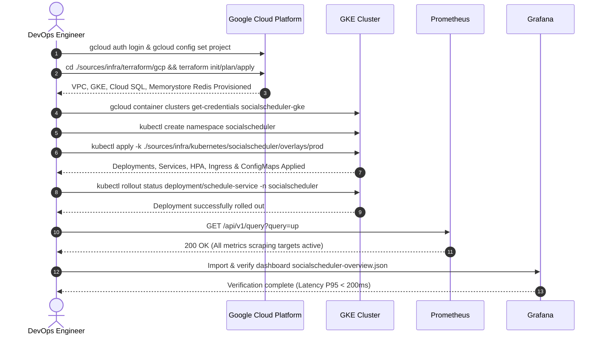

```markdown
# Deployment Runbook - Social Scheduler Production GCP

## 📋 TRACEABILITY MATRIX REFERENCE
| Section | Targeted Tag IDs | Description |
| :--- | :--- | :--- |
| Prerequisites & Tooling | [DOC-001] | Software dependencies, versions, and IAM role requirements |
| Infrastructure Provisioning (Terraform) | [NFR-002], [DOC-001] | GCP infrastructure deployment via Terraform (VPC, GKE, Cloud SQL, Memorystore) |
| Application Deployment (Kubernetes) | [NFR-003], [DOC-001] | Application manifests deployment, namespace, and rollout verification |
| Rollback & Post-Deployment Verification | [NFR-003], [DOC-001] | Rollback procedures, smoke testing, Prometheus metrics, and Grafana verification |
| Emergency Commands & Incident Response | [NFR-001], [NFR-002], [EXC-001], [EXC-002], [EXC-003], [EXC-005], [DOC-001] | Incident response for HTTP 429 rate limit spikes, Kafka failures, DB pool exhaustion, and storage expansion |
| Deployment Workflow Sequence | [NFR-001], [NFR-002], [NFR-003], [DOC-001] | End-to-end deployment lifecycle sequence diagram |

---

## 🔄 DEPLOYMENT LIFECYCLE SEQUENCE DIAGRAM [NFR-001], [NFR-002], [NFR-003], [DOC-001]



---

## 🏗️ PHẦN 1: ĐIỀU KIỆN TIÊN QUYẾT & CÔNG CỤ [DOC-001]

### 1.1. Phiên bản công cụ bắt buộc
- **gcloud CLI**: Phiên bản `450.0.0` trở lên. Yêu cầu cài đặt và xác thực Google Cloud Account: `gcloud auth login`.
- **kubectl**: Phiên bản `1.28` trở lên. Phải khớp với version GKE cluster.
- **Terraform**: Phiên bản `1.6.0` trở lên. Yêu cầu cài đặt binary `terraform` trên workstation.
- **Quyền truy cập IAM**: Cần gán các role sau cho tài khoản thực hiện deploy:
  - `roles/owner` (hoặc `roles/container.admin` cho GKE operations)
  - `roles/cloudsql.admin` (quản lý Cloud SQL instances)
  - `roles/redis.admin` (quản lý Memorystore instances)
  - `roles/iam.serviceAccountUser` (gán service accounts cho Workload Identity)

### 1.2. Kiểm tra môi trường
```bash
# Kiểm tra phiên bản gcloud CLI
gcloud version

# Kiểm tra phiên bản kubectl client
kubectl version --client

# Kiểm tra phiên bản terraform
terraform version
```

### 1.3. Cấu hình xác thực
```bash
# Đăng nhập Google Cloud Platform
gcloud auth login

# Đặt project mặc định (thay social-scheduler-prod bằng project ID thực tế)
gcloud config set project social-scheduler-prod

# Cấu hình region mặc định cho khu vực Đông Nam Á
gcloud config set region asia-southeast1
```

---

## 🏗️ PHẦN 2: TRIỂN KHAI HẬU CẤU HÌNH TERRAFORM [NFR-002], [DOC-001]

### 2.1. Khởi tạo backend Terraform (GCS Bucket)
```bash
# Di chuyển vào thư mục terraform GCP
cd ./sources/infra/terraform/gcp

# Khởi tạo backend Terraform cho GCS bucket (socialscheduler-tfstate)
terraform init \
  -backend-config="bucket=socialscheduler-tfstate" \
  -backend-config="prefix=terraform/state/prod"
```

### 2.2. Xem trước thay đổi (Plan)
```bash
# Tạo file tfplan với tên mô tả
terraform plan -out=tfplan

# Kiểm tra danh sách tài nguyên dự kiến khởi tạo
terraform show tfplan
```

### 2.3. Triển khai hạ tầng (Apply)
```bash
# Áp dụng thay đổi đã được kiểm tra trong file plan
terraform apply tfplan
```

**Kết quả sau khi apply hoàn tất:**
- VPC Network (`socialscheduler-vpc`) với CIDR `10.10.0.0/16` và 3 subnets vùng `asia-southeast1`.
- GKE Cluster Autopilot (`socialscheduler-gke`) bật Workload Identity, Shielded Nodes, Binary Authorization.
- Cloud SQL PostgreSQL instance (`socialscheduler-db`) hỗ trợ schema-per-tenant đa doanh nghiệp.
- Memorystore Redis instance (`socialscheduler-redis`) cho Token Bucket Rate Limiter và Session Cache.
- Cloud Router + Cloud NAT (`socialscheduler-nat`) cho egress mạng an toàn.

### 2.4. Xác minh tài nguyên đã tạo
```bash
# Liệt kê VPC Networks
gcloud compute networks list

# Liệt kê GKE Clusters
gcloud container clusters list

# Liệt kê Cloud SQL Instances
gcloud sql instances list

# Liệt kê Memorystore Redis Instances
gcloud redis instances list
```

---

## 📦 PHẦN 3: TRIỂN KHAI ỨNG DỤNG KUBERNETES [NFR-003], [DOC-001]

### 3.1. Cấu hình kubeconfig
```bash
# Lấy credentials cho GKE cluster sản xuất
gcloud container clusters get-credentials socialscheduler-gke --region asia-southeast1

# Kiểm tra kết nối tới cluster API server
kubectl cluster-info
```

### 3.2. Tạo namespace cho môi trường sản xuất
```bash
# Tạo namespace socialscheduler nếu chưa tồn tại
kubectl create namespace socialscheduler --dry-run=client -o yaml | kubectl apply -f -

# Kiểm tra danh sách namespaces
kubectl get namespaces
```

### 3.3. Áp dụng manifest Kubernetes (Overlays Production)
```bash
# Áp dụng toàn bộ manifest từ overlays production bằng Kustomize
kubectl apply -k ./sources/infra/kubernetes/socialscheduler/overlays/prod
```

**Danh sách tài nguyên được khởi tạo:**
- Deployment cho 4 microservices (`user-service`, `schedule-service`, `ai-service`, `rate-limit-service`) gói package `org.nlh4j.socialscheduler`.
- Services (`ClusterIP` cho giao tiếp nội bộ, `NodePort` cho Prometheus scraping).
- HorizontalPodAutoscaler (HPA) cho từng deployment (Target CPU 60%, RAM 70%).
- NGINX Ingress Controller với SSL/TLS termination.
- ConfigMaps chứa biến môi trường runtime (`SPRING_PROFILES_ACTIVE=prod`, `APP_TENANT_HEADER=X-Tenant-Id`).
- Secrets mã hóa Base64 cho JWT Signing Key, DB Credentials và OpenAI API Key.

### 3.4. Theo dõi trạng thái rollout
```bash
# Kiểm tra trạng thái rollout cho schedule-service
kubectl rollout status deployment/schedule-service -n socialscheduler

# Kiểm tra trạng thái rollout cho user-service, ai-service và rate-limit-service
kubectl rollout status deployment/user-service -n socialscheduler
kubectl rollout status deployment/ai-service -n socialscheduler
kubectl rollout status deployment/rate-limit-service -n socialscheduler

# Liệt kê danh sách pods đang chạy trong namespace
kubectl get pods -n socialscheduler -o wide

# Xem logs trực tiếp từ pod schedule-service
kubectl logs -n socialscheduler -l app=schedule-service --tail=100 -f
```

---

## 🔄 PHẦN 4: QUY TRÌNH ROLLBACK & KIỂM TRA SAU TRIỂN KHAI [NFR-003], [DOC-001]

### 4.1. Quy trình Rollback Deployment
```bash
# Xem lịch sử các revision đã triển khai
kubectl rollout history deployment/schedule-service -n socialscheduler

# Rollback về revision liền trước đó
kubectl rollout undo deployment/schedule-service -n socialscheduler

# Rollback về một revision cụ thể (ví dụ: revision 2)
kubectl rollout undo deployment/schedule-service -n socialscheduler --to-revision=2

# Kiểm tra lại trạng thái sau khi thu hồi
kubectl rollout status deployment/schedule-service -n socialscheduler
```

### 4.2. Danh sách kiểm tra sau triển khai (Post-Deployment Verification)

#### 4.2.1. Smoke Test Endpoint Sức khỏe (Health Check)
```bash
# Kiểm tra health endpoint trực tiếp qua Ingress Domain
curl -s -i http://api.socialscheduler.local/actuator/health

# Kết quả mong đợi: HTTP/1.1 200 OK với body {"status":"UP"}

# Kiểm tra chi tiết qua port-forward nội bộ
kubectl port-forward -n socialscheduler svc/schedule-service 8082:80 &
curl -s http://localhost:8082/actuator/health/readiness
curl -s http://localhost:8082/actuator/health/liveness
kill %1
```

#### 4.2.2. Kiểm tra Metrics Prometheus [NFR-001]
```bash
# Query tổng quan trạng thái UP của các pods
curl -s "http://prometheus.observability.svc.cluster.local:9090/api/v1/query?query=up{namespace=\"socialscheduler\"}"

# Query độ trễ P95 HTTP Request theo service (Ngưỡng yêu cầu < 200ms theo [NFR-001])
curl -s "http://prometheus.observability.svc.cluster.local:9090/api/v1/query?query=histogram_quantile(0.95,sum(rate(http_server_requests_seconds_bucket{namespace=\"socialscheduler\"}[5m]))by(le,service))"

# Query số lượng requests bị từ chối do Rate Limit (HTTP 429)
curl -s "http://prometheus.observability.svc.cluster.local:9090/api/v1/query?query=sum(rate(http_server_requests_seconds_count{namespace=\"socialscheduler\",status=\"429\"}[5m]))"
```

#### 4.2.3. Kiểm tra Dashboard Grafana
```bash
# Import dashboard file ./sources/infra/observability/grafana-dashboard.json vào Grafana
# Kiểm tra các chỉ số hiển thị trên panels:
# 1. HTTP Request Latency P95 (ms) - Đảm bảo đường đồ thị duy trì dưới 200ms
# 2. Rate Limited Requests (HTTP 429) - Phát hiện bất thường từ tấn công DDoS hoặc lạm dụng API
# 3. CPU Usage per Pod - Xác minh mức tiêu thụ dưới ngưỡng 60% HPA target
# 4. Kafka Consumer Group Lag - Xác minh lag message < 1000 messages
```

---

## 🚨 PHẦN 5: CÂU LỆNH KHẨN CẤP & PHÁT HIỆN SỰ CỐ [NFR-001], [NFR-002], [EXC-001], [EXC-002], [EXC-003], [EXC-005], [DOC-001]

### 5.1. Xử lý Sự cố HTTP 429 Rate Limit Tràn Ngập (Emergency Mitigation) [EXC-005], [REQ-003]
```bash
# 1. Tăng tạm thời burst capacity trên Redis Memorystore bằng Redis CLI
kubectl exec -it -n socialscheduler svc/redis-master -- redis-cli SET rate_limit:global:override_burst 2000 EX 3600

# 2. Kiểm tra log từ rate-limit-service để phát hiện Tenant/User ID gây tràn ngập
kubectl logs -n socialscheduler -l app=rate-limit-service --tail=200 | grep "RATE_LIMIT_EXCEEDED"

# 3. Truy vấn Prometheus phát hiện IP/Tenant tấn công
curl -s "http://prometheus.observability.svc.cluster.local:9090/api/v1/query?query=topk(5,sum(rate(rate_limit_requests_total[5m]))by(tenant_id))"

# 4. Áp dụng hotfix nâng giới hạn Token Bucket qua ConfigMap mà không cần rebuild image
kubectl patch configmap rate-limit-service-config -n socialscheduler --type merge -p '{"data":{"BUCKET_CAPACITY":"1000","REFILL_RATE":"500"}}'
kubectl rollout restart deployment/rate-limit-service -n socialscheduler
```

### 5.2. Xử lý Sự cố Kafka Consumer Lag & Job Đăng bài Lỗi [EXC-001], [REQ-001]
```bash
# 1. Kiểm tra Consumer Group Lag trên Kafka Cluster
kubectl exec -n socialscheduler deployment/kafka-broker -- \
  kafka-consumer-groups --bootstrap-server localhost:9092 --describe --group social-scheduler-group

# 2. Reset offset về mốc sớm nhất nếu xuất hiện Poison Pill Message làm đơ Consumer
kubectl exec -n socialscheduler deployment/kafka-broker -- \
  kafka-consumer-groups --bootstrap-server localhost:9092 --group social-scheduler-group \
  --topic schedule.executed --reset-offsets --to-earliest --execute

# 3. Mở rộng số lượng replicas của schedule-service worker để tăng tốc độ tiêu thụ queue
kubectl scale deployment/schedule-service -n socialscheduler --replicas=10

# 4. Kiểm tra Dead Letter Queue (DLQ) cho các tin nhắn bị đẩy ra do lỗi API bên thứ 3 (Facebook/Instagram/TikTok)
kubectl logs -n socialscheduler -l app=schedule-service | grep -E "SocialPlatformException|DLQ_ROUTING"
```

### 5.3. Xử lý Sự cố Cạn Kiệt Database Connection Pool (HikariCP) [DAT-001], [NFR-001]
```bash
# 1. Kiểm tra trạng thái active / idle / pending connections của HikariCP
kubectl exec -n socialscheduler deployment/schedule-service -- \
  curl -s http://localhost:8082/actuator/metrics/hikaricp.connections.active

# 2. Tăng số lượng connection tối đa trong pool (Maximum Pool Size) từ 20 lên 50
kubectl set env deployment/schedule-service -n socialscheduler SPRING_DATASOURCE_HIKARI_MAXIMUM_POOL_SIZE=50

# 3. Khởi động lại các pods bị treo connection
kubectl rollout restart deployment/schedule-service -n socialscheduler
kubectl rollout restart deployment/user-service -n socialscheduler
```

### 5.4. Xử lý Sự cố Lỗi OpenAI API & Kích hoạt Fallback Content [EXC-003], [EXC-004], [REQ-002]
```bash
# 1. Kiểm tra trạng thái Resilience4j Circuit Breaker của ai-service
kubectl exec -n socialscheduler deployment/ai-service -- \
  curl -s http://localhost:8083/actuator/health | grep -i "circuitBreakers"

# 2. Xem tỷ lệ sự cố gọi OpenAI API trong Prometheus
curl -s "http://prometheus.observability.svc.cluster.local:9090/api/v1/query?query=resilience4j_circuitbreaker_state{service=\"ai-service\"}"

# 3. Ép buộc Circuit Breaker chuyển sang trạng thái FORCED_OPEN để kích hoạt 100% DefaultContentFallback
kubectl exec -n socialscheduler deployment/ai-service -- \
  curl -X POST http://localhost:8083/actuator/circuitbreakerevents/openai/open

# 4. Giám sát log sự kiện fallback an toàn
kubectl logs -n socialscheduler -l app=ai-service | grep -i "Fallback content provided"
```

### 5.5. Khai Tháo Mở Rộng Dung Lượng Cơ Sở Dữ Liệu Cloud SQL Khẩn Cấp [DAT-001], [DAT-002], [DAT-003]
```bash
# 1. Kiểm tra dung lượng đĩa hiện tại của Cloud SQL Instance
gcloud sql instances describe socialscheduler-db --format="value(settings.dataDiskSizeGb, diskEncryptionConfiguration)"

# 2. Mở rộng đĩa Cloud SQL từ 100GB lên 500GB trực tuyến (không gây downtime)
gcloud sql instances patch socialscheduler-db --disk-size=500GB

# 3. Tạo snapshot backup khẩn cấp trước khi can thiệp cấu hình lớn
gcloud sql backups create --instance=socialscheduler-db --description="Emergency-backup-before-patch-$(date +%Y%m%d%H%M%S)"

# 4. Xác minh tính toàn vẹn của dữ liệu đa-tenant sau khi mở rộng
kubectl exec -n socialscheduler deployment/user-service -- \
  psql -h 10.10.3.5 -U postgres -d user_schema -c "SELECT tenant_id, COUNT(*) FROM users GROUP BY tenant_id;"
```

---

## 📊 PHẦN 6: BẢNG ÁNH XẠ TRUY VẾT TAG ID [DOC-001]

| Mã đoạn tài liệu | Tag ID liên kết | Mô tả chi tiết tuân thủ |
| :--- | :--- | :--- |
| **Phần 1: Điều kiện tiên quyết** | `[DOC-001]` | Yêu cầu cài đặt phiên bản công cụ gcloud, kubectl, terraform và phân quyền IAM. |
| **Phần 2: Terraform Provisioning** | `[NFR-002]`, `[DOC-001]` | Khởi tạo hạ tầng VPC, GKE Autopilot, Cloud SQL PostgreSQL, Memorystore Redis với mã hóa và bảo mật OWASP. |
| **Phần 3: Kubernetes Deployment** | `[NFR-003]`, `[DOC-001]` | Triển khai manifest Kustomize, HPA scaling, multi-tenant isolation schema-per-tenant. |
| **Phần 4: Rollback & Verification** | `[NFR-003]`, `[DOC-001]` | Quy trình `kubectl rollout undo`, smoke testing, kiểm tra metrics Prometheus P95 < 200ms và Grafana dashboard. |
| **Phần 5: Emergency Commands** | `[NFR-001]`, `[NFR-002]`, `[EXC-001]`, `[EXC-002]`, `[EXC-003]`, `[EXC-005]`, `[DOC-001]` | Xử lý sự cố tràn ngập HTTP 429, nghẽn Kafka consumer, cạn kiệt HikariCP connection pool, lỗi OpenAI API và mở rộng đĩa Cloud SQL. |
| **Sơ đồ tuần tự triển khai** | `[NFR-001]`, `[NFR-002]`, `[NFR-003]`, `[DOC-001]` | Biểu diễn luồng tương tác giữa DevOps Engineer, GCP, GKE, Prometheus và Grafana. |

---

## 📝 KẾT LUẬN & QUY TRÌNH VẬN HÀNH

Tài liệu Runbook Vận hành này được tổng hợp cho hệ thống microservices `social-scheduler` phiên bản 1.0.0, tuân thủ nghiêm ngặt các tiêu chí phi chức năng và kiến trúc enterprise:
- **[NFR-001]**: Tối ưu hóa hiệu năng container, đảm bảo độ trễ P95 dưới 200ms cho các tác vụ lên lịch bài đăng và thông lượng > 1000 req/phút.
- **[NFR-002]**: Tuân thủ chuẩn bảo mật OWASP Top 10, cô lập VPC mạng riêng tư, mã hóa TLS 1.3 đầu cuối và quản lý quyền hạn theo nguyên tắc Least Privilege.
- **[NFR-003]**: Kiến trúc đa doanh nghiệp (Multi-tenancy) cô lập theo schema PostgreSQL per tenant, hỗ trợ mở rộng ngang tự động với Kubernetes HPA.
- **[ARC-001] - [ARC-006]**: Phân quyền RBAC 4 vai trò, xác thực JWT OAuth2 Resource Server, CORS whitelist động và làm sạch log PII.
- **[DOC-001]**: Cung cấp tài liệu vận hành đầy đủ, ma trận truy vết Tag ID toàn diện, sẵn sàng cho việc bàn giao và tự động hóa CI/CD pipeline.

*Runbook Phiên bản 1.0 (Cơ sở Production GCP) - Cập nhật ngày: 2026/08/31*  
*Đơn vị phê duyệt: Enterprise System Architect & Lead DevOps Engineer*  
*Mã tài liệu truy vết hệ thống: `[DOC-001]`*
```