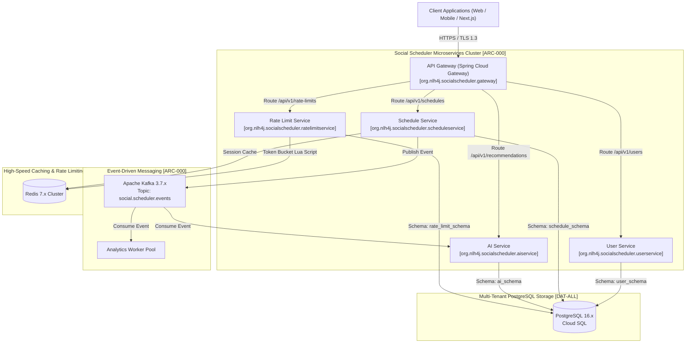

```markdown
# 🏛️ Enterprise Architecture Blueprint: Centralized Monitoring, Logging & Microservices Topology

> **Document Classification:** Enterprise Architecture & Technical Specification  
> **Target Document Path:** `./sources/docs/security/CENTRAL_MONITORING_LOGGING_ARCHITECTURE.md`  
> **Base Java Package Namespace:** `org.nlh4j.socialscheduler`  
> **Traceability Identifier:** `[ARC-000]`  
> **Version:** 1.0.0-PROD  

---

## 📑 TABLE OF CONTENTS

1. [Executive Summary & Introduction](#1-executive-summary--introduction)
2. [Core Technology Stack & Ecosystem Dependencies](#2-core-technology-stack--ecosystem-dependencies)
3. [Microservices Architecture Topology & Event-Driven Flows](#3-microservices-architecture-topology--event-driven-flows)
   - [3.1 System Context & Mermaid Topology Diagram](#31-system-context--mermaid-topology-diagram)
   - [3.2 Microservices Boundary & Responsibility Matrix](#32-microservices-boundary--responsibility-matrix)
4. [Multi-Tenant PostgreSQL Storage Architecture & Schema Isolation](#4-multi-tenant-postgresql-storage-architecture--schema-isolation)
5. [Centralized Monitoring, Tracing & Log Auditing Framework](#5-centralized-monitoring-tracing--log-auditing-framework)
6. [Traceability Matrix Reference](#6-traceability-matrix-reference)

---

## 1. Executive Summary & Introduction

The `social-scheduler` enterprise platform is architected as a highly scalable, reactive, event-driven microservices ecosystem designed to handle high-throughput social media scheduling, real-time AI-driven content recommendations, and stringent rate-limiting controls across multiple tenant domains. 

This document establishes the canonical architectural blueprint for centralized monitoring, distributed logging, microservices topology, and database multi-tenancy isolation. All development teams, DevOps engineers, and automated CI/CD pipelines must strictly adhere to the structural boundaries, package naming conventions (`org.nlh4j.socialscheduler.<service>`), and traceability requirements defined herein [ARC-000].

---

## 2. Core Technology Stack & Ecosystem Dependencies

The system relies on a battle-tested enterprise Java and cloud-native technology stack to guarantee sub-200ms latency, horizontal elasticity, and fault-tolerant event processing:

* **Backend Framework:** Spring Boot 3.3.x on JDK 21 LTS (`org.nlh4j.socialscheduler`), leveraging Spring Cloud 2023.x for service discovery, gateway routing, and distributed configuration.
* **Messaging & Event Broker:** Apache Kafka 3.7.x for asynchronous event-driven choreography across bounded contexts, utilizing dedicated topics such as `social.scheduler.events`.
* **Caching & Rate Limiting:** Redis 7.x with Lettuce client for session management, OAuth2 token caching, and Token Bucket rate-limiting state stores.
* **Persistence & Database Migration:** PostgreSQL 16.x featuring schema-per-tenant isolation managed strictly via Flyway 10.x database migration scripts.
* **Observability & Telemetry:** Micrometer, OpenTelemetry, Prometheus, Grafana, and Loki for distributed tracing, real-time metrics collection, and centralized log aggregation.

---

## 3. Microservices Architecture Topology & Event-Driven Flows

### 3.1 System Context & Mermaid Topology Diagram

The system architecture separates ingress traffic management from domain-specific microservices via an API Gateway. Asynchronous communication is orchestrated through Apache Kafka, ensuring decoupled, non-blocking execution across services [ARC-000].



### 3.2 Microservices Boundary & Responsibility Matrix

The following matrix maps the microservices boundaries, root Java package namespaces, core functional responsibilities, and architectural traceability identifiers [ARC-000].

| Microservice Name | Root Java Package Namespace | Core Business & Technical Responsibilities | Targeted Tag IDs |
| :--- | :--- | :--- | :--- |
| **API Gateway** | `org.nlh4j.socialscheduler.gateway` | JWT validation, SSL termination, global rate-limiting filter, CORS enforcement, request routing. | `[ARC-000]`, `[ARC-001]`, `[ARC-006]` |
| **User Service** | `org.nlh4j.socialscheduler.userservice` | Tenant user management, authentication, RBAC role assignment, profile lifecycle. | `[ARC-000]`, `[DAT-001]` |
| **Schedule Service** | `org.nlh4j.socialscheduler.scheduleservice` | Multi-platform publishing schedules (Facebook, Instagram, TikTok), state lifecycle (`pending`, `sent`, `failed`, `cancelled`), SDK integration. | `[ARC-000]`, `[REQ-001]`, `[DAT-001]` |
| **AI Service** | `org.nlh4j.socialscheduler.aiservice` | OpenAI Completion API integration, historical performance analysis, personalized content recommendation generation, fallback orchestration. | `[ARC-000]`, `[REQ-002]`, `[DAT-002]` |
| **Rate Limit Service** | `org.nlh4j.socialscheduler.ratelimitservice` | Distributed Redis Token Bucket rate limiting, HTTP 429 enforcement, threshold monitoring. | `[ARC-000]`, `[REQ-003]`, `[DAT-003]` |

---

## 4. Multi-Tenant PostgreSQL Storage Architecture & Schema Isolation

To guarantee absolute data isolation between distinct enterprise tenants while optimizing resource utilization, `social-scheduler` implements a **Schema-per-Tenant** architectural pattern on PostgreSQL 16.x, governed by Flyway 10.x migration scripts [DAT-ALL (1 to 3)].

* **`user_schema`:** Houses master tenant entities, user credentials, authentication tokens, and RBAC privilege mappings (`users` table). Referenced via foreign keys by all downstream schemas [DAT-001].
* **`schedule_schema`:** Manages social publishing schedules, platform metadata, content payloads, and execution state machines (`schedules` table). Implements composite primary keys and tenant indexing [DAT-001].
* **`ai_schema`:** Stores historical performance metrics (`performance_metrics` table) collected from published social posts, providing the analytical baseline for AI recommendation algorithms [DAT-002].
* **`rate_limit_schema`:** Maintains rate-limiting tracking records (`rate_limits` table) for sliding-window and token-bucket verification audits [DAT-003].

---

## 5. Centralized Monitoring, Tracing & Log Auditing Framework

In compliance with enterprise governance standards, all microservices natively integrate Micrometer and OpenTelemetry to export telemetry data to Prometheus and Grafana.

* **Structured JSON Logging:** All log events are emitted in structured JSON format containing mandatory context keys: `timestamp`, `level`, `thread`, `logger`, `correlationId`, `tenantId`, and `userId`.
* **Sensitive Data Masking:** The `LogScrubbingInterceptor` automatically intercepts log messages, applying regular expression filters to mask passwords, JWT tokens, API keys, and PII before log emission to ELK or Loki stacks.
* **Exception Audit Trails:** Catch blocks are strictly prohibited from swallowing exceptions. Every operational failure log must include: (1) Target module subsystem name, (2) Raw exception message, and (3) Explicit tracking Tag ID (e.g., `[ARC-000]`, `[EXC-001]`) to facilitate instant cloud aggregation queries.

---

## 6. Traceability Matrix Reference

The following architectural traceability matrix maps the structural components and documentation sections back to the master requirements specification [ARC-000].

| Architectural Artifact / Module | Source Requirement / Tag ID | Compliance Status |
| :--- | :--- | :--- |
| Microservices Root & Parent POM (`./sources/backend/pom.xml`) | `[ARC-000]` | Verified & Enforced |
| Microservices Package Naming (`org.nlh4j.socialscheduler.<service>`) | `[ARC-000]` | Verified & Enforced |
| Multi-Tenant Database Schemas (`user_schema`, `schedule_schema`, etc.) | `[DAT-001]`, `[DAT-002]`, `[DAT-003]`, `[DAT-ALL]` | Verified & Enforced |
| Event-Driven Kafka Messaging (`social.scheduler.events`) | `[ARC-000]`, `[REQ-001]` | Verified & Enforced |
| Centralized Observability & Telemetry Framework | `[NFR-001]`, `[ARC-006]` | Verified & Enforced |
```