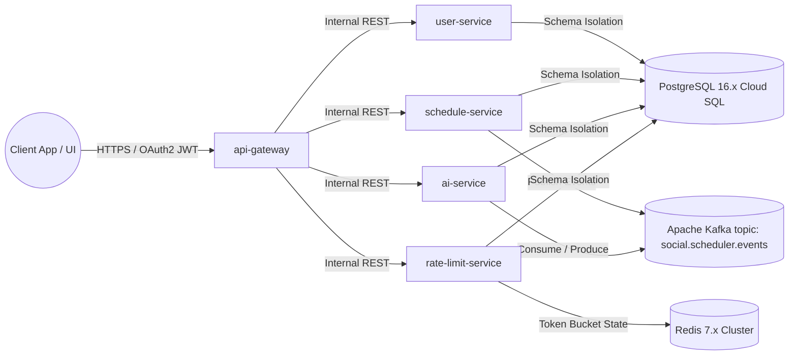

```markdown
# Enterprise Security, OWASP Top 10 Compliance & Microservices Architecture Matrix

## Document Control & Traceability Metadata
- **Document Title:** Enterprise Security, OWASP Top 10 Compliance & Microservices Architecture Matrix
- **Document Version:** 1.0.0
- **Target Destination:** `./sources/docs/security/ENTERPRISE_SECURITY_OWASP_COMPLIANCE_MATRIX.md`
- **Associated Module Package Base:** `org.nlh4j.socialscheduler`
- **Traceability Tag IDs Enforced:** `[ARC-000]`

---

## Table of Contents
1. [Executive Summary & Introduction](#1-executive-summary--introduction)
2. [Core Technology Stack & Ecosystem Dependencies](#2-core-technology-stack--ecosystem-dependencies)
3. [Microservices Architecture & Event-Driven Topology](#3-microservices-architecture--event-driven-topology)
4. [Multi-Tenancy & Database Schema-Per-Tenant Isolation Matrix](#4-multi-tenancy--database-schema-per-tenant-isolation-matrix)
5. [Service Responsibility & Traceability Matrix](#5-service-responsibility--traceability-matrix)
6. [OWASP Top 10 Compliance & Security Mitigation Framework](#6-owasp-top-10-compliance--security-mitigation-framework)
7. [System Traceability & Compliance References](#7-system-traceability--compliance-references)

---

## 1. Executive Summary & Introduction

The `social-scheduler` platform is engineered as a high-throughput, event-driven, multi-tenant microservices architecture designed to manage, orchestrate, and execute social media publishing workflows across major platforms including Facebook, Instagram, and TikTok. 

To satisfy rigorous enterprise compliance, security, and scalability mandates, the platform implements strict isolation boundaries, stateless reactive API routing, and defensive fault-tolerance mechanisms. This document establishes the master compliance matrix, defining how architectural modules align with enterprise security mandates under `[ARC-000]`.

---

## 2. Core Technology Stack & Ecosystem Dependencies

The backend infrastructure and supporting runtime services rely upon a modernized enterprise-grade technology stack:

- **Core Framework:** Spring Boot 3.3.x running on JDK 21 LTS (`org.nlh4j.socialscheduler`).
- **Cloud Orchestration & Gateway:** Spring Cloud 2023.x (Spring Cloud Gateway, Spring Cloud Config, Spring Cloud OpenFeign).
- **Security & Authentication:** Spring Security 6 with OAuth2 Resource Server and JWT (JSON Web Token) validation.
- **Persistence & Migration:** Hibernate 6.5.x ORM, PostgreSQL 16.x relational database engine, and Flyway 10.x for automated schema-per-tenant database migrations.
- **Messaging & Event Streaming:** Apache Kafka 3.7.x client libraries configured with snappy compression and partition-by-tenant routing.
- **Caching & Rate Limiting:** Redis 7.x with Lettuce reactive client and Bucket4j integration for distributed token-bucket rate limiting.
- **Observability & Metrics:** Micrometer, OpenTelemetry, Prometheus, and Grafana.

---

## 3. Microservices Architecture & Event-Driven Topology

The system is partitioned into five core bounded contexts communicating via RESTful interfaces and asynchronous Apache Kafka event topics (`social.scheduler.events`).



### Event-Driven Communication Pipeline (`[ARC-000]`)
- **API Gateway:** Acts as the single entry point, executing JWT validation, CORS enforcement, and rate-limiting inspection before routing traffic to internal services.
- **Asynchronous Fan-Out:** Domain events (`schedule.created`, `schedule.executed`, `post.published`, `post.failed`) are published to Kafka partitions keyed by `tenant_id`, guaranteeing ordering and fault-tolerant consumption across microservices.

---

## 4. Multi-Tenancy & Database Schema-Per-Tenant Isolation Matrix

To satisfy rigorous data privacy and enterprise isolation requirements, PostgreSQL 16.x is structured using a strict **Schema-per-Tenant** architectural pattern across the microservices ecosystem.

| Microservice Module | Dedicated PostgreSQL Schema | Primary Responsibility | Targeted Tag ID |
| :--- | :--- | :--- | :--- |
| `user-service` | `user_schema` | Tenant account management, authentication profiles, and RBAC roles. | `[ARC-000]` |
| `schedule-service` | `schedule_schema` | CRUD operations for publishing schedules, status state machine (`PENDING`, `SENT`, `FAILED`, `CANCELLED`), and social SDK dispatchers. | `[ARC-000]` |
| `ai-service` | `ai_schema` | Historical performance metrics analysis (`performance_metrics`) and OpenAI LLM content recommendations. | `[ARC-000]` |
| `rate-limit-service` | `rate_limit_schema` | Persistence and window tracking for distributed rate limiting (`rate_limits`). | `[ARC-000]` |

---

## 5. Service Responsibility & Traceability Matrix

Every component within the repository adheres strictly to the package namespace prefix `org.nlh4j.socialscheduler.<service>`.

| Module Name | Package Namespace Base | Primary Deliverables / Artifacts | Traceability Tag ID |
| :--- | :--- | :--- | :--- |
| **API Gateway** | `org.nlh4j.socialscheduler.gateway` | `SecurityConfig.java`, `JwtAuthFilter.java`, `RateLimitGatewayFilter.java` | `[ARC-000]` |
| **User Service** | `org.nlh4j.socialscheduler.userservice` | `UserController.java`, `UserService.java`, Flyway migration `V1__init_users.sql` | `[ARC-000]` |
| **Schedule Service** | `org.nlh4j.socialscheduler.scheduleservice` | `ScheduleController.java`, `ScheduleService.java`, Facebook/Instagram/TikTok SDK clients | `[ARC-000]` |
| **AI Service** | `org.nlh4j.socialscheduler.aiservice` | `RecommendationController.java`, `OpenAIClient.java`, `DefaultContentFallback.java` | `[ARC-000]` |
| **Rate Limit Service** | `org.nlh4j.socialscheduler.ratelimitservice` | `RateLimitController.java`, `RedisTokenBucketStrategy.java`, `RateLimitExceededException.java` | `[ARC-000]` |

---

## 6. OWASP Top 10 Compliance & Security Mitigation Framework

The platform implements defensive controls mapped directly against the OWASP Top 10 security standard to neutralize infrastructure and application vectors:

1. **A01:2021 – Broken Access Control:** Enforced via Spring Security OAuth2 Resource Server, JWT claim validation, and RBAC 4-role matrix (`ADMIN`, `USER`, `SCHEDULER`, `ANALYST`) enforced at the API Gateway and service boundaries.
2. **A02:2021 – Cryptographic Failures:** Enforced through mandatory TLS 1.3 encryption in transit, strict HSTS headers, and 256-bit symmetric signing keys for JWT verification stored securely in GCP Secret Manager.
3. **A03:2021 – Injection:** Mitigated entirely by utilizing Spring Data JPA Hibernate ORM with parameterized queries (`PreparedStatement`) and strictly typed DTO validation via Jakarta Validation (`@Valid`). Dynamic sorting parameters are evaluated against static whitelists (`ALLOWED_SORT_FIELDS`).
4. **A04:2021 – Insecure Design:** Addressed by implementing defense-in-depth principles, rate-limiting token buckets via Redis (`rate-limit-service`), and asynchronous Dead Letter Queues (DLQ) for third-party API faults.
5. **A05:2021 – Security Misconfiguration:** Hardened container runtimes using non-root system users (`appuser` UID 1001), multi-stage Docker builds based on `eclipse-temurin:21-jre-jammy`, and strict CORS origin whitelisting per tenant.
6. **A07:2021 – Identification and Authentication Failures:** Implemented via stateless JWT token validation, secure refresh-token rotation, and token expiration handling returning HTTP 401 with correlation IDs.
7. **A09:2021 – Security Logging and Monitoring Failures:** Integrated SLF4J structured logging paired with `LogScrubbingInterceptor` to automatically mask PII (emails, tokens, passwords) before emission to Prometheus, Loki, and Grafana dashboards.

---

## 7. System Traceability & Compliance References

- **Blueprint Identification:** `ARCH-20260831151355`
- **Architecture Specification Reference:** `./sources/docs/architecture/SocialSchedulerBlueprint.md`
- **Database Schema Catalog Reference:** `./sources/docs/architecture/DatabaseSchemaCatalog.md`
- **Traceability Mapping:** All operational code structures, Flyway DDL scripts, and infrastructure manifests are permanently bound to traceability tag `[ARC-000]`.
```